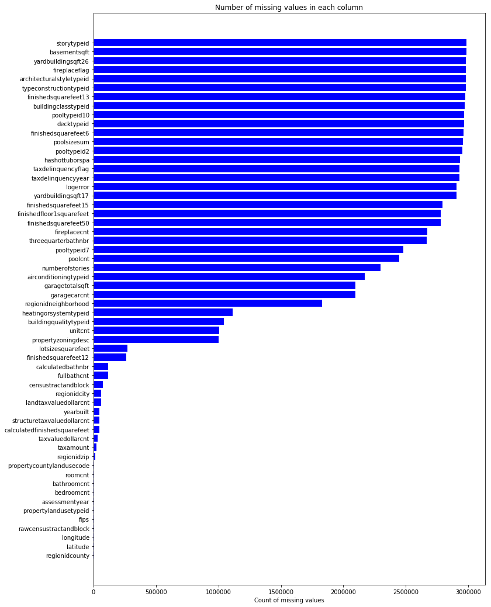
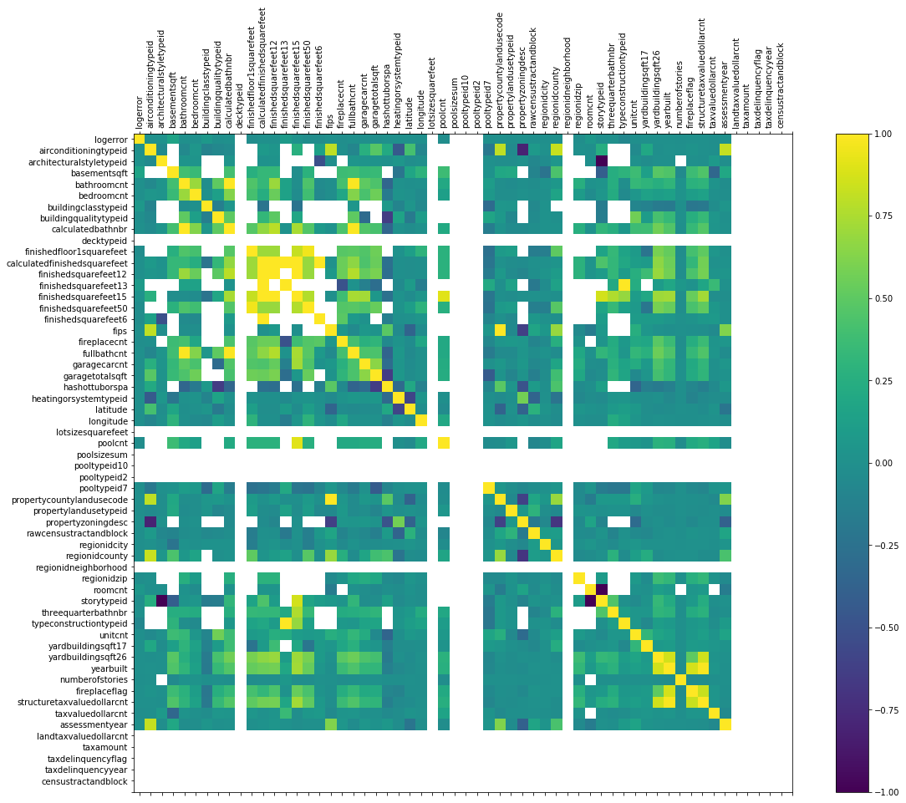

# Mini project 2 - Data Cleansing Practice on Zillow Data

In this week, we’ll practice how to do regular cleansing in Python with a real-world dataset – Zillow dataset, which is available in the [Zillow Prize: Zillow’s Home Value Prediction (Zestimate)](https://www.kaggle.com/c/zillow-prize-1). This Zillow dataset contains abundant missing data and will provide you a good environment to practice your skills on data cleaning. The cleansing of this dataset will be a great start for you to further play with this Kaggle Competition if you have more interest and time.

This step-by-step mini project will illustrate you various ways to impute missing values.


```python
# Start with importing essentials
import pandas as pd
import numpy as np
import matplotlib.pyplot as plt
import seaborn as sns
%matplotlib inline
```

#### 1. Read the train set and property set of Zillow dataset, and name them as train and properties.


```python
ls
```

    Data_Cleaning_Demo.ipynb*     crawl_indeed_tutorial_.ipynb*
    MiniProject2.ipynb            properties_2016.csv.zip*
    MiniProject2_Answer.ipynb     properties_2017.csv
    Untitled.ipynb                properties_2017.csv.zip*
    Week2Notebook20180128.ipynb   train_2017.csv


```python
train = pd.read_csv('train_2017.csv')
properties = pd.read_csv('properties_2017.csv')
```

    /Users/lucydiamondsky/anaconda3/lib/python3.6/site-packages/IPython/core/interactiveshell.py:2698: DtypeWarning: Columns (49) have mixed types. Specify dtype option on import or set low_memory=False.
      interactivity=interactivity, compiler=compiler, result=result)


#### 2. Merge train and properties to one dataframe on parcelid and call it as df_train. Drop the column of 'parcelid' and 'transactiondate'. Check the first 5 rows to see how this merged dataset looks like.


```python
train.head(5)
```


<div>
<style>
    .dataframe thead tr:only-child th {
        text-align: right;
    }

    .dataframe thead th {
        text-align: left;
    }

    .dataframe tbody tr th {
        vertical-align: top;
    }
</style>
<table border="1" class="dataframe">
  <thead>
    <tr style="text-align: right;">
      <th></th>
      <th>parcelid</th>
      <th>logerror</th>
      <th>transactiondate</th>
    </tr>
  </thead>
  <tbody>
    <tr>
      <th>0</th>
      <td>14297519</td>
      <td>0.025595</td>
      <td>2017-01-01</td>
    </tr>
    <tr>
      <th>1</th>
      <td>17052889</td>
      <td>0.055619</td>
      <td>2017-01-01</td>
    </tr>
    <tr>
      <th>2</th>
      <td>14186244</td>
      <td>0.005383</td>
      <td>2017-01-01</td>
    </tr>
    <tr>
      <th>3</th>
      <td>12177905</td>
      <td>-0.103410</td>
      <td>2017-01-01</td>
    </tr>
    <tr>
      <th>4</th>
      <td>10887214</td>
      <td>0.006940</td>
      <td>2017-01-01</td>
    </tr>
  </tbody>
</table>
</div>


```python
properties.head(5)
```


<div>
<style>
    .dataframe thead tr:only-child th {
        text-align: right;
    }

    .dataframe thead th {
        text-align: left;
    }

    .dataframe tbody tr th {
        vertical-align: top;
    }
</style>
<table border="1" class="dataframe">
  <thead>
    <tr style="text-align: right;">
      <th></th>
      <th>parcelid</th>
      <th>airconditioningtypeid</th>
      <th>architecturalstyletypeid</th>
      <th>basementsqft</th>
      <th>bathroomcnt</th>
      <th>bedroomcnt</th>
      <th>buildingclasstypeid</th>
      <th>buildingqualitytypeid</th>
      <th>calculatedbathnbr</th>
      <th>decktypeid</th>
      <th>...</th>
      <th>numberofstories</th>
      <th>fireplaceflag</th>
      <th>structuretaxvaluedollarcnt</th>
      <th>taxvaluedollarcnt</th>
      <th>assessmentyear</th>
      <th>landtaxvaluedollarcnt</th>
      <th>taxamount</th>
      <th>taxdelinquencyflag</th>
      <th>taxdelinquencyyear</th>
      <th>censustractandblock</th>
    </tr>
  </thead>
  <tbody>
    <tr>
      <th>0</th>
      <td>10754147</td>
      <td>NaN</td>
      <td>NaN</td>
      <td>NaN</td>
      <td>0.0</td>
      <td>0.0</td>
      <td>NaN</td>
      <td>NaN</td>
      <td>NaN</td>
      <td>NaN</td>
      <td>...</td>
      <td>NaN</td>
      <td>NaN</td>
      <td>NaN</td>
      <td>9.0</td>
      <td>2016.0</td>
      <td>9.0</td>
      <td>NaN</td>
      <td>NaN</td>
      <td>NaN</td>
      <td>NaN</td>
    </tr>
    <tr>
      <th>1</th>
      <td>10759547</td>
      <td>NaN</td>
      <td>NaN</td>
      <td>NaN</td>
      <td>0.0</td>
      <td>0.0</td>
      <td>NaN</td>
      <td>NaN</td>
      <td>NaN</td>
      <td>NaN</td>
      <td>...</td>
      <td>NaN</td>
      <td>NaN</td>
      <td>NaN</td>
      <td>27516.0</td>
      <td>2015.0</td>
      <td>27516.0</td>
      <td>NaN</td>
      <td>NaN</td>
      <td>NaN</td>
      <td>NaN</td>
    </tr>
    <tr>
      <th>2</th>
      <td>10843547</td>
      <td>NaN</td>
      <td>NaN</td>
      <td>NaN</td>
      <td>0.0</td>
      <td>0.0</td>
      <td>5.0</td>
      <td>NaN</td>
      <td>NaN</td>
      <td>NaN</td>
      <td>...</td>
      <td>1.0</td>
      <td>NaN</td>
      <td>660680.0</td>
      <td>1434941.0</td>
      <td>2016.0</td>
      <td>774261.0</td>
      <td>20800.37</td>
      <td>NaN</td>
      <td>NaN</td>
      <td>NaN</td>
    </tr>
    <tr>
      <th>3</th>
      <td>10859147</td>
      <td>NaN</td>
      <td>NaN</td>
      <td>NaN</td>
      <td>0.0</td>
      <td>0.0</td>
      <td>3.0</td>
      <td>6.0</td>
      <td>NaN</td>
      <td>NaN</td>
      <td>...</td>
      <td>1.0</td>
      <td>NaN</td>
      <td>580059.0</td>
      <td>1174475.0</td>
      <td>2016.0</td>
      <td>594416.0</td>
      <td>14557.57</td>
      <td>NaN</td>
      <td>NaN</td>
      <td>NaN</td>
    </tr>
    <tr>
      <th>4</th>
      <td>10879947</td>
      <td>NaN</td>
      <td>NaN</td>
      <td>NaN</td>
      <td>0.0</td>
      <td>0.0</td>
      <td>4.0</td>
      <td>NaN</td>
      <td>NaN</td>
      <td>NaN</td>
      <td>...</td>
      <td>1.0</td>
      <td>NaN</td>
      <td>196751.0</td>
      <td>440101.0</td>
      <td>2016.0</td>
      <td>243350.0</td>
      <td>5725.17</td>
      <td>NaN</td>
      <td>NaN</td>
      <td>NaN</td>
    </tr>
  </tbody>
</table>
<p>5 rows × 58 columns</p>
</div>


```python
df_train = pd.concat([train, properties],axis=1)
```


```python
df_train.head(5)
```


<div>
<style>
    .dataframe thead tr:only-child th {
        text-align: right;
    }

    .dataframe thead th {
        text-align: left;
    }

    .dataframe tbody tr th {
        vertical-align: top;
    }
</style>
<table border="1" class="dataframe">
  <thead>
    <tr style="text-align: right;">
      <th></th>
      <th>parcelid</th>
      <th>logerror</th>
      <th>transactiondate</th>
      <th>parcelid</th>
      <th>airconditioningtypeid</th>
      <th>architecturalstyletypeid</th>
      <th>basementsqft</th>
      <th>bathroomcnt</th>
      <th>bedroomcnt</th>
      <th>buildingclasstypeid</th>
      <th>...</th>
      <th>numberofstories</th>
      <th>fireplaceflag</th>
      <th>structuretaxvaluedollarcnt</th>
      <th>taxvaluedollarcnt</th>
      <th>assessmentyear</th>
      <th>landtaxvaluedollarcnt</th>
      <th>taxamount</th>
      <th>taxdelinquencyflag</th>
      <th>taxdelinquencyyear</th>
      <th>censustractandblock</th>
    </tr>
  </thead>
  <tbody>
    <tr>
      <th>0</th>
      <td>14297519.0</td>
      <td>0.025595</td>
      <td>2017-01-01</td>
      <td>10754147</td>
      <td>NaN</td>
      <td>NaN</td>
      <td>NaN</td>
      <td>0.0</td>
      <td>0.0</td>
      <td>NaN</td>
      <td>...</td>
      <td>NaN</td>
      <td>NaN</td>
      <td>NaN</td>
      <td>9.0</td>
      <td>2016.0</td>
      <td>9.0</td>
      <td>NaN</td>
      <td>NaN</td>
      <td>NaN</td>
      <td>NaN</td>
    </tr>
    <tr>
      <th>1</th>
      <td>17052889.0</td>
      <td>0.055619</td>
      <td>2017-01-01</td>
      <td>10759547</td>
      <td>NaN</td>
      <td>NaN</td>
      <td>NaN</td>
      <td>0.0</td>
      <td>0.0</td>
      <td>NaN</td>
      <td>...</td>
      <td>NaN</td>
      <td>NaN</td>
      <td>NaN</td>
      <td>27516.0</td>
      <td>2015.0</td>
      <td>27516.0</td>
      <td>NaN</td>
      <td>NaN</td>
      <td>NaN</td>
      <td>NaN</td>
    </tr>
    <tr>
      <th>2</th>
      <td>14186244.0</td>
      <td>0.005383</td>
      <td>2017-01-01</td>
      <td>10843547</td>
      <td>NaN</td>
      <td>NaN</td>
      <td>NaN</td>
      <td>0.0</td>
      <td>0.0</td>
      <td>5.0</td>
      <td>...</td>
      <td>1.0</td>
      <td>NaN</td>
      <td>660680.0</td>
      <td>1434941.0</td>
      <td>2016.0</td>
      <td>774261.0</td>
      <td>20800.37</td>
      <td>NaN</td>
      <td>NaN</td>
      <td>NaN</td>
    </tr>
    <tr>
      <th>3</th>
      <td>12177905.0</td>
      <td>-0.103410</td>
      <td>2017-01-01</td>
      <td>10859147</td>
      <td>NaN</td>
      <td>NaN</td>
      <td>NaN</td>
      <td>0.0</td>
      <td>0.0</td>
      <td>3.0</td>
      <td>...</td>
      <td>1.0</td>
      <td>NaN</td>
      <td>580059.0</td>
      <td>1174475.0</td>
      <td>2016.0</td>
      <td>594416.0</td>
      <td>14557.57</td>
      <td>NaN</td>
      <td>NaN</td>
      <td>NaN</td>
    </tr>
    <tr>
      <th>4</th>
      <td>10887214.0</td>
      <td>0.006940</td>
      <td>2017-01-01</td>
      <td>10879947</td>
      <td>NaN</td>
      <td>NaN</td>
      <td>NaN</td>
      <td>0.0</td>
      <td>0.0</td>
      <td>4.0</td>
      <td>...</td>
      <td>1.0</td>
      <td>NaN</td>
      <td>196751.0</td>
      <td>440101.0</td>
      <td>2016.0</td>
      <td>243350.0</td>
      <td>5725.17</td>
      <td>NaN</td>
      <td>NaN</td>
      <td>NaN</td>
    </tr>
  </tbody>
</table>
<p>5 rows × 61 columns</p>
</div>


```python
df_train= df_train.drop(['parcelid', 'transactiondate'],axis=1)
```


```python
df_train.head(5)
```


<div>
<style>
    .dataframe thead tr:only-child th {
        text-align: right;
    }

    .dataframe thead th {
        text-align: left;
    }

    .dataframe tbody tr th {
        vertical-align: top;
    }
</style>
<table border="1" class="dataframe">
  <thead>
    <tr style="text-align: right;">
      <th></th>
      <th>logerror</th>
      <th>airconditioningtypeid</th>
      <th>architecturalstyletypeid</th>
      <th>basementsqft</th>
      <th>bathroomcnt</th>
      <th>bedroomcnt</th>
      <th>buildingclasstypeid</th>
      <th>buildingqualitytypeid</th>
      <th>calculatedbathnbr</th>
      <th>decktypeid</th>
      <th>...</th>
      <th>numberofstories</th>
      <th>fireplaceflag</th>
      <th>structuretaxvaluedollarcnt</th>
      <th>taxvaluedollarcnt</th>
      <th>assessmentyear</th>
      <th>landtaxvaluedollarcnt</th>
      <th>taxamount</th>
      <th>taxdelinquencyflag</th>
      <th>taxdelinquencyyear</th>
      <th>censustractandblock</th>
    </tr>
  </thead>
  <tbody>
    <tr>
      <th>0</th>
      <td>0.025595</td>
      <td>NaN</td>
      <td>NaN</td>
      <td>NaN</td>
      <td>0.0</td>
      <td>0.0</td>
      <td>NaN</td>
      <td>NaN</td>
      <td>NaN</td>
      <td>NaN</td>
      <td>...</td>
      <td>NaN</td>
      <td>NaN</td>
      <td>NaN</td>
      <td>9.0</td>
      <td>2016.0</td>
      <td>9.0</td>
      <td>NaN</td>
      <td>NaN</td>
      <td>NaN</td>
      <td>NaN</td>
    </tr>
    <tr>
      <th>1</th>
      <td>0.055619</td>
      <td>NaN</td>
      <td>NaN</td>
      <td>NaN</td>
      <td>0.0</td>
      <td>0.0</td>
      <td>NaN</td>
      <td>NaN</td>
      <td>NaN</td>
      <td>NaN</td>
      <td>...</td>
      <td>NaN</td>
      <td>NaN</td>
      <td>NaN</td>
      <td>27516.0</td>
      <td>2015.0</td>
      <td>27516.0</td>
      <td>NaN</td>
      <td>NaN</td>
      <td>NaN</td>
      <td>NaN</td>
    </tr>
    <tr>
      <th>2</th>
      <td>0.005383</td>
      <td>NaN</td>
      <td>NaN</td>
      <td>NaN</td>
      <td>0.0</td>
      <td>0.0</td>
      <td>5.0</td>
      <td>NaN</td>
      <td>NaN</td>
      <td>NaN</td>
      <td>...</td>
      <td>1.0</td>
      <td>NaN</td>
      <td>660680.0</td>
      <td>1434941.0</td>
      <td>2016.0</td>
      <td>774261.0</td>
      <td>20800.37</td>
      <td>NaN</td>
      <td>NaN</td>
      <td>NaN</td>
    </tr>
    <tr>
      <th>3</th>
      <td>-0.103410</td>
      <td>NaN</td>
      <td>NaN</td>
      <td>NaN</td>
      <td>0.0</td>
      <td>0.0</td>
      <td>3.0</td>
      <td>6.0</td>
      <td>NaN</td>
      <td>NaN</td>
      <td>...</td>
      <td>1.0</td>
      <td>NaN</td>
      <td>580059.0</td>
      <td>1174475.0</td>
      <td>2016.0</td>
      <td>594416.0</td>
      <td>14557.57</td>
      <td>NaN</td>
      <td>NaN</td>
      <td>NaN</td>
    </tr>
    <tr>
      <th>4</th>
      <td>0.006940</td>
      <td>NaN</td>
      <td>NaN</td>
      <td>NaN</td>
      <td>0.0</td>
      <td>0.0</td>
      <td>4.0</td>
      <td>NaN</td>
      <td>NaN</td>
      <td>NaN</td>
      <td>...</td>
      <td>1.0</td>
      <td>NaN</td>
      <td>196751.0</td>
      <td>440101.0</td>
      <td>2016.0</td>
      <td>243350.0</td>
      <td>5725.17</td>
      <td>NaN</td>
      <td>NaN</td>
      <td>NaN</td>
    </tr>
  </tbody>
</table>
<p>5 rows × 58 columns</p>
</div>


#### 3.  (a) Generate a dataframe called missing_df from df_train, in which there are two columns, one is the column names of our features, the other column is the missing_count (the number of missing values) of that feature. The table should be ordered by missing_count decendingly.  


```python
missing_df = pd.DataFrame(df_train.isnull().sum())
missing_df = missing_df.reset_index()
missing_df.rename(columns={ missing_df.columns[1]: "missing_count", missing_df.columns[0]: "feature"}, inplace=True)
missing_df
```


<div>
<style>
    .dataframe thead tr:only-child th {
        text-align: right;
    }

    .dataframe thead th {
        text-align: left;
    }

    .dataframe tbody tr th {
        vertical-align: top;
    }
</style>
<table border="1" class="dataframe">
  <thead>
    <tr style="text-align: right;">
      <th></th>
      <th>feature</th>
      <th>missing_count</th>
    </tr>
  </thead>
  <tbody>
    <tr>
      <th>0</th>
      <td>logerror</td>
      <td>2907604</td>
    </tr>
    <tr>
      <th>1</th>
      <td>airconditioningtypeid</td>
      <td>2169855</td>
    </tr>
    <tr>
      <th>2</th>
      <td>architecturalstyletypeid</td>
      <td>2979156</td>
    </tr>
    <tr>
      <th>3</th>
      <td>basementsqft</td>
      <td>2983590</td>
    </tr>
    <tr>
      <th>4</th>
      <td>bathroomcnt</td>
      <td>2957</td>
    </tr>
    <tr>
      <th>5</th>
      <td>bedroomcnt</td>
      <td>2945</td>
    </tr>
    <tr>
      <th>6</th>
      <td>buildingclasstypeid</td>
      <td>2972486</td>
    </tr>
    <tr>
      <th>7</th>
      <td>buildingqualitytypeid</td>
      <td>1043822</td>
    </tr>
    <tr>
      <th>8</th>
      <td>calculatedbathnbr</td>
      <td>117156</td>
    </tr>
    <tr>
      <th>9</th>
      <td>decktypeid</td>
      <td>2967838</td>
    </tr>
    <tr>
      <th>10</th>
      <td>finishedfloor1squarefeet</td>
      <td>2781459</td>
    </tr>
    <tr>
      <th>11</th>
      <td>calculatedfinishedsquarefeet</td>
      <td>45097</td>
    </tr>
    <tr>
      <th>12</th>
      <td>finishedsquarefeet12</td>
      <td>264431</td>
    </tr>
    <tr>
      <th>13</th>
      <td>finishedsquarefeet13</td>
      <td>2977546</td>
    </tr>
    <tr>
      <th>14</th>
      <td>finishedsquarefeet15</td>
      <td>2795032</td>
    </tr>
    <tr>
      <th>15</th>
      <td>finishedsquarefeet50</td>
      <td>2781459</td>
    </tr>
    <tr>
      <th>16</th>
      <td>finishedsquarefeet6</td>
      <td>2963735</td>
    </tr>
    <tr>
      <th>17</th>
      <td>fips</td>
      <td>2932</td>
    </tr>
    <tr>
      <th>18</th>
      <td>fireplacecnt</td>
      <td>2672093</td>
    </tr>
    <tr>
      <th>19</th>
      <td>fullbathcnt</td>
      <td>117156</td>
    </tr>
    <tr>
      <th>20</th>
      <td>garagecarcnt</td>
      <td>2094209</td>
    </tr>
    <tr>
      <th>21</th>
      <td>garagetotalsqft</td>
      <td>2094209</td>
    </tr>
    <tr>
      <th>22</th>
      <td>hashottuborspa</td>
      <td>2935155</td>
    </tr>
    <tr>
      <th>23</th>
      <td>heatingorsystemtypeid</td>
      <td>1116053</td>
    </tr>
    <tr>
      <th>24</th>
      <td>latitude</td>
      <td>2932</td>
    </tr>
    <tr>
      <th>25</th>
      <td>longitude</td>
      <td>2932</td>
    </tr>
    <tr>
      <th>26</th>
      <td>lotsizesquarefeet</td>
      <td>272706</td>
    </tr>
    <tr>
      <th>27</th>
      <td>poolcnt</td>
      <td>2445585</td>
    </tr>
    <tr>
      <th>28</th>
      <td>poolsizesum</td>
      <td>2957259</td>
    </tr>
    <tr>
      <th>29</th>
      <td>pooltypeid10</td>
      <td>2968211</td>
    </tr>
    <tr>
      <th>30</th>
      <td>pooltypeid2</td>
      <td>2952161</td>
    </tr>
    <tr>
      <th>31</th>
      <td>pooltypeid7</td>
      <td>2479322</td>
    </tr>
    <tr>
      <th>32</th>
      <td>propertycountylandusecode</td>
      <td>2999</td>
    </tr>
    <tr>
      <th>33</th>
      <td>propertylandusetypeid</td>
      <td>2932</td>
    </tr>
    <tr>
      <th>34</th>
      <td>propertyzoningdesc</td>
      <td>1002746</td>
    </tr>
    <tr>
      <th>35</th>
      <td>rawcensustractandblock</td>
      <td>2932</td>
    </tr>
    <tr>
      <th>36</th>
      <td>regionidcity</td>
      <td>62128</td>
    </tr>
    <tr>
      <th>37</th>
      <td>regionidcounty</td>
      <td>2932</td>
    </tr>
    <tr>
      <th>38</th>
      <td>regionidneighborhood</td>
      <td>1828476</td>
    </tr>
    <tr>
      <th>39</th>
      <td>regionidzip</td>
      <td>12714</td>
    </tr>
    <tr>
      <th>40</th>
      <td>roomcnt</td>
      <td>2969</td>
    </tr>
    <tr>
      <th>41</th>
      <td>storytypeid</td>
      <td>2983594</td>
    </tr>
    <tr>
      <th>42</th>
      <td>threequarterbathnbr</td>
      <td>2668860</td>
    </tr>
    <tr>
      <th>43</th>
      <td>typeconstructiontypeid</td>
      <td>2978471</td>
    </tr>
    <tr>
      <th>44</th>
      <td>unitcnt</td>
      <td>1004175</td>
    </tr>
    <tr>
      <th>45</th>
      <td>yardbuildingsqft17</td>
      <td>2903629</td>
    </tr>
    <tr>
      <th>46</th>
      <td>yardbuildingsqft26</td>
      <td>2982571</td>
    </tr>
    <tr>
      <th>47</th>
      <td>yearbuilt</td>
      <td>47833</td>
    </tr>
    <tr>
      <th>48</th>
      <td>numberofstories</td>
      <td>2299541</td>
    </tr>
    <tr>
      <th>49</th>
      <td>fireplaceflag</td>
      <td>2980054</td>
    </tr>
    <tr>
      <th>50</th>
      <td>structuretaxvaluedollarcnt</td>
      <td>46464</td>
    </tr>
    <tr>
      <th>51</th>
      <td>taxvaluedollarcnt</td>
      <td>34266</td>
    </tr>
    <tr>
      <th>52</th>
      <td>assessmentyear</td>
      <td>2933</td>
    </tr>
    <tr>
      <th>53</th>
      <td>landtaxvaluedollarcnt</td>
      <td>59926</td>
    </tr>
    <tr>
      <th>54</th>
      <td>taxamount</td>
      <td>22752</td>
    </tr>
    <tr>
      <th>55</th>
      <td>taxdelinquencyflag</td>
      <td>2928702</td>
    </tr>
    <tr>
      <th>56</th>
      <td>taxdelinquencyyear</td>
      <td>2928700</td>
    </tr>
    <tr>
      <th>57</th>
      <td>censustractandblock</td>
      <td>74985</td>
    </tr>
  </tbody>
</table>
</div>


#### 3.(b) Draw a horizontal bar plot to visualize it. 


```python
missing_df = df_train.isnull().sum().reset_index()
missing_df.columns = ['column_name', 'missing_count']
missing_df = missing_df.loc[missing_df['missing_count']>0]
missing_df = missing_df.sort_values(by='missing_count')
```


```python
missing_df.shape
```


    (58, 2)


```python
missing_df
```


<div>
<style>
    .dataframe thead tr:only-child th {
        text-align: right;
    }

    .dataframe thead th {
        text-align: left;
    }

    .dataframe tbody tr th {
        vertical-align: top;
    }
</style>
<table border="1" class="dataframe">
  <thead>
    <tr style="text-align: right;">
      <th></th>
      <th>column_name</th>
      <th>missing_count</th>
    </tr>
  </thead>
  <tbody>
    <tr>
      <th>37</th>
      <td>regionidcounty</td>
      <td>2932</td>
    </tr>
    <tr>
      <th>24</th>
      <td>latitude</td>
      <td>2932</td>
    </tr>
    <tr>
      <th>25</th>
      <td>longitude</td>
      <td>2932</td>
    </tr>
    <tr>
      <th>35</th>
      <td>rawcensustractandblock</td>
      <td>2932</td>
    </tr>
    <tr>
      <th>17</th>
      <td>fips</td>
      <td>2932</td>
    </tr>
    <tr>
      <th>33</th>
      <td>propertylandusetypeid</td>
      <td>2932</td>
    </tr>
    <tr>
      <th>52</th>
      <td>assessmentyear</td>
      <td>2933</td>
    </tr>
    <tr>
      <th>5</th>
      <td>bedroomcnt</td>
      <td>2945</td>
    </tr>
    <tr>
      <th>4</th>
      <td>bathroomcnt</td>
      <td>2957</td>
    </tr>
    <tr>
      <th>40</th>
      <td>roomcnt</td>
      <td>2969</td>
    </tr>
    <tr>
      <th>32</th>
      <td>propertycountylandusecode</td>
      <td>2999</td>
    </tr>
    <tr>
      <th>39</th>
      <td>regionidzip</td>
      <td>12714</td>
    </tr>
    <tr>
      <th>54</th>
      <td>taxamount</td>
      <td>22752</td>
    </tr>
    <tr>
      <th>51</th>
      <td>taxvaluedollarcnt</td>
      <td>34266</td>
    </tr>
    <tr>
      <th>11</th>
      <td>calculatedfinishedsquarefeet</td>
      <td>45097</td>
    </tr>
    <tr>
      <th>50</th>
      <td>structuretaxvaluedollarcnt</td>
      <td>46464</td>
    </tr>
    <tr>
      <th>47</th>
      <td>yearbuilt</td>
      <td>47833</td>
    </tr>
    <tr>
      <th>53</th>
      <td>landtaxvaluedollarcnt</td>
      <td>59926</td>
    </tr>
    <tr>
      <th>36</th>
      <td>regionidcity</td>
      <td>62128</td>
    </tr>
    <tr>
      <th>57</th>
      <td>censustractandblock</td>
      <td>74985</td>
    </tr>
    <tr>
      <th>19</th>
      <td>fullbathcnt</td>
      <td>117156</td>
    </tr>
    <tr>
      <th>8</th>
      <td>calculatedbathnbr</td>
      <td>117156</td>
    </tr>
    <tr>
      <th>12</th>
      <td>finishedsquarefeet12</td>
      <td>264431</td>
    </tr>
    <tr>
      <th>26</th>
      <td>lotsizesquarefeet</td>
      <td>272706</td>
    </tr>
    <tr>
      <th>34</th>
      <td>propertyzoningdesc</td>
      <td>1002746</td>
    </tr>
    <tr>
      <th>44</th>
      <td>unitcnt</td>
      <td>1004175</td>
    </tr>
    <tr>
      <th>7</th>
      <td>buildingqualitytypeid</td>
      <td>1043822</td>
    </tr>
    <tr>
      <th>23</th>
      <td>heatingorsystemtypeid</td>
      <td>1116053</td>
    </tr>
    <tr>
      <th>38</th>
      <td>regionidneighborhood</td>
      <td>1828476</td>
    </tr>
    <tr>
      <th>20</th>
      <td>garagecarcnt</td>
      <td>2094209</td>
    </tr>
    <tr>
      <th>21</th>
      <td>garagetotalsqft</td>
      <td>2094209</td>
    </tr>
    <tr>
      <th>1</th>
      <td>airconditioningtypeid</td>
      <td>2169855</td>
    </tr>
    <tr>
      <th>48</th>
      <td>numberofstories</td>
      <td>2299541</td>
    </tr>
    <tr>
      <th>27</th>
      <td>poolcnt</td>
      <td>2445585</td>
    </tr>
    <tr>
      <th>31</th>
      <td>pooltypeid7</td>
      <td>2479322</td>
    </tr>
    <tr>
      <th>42</th>
      <td>threequarterbathnbr</td>
      <td>2668860</td>
    </tr>
    <tr>
      <th>18</th>
      <td>fireplacecnt</td>
      <td>2672093</td>
    </tr>
    <tr>
      <th>15</th>
      <td>finishedsquarefeet50</td>
      <td>2781459</td>
    </tr>
    <tr>
      <th>10</th>
      <td>finishedfloor1squarefeet</td>
      <td>2781459</td>
    </tr>
    <tr>
      <th>14</th>
      <td>finishedsquarefeet15</td>
      <td>2795032</td>
    </tr>
    <tr>
      <th>45</th>
      <td>yardbuildingsqft17</td>
      <td>2903629</td>
    </tr>
    <tr>
      <th>0</th>
      <td>logerror</td>
      <td>2907604</td>
    </tr>
    <tr>
      <th>56</th>
      <td>taxdelinquencyyear</td>
      <td>2928700</td>
    </tr>
    <tr>
      <th>55</th>
      <td>taxdelinquencyflag</td>
      <td>2928702</td>
    </tr>
    <tr>
      <th>22</th>
      <td>hashottuborspa</td>
      <td>2935155</td>
    </tr>
    <tr>
      <th>30</th>
      <td>pooltypeid2</td>
      <td>2952161</td>
    </tr>
    <tr>
      <th>28</th>
      <td>poolsizesum</td>
      <td>2957259</td>
    </tr>
    <tr>
      <th>16</th>
      <td>finishedsquarefeet6</td>
      <td>2963735</td>
    </tr>
    <tr>
      <th>9</th>
      <td>decktypeid</td>
      <td>2967838</td>
    </tr>
    <tr>
      <th>29</th>
      <td>pooltypeid10</td>
      <td>2968211</td>
    </tr>
    <tr>
      <th>6</th>
      <td>buildingclasstypeid</td>
      <td>2972486</td>
    </tr>
    <tr>
      <th>13</th>
      <td>finishedsquarefeet13</td>
      <td>2977546</td>
    </tr>
    <tr>
      <th>43</th>
      <td>typeconstructiontypeid</td>
      <td>2978471</td>
    </tr>
    <tr>
      <th>2</th>
      <td>architecturalstyletypeid</td>
      <td>2979156</td>
    </tr>
    <tr>
      <th>49</th>
      <td>fireplaceflag</td>
      <td>2980054</td>
    </tr>
    <tr>
      <th>46</th>
      <td>yardbuildingsqft26</td>
      <td>2982571</td>
    </tr>
    <tr>
      <th>3</th>
      <td>basementsqft</td>
      <td>2983590</td>
    </tr>
    <tr>
      <th>41</th>
      <td>storytypeid</td>
      <td>2983594</td>
    </tr>
  </tbody>
</table>
</div>


```python
ind = np.arange(missing_df.shape[0])
width = 0.9
fig, ax = plt.subplots(figsize=(12,18))
rects = ax.barh(ind, missing_df.missing_count.values, color='blue')
ax.set_yticks(ind)
ax.set_yticklabels(missing_df.column_name.values, rotation='horizontal')
ax.set_xlabel("Count of missing values")
ax.set_title("Number of missing values in each column")
plt.show()
```





#### 4. Generate the correlation matrix for all the numerical features, and plot it by using heatmap or related visualization methods. 


```python
correlations = df_train.corr()
correlations
```


<div>
<style>
    .dataframe thead tr:only-child th {
        text-align: right;
    }

    .dataframe thead th {
        text-align: left;
    }

    .dataframe tbody tr th {
        vertical-align: top;
    }
</style>
<table border="1" class="dataframe">
  <thead>
    <tr style="text-align: right;">
      <th></th>
      <th>logerror</th>
      <th>airconditioningtypeid</th>
      <th>architecturalstyletypeid</th>
      <th>basementsqft</th>
      <th>bathroomcnt</th>
      <th>bedroomcnt</th>
      <th>buildingclasstypeid</th>
      <th>buildingqualitytypeid</th>
      <th>calculatedbathnbr</th>
      <th>decktypeid</th>
      <th>...</th>
      <th>yardbuildingsqft26</th>
      <th>yearbuilt</th>
      <th>numberofstories</th>
      <th>structuretaxvaluedollarcnt</th>
      <th>taxvaluedollarcnt</th>
      <th>assessmentyear</th>
      <th>landtaxvaluedollarcnt</th>
      <th>taxamount</th>
      <th>taxdelinquencyyear</th>
      <th>censustractandblock</th>
    </tr>
  </thead>
  <tbody>
    <tr>
      <th>logerror</th>
      <td>1.000000</td>
      <td>0.013596</td>
      <td>0.020628</td>
      <td>0.163582</td>
      <td>0.003579</td>
      <td>0.003314</td>
      <td>0.063531</td>
      <td>-0.001071</td>
      <td>0.002864</td>
      <td>NaN</td>
      <td>...</td>
      <td>-0.075707</td>
      <td>-0.003228</td>
      <td>0.003764</td>
      <td>0.005645</td>
      <td>0.003800</td>
      <td>-0.005857</td>
      <td>0.001423</td>
      <td>0.004694</td>
      <td>-0.013900</td>
      <td>0.002471</td>
    </tr>
    <tr>
      <th>airconditioningtypeid</th>
      <td>0.013596</td>
      <td>1.000000</td>
      <td>-0.043510</td>
      <td>NaN</td>
      <td>-0.056293</td>
      <td>0.052546</td>
      <td>-0.102100</td>
      <td>-0.067789</td>
      <td>-0.037528</td>
      <td>NaN</td>
      <td>...</td>
      <td>NaN</td>
      <td>-0.044055</td>
      <td>0.194663</td>
      <td>-0.000068</td>
      <td>0.014659</td>
      <td>0.003387</td>
      <td>0.024973</td>
      <td>0.000657</td>
      <td>-0.002083</td>
      <td>0.822055</td>
    </tr>
    <tr>
      <th>architecturalstyletypeid</th>
      <td>0.020628</td>
      <td>-0.043510</td>
      <td>1.000000</td>
      <td>NaN</td>
      <td>0.032060</td>
      <td>0.038203</td>
      <td>NaN</td>
      <td>NaN</td>
      <td>0.032078</td>
      <td>NaN</td>
      <td>...</td>
      <td>NaN</td>
      <td>0.010203</td>
      <td>-0.021448</td>
      <td>0.003030</td>
      <td>0.003886</td>
      <td>NaN</td>
      <td>0.003657</td>
      <td>-0.005617</td>
      <td>0.081641</td>
      <td>-0.014409</td>
    </tr>
    <tr>
      <th>basementsqft</th>
      <td>0.163582</td>
      <td>NaN</td>
      <td>NaN</td>
      <td>1.000000</td>
      <td>0.397658</td>
      <td>0.352437</td>
      <td>NaN</td>
      <td>NaN</td>
      <td>0.405392</td>
      <td>NaN</td>
      <td>...</td>
      <td>0.296268</td>
      <td>0.367551</td>
      <td>0.125758</td>
      <td>0.481196</td>
      <td>0.450068</td>
      <td>-0.042790</td>
      <td>0.374859</td>
      <td>0.448335</td>
      <td>-0.334451</td>
      <td>0.190944</td>
    </tr>
    <tr>
      <th>bathroomcnt</th>
      <td>0.003579</td>
      <td>-0.056293</td>
      <td>0.032060</td>
      <td>0.397658</td>
      <td>1.000000</td>
      <td>0.699411</td>
      <td>-0.018907</td>
      <td>0.504397</td>
      <td>1.000000</td>
      <td>NaN</td>
      <td>...</td>
      <td>-0.014114</td>
      <td>0.332190</td>
      <td>0.304577</td>
      <td>0.250899</td>
      <td>0.307743</td>
      <td>0.019234</td>
      <td>0.275638</td>
      <td>0.304536</td>
      <td>0.030837</td>
      <td>-0.015826</td>
    </tr>
    <tr>
      <th>bedroomcnt</th>
      <td>0.003314</td>
      <td>0.052546</td>
      <td>0.038203</td>
      <td>0.352437</td>
      <td>0.699411</td>
      <td>1.000000</td>
      <td>0.002633</td>
      <td>0.132064</td>
      <td>0.629650</td>
      <td>NaN</td>
      <td>...</td>
      <td>-0.043149</td>
      <td>0.048354</td>
      <td>0.148038</td>
      <td>0.116213</td>
      <td>0.138356</td>
      <td>0.023767</td>
      <td>0.112545</td>
      <td>0.144009</td>
      <td>0.001256</td>
      <td>-0.012018</td>
    </tr>
    <tr>
      <th>buildingclasstypeid</th>
      <td>0.063531</td>
      <td>-0.102100</td>
      <td>NaN</td>
      <td>NaN</td>
      <td>-0.018907</td>
      <td>0.002633</td>
      <td>1.000000</td>
      <td>-0.137089</td>
      <td>0.048711</td>
      <td>NaN</td>
      <td>...</td>
      <td>NaN</td>
      <td>-0.091038</td>
      <td>-0.110391</td>
      <td>-0.165696</td>
      <td>-0.185836</td>
      <td>-0.000038</td>
      <td>-0.204130</td>
      <td>-0.190478</td>
      <td>-0.019608</td>
      <td>0.042497</td>
    </tr>
    <tr>
      <th>buildingqualitytypeid</th>
      <td>-0.001071</td>
      <td>-0.067789</td>
      <td>NaN</td>
      <td>NaN</td>
      <td>0.504397</td>
      <td>0.132064</td>
      <td>-0.137089</td>
      <td>1.000000</td>
      <td>0.502487</td>
      <td>NaN</td>
      <td>...</td>
      <td>NaN</td>
      <td>0.567699</td>
      <td>0.098343</td>
      <td>0.416079</td>
      <td>0.343297</td>
      <td>0.001830</td>
      <td>0.256534</td>
      <td>0.340706</td>
      <td>0.054285</td>
      <td>0.000435</td>
    </tr>
    <tr>
      <th>calculatedbathnbr</th>
      <td>0.002864</td>
      <td>-0.037528</td>
      <td>0.032078</td>
      <td>0.405392</td>
      <td>1.000000</td>
      <td>0.629650</td>
      <td>0.048711</td>
      <td>0.502487</td>
      <td>1.000000</td>
      <td>NaN</td>
      <td>...</td>
      <td>0.054883</td>
      <td>0.367604</td>
      <td>0.375098</td>
      <td>0.565642</td>
      <td>0.457812</td>
      <td>-0.005784</td>
      <td>0.339888</td>
      <td>0.463126</td>
      <td>0.042405</td>
      <td>0.013248</td>
    </tr>
    <tr>
      <th>decktypeid</th>
      <td>NaN</td>
      <td>NaN</td>
      <td>NaN</td>
      <td>NaN</td>
      <td>NaN</td>
      <td>NaN</td>
      <td>NaN</td>
      <td>NaN</td>
      <td>NaN</td>
      <td>NaN</td>
      <td>...</td>
      <td>NaN</td>
      <td>NaN</td>
      <td>NaN</td>
      <td>NaN</td>
      <td>NaN</td>
      <td>NaN</td>
      <td>NaN</td>
      <td>NaN</td>
      <td>NaN</td>
      <td>NaN</td>
    </tr>
    <tr>
      <th>finishedfloor1squarefeet</th>
      <td>-0.016909</td>
      <td>NaN</td>
      <td>NaN</td>
      <td>0.264163</td>
      <td>0.450383</td>
      <td>0.410505</td>
      <td>NaN</td>
      <td>NaN</td>
      <td>0.471150</td>
      <td>NaN</td>
      <td>...</td>
      <td>0.157729</td>
      <td>0.091669</td>
      <td>-0.227981</td>
      <td>0.590551</td>
      <td>0.527583</td>
      <td>-0.016637</td>
      <td>0.413907</td>
      <td>0.503373</td>
      <td>0.050967</td>
      <td>0.001130</td>
    </tr>
    <tr>
      <th>calculatedfinishedsquarefeet</th>
      <td>0.004554</td>
      <td>0.074286</td>
      <td>0.023248</td>
      <td>0.332013</td>
      <td>0.328405</td>
      <td>0.242668</td>
      <td>-0.231800</td>
      <td>0.326054</td>
      <td>0.678733</td>
      <td>NaN</td>
      <td>...</td>
      <td>0.200007</td>
      <td>0.109696</td>
      <td>0.093299</td>
      <td>0.656635</td>
      <td>0.559505</td>
      <td>-0.008249</td>
      <td>0.327697</td>
      <td>0.575270</td>
      <td>0.015042</td>
      <td>0.018939</td>
    </tr>
    <tr>
      <th>finishedsquarefeet12</th>
      <td>0.000137</td>
      <td>0.046340</td>
      <td>0.023849</td>
      <td>0.331534</td>
      <td>0.700489</td>
      <td>0.543026</td>
      <td>NaN</td>
      <td>0.495493</td>
      <td>0.791140</td>
      <td>NaN</td>
      <td>...</td>
      <td>0.098775</td>
      <td>0.256333</td>
      <td>0.367860</td>
      <td>0.688438</td>
      <td>0.575814</td>
      <td>-0.009753</td>
      <td>0.434983</td>
      <td>0.582915</td>
      <td>0.035952</td>
      <td>0.043555</td>
    </tr>
    <tr>
      <th>finishedsquarefeet13</th>
      <td>0.087191</td>
      <td>NaN</td>
      <td>NaN</td>
      <td>NaN</td>
      <td>0.144972</td>
      <td>0.144690</td>
      <td>NaN</td>
      <td>NaN</td>
      <td>0.021295</td>
      <td>NaN</td>
      <td>...</td>
      <td>1.000000</td>
      <td>0.235027</td>
      <td>NaN</td>
      <td>0.096990</td>
      <td>0.184617</td>
      <td>0.060429</td>
      <td>0.017393</td>
      <td>0.179420</td>
      <td>0.352329</td>
      <td>0.007846</td>
    </tr>
    <tr>
      <th>finishedsquarefeet15</th>
      <td>0.022251</td>
      <td>0.263237</td>
      <td>NaN</td>
      <td>-0.014030</td>
      <td>-0.013904</td>
      <td>-0.025157</td>
      <td>-0.231800</td>
      <td>0.179754</td>
      <td>0.737731</td>
      <td>NaN</td>
      <td>...</td>
      <td>0.685390</td>
      <td>0.103868</td>
      <td>0.194066</td>
      <td>0.710671</td>
      <td>0.723327</td>
      <td>-0.009275</td>
      <td>0.536495</td>
      <td>0.720167</td>
      <td>-0.010096</td>
      <td>-0.011351</td>
    </tr>
    <tr>
      <th>finishedsquarefeet50</th>
      <td>-0.016926</td>
      <td>NaN</td>
      <td>NaN</td>
      <td>0.274458</td>
      <td>0.440370</td>
      <td>0.388897</td>
      <td>NaN</td>
      <td>NaN</td>
      <td>0.459629</td>
      <td>NaN</td>
      <td>...</td>
      <td>0.135413</td>
      <td>0.080830</td>
      <td>-0.214170</td>
      <td>0.590121</td>
      <td>0.535844</td>
      <td>-0.015592</td>
      <td>0.426833</td>
      <td>0.511730</td>
      <td>0.057400</td>
      <td>0.001090</td>
    </tr>
    <tr>
      <th>finishedsquarefeet6</th>
      <td>-0.020049</td>
      <td>0.138621</td>
      <td>-0.509847</td>
      <td>NaN</td>
      <td>-0.036796</td>
      <td>-0.060610</td>
      <td>NaN</td>
      <td>NaN</td>
      <td>0.084836</td>
      <td>NaN</td>
      <td>...</td>
      <td>NaN</td>
      <td>0.098607</td>
      <td>0.087483</td>
      <td>0.091862</td>
      <td>0.050764</td>
      <td>0.009471</td>
      <td>0.026756</td>
      <td>0.063885</td>
      <td>0.085764</td>
      <td>0.005641</td>
    </tr>
    <tr>
      <th>fips</th>
      <td>0.001784</td>
      <td>0.811877</td>
      <td>-0.014751</td>
      <td>NaN</td>
      <td>-0.015292</td>
      <td>-0.008866</td>
      <td>NaN</td>
      <td>NaN</td>
      <td>0.022384</td>
      <td>NaN</td>
      <td>...</td>
      <td>NaN</td>
      <td>0.251975</td>
      <td>0.054007</td>
      <td>0.008537</td>
      <td>-0.000360</td>
      <td>0.002539</td>
      <td>-0.004292</td>
      <td>-0.015167</td>
      <td>-0.044163</td>
      <td>0.618367</td>
    </tr>
    <tr>
      <th>fireplacecnt</th>
      <td>-0.011618</td>
      <td>-0.005929</td>
      <td>NaN</td>
      <td>0.373866</td>
      <td>0.407370</td>
      <td>0.183154</td>
      <td>NaN</td>
      <td>NaN</td>
      <td>0.436713</td>
      <td>NaN</td>
      <td>...</td>
      <td>0.063603</td>
      <td>0.205692</td>
      <td>0.182481</td>
      <td>0.485485</td>
      <td>0.360725</td>
      <td>-0.010029</td>
      <td>0.244702</td>
      <td>0.361414</td>
      <td>0.034207</td>
      <td>0.049886</td>
    </tr>
    <tr>
      <th>fullbathcnt</th>
      <td>0.002837</td>
      <td>-0.085377</td>
      <td>0.040144</td>
      <td>0.387326</td>
      <td>0.987275</td>
      <td>0.627435</td>
      <td>0.048711</td>
      <td>0.502487</td>
      <td>0.987275</td>
      <td>NaN</td>
      <td>...</td>
      <td>0.051315</td>
      <td>0.325020</td>
      <td>0.265768</td>
      <td>0.550507</td>
      <td>0.444294</td>
      <td>-0.006462</td>
      <td>0.329067</td>
      <td>0.452208</td>
      <td>0.041928</td>
      <td>-0.023781</td>
    </tr>
    <tr>
      <th>garagecarcnt</th>
      <td>-0.007339</td>
      <td>0.258588</td>
      <td>0.038354</td>
      <td>0.329521</td>
      <td>0.501259</td>
      <td>0.422839</td>
      <td>NaN</td>
      <td>-0.304034</td>
      <td>0.456824</td>
      <td>NaN</td>
      <td>...</td>
      <td>0.162812</td>
      <td>0.227903</td>
      <td>0.079679</td>
      <td>0.437898</td>
      <td>0.322271</td>
      <td>0.010940</td>
      <td>0.214857</td>
      <td>0.319110</td>
      <td>0.000292</td>
      <td>0.050104</td>
    </tr>
    <tr>
      <th>garagetotalsqft</th>
      <td>-0.009656</td>
      <td>0.480792</td>
      <td>0.028570</td>
      <td>0.347752</td>
      <td>0.441465</td>
      <td>0.557807</td>
      <td>NaN</td>
      <td>NaN</td>
      <td>0.419929</td>
      <td>NaN</td>
      <td>...</td>
      <td>0.167441</td>
      <td>-0.048750</td>
      <td>0.044722</td>
      <td>0.400170</td>
      <td>0.316734</td>
      <td>0.009638</td>
      <td>0.226126</td>
      <td>0.307456</td>
      <td>0.002298</td>
      <td>0.021417</td>
    </tr>
    <tr>
      <th>heatingorsystemtypeid</th>
      <td>0.000081</td>
      <td>0.218145</td>
      <td>0.013199</td>
      <td>NaN</td>
      <td>-0.342468</td>
      <td>-0.175332</td>
      <td>0.067915</td>
      <td>-0.641780</td>
      <td>-0.342111</td>
      <td>NaN</td>
      <td>...</td>
      <td>NaN</td>
      <td>-0.351145</td>
      <td>-0.147944</td>
      <td>-0.185416</td>
      <td>-0.129710</td>
      <td>-0.002485</td>
      <td>-0.082407</td>
      <td>-0.134933</td>
      <td>-0.039669</td>
      <td>0.055697</td>
    </tr>
    <tr>
      <th>latitude</th>
      <td>0.000849</td>
      <td>-0.433921</td>
      <td>0.053111</td>
      <td>-0.213753</td>
      <td>0.010073</td>
      <td>0.027142</td>
      <td>-0.095171</td>
      <td>0.161271</td>
      <td>0.011536</td>
      <td>NaN</td>
      <td>...</td>
      <td>0.040794</td>
      <td>-0.007796</td>
      <td>-0.008048</td>
      <td>0.003356</td>
      <td>-0.056682</td>
      <td>-0.005220</td>
      <td>-0.102245</td>
      <td>-0.040106</td>
      <td>-0.021972</td>
      <td>-0.023405</td>
    </tr>
    <tr>
      <th>longitude</th>
      <td>0.000888</td>
      <td>0.410405</td>
      <td>-0.012717</td>
      <td>0.176297</td>
      <td>-0.006156</td>
      <td>0.010854</td>
      <td>0.042356</td>
      <td>-0.179742</td>
      <td>-0.020540</td>
      <td>NaN</td>
      <td>...</td>
      <td>0.112524</td>
      <td>0.062877</td>
      <td>-0.009520</td>
      <td>-0.029767</td>
      <td>-0.020341</td>
      <td>0.005313</td>
      <td>-0.005030</td>
      <td>-0.024091</td>
      <td>0.028668</td>
      <td>-0.222520</td>
    </tr>
    <tr>
      <th>lotsizesquarefeet</th>
      <td>-0.000576</td>
      <td>-0.082926</td>
      <td>0.000171</td>
      <td>0.291087</td>
      <td>0.006323</td>
      <td>-0.034260</td>
      <td>-0.061174</td>
      <td>0.106001</td>
      <td>0.008206</td>
      <td>NaN</td>
      <td>...</td>
      <td>0.150314</td>
      <td>0.045888</td>
      <td>-0.002141</td>
      <td>0.011141</td>
      <td>0.004518</td>
      <td>-0.002363</td>
      <td>-0.000682</td>
      <td>0.005067</td>
      <td>0.009322</td>
      <td>-0.014177</td>
    </tr>
    <tr>
      <th>poolcnt</th>
      <td>NaN</td>
      <td>NaN</td>
      <td>NaN</td>
      <td>NaN</td>
      <td>NaN</td>
      <td>NaN</td>
      <td>NaN</td>
      <td>NaN</td>
      <td>NaN</td>
      <td>NaN</td>
      <td>...</td>
      <td>NaN</td>
      <td>NaN</td>
      <td>NaN</td>
      <td>NaN</td>
      <td>NaN</td>
      <td>NaN</td>
      <td>NaN</td>
      <td>NaN</td>
      <td>NaN</td>
      <td>NaN</td>
    </tr>
    <tr>
      <th>poolsizesum</th>
      <td>-0.020108</td>
      <td>NaN</td>
      <td>NaN</td>
      <td>0.371913</td>
      <td>0.206193</td>
      <td>0.130264</td>
      <td>NaN</td>
      <td>NaN</td>
      <td>0.218016</td>
      <td>NaN</td>
      <td>...</td>
      <td>0.108515</td>
      <td>0.066759</td>
      <td>0.026052</td>
      <td>0.274723</td>
      <td>0.258435</td>
      <td>-0.016620</td>
      <td>0.216910</td>
      <td>0.253777</td>
      <td>0.157116</td>
      <td>-0.020308</td>
    </tr>
    <tr>
      <th>pooltypeid10</th>
      <td>NaN</td>
      <td>NaN</td>
      <td>NaN</td>
      <td>NaN</td>
      <td>NaN</td>
      <td>NaN</td>
      <td>NaN</td>
      <td>NaN</td>
      <td>NaN</td>
      <td>NaN</td>
      <td>...</td>
      <td>NaN</td>
      <td>NaN</td>
      <td>NaN</td>
      <td>NaN</td>
      <td>NaN</td>
      <td>NaN</td>
      <td>NaN</td>
      <td>NaN</td>
      <td>NaN</td>
      <td>NaN</td>
    </tr>
    <tr>
      <th>pooltypeid2</th>
      <td>NaN</td>
      <td>NaN</td>
      <td>NaN</td>
      <td>NaN</td>
      <td>NaN</td>
      <td>NaN</td>
      <td>NaN</td>
      <td>NaN</td>
      <td>NaN</td>
      <td>NaN</td>
      <td>...</td>
      <td>NaN</td>
      <td>NaN</td>
      <td>NaN</td>
      <td>NaN</td>
      <td>NaN</td>
      <td>NaN</td>
      <td>NaN</td>
      <td>NaN</td>
      <td>NaN</td>
      <td>NaN</td>
    </tr>
    <tr>
      <th>pooltypeid7</th>
      <td>NaN</td>
      <td>NaN</td>
      <td>NaN</td>
      <td>NaN</td>
      <td>NaN</td>
      <td>NaN</td>
      <td>NaN</td>
      <td>NaN</td>
      <td>NaN</td>
      <td>NaN</td>
      <td>...</td>
      <td>NaN</td>
      <td>NaN</td>
      <td>NaN</td>
      <td>NaN</td>
      <td>NaN</td>
      <td>NaN</td>
      <td>NaN</td>
      <td>NaN</td>
      <td>NaN</td>
      <td>NaN</td>
    </tr>
    <tr>
      <th>propertylandusetypeid</th>
      <td>-0.001766</td>
      <td>-0.200436</td>
      <td>0.004966</td>
      <td>0.023223</td>
      <td>0.103341</td>
      <td>0.068753</td>
      <td>-0.304517</td>
      <td>0.165004</td>
      <td>-0.153760</td>
      <td>NaN</td>
      <td>...</td>
      <td>-0.205571</td>
      <td>0.167671</td>
      <td>0.083008</td>
      <td>-0.073140</td>
      <td>-0.069832</td>
      <td>0.004600</td>
      <td>-0.048129</td>
      <td>-0.080674</td>
      <td>0.028590</td>
      <td>0.043492</td>
    </tr>
    <tr>
      <th>rawcensustractandblock</th>
      <td>0.001769</td>
      <td>0.810990</td>
      <td>-0.014304</td>
      <td>0.190155</td>
      <td>-0.015212</td>
      <td>-0.008581</td>
      <td>0.051246</td>
      <td>0.065495</td>
      <td>0.022551</td>
      <td>NaN</td>
      <td>...</td>
      <td>0.065931</td>
      <td>0.253082</td>
      <td>0.053831</td>
      <td>0.008625</td>
      <td>-0.000648</td>
      <td>0.002517</td>
      <td>-0.004883</td>
      <td>-0.015293</td>
      <td>-0.044491</td>
      <td>0.618406</td>
    </tr>
    <tr>
      <th>regionidcity</th>
      <td>-0.000737</td>
      <td>-0.031368</td>
      <td>-0.009340</td>
      <td>0.205286</td>
      <td>-0.027852</td>
      <td>-0.011855</td>
      <td>0.041079</td>
      <td>-0.071011</td>
      <td>-0.036006</td>
      <td>NaN</td>
      <td>...</td>
      <td>0.015933</td>
      <td>-0.060187</td>
      <td>0.001229</td>
      <td>-0.016835</td>
      <td>-0.017446</td>
      <td>0.002065</td>
      <td>-0.013964</td>
      <td>-0.018935</td>
      <td>-0.003627</td>
      <td>-0.030071</td>
    </tr>
    <tr>
      <th>regionidcounty</th>
      <td>0.000580</td>
      <td>-0.811877</td>
      <td>0.014751</td>
      <td>NaN</td>
      <td>-0.004188</td>
      <td>0.014261</td>
      <td>NaN</td>
      <td>NaN</td>
      <td>-0.036673</td>
      <td>NaN</td>
      <td>...</td>
      <td>NaN</td>
      <td>-0.300246</td>
      <td>-0.017435</td>
      <td>0.002197</td>
      <td>-0.023773</td>
      <td>-0.004452</td>
      <td>-0.049222</td>
      <td>-0.006750</td>
      <td>-0.004124</td>
      <td>-0.379572</td>
    </tr>
    <tr>
      <th>regionidneighborhood</th>
      <td>-0.004423</td>
      <td>0.082274</td>
      <td>-0.073924</td>
      <td>-0.098692</td>
      <td>-0.018877</td>
      <td>-0.006990</td>
      <td>-0.055844</td>
      <td>-0.032323</td>
      <td>-0.011189</td>
      <td>NaN</td>
      <td>...</td>
      <td>0.013899</td>
      <td>-0.040696</td>
      <td>-0.067647</td>
      <td>-0.001222</td>
      <td>0.011635</td>
      <td>-0.001997</td>
      <td>0.023958</td>
      <td>0.012649</td>
      <td>0.007787</td>
      <td>0.171132</td>
    </tr>
    <tr>
      <th>regionidzip</th>
      <td>-0.001037</td>
      <td>0.015434</td>
      <td>-0.029168</td>
      <td>-0.232353</td>
      <td>0.017594</td>
      <td>0.007697</td>
      <td>0.020243</td>
      <td>0.022748</td>
      <td>0.022963</td>
      <td>NaN</td>
      <td>...</td>
      <td>0.025323</td>
      <td>0.048082</td>
      <td>0.009622</td>
      <td>0.011215</td>
      <td>0.014285</td>
      <td>0.000380</td>
      <td>0.013853</td>
      <td>0.015009</td>
      <td>-0.000935</td>
      <td>0.034872</td>
    </tr>
    <tr>
      <th>roomcnt</th>
      <td>0.004018</td>
      <td>0.833907</td>
      <td>0.054200</td>
      <td>0.431258</td>
      <td>0.061458</td>
      <td>0.162143</td>
      <td>NaN</td>
      <td>0.001951</td>
      <td>0.023059</td>
      <td>NaN</td>
      <td>...</td>
      <td>-0.027886</td>
      <td>0.124480</td>
      <td>0.238078</td>
      <td>-0.017928</td>
      <td>0.000407</td>
      <td>0.010817</td>
      <td>0.014440</td>
      <td>-0.018870</td>
      <td>-0.015779</td>
      <td>0.428954</td>
    </tr>
    <tr>
      <th>storytypeid</th>
      <td>NaN</td>
      <td>NaN</td>
      <td>NaN</td>
      <td>NaN</td>
      <td>NaN</td>
      <td>NaN</td>
      <td>NaN</td>
      <td>NaN</td>
      <td>NaN</td>
      <td>NaN</td>
      <td>...</td>
      <td>NaN</td>
      <td>NaN</td>
      <td>NaN</td>
      <td>NaN</td>
      <td>NaN</td>
      <td>NaN</td>
      <td>NaN</td>
      <td>NaN</td>
      <td>NaN</td>
      <td>NaN</td>
    </tr>
    <tr>
      <th>threequarterbathnbr</th>
      <td>-0.015292</td>
      <td>0.000361</td>
      <td>NaN</td>
      <td>NaN</td>
      <td>0.253339</td>
      <td>0.099273</td>
      <td>NaN</td>
      <td>NaN</td>
      <td>0.253339</td>
      <td>NaN</td>
      <td>...</td>
      <td>NaN</td>
      <td>0.072501</td>
      <td>-0.030410</td>
      <td>0.370222</td>
      <td>0.326492</td>
      <td>0.001009</td>
      <td>0.259307</td>
      <td>0.322604</td>
      <td>0.027467</td>
      <td>-0.039659</td>
    </tr>
    <tr>
      <th>typeconstructiontypeid</th>
      <td>0.061105</td>
      <td>-0.004523</td>
      <td>-0.003678</td>
      <td>NaN</td>
      <td>0.017981</td>
      <td>-0.024517</td>
      <td>NaN</td>
      <td>NaN</td>
      <td>0.017982</td>
      <td>NaN</td>
      <td>...</td>
      <td>NaN</td>
      <td>0.022302</td>
      <td>0.000212</td>
      <td>0.124896</td>
      <td>0.074711</td>
      <td>NaN</td>
      <td>0.052301</td>
      <td>0.073137</td>
      <td>NaN</td>
      <td>-0.161189</td>
    </tr>
    <tr>
      <th>unitcnt</th>
      <td>-0.004159</td>
      <td>0.243720</td>
      <td>-1.000000</td>
      <td>-0.403496</td>
      <td>0.033839</td>
      <td>0.051258</td>
      <td>-0.161778</td>
      <td>-0.154850</td>
      <td>0.314306</td>
      <td>NaN</td>
      <td>...</td>
      <td>0.006301</td>
      <td>-0.035159</td>
      <td>0.025148</td>
      <td>0.328930</td>
      <td>0.226481</td>
      <td>-0.003632</td>
      <td>0.071421</td>
      <td>0.235702</td>
      <td>-0.002746</td>
      <td>0.009657</td>
    </tr>
    <tr>
      <th>yardbuildingsqft17</th>
      <td>0.000638</td>
      <td>NaN</td>
      <td>NaN</td>
      <td>0.247735</td>
      <td>0.245424</td>
      <td>0.230390</td>
      <td>NaN</td>
      <td>NaN</td>
      <td>0.251385</td>
      <td>NaN</td>
      <td>...</td>
      <td>0.117016</td>
      <td>0.048323</td>
      <td>0.049988</td>
      <td>0.311573</td>
      <td>0.286350</td>
      <td>-0.005613</td>
      <td>0.234109</td>
      <td>0.280691</td>
      <td>-0.025378</td>
      <td>-0.003110</td>
    </tr>
    <tr>
      <th>yardbuildingsqft26</th>
      <td>-0.075707</td>
      <td>NaN</td>
      <td>NaN</td>
      <td>0.296268</td>
      <td>-0.014114</td>
      <td>-0.043149</td>
      <td>NaN</td>
      <td>NaN</td>
      <td>0.054883</td>
      <td>NaN</td>
      <td>...</td>
      <td>1.000000</td>
      <td>0.047190</td>
      <td>-0.057077</td>
      <td>0.113204</td>
      <td>0.085609</td>
      <td>0.006721</td>
      <td>0.055490</td>
      <td>0.086543</td>
      <td>-0.015000</td>
      <td>0.089144</td>
    </tr>
    <tr>
      <th>yearbuilt</th>
      <td>-0.003228</td>
      <td>-0.044055</td>
      <td>0.010203</td>
      <td>0.367551</td>
      <td>0.332190</td>
      <td>0.048354</td>
      <td>-0.091038</td>
      <td>0.567699</td>
      <td>0.367604</td>
      <td>NaN</td>
      <td>...</td>
      <td>0.047190</td>
      <td>1.000000</td>
      <td>0.313382</td>
      <td>0.168665</td>
      <td>0.130334</td>
      <td>0.007768</td>
      <td>0.063292</td>
      <td>0.121643</td>
      <td>0.037318</td>
      <td>0.159950</td>
    </tr>
    <tr>
      <th>numberofstories</th>
      <td>0.003764</td>
      <td>0.194663</td>
      <td>-0.021448</td>
      <td>0.125758</td>
      <td>0.304577</td>
      <td>0.148038</td>
      <td>-0.110391</td>
      <td>0.098343</td>
      <td>0.375098</td>
      <td>NaN</td>
      <td>...</td>
      <td>-0.057077</td>
      <td>0.313382</td>
      <td>1.000000</td>
      <td>0.071597</td>
      <td>0.094342</td>
      <td>0.002863</td>
      <td>0.086829</td>
      <td>0.083295</td>
      <td>0.047166</td>
      <td>0.031210</td>
    </tr>
    <tr>
      <th>structuretaxvaluedollarcnt</th>
      <td>0.005645</td>
      <td>-0.000068</td>
      <td>0.003030</td>
      <td>0.481196</td>
      <td>0.250899</td>
      <td>0.116213</td>
      <td>-0.165696</td>
      <td>0.416079</td>
      <td>0.565642</td>
      <td>NaN</td>
      <td>...</td>
      <td>0.113204</td>
      <td>0.168665</td>
      <td>0.071597</td>
      <td>1.000000</td>
      <td>0.860095</td>
      <td>-0.011187</td>
      <td>0.500191</td>
      <td>0.857386</td>
      <td>0.029364</td>
      <td>0.011337</td>
    </tr>
    <tr>
      <th>taxvaluedollarcnt</th>
      <td>0.003800</td>
      <td>0.014659</td>
      <td>0.003886</td>
      <td>0.450068</td>
      <td>0.307743</td>
      <td>0.138356</td>
      <td>-0.185836</td>
      <td>0.343297</td>
      <td>0.457812</td>
      <td>NaN</td>
      <td>...</td>
      <td>0.085609</td>
      <td>0.130334</td>
      <td>0.094342</td>
      <td>0.860095</td>
      <td>1.000000</td>
      <td>-0.022766</td>
      <td>0.871977</td>
      <td>0.979186</td>
      <td>0.040306</td>
      <td>0.001706</td>
    </tr>
    <tr>
      <th>assessmentyear</th>
      <td>-0.005857</td>
      <td>0.003387</td>
      <td>NaN</td>
      <td>-0.042790</td>
      <td>0.019234</td>
      <td>0.023767</td>
      <td>-0.000038</td>
      <td>0.001830</td>
      <td>-0.005784</td>
      <td>NaN</td>
      <td>...</td>
      <td>0.006721</td>
      <td>0.007768</td>
      <td>0.002863</td>
      <td>-0.011187</td>
      <td>-0.022766</td>
      <td>1.000000</td>
      <td>-0.032233</td>
      <td>-0.016629</td>
      <td>-0.004995</td>
      <td>0.000525</td>
    </tr>
    <tr>
      <th>landtaxvaluedollarcnt</th>
      <td>0.001423</td>
      <td>0.024973</td>
      <td>0.003657</td>
      <td>0.374859</td>
      <td>0.275638</td>
      <td>0.112545</td>
      <td>-0.204130</td>
      <td>0.256534</td>
      <td>0.339888</td>
      <td>NaN</td>
      <td>...</td>
      <td>0.055490</td>
      <td>0.063292</td>
      <td>0.086829</td>
      <td>0.500191</td>
      <td>0.871977</td>
      <td>-0.032233</td>
      <td>1.000000</td>
      <td>0.835054</td>
      <td>0.044400</td>
      <td>-0.002113</td>
    </tr>
    <tr>
      <th>taxamount</th>
      <td>0.004694</td>
      <td>0.000657</td>
      <td>-0.005617</td>
      <td>0.448335</td>
      <td>0.304536</td>
      <td>0.144009</td>
      <td>-0.190478</td>
      <td>0.340706</td>
      <td>0.463126</td>
      <td>NaN</td>
      <td>...</td>
      <td>0.086543</td>
      <td>0.121643</td>
      <td>0.083295</td>
      <td>0.857386</td>
      <td>0.979186</td>
      <td>-0.016629</td>
      <td>0.835054</td>
      <td>1.000000</td>
      <td>0.039857</td>
      <td>-0.011689</td>
    </tr>
    <tr>
      <th>taxdelinquencyyear</th>
      <td>-0.013900</td>
      <td>-0.002083</td>
      <td>0.081641</td>
      <td>-0.334451</td>
      <td>0.030837</td>
      <td>0.001256</td>
      <td>-0.019608</td>
      <td>0.054285</td>
      <td>0.042405</td>
      <td>NaN</td>
      <td>...</td>
      <td>-0.015000</td>
      <td>0.037318</td>
      <td>0.047166</td>
      <td>0.029364</td>
      <td>0.040306</td>
      <td>-0.004995</td>
      <td>0.044400</td>
      <td>0.039857</td>
      <td>1.000000</td>
      <td>-0.048424</td>
    </tr>
    <tr>
      <th>censustractandblock</th>
      <td>0.002471</td>
      <td>0.822055</td>
      <td>-0.014409</td>
      <td>0.190944</td>
      <td>-0.015826</td>
      <td>-0.012018</td>
      <td>0.042497</td>
      <td>0.000435</td>
      <td>0.013248</td>
      <td>NaN</td>
      <td>...</td>
      <td>0.089144</td>
      <td>0.159950</td>
      <td>0.031210</td>
      <td>0.011337</td>
      <td>0.001706</td>
      <td>0.000525</td>
      <td>-0.002113</td>
      <td>-0.011689</td>
      <td>-0.048424</td>
      <td>1.000000</td>
    </tr>
  </tbody>
</table>
<p>53 rows × 53 columns</p>
</div>


```python
fig = plt.figure()
ax = fig.add_subplot(111)
cax = ax.matshow(correlations, vmin=-1, vmax=1)
fig.colorbar(cax)
ticks = np.arange(0,59,1)
ax.set_xticks(ticks)
ax.set_yticks(ticks)
ax.set_xticklabels(missing_key, rotation = 90)
ax.set_yticklabels(missing_key)
CorrelationsMatrix = plt.gcf()
CorrelationsMatrix.set_size_inches(18.5, 14.5)
```





#### 5. From the results from Step 4, please list those features having a strong correlation. Generate a list called dropcols, and put those redundent variables into it.


```python
dropcols = []
for i in range(0, len(correlations)):
    for x in range (0, i):
        if (abs(correlations.iloc [x, i]) > 0.7 and abs(correlations.iloc [x, i]) < 1):
            dropcols.append(correlations.iloc [x, i])
dropcols
```


    [0.70707568995496972,
     0.70048927844991438,
     0.79114034113141762,
     0.70673422360935345,
     0.73773070137295782,
     0.82127134387227818,
     0.99999533653382766,
     0.95675356205380446,
     0.76577829698892197,
     0.811876590583683,
     0.98727501640314563,
     0.98727501640314563,
     0.77185985799553047,
     0.73773035488939698,
     0.7256557163757652,
     0.90756729642247069,
     0.81099001152288908,
     0.99994051007483109,
     -0.81187659058275707,
     0.83390653809588777,
     0.8622131827902022,
     0.76196852450500152,
     0.71067064707348193,
     0.72332723446708824,
     0.86009472781766738,
     0.87197668600794154,
     0.72016737965419397,
     0.85738558689526356,
     0.97918584016959964,
     0.83505402760064085,
     0.82205474759956509]


```python
dropcols = []
for col in correlations.columns:
    for ind in correlations.index:
        if (abs(correlations.loc[ind, col]) > 0.7 and abs(correlations.loc[col, ind]) <1):
            dropcols.append(col)
dropcols = list(set(dropcols))
dropcols
```


    ['finishedfloor1squarefeet',
     'roomcnt',
     'unitcnt',
     'structuretaxvaluedollarcnt',
     'regionidcounty',
     'finishedsquarefeet12',
     'calculatedfinishedsquarefeet',
     'fips',
     'fullbathcnt',
     'taxvaluedollarcnt',
     'rawcensustractandblock',
     'garagecarcnt',
     'bathroomcnt',
     'calculatedbathnbr',
     'finishedsquarefeet50',
     'yardbuildingsqft17',
     'censustractandblock',
     'airconditioningtypeid',
     'landtaxvaluedollarcnt',
     'taxamount',
     'finishedsquarefeet15',
     'poolsizesum']


```python
dropcols2 = []
dropcols2.append('finishedsquarefeet12')
dropcols2.append('finishedsquarefeet13')
dropcols2.append('finishedsquarefeet15')
dropcols2.append('finishedsquarefeet6')
dropcols2.append('finishedsquarefeet50')
dropcols2.append('calculatedbathnbr')
dropcols2.append('fullbathcnt')
```

#### 6. Some variables where it is NA can be considered as the object does not exist. Such as 'hashottuborspa', if it is NA, we can assume the house doesn't contain the hot tub or spa. So we need to fix this kind of variables.

(a) Fix the hashottuborspa variable, fill the na part as None.


```python
index = df_train.hashottuborspa.isnull()
df_train.loc[index,'hashottuborspa'] = "None"
```

(b) Assume if the pooltype id and its related features is null then pool/hottub doesn't exist.


```python
index = df_train.pooltypeid2.isnull()
df_train.loc[index,'pooltypeid2'] = 0
```


```python
index = df_train.pooltypeid7.isnull()
df_train.loc[index,'pooltypeid7'] = 0
```


```python
index = df_train.pooltypeid10.isnull()
df_train.loc[index,'pooltypeid10'] = 0
```


```python
index = df_train.poolcnt.isnull()
df_train.loc[index,'poolcnt'] = 0
```

(c) taxdeliquencyflag - assume if it is null then doesn't exist


```python
index = df_train.taxdelinquencyflag.isnull()
df_train.loc[index,'taxdelinquencyflag'] = "None"
```

(d) If Null in garage count (garagecarcnt) it means there are no garages, and no garage means the size (garagetotalsqft) is 0 by default


```python
index = df_train.garagecarcnt.isnull()
df_train.loc[index,'garagecarcnt'] = 0
```


```python
index = df_train.garagetotalsqft.isnull()
df_train.loc[index,'garagetotalsqft'] = 0
```

#### 7. There are more missing values in the 'poolsizesum' than in 'poolcnt'. Fill in median values for poolsizesum where pool count is >0 and missing.


```python
poolsizesum_median = df_train.loc[df_train['poolcnt'] > 0, 'poolsizesum'].median()
poolsizesum_median
```


    495.0


```python
df_train.loc[(df_train['poolcnt'] > 0) & (df_train['poolsizesum'].isnull()), 'poolsizesum'] = poolsizesum_median

#If it doesn't have a pool then poolsizesum is 0 by default
df_train.loc[(df_train['poolcnt'] == 0), 'poolsizesum'] = 0
```

#### 8. The number of missing value of 'fireplaceflag' is more than the 'fireplacecnt'. So we need to mark the missing 'fireplaceflag' as Yes when fireplacecnt>0, then the rest of 'fireplaceflag' should be marked as No. Then for the missing part in fireplacecnt, we can consider the number of fire place is 0.


```python
df_train['fireplaceflag']= "No"
df_train.loc[df_train['fireplacecnt']>0,'fireplaceflag']= "Yes"

index = df_train.fireplacecnt.isnull()
df_train.loc[index,'fireplacecnt'] = 0
```

#### 9. Fill some features with the most common value for those variables where this might be a sensible approach:

(a) AC Type (airconditioningtypeid)- Mostly 1's, which corresponds to central AC. It is reasonable to assume most other properties where this feature is missing are similar.


```python
index = df_train.airconditioningtypeid.isnull()
df_train.loc[index,'airconditioningtypeid'] = 1
```

(b) heating or system (heatingorsystemtypeid)- Mostly 2, which corresponds to central heating so seems reasonable to assume most other properties have central heating.


```python
index = df_train.heatingorsystemtypeid.isnull()
df_train.loc[index,'heatingorsystemtypeid'] = 2
```

#### 10. If the features where missing proportion is too much, we can directly delete them. Here we set 97% as our threshold (This is subjective) and add them into the dropcols. Then drop those features in dropcols from the full table.


```python
missingvalues_prop = (df_train.isnull().sum()/len(df_train)).reset_index()
missingvalues_prop.columns = ['field','proportion']
missingvalues_prop = missingvalues_prop.sort_values(by = 'proportion', ascending = False)
print(missingvalues_prop)
missingvaluescols = missingvalues_prop[missingvalues_prop['proportion'] > 0.97].field.tolist()
dropcols2 = dropcols2 + missingvaluescols
df_train = df_train.drop(dropcols2, axis=1)
```

                               field  proportion
    41                   storytypeid    0.999456
    3                   basementsqft    0.999455
    46            yardbuildingsqft26    0.999114
    2       architecturalstyletypeid    0.997970
    43        typeconstructiontypeid    0.997740
    13          finishedsquarefeet13    0.997430
    6            buildingclasstypeid    0.995735
    9                     decktypeid    0.994178
    16           finishedsquarefeet6    0.992804
    56            taxdelinquencyyear    0.981068
    0                       logerror    0.974001
    45            yardbuildingsqft17    0.972669
    14          finishedsquarefeet15    0.936291
    15          finishedsquarefeet50    0.931744
    10      finishedfloor1squarefeet    0.931744
    42           threequarterbathnbr    0.894025
    48               numberofstories    0.770309
    38          regionidneighborhood    0.612510
    7          buildingqualitytypeid    0.349664
    44                       unitcnt    0.336383
    34            propertyzoningdesc    0.335904
    26             lotsizesquarefeet    0.091352
    12          finishedsquarefeet12    0.088580
    19                   fullbathcnt    0.039245
    8              calculatedbathnbr    0.039245
    57           censustractandblock    0.025119
    36                  regionidcity    0.020812
    53         landtaxvaluedollarcnt    0.020074
    47                     yearbuilt    0.016023
    50    structuretaxvaluedollarcnt    0.015565
    11  calculatedfinishedsquarefeet    0.015107
    51             taxvaluedollarcnt    0.011479
    54                     taxamount    0.007622
    39                   regionidzip    0.004259
    32     propertycountylandusecode    0.001005
    40                       roomcnt    0.000995
    4                    bathroomcnt    0.000991
    5                     bedroomcnt    0.000987
    52                assessmentyear    0.000983
    33         propertylandusetypeid    0.000982
    24                      latitude    0.000982
    35        rawcensustractandblock    0.000982
    37                regionidcounty    0.000982
    17                          fips    0.000982
    25                     longitude    0.000982
    55            taxdelinquencyflag    0.000000
    49                 fireplaceflag    0.000000
    21               garagetotalsqft    0.000000
    18                  fireplacecnt    0.000000
    20                  garagecarcnt    0.000000
    27                       poolcnt    0.000000
    22                hashottuborspa    0.000000
    23         heatingorsystemtypeid    0.000000
    31                   pooltypeid7    0.000000
    30                   pooltypeid2    0.000000
    1          airconditioningtypeid    0.000000
    28                   poolsizesum    0.000000
    29                  pooltypeid10    0.000000


#### 11. We can also use some machine learning algorithm to fill the missing data. (you can skip this if you feel so difficult)
In this dataset, there's quite a few variables which are probably dependant on longtitude and latitude data. It is reasonable to fill in some of the missing variables using geographically nearby properties (by using the longtitude and latitude information).

You don't need to understand the following code, just consider this as a function you can use directly. The following code comes from the link:
https://www.kaggle.com/auroralht/restoring-the-missing-geo-data


```python
from sklearn import neighbors
from sklearn.neighbors import KNeighborsRegressor
from sklearn.preprocessing import OneHotEncoder
from sklearn.preprocessing import StandardScaler
from sklearn.preprocessing import LabelEncoder

## Works on categorical feature
def fillna_knn( df, base, target, fraction = 1, threshold = 10, n_neighbors = 5 ):
    assert isinstance( base , list ) or isinstance( base , np.ndarray ) and isinstance( target, str ) 
    whole = [ target ] + base
    
    miss = df[target].isnull()
    notmiss = ~miss 
    nummiss = miss.sum()
    
    enc = OneHotEncoder()
    X_target = df.loc[ notmiss, whole ].sample( frac = fraction )
    
    enc.fit( X_target[ target ].unique().reshape( (-1,1) ) )
    
    Y = enc.transform( X_target[ target ].values.reshape((-1,1)) ).toarray()
    X = X_target[ base  ]
    
    print( 'fitting' )
    n_neighbors = n_neighbors
    clf = neighbors.KNeighborsClassifier( n_neighbors, weights = 'uniform' )
    clf.fit( X, Y )
    
    print( 'the shape of active features: ' ,enc.active_features_.shape )
    
    print( 'predicting' )
    Z = clf.predict(df.loc[miss, base])
    
    numunperdicted = Z[:,0].sum()
    if numunperdicted / nummiss *100 < threshold :
        print( 'writing result to df' )    
        df.loc[ miss, target ]  = np.dot( Z , enc.active_features_ )
        print( 'num of unperdictable data: ', numunperdicted )
        return enc
    else:
        print( 'out of threshold: {}% > {}%'.format( numunperdicted / nummiss *100 , threshold ) )

#function to deal with variables that are actually string/categories
def zoningcode2int( df, target ):
    storenull = df[ target ].isnull()
    enc = LabelEncoder( )
    df[ target ] = df[ target ].astype( str )

    print('fit and transform')
    df[ target ]= enc.fit_transform( df[ target ].values )
    print( 'num of categories: ', enc.classes_.shape  )
    df.loc[ storenull, target ] = np.nan
    print('recover the nan value')
    return enc

### Example: 
### If you want to impute buildingqualitytypeid with geological information:
"""
fillna_knn( df = df_train,
                  base = [ 'latitude', 'longitude' ] ,
                  target = 'buildingqualitytypeid', fraction = 0.15, n_neighbors = 1 )
"""

## Works on regression
def fillna_knn_reg( df, base, target, n_neighbors = 5 ):
    cols = base + [target]
    X_train = df[cols]
    scaler = StandardScaler(with_mean=True, with_std=True).fit(X_train[base].values.reshape(-1, 1))
    rescaledX = scaler.transform(X_train[base].values.reshape(-1, 1))

    X_train = rescaledX[df[target].notnull()]
    Y_train = df.loc[df[target].notnull(),target].values.reshape(-1, 1)

    knn = KNeighborsRegressor(n_neighbors, n_jobs = -1)    
    # fitting the model
    knn.fit(X_train, Y_train)
    # predict the response
    X_test = rescaledX[df[target].isnull()]
    pred = knn.predict(X_test)
    df.loc[df_train[target].isnull(),target] = pred
    return
```

**Find out some features you can use this knn to fill the missing data, and use the above funtion to impute them**


```python
df_train['latitude'].dropna(inplace=True)
```


```python
df_train['longitude'].dropna(inplace=True)
```


```python
fillna_knn( df = df_train,
                  base = [ 'latitude', 'longitude' ] ,
                  target = 'regionidcity', fraction = 0.15, n_neighbors = 1 )
```
