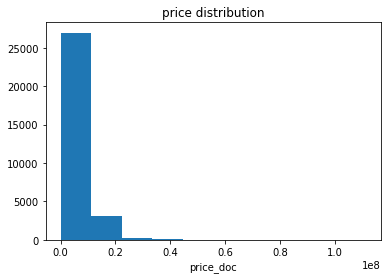
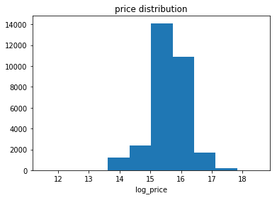

# Mini project 1 - Basic Data Analytics with Pandas

In the first week, we’ll practice data exploration and data analysis in Python with a real-world dataset – Sberbank data, which is available in the [Sberbank Russian Housing Market Kaggle competition](https://www.kaggle.com/c/sberbank-russian-housing-market). Sberbank dataset contains rich and messy data about Russian's housing market. This real-world data will provide you concrete practices for getting started with python. 

This step-by-step mini project will cover the most essential and useful techniques for data analysis in solving a real-world problem with key Python data analysis libraries: pandas and numpy. We’ll go through data loading and data frame creation, selection and query, grouping and function applying, plotting and writing data to file. 


```python
# Start with importing essentials
import pandas as pd
import numpy as np
import matplotlib.pyplot as plt
%matplotlib inline
```

**Question 1: Read the train set and test set of Sberbank dataset from the train.csv and test.csv, and call them train_data and test_data. **

Hint: You can read data from a CSV file using the read_csv function in pandas. By default, it assumes that the fields are comma-separated.


```python
train_data = pd.read_csv('train.csv')
test_data = pd.read_csv('test.csv')
```

** Question 2: Merge train and test to one dataframe and call it full_data. **

Hint: The new dataframe should have the rows from train_data followed by rows from test_data. Refer to [merge, join, and concatenate](https://pandas.pydata.org/pandas-docs/stable/merging.html). 


```python
full_data = pd.concat([test_data, train_data],keys=['test', 'train'])
full_data
```


<div>
<style>
    .dataframe thead tr:only-child th {
        text-align: right;
    }

    .dataframe thead th {
        text-align: left;
    }

    .dataframe tbody tr th {
        vertical-align: top;
    }
</style>
<table border="1" class="dataframe">
  <thead>
    <tr style="text-align: right;">
      <th></th>
      <th></th>
      <th>0_13_all</th>
      <th>0_13_female</th>
      <th>0_13_male</th>
      <th>0_17_all</th>
      <th>0_17_female</th>
      <th>0_17_male</th>
      <th>0_6_all</th>
      <th>0_6_female</th>
      <th>0_6_male</th>
      <th>16_29_all</th>
      <th>...</th>
      <th>water_km</th>
      <th>water_treatment_km</th>
      <th>work_all</th>
      <th>work_female</th>
      <th>work_male</th>
      <th>workplaces_km</th>
      <th>young_all</th>
      <th>young_female</th>
      <th>young_male</th>
      <th>zd_vokzaly_avto_km</th>
    </tr>
  </thead>
  <tbody>
    <tr>
      <th rowspan="30" valign="top">test</th>
      <th>0</th>
      <td>27123</td>
      <td>12783</td>
      <td>14340</td>
      <td>34341</td>
      <td>16247</td>
      <td>18094</td>
      <td>14080</td>
      <td>6623</td>
      <td>7457</td>
      <td>19906</td>
      <td>...</td>
      <td>0.248151</td>
      <td>0.967696</td>
      <td>121369</td>
      <td>62231</td>
      <td>59138</td>
      <td>7.922610</td>
      <td>30808</td>
      <td>14557</td>
      <td>16251</td>
      <td>27.553486</td>
    </tr>
    <tr>
      <th>1</th>
      <td>506</td>
      <td>245</td>
      <td>261</td>
      <td>646</td>
      <td>311</td>
      <td>336</td>
      <td>275</td>
      <td>133</td>
      <td>143</td>
      <td>3796</td>
      <td>...</td>
      <td>0.799853</td>
      <td>16.049420</td>
      <td>2566</td>
      <td>1211</td>
      <td>1356</td>
      <td>9.672779</td>
      <td>574</td>
      <td>277</td>
      <td>297</td>
      <td>27.421853</td>
    </tr>
    <tr>
      <th>2</th>
      <td>12162</td>
      <td>6045</td>
      <td>6117</td>
      <td>15514</td>
      <td>7701</td>
      <td>7813</td>
      <td>6400</td>
      <td>3191</td>
      <td>3209</td>
      <td>8137</td>
      <td>...</td>
      <td>1.384824</td>
      <td>11.749900</td>
      <td>91795</td>
      <td>47061</td>
      <td>44734</td>
      <td>3.506298</td>
      <td>13799</td>
      <td>6862</td>
      <td>6937</td>
      <td>10.093318</td>
    </tr>
    <tr>
      <th>3</th>
      <td>900</td>
      <td>435</td>
      <td>465</td>
      <td>1150</td>
      <td>553</td>
      <td>597</td>
      <td>489</td>
      <td>236</td>
      <td>254</td>
      <td>2155</td>
      <td>...</td>
      <td>0.233017</td>
      <td>5.061917</td>
      <td>4568</td>
      <td>2155</td>
      <td>2414</td>
      <td>11.306566</td>
      <td>1021</td>
      <td>493</td>
      <td>529</td>
      <td>37.436772</td>
    </tr>
    <tr>
      <th>4</th>
      <td>506</td>
      <td>245</td>
      <td>261</td>
      <td>646</td>
      <td>311</td>
      <td>336</td>
      <td>275</td>
      <td>133</td>
      <td>143</td>
      <td>3796</td>
      <td>...</td>
      <td>0.394422</td>
      <td>16.784630</td>
      <td>2566</td>
      <td>1211</td>
      <td>1356</td>
      <td>9.479093</td>
      <td>574</td>
      <td>277</td>
      <td>297</td>
      <td>25.699461</td>
    </tr>
    <tr>
      <th>5</th>
      <td>7332</td>
      <td>3617</td>
      <td>3715</td>
      <td>9249</td>
      <td>4558</td>
      <td>4691</td>
      <td>3903</td>
      <td>1914</td>
      <td>1989</td>
      <td>23768</td>
      <td>...</td>
      <td>0.420686</td>
      <td>14.695410</td>
      <td>65115</td>
      <td>26333</td>
      <td>38782</td>
      <td>2.271688</td>
      <td>8294</td>
      <td>4058</td>
      <td>4236</td>
      <td>7.586885</td>
    </tr>
    <tr>
      <th>6</th>
      <td>14555</td>
      <td>7398</td>
      <td>7157</td>
      <td>17908</td>
      <td>9050</td>
      <td>8858</td>
      <td>8340</td>
      <td>4292</td>
      <td>4048</td>
      <td>31549</td>
      <td>...</td>
      <td>0.589157</td>
      <td>16.103650</td>
      <td>75334</td>
      <td>37196</td>
      <td>38138</td>
      <td>6.167764</td>
      <td>16287</td>
      <td>8248</td>
      <td>8039</td>
      <td>20.071219</td>
    </tr>
    <tr>
      <th>7</th>
      <td>1207</td>
      <td>584</td>
      <td>623</td>
      <td>1542</td>
      <td>742</td>
      <td>801</td>
      <td>656</td>
      <td>316</td>
      <td>340</td>
      <td>3134</td>
      <td>...</td>
      <td>0.912455</td>
      <td>7.064776</td>
      <td>6127</td>
      <td>2890</td>
      <td>3237</td>
      <td>4.808383</td>
      <td>1370</td>
      <td>661</td>
      <td>709</td>
      <td>21.310806</td>
    </tr>
    <tr>
      <th>8</th>
      <td>2645</td>
      <td>1266</td>
      <td>1379</td>
      <td>3307</td>
      <td>1608</td>
      <td>1699</td>
      <td>1491</td>
      <td>713</td>
      <td>778</td>
      <td>281232</td>
      <td>...</td>
      <td>0.255966</td>
      <td>16.647890</td>
      <td>13457</td>
      <td>6524</td>
      <td>6933</td>
      <td>12.067427</td>
      <td>2981</td>
      <td>1432</td>
      <td>1549</td>
      <td>29.316910</td>
    </tr>
    <tr>
      <th>9</th>
      <td>506</td>
      <td>245</td>
      <td>261</td>
      <td>646</td>
      <td>311</td>
      <td>336</td>
      <td>275</td>
      <td>133</td>
      <td>143</td>
      <td>3796</td>
      <td>...</td>
      <td>1.094689</td>
      <td>18.946490</td>
      <td>2566</td>
      <td>1211</td>
      <td>1356</td>
      <td>10.721708</td>
      <td>574</td>
      <td>277</td>
      <td>297</td>
      <td>26.008518</td>
    </tr>
    <tr>
      <th>10</th>
      <td>13729</td>
      <td>6800</td>
      <td>6929</td>
      <td>17700</td>
      <td>8702</td>
      <td>8998</td>
      <td>6880</td>
      <td>3414</td>
      <td>3466</td>
      <td>15164</td>
      <td>...</td>
      <td>0.244431</td>
      <td>1.795546</td>
      <td>70194</td>
      <td>34572</td>
      <td>35622</td>
      <td>0.878220</td>
      <td>15727</td>
      <td>7802</td>
      <td>7925</td>
      <td>12.464723</td>
    </tr>
    <tr>
      <th>11</th>
      <td>506</td>
      <td>245</td>
      <td>261</td>
      <td>646</td>
      <td>311</td>
      <td>336</td>
      <td>275</td>
      <td>133</td>
      <td>143</td>
      <td>3796</td>
      <td>...</td>
      <td>0.394422</td>
      <td>16.784630</td>
      <td>2566</td>
      <td>1211</td>
      <td>1356</td>
      <td>9.479093</td>
      <td>574</td>
      <td>277</td>
      <td>297</td>
      <td>25.699461</td>
    </tr>
    <tr>
      <th>12</th>
      <td>506</td>
      <td>245</td>
      <td>261</td>
      <td>646</td>
      <td>311</td>
      <td>336</td>
      <td>275</td>
      <td>133</td>
      <td>143</td>
      <td>3796</td>
      <td>...</td>
      <td>0.173029</td>
      <td>18.857430</td>
      <td>2566</td>
      <td>1211</td>
      <td>1356</td>
      <td>12.462580</td>
      <td>574</td>
      <td>277</td>
      <td>297</td>
      <td>27.726514</td>
    </tr>
    <tr>
      <th>13</th>
      <td>3112</td>
      <td>1512</td>
      <td>1600</td>
      <td>3831</td>
      <td>1858</td>
      <td>1973</td>
      <td>1706</td>
      <td>844</td>
      <td>862</td>
      <td>55710</td>
      <td>...</td>
      <td>1.164959</td>
      <td>2.166674</td>
      <td>13331</td>
      <td>6661</td>
      <td>6670</td>
      <td>5.191946</td>
      <td>3459</td>
      <td>1677</td>
      <td>1782</td>
      <td>23.803464</td>
    </tr>
    <tr>
      <th>14</th>
      <td>322</td>
      <td>156</td>
      <td>166</td>
      <td>411</td>
      <td>198</td>
      <td>214</td>
      <td>175</td>
      <td>85</td>
      <td>91</td>
      <td>628</td>
      <td>...</td>
      <td>0.752827</td>
      <td>10.210550</td>
      <td>1633</td>
      <td>771</td>
      <td>863</td>
      <td>10.915502</td>
      <td>365</td>
      <td>177</td>
      <td>189</td>
      <td>37.934996</td>
    </tr>
    <tr>
      <th>15</th>
      <td>1207</td>
      <td>584</td>
      <td>623</td>
      <td>1542</td>
      <td>742</td>
      <td>801</td>
      <td>656</td>
      <td>316</td>
      <td>340</td>
      <td>3134</td>
      <td>...</td>
      <td>0.302692</td>
      <td>8.813134</td>
      <td>6127</td>
      <td>2890</td>
      <td>3237</td>
      <td>4.729796</td>
      <td>1370</td>
      <td>661</td>
      <td>709</td>
      <td>22.103983</td>
    </tr>
    <tr>
      <th>16</th>
      <td>9633</td>
      <td>4667</td>
      <td>4966</td>
      <td>13203</td>
      <td>6321</td>
      <td>6882</td>
      <td>4992</td>
      <td>2390</td>
      <td>2602</td>
      <td>24605</td>
      <td>...</td>
      <td>0.255791</td>
      <td>14.856050</td>
      <td>65499</td>
      <td>31332</td>
      <td>34167</td>
      <td>0.568046</td>
      <td>10988</td>
      <td>5333</td>
      <td>5655</td>
      <td>9.394126</td>
    </tr>
    <tr>
      <th>17</th>
      <td>10653</td>
      <td>5147</td>
      <td>5506</td>
      <td>14297</td>
      <td>7088</td>
      <td>7209</td>
      <td>5506</td>
      <td>2645</td>
      <td>2861</td>
      <td>291222</td>
      <td>...</td>
      <td>1.583581</td>
      <td>7.094807</td>
      <td>68518</td>
      <td>34386</td>
      <td>34132</td>
      <td>0.223616</td>
      <td>12074</td>
      <td>5876</td>
      <td>6198</td>
      <td>7.039798</td>
    </tr>
    <tr>
      <th>18</th>
      <td>3112</td>
      <td>1512</td>
      <td>1600</td>
      <td>3831</td>
      <td>1858</td>
      <td>1973</td>
      <td>1706</td>
      <td>844</td>
      <td>862</td>
      <td>55710</td>
      <td>...</td>
      <td>1.247852</td>
      <td>2.100849</td>
      <td>13331</td>
      <td>6661</td>
      <td>6670</td>
      <td>5.294133</td>
      <td>3459</td>
      <td>1677</td>
      <td>1782</td>
      <td>25.178735</td>
    </tr>
    <tr>
      <th>19</th>
      <td>10653</td>
      <td>5147</td>
      <td>5506</td>
      <td>14297</td>
      <td>7088</td>
      <td>7209</td>
      <td>5506</td>
      <td>2645</td>
      <td>2861</td>
      <td>291222</td>
      <td>...</td>
      <td>0.812136</td>
      <td>7.936607</td>
      <td>68518</td>
      <td>34386</td>
      <td>34132</td>
      <td>1.183532</td>
      <td>12074</td>
      <td>5876</td>
      <td>6198</td>
      <td>9.007753</td>
    </tr>
    <tr>
      <th>20</th>
      <td>506</td>
      <td>245</td>
      <td>261</td>
      <td>646</td>
      <td>311</td>
      <td>336</td>
      <td>275</td>
      <td>133</td>
      <td>143</td>
      <td>3796</td>
      <td>...</td>
      <td>0.394422</td>
      <td>16.784630</td>
      <td>2566</td>
      <td>1211</td>
      <td>1356</td>
      <td>9.479093</td>
      <td>574</td>
      <td>277</td>
      <td>297</td>
      <td>25.699461</td>
    </tr>
    <tr>
      <th>21</th>
      <td>12653</td>
      <td>6105</td>
      <td>6548</td>
      <td>15947</td>
      <td>7684</td>
      <td>8263</td>
      <td>6715</td>
      <td>3263</td>
      <td>3452</td>
      <td>16001</td>
      <td>...</td>
      <td>0.410296</td>
      <td>4.179881</td>
      <td>78835</td>
      <td>36506</td>
      <td>42329</td>
      <td>2.111245</td>
      <td>14317</td>
      <td>6905</td>
      <td>7412</td>
      <td>10.032059</td>
    </tr>
    <tr>
      <th>22</th>
      <td>10557</td>
      <td>5115</td>
      <td>5442</td>
      <td>13390</td>
      <td>6487</td>
      <td>6903</td>
      <td>5519</td>
      <td>2744</td>
      <td>2775</td>
      <td>17236</td>
      <td>...</td>
      <td>1.474372</td>
      <td>18.127570</td>
      <td>51138</td>
      <td>25603</td>
      <td>25535</td>
      <td>3.232352</td>
      <td>11996</td>
      <td>5811</td>
      <td>6185</td>
      <td>14.778442</td>
    </tr>
    <tr>
      <th>23</th>
      <td>11003</td>
      <td>5225</td>
      <td>5778</td>
      <td>13507</td>
      <td>6419</td>
      <td>7088</td>
      <td>6354</td>
      <td>2982</td>
      <td>3372</td>
      <td>27107</td>
      <td>...</td>
      <td>0.682454</td>
      <td>17.889290</td>
      <td>81271</td>
      <td>38523</td>
      <td>42748</td>
      <td>7.523798</td>
      <td>12244</td>
      <td>5826</td>
      <td>6418</td>
      <td>23.647287</td>
    </tr>
    <tr>
      <th>24</th>
      <td>10230</td>
      <td>4940</td>
      <td>5290</td>
      <td>13481</td>
      <td>6521</td>
      <td>6960</td>
      <td>5208</td>
      <td>2522</td>
      <td>2686</td>
      <td>21542</td>
      <td>...</td>
      <td>0.883414</td>
      <td>7.620876</td>
      <td>74032</td>
      <td>37346</td>
      <td>36686</td>
      <td>2.310634</td>
      <td>11729</td>
      <td>5670</td>
      <td>6059</td>
      <td>13.938686</td>
    </tr>
    <tr>
      <th>25</th>
      <td>7148</td>
      <td>3416</td>
      <td>3732</td>
      <td>9115</td>
      <td>4324</td>
      <td>4791</td>
      <td>3559</td>
      <td>1718</td>
      <td>1841</td>
      <td>20342</td>
      <td>...</td>
      <td>0.728382</td>
      <td>23.606450</td>
      <td>34611</td>
      <td>16976</td>
      <td>17635</td>
      <td>0.257841</td>
      <td>8140</td>
      <td>3899</td>
      <td>4241</td>
      <td>12.621859</td>
    </tr>
    <tr>
      <th>26</th>
      <td>5133</td>
      <td>2418</td>
      <td>2715</td>
      <td>6589</td>
      <td>3103</td>
      <td>3486</td>
      <td>2672</td>
      <td>1280</td>
      <td>1392</td>
      <td>19189</td>
      <td>...</td>
      <td>0.509525</td>
      <td>17.900570</td>
      <td>31832</td>
      <td>15122</td>
      <td>16710</td>
      <td>2.498736</td>
      <td>5836</td>
      <td>2752</td>
      <td>3084</td>
      <td>13.605319</td>
    </tr>
    <tr>
      <th>27</th>
      <td>10012</td>
      <td>4877</td>
      <td>5135</td>
      <td>12655</td>
      <td>6185</td>
      <td>6470</td>
      <td>5195</td>
      <td>2574</td>
      <td>2621</td>
      <td>21910</td>
      <td>...</td>
      <td>0.915929</td>
      <td>19.639800</td>
      <td>47628</td>
      <td>24101</td>
      <td>23527</td>
      <td>1.366228</td>
      <td>11356</td>
      <td>5537</td>
      <td>5819</td>
      <td>11.172078</td>
    </tr>
    <tr>
      <th>28</th>
      <td>3681</td>
      <td>1787</td>
      <td>1894</td>
      <td>4724</td>
      <td>2283</td>
      <td>2441</td>
      <td>2041</td>
      <td>976</td>
      <td>1065</td>
      <td>7467</td>
      <td>...</td>
      <td>0.198830</td>
      <td>2.721279</td>
      <td>20445</td>
      <td>9955</td>
      <td>10490</td>
      <td>10.473497</td>
      <td>4207</td>
      <td>2039</td>
      <td>2168</td>
      <td>29.502495</td>
    </tr>
    <tr>
      <th>29</th>
      <td>7332</td>
      <td>3617</td>
      <td>3715</td>
      <td>9249</td>
      <td>4558</td>
      <td>4691</td>
      <td>3903</td>
      <td>1914</td>
      <td>1989</td>
      <td>23768</td>
      <td>...</td>
      <td>0.098841</td>
      <td>16.860880</td>
      <td>65115</td>
      <td>26333</td>
      <td>38782</td>
      <td>1.466317</td>
      <td>8294</td>
      <td>4058</td>
      <td>4236</td>
      <td>10.069551</td>
    </tr>
    <tr>
      <th>...</th>
      <th>...</th>
      <td>...</td>
      <td>...</td>
      <td>...</td>
      <td>...</td>
      <td>...</td>
      <td>...</td>
      <td>...</td>
      <td>...</td>
      <td>...</td>
      <td>...</td>
      <td>...</td>
      <td>...</td>
      <td>...</td>
      <td>...</td>
      <td>...</td>
      <td>...</td>
      <td>...</td>
      <td>...</td>
      <td>...</td>
      <td>...</td>
      <td>...</td>
    </tr>
    <tr>
      <th rowspan="30" valign="top">train</th>
      <th>30441</th>
      <td>9955</td>
      <td>5120</td>
      <td>4835</td>
      <td>12508</td>
      <td>6443</td>
      <td>6065</td>
      <td>4237</td>
      <td>2158</td>
      <td>2079</td>
      <td>23480</td>
      <td>...</td>
      <td>0.524839</td>
      <td>10.378040</td>
      <td>43921</td>
      <td>22020</td>
      <td>21901</td>
      <td>1.091507</td>
      <td>11272</td>
      <td>5802</td>
      <td>5470</td>
      <td>4.060430</td>
    </tr>
    <tr>
      <th>30442</th>
      <td>900</td>
      <td>435</td>
      <td>465</td>
      <td>1150</td>
      <td>553</td>
      <td>597</td>
      <td>489</td>
      <td>236</td>
      <td>254</td>
      <td>2155</td>
      <td>...</td>
      <td>0.006707</td>
      <td>1.014447</td>
      <td>4568</td>
      <td>2155</td>
      <td>2414</td>
      <td>8.941513</td>
      <td>1021</td>
      <td>493</td>
      <td>529</td>
      <td>29.254460</td>
    </tr>
    <tr>
      <th>30443</th>
      <td>14555</td>
      <td>7398</td>
      <td>7157</td>
      <td>17908</td>
      <td>9050</td>
      <td>8858</td>
      <td>8340</td>
      <td>4292</td>
      <td>4048</td>
      <td>31549</td>
      <td>...</td>
      <td>0.589157</td>
      <td>16.103650</td>
      <td>75334</td>
      <td>37196</td>
      <td>38138</td>
      <td>6.167764</td>
      <td>16287</td>
      <td>8248</td>
      <td>8039</td>
      <td>20.071219</td>
    </tr>
    <tr>
      <th>30444</th>
      <td>24934</td>
      <td>12152</td>
      <td>12782</td>
      <td>32063</td>
      <td>15550</td>
      <td>16513</td>
      <td>13087</td>
      <td>6442</td>
      <td>6645</td>
      <td>3292</td>
      <td>...</td>
      <td>0.237405</td>
      <td>16.727180</td>
      <td>120381</td>
      <td>60341</td>
      <td>60040</td>
      <td>1.016728</td>
      <td>28563</td>
      <td>13883</td>
      <td>14680</td>
      <td>15.955488</td>
    </tr>
    <tr>
      <th>30445</th>
      <td>7332</td>
      <td>3617</td>
      <td>3715</td>
      <td>9249</td>
      <td>4558</td>
      <td>4691</td>
      <td>3903</td>
      <td>1914</td>
      <td>1989</td>
      <td>23768</td>
      <td>...</td>
      <td>0.420686</td>
      <td>14.695410</td>
      <td>65115</td>
      <td>26333</td>
      <td>38782</td>
      <td>2.271688</td>
      <td>8294</td>
      <td>4058</td>
      <td>4236</td>
      <td>7.586885</td>
    </tr>
    <tr>
      <th>30446</th>
      <td>1207</td>
      <td>584</td>
      <td>623</td>
      <td>1542</td>
      <td>742</td>
      <td>801</td>
      <td>656</td>
      <td>316</td>
      <td>340</td>
      <td>3134</td>
      <td>...</td>
      <td>0.302692</td>
      <td>8.813134</td>
      <td>6127</td>
      <td>2890</td>
      <td>3237</td>
      <td>4.729796</td>
      <td>1370</td>
      <td>661</td>
      <td>709</td>
      <td>22.103983</td>
    </tr>
    <tr>
      <th>30447</th>
      <td>14555</td>
      <td>7398</td>
      <td>7157</td>
      <td>17908</td>
      <td>9050</td>
      <td>8858</td>
      <td>8340</td>
      <td>4292</td>
      <td>4048</td>
      <td>31549</td>
      <td>...</td>
      <td>0.589157</td>
      <td>16.103650</td>
      <td>75334</td>
      <td>37196</td>
      <td>38138</td>
      <td>6.167764</td>
      <td>16287</td>
      <td>8248</td>
      <td>8039</td>
      <td>20.071219</td>
    </tr>
    <tr>
      <th>30448</th>
      <td>2756</td>
      <td>1333</td>
      <td>1423</td>
      <td>3523</td>
      <td>1694</td>
      <td>1830</td>
      <td>1497</td>
      <td>721</td>
      <td>777</td>
      <td>1566</td>
      <td>...</td>
      <td>1.263289</td>
      <td>13.997580</td>
      <td>13996</td>
      <td>6602</td>
      <td>7394</td>
      <td>9.907037</td>
      <td>3128</td>
      <td>1510</td>
      <td>1618</td>
      <td>30.927687</td>
    </tr>
    <tr>
      <th>30449</th>
      <td>7332</td>
      <td>3617</td>
      <td>3715</td>
      <td>9249</td>
      <td>4558</td>
      <td>4691</td>
      <td>3903</td>
      <td>1914</td>
      <td>1989</td>
      <td>23768</td>
      <td>...</td>
      <td>0.420686</td>
      <td>14.695410</td>
      <td>65115</td>
      <td>26333</td>
      <td>38782</td>
      <td>2.271688</td>
      <td>8294</td>
      <td>4058</td>
      <td>4236</td>
      <td>7.586885</td>
    </tr>
    <tr>
      <th>30450</th>
      <td>18732</td>
      <td>9069</td>
      <td>9663</td>
      <td>23849</td>
      <td>11437</td>
      <td>12412</td>
      <td>9753</td>
      <td>4709</td>
      <td>5044</td>
      <td>11588</td>
      <td>...</td>
      <td>0.536299</td>
      <td>22.081640</td>
      <td>112133</td>
      <td>53044</td>
      <td>59089</td>
      <td>2.164989</td>
      <td>21400</td>
      <td>10306</td>
      <td>11094</td>
      <td>9.121523</td>
    </tr>
    <tr>
      <th>30451</th>
      <td>730</td>
      <td>352</td>
      <td>379</td>
      <td>930</td>
      <td>450</td>
      <td>480</td>
      <td>390</td>
      <td>189</td>
      <td>201</td>
      <td>2092</td>
      <td>...</td>
      <td>0.136930</td>
      <td>37.667390</td>
      <td>3989</td>
      <td>1760</td>
      <td>2229</td>
      <td>37.681524</td>
      <td>830</td>
      <td>401</td>
      <td>430</td>
      <td>59.273863</td>
    </tr>
    <tr>
      <th>30452</th>
      <td>14168</td>
      <td>6842</td>
      <td>7326</td>
      <td>18269</td>
      <td>8762</td>
      <td>9507</td>
      <td>7454</td>
      <td>3609</td>
      <td>3845</td>
      <td>29595</td>
      <td>...</td>
      <td>0.571205</td>
      <td>14.420450</td>
      <td>78670</td>
      <td>34017</td>
      <td>44653</td>
      <td>3.278191</td>
      <td>16098</td>
      <td>7811</td>
      <td>8287</td>
      <td>10.596898</td>
    </tr>
    <tr>
      <th>30453</th>
      <td>27123</td>
      <td>12783</td>
      <td>14340</td>
      <td>34341</td>
      <td>16247</td>
      <td>18094</td>
      <td>14080</td>
      <td>6623</td>
      <td>7457</td>
      <td>19906</td>
      <td>...</td>
      <td>0.675396</td>
      <td>4.134976</td>
      <td>121369</td>
      <td>62231</td>
      <td>59138</td>
      <td>4.075042</td>
      <td>30808</td>
      <td>14557</td>
      <td>16251</td>
      <td>23.652443</td>
    </tr>
    <tr>
      <th>30454</th>
      <td>12479</td>
      <td>6296</td>
      <td>6183</td>
      <td>15630</td>
      <td>7847</td>
      <td>7783</td>
      <td>7103</td>
      <td>3505</td>
      <td>3598</td>
      <td>311210</td>
      <td>...</td>
      <td>1.245358</td>
      <td>16.663030</td>
      <td>59366</td>
      <td>28510</td>
      <td>30856</td>
      <td>0.961187</td>
      <td>13897</td>
      <td>6960</td>
      <td>6937</td>
      <td>6.951842</td>
    </tr>
    <tr>
      <th>30455</th>
      <td>506</td>
      <td>245</td>
      <td>261</td>
      <td>646</td>
      <td>311</td>
      <td>336</td>
      <td>275</td>
      <td>133</td>
      <td>143</td>
      <td>3796</td>
      <td>...</td>
      <td>0.718454</td>
      <td>17.049540</td>
      <td>2566</td>
      <td>1211</td>
      <td>1356</td>
      <td>9.660010</td>
      <td>574</td>
      <td>277</td>
      <td>297</td>
      <td>26.054343</td>
    </tr>
    <tr>
      <th>30456</th>
      <td>24934</td>
      <td>12152</td>
      <td>12782</td>
      <td>32063</td>
      <td>15550</td>
      <td>16513</td>
      <td>13087</td>
      <td>6442</td>
      <td>6645</td>
      <td>3292</td>
      <td>...</td>
      <td>0.327461</td>
      <td>16.791370</td>
      <td>120381</td>
      <td>60341</td>
      <td>60040</td>
      <td>1.132403</td>
      <td>28563</td>
      <td>13883</td>
      <td>14680</td>
      <td>15.601020</td>
    </tr>
    <tr>
      <th>30457</th>
      <td>12396</td>
      <td>6493</td>
      <td>5903</td>
      <td>16291</td>
      <td>8549</td>
      <td>7742</td>
      <td>5991</td>
      <td>3143</td>
      <td>2848</td>
      <td>18679</td>
      <td>...</td>
      <td>0.403743</td>
      <td>23.798810</td>
      <td>58882</td>
      <td>29502</td>
      <td>29380</td>
      <td>0.509614</td>
      <td>14309</td>
      <td>7498</td>
      <td>6811</td>
      <td>11.987559</td>
    </tr>
    <tr>
      <th>30458</th>
      <td>2756</td>
      <td>1333</td>
      <td>1423</td>
      <td>3523</td>
      <td>1694</td>
      <td>1830</td>
      <td>1497</td>
      <td>721</td>
      <td>777</td>
      <td>1566</td>
      <td>...</td>
      <td>0.191540</td>
      <td>15.164050</td>
      <td>13996</td>
      <td>6602</td>
      <td>7394</td>
      <td>5.247596</td>
      <td>3128</td>
      <td>1510</td>
      <td>1618</td>
      <td>21.641280</td>
    </tr>
    <tr>
      <th>30459</th>
      <td>14555</td>
      <td>7398</td>
      <td>7157</td>
      <td>17908</td>
      <td>9050</td>
      <td>8858</td>
      <td>8340</td>
      <td>4292</td>
      <td>4048</td>
      <td>31549</td>
      <td>...</td>
      <td>0.589157</td>
      <td>16.103650</td>
      <td>75334</td>
      <td>37196</td>
      <td>38138</td>
      <td>6.167764</td>
      <td>16287</td>
      <td>8248</td>
      <td>8039</td>
      <td>20.071219</td>
    </tr>
    <tr>
      <th>30460</th>
      <td>20530</td>
      <td>9999</td>
      <td>10531</td>
      <td>26209</td>
      <td>12754</td>
      <td>13455</td>
      <td>10712</td>
      <td>5210</td>
      <td>5502</td>
      <td>45669</td>
      <td>...</td>
      <td>0.517980</td>
      <td>9.477324</td>
      <td>105171</td>
      <td>52323</td>
      <td>52848</td>
      <td>0.703050</td>
      <td>23483</td>
      <td>11400</td>
      <td>12083</td>
      <td>17.876528</td>
    </tr>
    <tr>
      <th>30461</th>
      <td>8301</td>
      <td>4082</td>
      <td>4219</td>
      <td>10896</td>
      <td>5324</td>
      <td>5572</td>
      <td>4215</td>
      <td>2054</td>
      <td>2161</td>
      <td>15835</td>
      <td>...</td>
      <td>0.450691</td>
      <td>9.872418</td>
      <td>51445</td>
      <td>26442</td>
      <td>25003</td>
      <td>3.501005</td>
      <td>9414</td>
      <td>4599</td>
      <td>4815</td>
      <td>11.086655</td>
    </tr>
    <tr>
      <th>30462</th>
      <td>7332</td>
      <td>3617</td>
      <td>3715</td>
      <td>9249</td>
      <td>4558</td>
      <td>4691</td>
      <td>3903</td>
      <td>1914</td>
      <td>1989</td>
      <td>23768</td>
      <td>...</td>
      <td>0.420686</td>
      <td>14.695410</td>
      <td>65115</td>
      <td>26333</td>
      <td>38782</td>
      <td>2.271688</td>
      <td>8294</td>
      <td>4058</td>
      <td>4236</td>
      <td>7.586885</td>
    </tr>
    <tr>
      <th>30463</th>
      <td>20140</td>
      <td>9609</td>
      <td>10531</td>
      <td>26095</td>
      <td>12498</td>
      <td>13597</td>
      <td>10190</td>
      <td>4856</td>
      <td>5334</td>
      <td>11372</td>
      <td>...</td>
      <td>0.684074</td>
      <td>16.656070</td>
      <td>93843</td>
      <td>46574</td>
      <td>47269</td>
      <td>2.106114</td>
      <td>22961</td>
      <td>10922</td>
      <td>12039</td>
      <td>16.154691</td>
    </tr>
    <tr>
      <th>30464</th>
      <td>6859</td>
      <td>3564</td>
      <td>3295</td>
      <td>8741</td>
      <td>4430</td>
      <td>4311</td>
      <td>3694</td>
      <td>1873</td>
      <td>1821</td>
      <td>7290</td>
      <td>...</td>
      <td>0.241299</td>
      <td>20.271190</td>
      <td>40289</td>
      <td>20275</td>
      <td>20014</td>
      <td>1.766675</td>
      <td>7706</td>
      <td>3992</td>
      <td>3714</td>
      <td>7.185917</td>
    </tr>
    <tr>
      <th>30465</th>
      <td>9955</td>
      <td>5120</td>
      <td>4835</td>
      <td>12508</td>
      <td>6443</td>
      <td>6065</td>
      <td>4237</td>
      <td>2158</td>
      <td>2079</td>
      <td>23480</td>
      <td>...</td>
      <td>0.524839</td>
      <td>10.378040</td>
      <td>43921</td>
      <td>22020</td>
      <td>21901</td>
      <td>1.091507</td>
      <td>11272</td>
      <td>5802</td>
      <td>5470</td>
      <td>4.060430</td>
    </tr>
    <tr>
      <th>30466</th>
      <td>18732</td>
      <td>9069</td>
      <td>9663</td>
      <td>23849</td>
      <td>11437</td>
      <td>12412</td>
      <td>9753</td>
      <td>4709</td>
      <td>5044</td>
      <td>11588</td>
      <td>...</td>
      <td>0.979218</td>
      <td>22.746320</td>
      <td>112133</td>
      <td>53044</td>
      <td>59089</td>
      <td>1.442576</td>
      <td>21400</td>
      <td>10306</td>
      <td>11094</td>
      <td>11.396447</td>
    </tr>
    <tr>
      <th>30467</th>
      <td>9955</td>
      <td>5120</td>
      <td>4835</td>
      <td>12508</td>
      <td>6443</td>
      <td>6065</td>
      <td>4237</td>
      <td>2158</td>
      <td>2079</td>
      <td>23480</td>
      <td>...</td>
      <td>1.063533</td>
      <td>13.867820</td>
      <td>43921</td>
      <td>22020</td>
      <td>21901</td>
      <td>0.796851</td>
      <td>11272</td>
      <td>5802</td>
      <td>5470</td>
      <td>1.010437</td>
    </tr>
    <tr>
      <th>30468</th>
      <td>506</td>
      <td>245</td>
      <td>261</td>
      <td>646</td>
      <td>311</td>
      <td>336</td>
      <td>275</td>
      <td>133</td>
      <td>143</td>
      <td>3796</td>
      <td>...</td>
      <td>0.394422</td>
      <td>16.784630</td>
      <td>2566</td>
      <td>1211</td>
      <td>1356</td>
      <td>9.479093</td>
      <td>574</td>
      <td>277</td>
      <td>297</td>
      <td>25.699461</td>
    </tr>
    <tr>
      <th>30469</th>
      <td>8301</td>
      <td>4082</td>
      <td>4219</td>
      <td>10896</td>
      <td>5324</td>
      <td>5572</td>
      <td>4215</td>
      <td>2054</td>
      <td>2161</td>
      <td>15835</td>
      <td>...</td>
      <td>0.738539</td>
      <td>11.397520</td>
      <td>51445</td>
      <td>26442</td>
      <td>25003</td>
      <td>2.340429</td>
      <td>9414</td>
      <td>4599</td>
      <td>4815</td>
      <td>15.303338</td>
    </tr>
    <tr>
      <th>30470</th>
      <td>11903</td>
      <td>5975</td>
      <td>5928</td>
      <td>14994</td>
      <td>7572</td>
      <td>7422</td>
      <td>6120</td>
      <td>3024</td>
      <td>3096</td>
      <td>17070</td>
      <td>...</td>
      <td>0.518509</td>
      <td>10.451010</td>
      <td>56908</td>
      <td>29689</td>
      <td>27219</td>
      <td>3.065101</td>
      <td>13523</td>
      <td>6799</td>
      <td>6724</td>
      <td>12.243439</td>
    </tr>
  </tbody>
</table>
<p>38133 rows × 292 columns</p>
</div>


***For the rest questions, if not specified, we'll do practice on train_data. Let's create a dataframe called df from train_data.***


```python
df = pd.read_csv('train.csv')
```

** Question 3: Preview the first 10 columns with head().**

Hint: You can change the number of rows displayed by specifying a number. There is a similar function tail(), which will show you the last columns of a dataframe.


```python
df.head(10) 
df.tail(10)
```


<div>
<style>
    .dataframe thead tr:only-child th {
        text-align: right;
    }

    .dataframe thead th {
        text-align: left;
    }

    .dataframe tbody tr th {
        vertical-align: top;
    }
</style>
<table border="1" class="dataframe">
  <thead>
    <tr style="text-align: right;">
      <th></th>
      <th>id</th>
      <th>timestamp</th>
      <th>full_sq</th>
      <th>life_sq</th>
      <th>floor</th>
      <th>max_floor</th>
      <th>material</th>
      <th>build_year</th>
      <th>num_room</th>
      <th>kitch_sq</th>
      <th>...</th>
      <th>cafe_count_5000_price_2500</th>
      <th>cafe_count_5000_price_4000</th>
      <th>cafe_count_5000_price_high</th>
      <th>big_church_count_5000</th>
      <th>church_count_5000</th>
      <th>mosque_count_5000</th>
      <th>leisure_count_5000</th>
      <th>sport_count_5000</th>
      <th>market_count_5000</th>
      <th>price_doc</th>
    </tr>
  </thead>
  <tbody>
    <tr>
      <th>30461</th>
      <td>30464</td>
      <td>2015-06-30</td>
      <td>36</td>
      <td>19.0</td>
      <td>5.0</td>
      <td>16.0</td>
      <td>1.0</td>
      <td>1980.0</td>
      <td>1.0</td>
      <td>8.0</td>
      <td>...</td>
      <td>41</td>
      <td>4</td>
      <td>1</td>
      <td>4</td>
      <td>35</td>
      <td>1</td>
      <td>6</td>
      <td>80</td>
      <td>6</td>
      <td>5000000</td>
    </tr>
    <tr>
      <th>30462</th>
      <td>30465</td>
      <td>2015-06-30</td>
      <td>47</td>
      <td>30.0</td>
      <td>23.0</td>
      <td>25.0</td>
      <td>4.0</td>
      <td>2016.0</td>
      <td>1.0</td>
      <td>10.0</td>
      <td>...</td>
      <td>99</td>
      <td>57</td>
      <td>12</td>
      <td>23</td>
      <td>42</td>
      <td>1</td>
      <td>13</td>
      <td>123</td>
      <td>7</td>
      <td>10544070</td>
    </tr>
    <tr>
      <th>30463</th>
      <td>30466</td>
      <td>2015-06-30</td>
      <td>56</td>
      <td>29.0</td>
      <td>13.0</td>
      <td>14.0</td>
      <td>1.0</td>
      <td>2001.0</td>
      <td>2.0</td>
      <td>11.0</td>
      <td>...</td>
      <td>14</td>
      <td>2</td>
      <td>0</td>
      <td>13</td>
      <td>12</td>
      <td>0</td>
      <td>1</td>
      <td>53</td>
      <td>6</td>
      <td>12000000</td>
    </tr>
    <tr>
      <th>30464</th>
      <td>30467</td>
      <td>2015-06-30</td>
      <td>56</td>
      <td>51.0</td>
      <td>19.0</td>
      <td>19.0</td>
      <td>1.0</td>
      <td>2017.0</td>
      <td>2.0</td>
      <td>1.0</td>
      <td>...</td>
      <td>25</td>
      <td>3</td>
      <td>0</td>
      <td>14</td>
      <td>29</td>
      <td>1</td>
      <td>4</td>
      <td>90</td>
      <td>6</td>
      <td>10262010</td>
    </tr>
    <tr>
      <th>30465</th>
      <td>30468</td>
      <td>2015-06-30</td>
      <td>52</td>
      <td>NaN</td>
      <td>13.0</td>
      <td>17.0</td>
      <td>1.0</td>
      <td>NaN</td>
      <td>2.0</td>
      <td>1.0</td>
      <td>...</td>
      <td>371</td>
      <td>141</td>
      <td>26</td>
      <td>150</td>
      <td>249</td>
      <td>2</td>
      <td>105</td>
      <td>203</td>
      <td>13</td>
      <td>6750554</td>
    </tr>
    <tr>
      <th>30466</th>
      <td>30469</td>
      <td>2015-06-30</td>
      <td>44</td>
      <td>27.0</td>
      <td>7.0</td>
      <td>9.0</td>
      <td>1.0</td>
      <td>1975.0</td>
      <td>2.0</td>
      <td>6.0</td>
      <td>...</td>
      <td>15</td>
      <td>5</td>
      <td>0</td>
      <td>15</td>
      <td>26</td>
      <td>1</td>
      <td>2</td>
      <td>84</td>
      <td>6</td>
      <td>7400000</td>
    </tr>
    <tr>
      <th>30467</th>
      <td>30470</td>
      <td>2015-06-30</td>
      <td>86</td>
      <td>59.0</td>
      <td>3.0</td>
      <td>9.0</td>
      <td>2.0</td>
      <td>1935.0</td>
      <td>4.0</td>
      <td>10.0</td>
      <td>...</td>
      <td>313</td>
      <td>128</td>
      <td>24</td>
      <td>98</td>
      <td>182</td>
      <td>1</td>
      <td>82</td>
      <td>171</td>
      <td>15</td>
      <td>25000000</td>
    </tr>
    <tr>
      <th>30468</th>
      <td>30471</td>
      <td>2015-06-30</td>
      <td>45</td>
      <td>NaN</td>
      <td>10.0</td>
      <td>20.0</td>
      <td>1.0</td>
      <td>NaN</td>
      <td>1.0</td>
      <td>1.0</td>
      <td>...</td>
      <td>1</td>
      <td>1</td>
      <td>0</td>
      <td>2</td>
      <td>12</td>
      <td>0</td>
      <td>1</td>
      <td>11</td>
      <td>1</td>
      <td>6970959</td>
    </tr>
    <tr>
      <th>30469</th>
      <td>30472</td>
      <td>2015-06-30</td>
      <td>64</td>
      <td>32.0</td>
      <td>5.0</td>
      <td>15.0</td>
      <td>1.0</td>
      <td>2003.0</td>
      <td>2.0</td>
      <td>11.0</td>
      <td>...</td>
      <td>22</td>
      <td>1</td>
      <td>1</td>
      <td>6</td>
      <td>31</td>
      <td>1</td>
      <td>4</td>
      <td>65</td>
      <td>7</td>
      <td>13500000</td>
    </tr>
    <tr>
      <th>30470</th>
      <td>30473</td>
      <td>2015-06-30</td>
      <td>43</td>
      <td>28.0</td>
      <td>1.0</td>
      <td>9.0</td>
      <td>1.0</td>
      <td>1968.0</td>
      <td>2.0</td>
      <td>6.0</td>
      <td>...</td>
      <td>5</td>
      <td>2</td>
      <td>0</td>
      <td>7</td>
      <td>16</td>
      <td>0</td>
      <td>9</td>
      <td>54</td>
      <td>10</td>
      <td>5600000</td>
    </tr>
  </tbody>
</table>
<p>10 rows × 292 columns</p>
</div>


**Question 4: How many columns and rows are there in the data?**


```python
df.info()
```

    <class 'pandas.core.frame.DataFrame'>
    RangeIndex: 30471 entries, 0 to 30470
    Columns: 292 entries, id to price_doc
    dtypes: float64(119), int64(157), object(16)
    memory usage: 67.9+ MB


**Question 5: Which features are available in the data? Display the features.**

Hint: The features are the column names. You can print them out.


```python
df.describe()
```


<div>
<style>
    .dataframe thead tr:only-child th {
        text-align: right;
    }

    .dataframe thead th {
        text-align: left;
    }

    .dataframe tbody tr th {
        vertical-align: top;
    }
</style>
<table border="1" class="dataframe">
  <thead>
    <tr style="text-align: right;">
      <th></th>
      <th>id</th>
      <th>full_sq</th>
      <th>life_sq</th>
      <th>floor</th>
      <th>max_floor</th>
      <th>material</th>
      <th>build_year</th>
      <th>num_room</th>
      <th>kitch_sq</th>
      <th>state</th>
      <th>...</th>
      <th>cafe_count_5000_price_2500</th>
      <th>cafe_count_5000_price_4000</th>
      <th>cafe_count_5000_price_high</th>
      <th>big_church_count_5000</th>
      <th>church_count_5000</th>
      <th>mosque_count_5000</th>
      <th>leisure_count_5000</th>
      <th>sport_count_5000</th>
      <th>market_count_5000</th>
      <th>price_doc</th>
    </tr>
  </thead>
  <tbody>
    <tr>
      <th>count</th>
      <td>30471.000000</td>
      <td>30471.000000</td>
      <td>24088.000000</td>
      <td>30304.000000</td>
      <td>20899.000000</td>
      <td>20899.000000</td>
      <td>1.686600e+04</td>
      <td>20899.000000</td>
      <td>20899.000000</td>
      <td>16912.000000</td>
      <td>...</td>
      <td>30471.000000</td>
      <td>30471.000000</td>
      <td>30471.000000</td>
      <td>30471.000000</td>
      <td>30471.000000</td>
      <td>30471.000000</td>
      <td>30471.000000</td>
      <td>30471.000000</td>
      <td>30471.000000</td>
      <td>3.047100e+04</td>
    </tr>
    <tr>
      <th>mean</th>
      <td>15237.917397</td>
      <td>54.214269</td>
      <td>34.403271</td>
      <td>7.670803</td>
      <td>12.558974</td>
      <td>1.827121</td>
      <td>3.068057e+03</td>
      <td>1.909804</td>
      <td>6.399301</td>
      <td>2.107025</td>
      <td>...</td>
      <td>32.058318</td>
      <td>10.783860</td>
      <td>1.771783</td>
      <td>15.045552</td>
      <td>30.251518</td>
      <td>0.442421</td>
      <td>8.648814</td>
      <td>52.796593</td>
      <td>5.987070</td>
      <td>7.123035e+06</td>
    </tr>
    <tr>
      <th>std</th>
      <td>8796.501536</td>
      <td>38.031487</td>
      <td>52.285733</td>
      <td>5.319989</td>
      <td>6.756550</td>
      <td>1.481154</td>
      <td>1.543878e+05</td>
      <td>0.851805</td>
      <td>28.265979</td>
      <td>0.880148</td>
      <td>...</td>
      <td>73.465611</td>
      <td>28.385679</td>
      <td>5.418807</td>
      <td>29.118668</td>
      <td>47.347938</td>
      <td>0.609269</td>
      <td>20.580741</td>
      <td>46.292660</td>
      <td>4.889219</td>
      <td>4.780111e+06</td>
    </tr>
    <tr>
      <th>min</th>
      <td>1.000000</td>
      <td>0.000000</td>
      <td>0.000000</td>
      <td>0.000000</td>
      <td>0.000000</td>
      <td>1.000000</td>
      <td>0.000000e+00</td>
      <td>0.000000</td>
      <td>0.000000</td>
      <td>1.000000</td>
      <td>...</td>
      <td>0.000000</td>
      <td>0.000000</td>
      <td>0.000000</td>
      <td>0.000000</td>
      <td>0.000000</td>
      <td>0.000000</td>
      <td>0.000000</td>
      <td>0.000000</td>
      <td>0.000000</td>
      <td>1.000000e+05</td>
    </tr>
    <tr>
      <th>25%</th>
      <td>7620.500000</td>
      <td>38.000000</td>
      <td>20.000000</td>
      <td>3.000000</td>
      <td>9.000000</td>
      <td>1.000000</td>
      <td>1.967000e+03</td>
      <td>1.000000</td>
      <td>1.000000</td>
      <td>1.000000</td>
      <td>...</td>
      <td>2.000000</td>
      <td>1.000000</td>
      <td>0.000000</td>
      <td>2.000000</td>
      <td>9.000000</td>
      <td>0.000000</td>
      <td>0.000000</td>
      <td>11.000000</td>
      <td>1.000000</td>
      <td>4.740002e+06</td>
    </tr>
    <tr>
      <th>50%</th>
      <td>15238.000000</td>
      <td>49.000000</td>
      <td>30.000000</td>
      <td>6.500000</td>
      <td>12.000000</td>
      <td>1.000000</td>
      <td>1.979000e+03</td>
      <td>2.000000</td>
      <td>6.000000</td>
      <td>2.000000</td>
      <td>...</td>
      <td>8.000000</td>
      <td>2.000000</td>
      <td>0.000000</td>
      <td>7.000000</td>
      <td>16.000000</td>
      <td>0.000000</td>
      <td>2.000000</td>
      <td>48.000000</td>
      <td>5.000000</td>
      <td>6.274411e+06</td>
    </tr>
    <tr>
      <th>75%</th>
      <td>22855.500000</td>
      <td>63.000000</td>
      <td>43.000000</td>
      <td>11.000000</td>
      <td>17.000000</td>
      <td>2.000000</td>
      <td>2.005000e+03</td>
      <td>2.000000</td>
      <td>9.000000</td>
      <td>3.000000</td>
      <td>...</td>
      <td>21.000000</td>
      <td>5.000000</td>
      <td>1.000000</td>
      <td>12.000000</td>
      <td>28.000000</td>
      <td>1.000000</td>
      <td>7.000000</td>
      <td>76.000000</td>
      <td>10.000000</td>
      <td>8.300000e+06</td>
    </tr>
    <tr>
      <th>max</th>
      <td>30473.000000</td>
      <td>5326.000000</td>
      <td>7478.000000</td>
      <td>77.000000</td>
      <td>117.000000</td>
      <td>6.000000</td>
      <td>2.005201e+07</td>
      <td>19.000000</td>
      <td>2014.000000</td>
      <td>33.000000</td>
      <td>...</td>
      <td>377.000000</td>
      <td>147.000000</td>
      <td>30.000000</td>
      <td>151.000000</td>
      <td>250.000000</td>
      <td>2.000000</td>
      <td>106.000000</td>
      <td>218.000000</td>
      <td>21.000000</td>
      <td>1.111111e+08</td>
    </tr>
  </tbody>
</table>
<p>8 rows × 276 columns</p>
</div>


**Question 6: What's the data type of each column? Save the datatype as data_type.**


```python
data_type = df.dtypes
data_type
```


    id                                         int64
    timestamp                                 object
    full_sq                                    int64
    life_sq                                  float64
    floor                                    float64
    max_floor                                float64
    material                                 float64
    build_year                               float64
    num_room                                 float64
    kitch_sq                                 float64
    state                                    float64
    product_type                              object
    sub_area                                  object
    area_m                                   float64
    raion_popul                                int64
    green_zone_part                          float64
    indust_part                              float64
    children_preschool                         int64
    preschool_quota                          float64
    preschool_education_centers_raion          int64
    children_school                            int64
    school_quota                             float64
    school_education_centers_raion             int64
    school_education_centers_top_20_raion      int64
    hospital_beds_raion                      float64
    healthcare_centers_raion                   int64
    university_top_20_raion                    int64
    sport_objects_raion                        int64
    additional_education_raion                 int64
    culture_objects_top_25                    object
                                              ...   
    big_church_count_3000                      int64
    church_count_3000                          int64
    mosque_count_3000                          int64
    leisure_count_3000                         int64
    sport_count_3000                           int64
    market_count_3000                          int64
    green_part_5000                          float64
    prom_part_5000                           float64
    office_count_5000                          int64
    office_sqm_5000                            int64
    trc_count_5000                             int64
    trc_sqm_5000                               int64
    cafe_count_5000                            int64
    cafe_sum_5000_min_price_avg              float64
    cafe_sum_5000_max_price_avg              float64
    cafe_avg_price_5000                      float64
    cafe_count_5000_na_price                   int64
    cafe_count_5000_price_500                  int64
    cafe_count_5000_price_1000                 int64
    cafe_count_5000_price_1500                 int64
    cafe_count_5000_price_2500                 int64
    cafe_count_5000_price_4000                 int64
    cafe_count_5000_price_high                 int64
    big_church_count_5000                      int64
    church_count_5000                          int64
    mosque_count_5000                          int64
    leisure_count_5000                         int64
    sport_count_5000                           int64
    market_count_5000                          int64
    price_doc                                  int64
    Length: 292, dtype: object


**Question 7: Which variables are numerical variables (excluding 'id')? Put all the numerical variable in list.**

Hint: Use the index of the data_type we just created in Q5. The data type of numerical variables should be int or float. Remenber to remove the 'id'.


```python
numerical = data_type[(data_type == 'int64') | (data_type == 'float64')]
numerical[1: ]
```


    full_sq                                    int64
    life_sq                                  float64
    floor                                    float64
    max_floor                                float64
    material                                 float64
    build_year                               float64
    num_room                                 float64
    kitch_sq                                 float64
    state                                    float64
    area_m                                   float64
    raion_popul                                int64
    green_zone_part                          float64
    indust_part                              float64
    children_preschool                         int64
    preschool_quota                          float64
    preschool_education_centers_raion          int64
    children_school                            int64
    school_quota                             float64
    school_education_centers_raion             int64
    school_education_centers_top_20_raion      int64
    hospital_beds_raion                      float64
    healthcare_centers_raion                   int64
    university_top_20_raion                    int64
    sport_objects_raion                        int64
    additional_education_raion                 int64
    culture_objects_top_25_raion               int64
    shopping_centers_raion                     int64
    office_raion                               int64
    full_all                                   int64
    male_f                                     int64
                                              ...   
    big_church_count_3000                      int64
    church_count_3000                          int64
    mosque_count_3000                          int64
    leisure_count_3000                         int64
    sport_count_3000                           int64
    market_count_3000                          int64
    green_part_5000                          float64
    prom_part_5000                           float64
    office_count_5000                          int64
    office_sqm_5000                            int64
    trc_count_5000                             int64
    trc_sqm_5000                               int64
    cafe_count_5000                            int64
    cafe_sum_5000_min_price_avg              float64
    cafe_sum_5000_max_price_avg              float64
    cafe_avg_price_5000                      float64
    cafe_count_5000_na_price                   int64
    cafe_count_5000_price_500                  int64
    cafe_count_5000_price_1000                 int64
    cafe_count_5000_price_1500                 int64
    cafe_count_5000_price_2500                 int64
    cafe_count_5000_price_4000                 int64
    cafe_count_5000_price_high                 int64
    big_church_count_5000                      int64
    church_count_5000                          int64
    mosque_count_5000                          int64
    leisure_count_5000                         int64
    sport_count_5000                           int64
    market_count_5000                          int64
    price_doc                                  int64
    Length: 275, dtype: object


**Question 8: Select the first 5 rows with 'id' (the 1st column) and 'price_doc' (the last column) columns from the data. **

Hint: You can find out several ways to solve this question. 


```python
df.ix[0:4, ['id', 'price_doc']]
```

    /Users/lucydiamondsky/anaconda3/lib/python3.6/site-packages/ipykernel_launcher.py:1: DeprecationWarning: 
    .ix is deprecated. Please use
    .loc for label based indexing or
    .iloc for positional indexing
    
    See the documentation here:
    http://pandas.pydata.org/pandas-docs/stable/indexing.html#ix-indexer-is-deprecated
      """Entry point for launching an IPython kernel.


<div>
<style>
    .dataframe thead tr:only-child th {
        text-align: right;
    }

    .dataframe thead th {
        text-align: left;
    }

    .dataframe tbody tr th {
        vertical-align: top;
    }
</style>
<table border="1" class="dataframe">
  <thead>
    <tr style="text-align: right;">
      <th></th>
      <th>id</th>
      <th>price_doc</th>
    </tr>
  </thead>
  <tbody>
    <tr>
      <th>0</th>
      <td>1</td>
      <td>5850000</td>
    </tr>
    <tr>
      <th>1</th>
      <td>2</td>
      <td>6000000</td>
    </tr>
    <tr>
      <th>2</th>
      <td>3</td>
      <td>5700000</td>
    </tr>
    <tr>
      <th>3</th>
      <td>4</td>
      <td>13100000</td>
    </tr>
    <tr>
      <th>4</th>
      <td>5</td>
      <td>16331452</td>
    </tr>
  </tbody>
</table>
</div>


**Question 9: Select the rows with the full area larger than 10 and smaller than 1500. Full area is indicated by 'full_sq'.**

Hint: You can use boolean indexing or query. Try both methods.


```python
df[(df['full_sq'] > 10) & (df['full_sq'] < 1500)]
```


<div>
<style>
    .dataframe thead tr:only-child th {
        text-align: right;
    }

    .dataframe thead th {
        text-align: left;
    }

    .dataframe tbody tr th {
        vertical-align: top;
    }
</style>
<table border="1" class="dataframe">
  <thead>
    <tr style="text-align: right;">
      <th></th>
      <th>id</th>
      <th>timestamp</th>
      <th>full_sq</th>
      <th>life_sq</th>
      <th>floor</th>
      <th>max_floor</th>
      <th>material</th>
      <th>build_year</th>
      <th>num_room</th>
      <th>kitch_sq</th>
      <th>...</th>
      <th>cafe_count_5000_price_2500</th>
      <th>cafe_count_5000_price_4000</th>
      <th>cafe_count_5000_price_high</th>
      <th>big_church_count_5000</th>
      <th>church_count_5000</th>
      <th>mosque_count_5000</th>
      <th>leisure_count_5000</th>
      <th>sport_count_5000</th>
      <th>market_count_5000</th>
      <th>price_doc</th>
    </tr>
  </thead>
  <tbody>
    <tr>
      <th>0</th>
      <td>1</td>
      <td>2011-08-20</td>
      <td>43</td>
      <td>27.0</td>
      <td>4.0</td>
      <td>NaN</td>
      <td>NaN</td>
      <td>NaN</td>
      <td>NaN</td>
      <td>NaN</td>
      <td>...</td>
      <td>9</td>
      <td>4</td>
      <td>0</td>
      <td>13</td>
      <td>22</td>
      <td>1</td>
      <td>0</td>
      <td>52</td>
      <td>4</td>
      <td>5850000</td>
    </tr>
    <tr>
      <th>1</th>
      <td>2</td>
      <td>2011-08-23</td>
      <td>34</td>
      <td>19.0</td>
      <td>3.0</td>
      <td>NaN</td>
      <td>NaN</td>
      <td>NaN</td>
      <td>NaN</td>
      <td>NaN</td>
      <td>...</td>
      <td>15</td>
      <td>3</td>
      <td>0</td>
      <td>15</td>
      <td>29</td>
      <td>1</td>
      <td>10</td>
      <td>66</td>
      <td>14</td>
      <td>6000000</td>
    </tr>
    <tr>
      <th>2</th>
      <td>3</td>
      <td>2011-08-27</td>
      <td>43</td>
      <td>29.0</td>
      <td>2.0</td>
      <td>NaN</td>
      <td>NaN</td>
      <td>NaN</td>
      <td>NaN</td>
      <td>NaN</td>
      <td>...</td>
      <td>10</td>
      <td>3</td>
      <td>0</td>
      <td>11</td>
      <td>27</td>
      <td>0</td>
      <td>4</td>
      <td>67</td>
      <td>10</td>
      <td>5700000</td>
    </tr>
    <tr>
      <th>3</th>
      <td>4</td>
      <td>2011-09-01</td>
      <td>89</td>
      <td>50.0</td>
      <td>9.0</td>
      <td>NaN</td>
      <td>NaN</td>
      <td>NaN</td>
      <td>NaN</td>
      <td>NaN</td>
      <td>...</td>
      <td>11</td>
      <td>2</td>
      <td>1</td>
      <td>4</td>
      <td>4</td>
      <td>0</td>
      <td>0</td>
      <td>26</td>
      <td>3</td>
      <td>13100000</td>
    </tr>
    <tr>
      <th>4</th>
      <td>5</td>
      <td>2011-09-05</td>
      <td>77</td>
      <td>77.0</td>
      <td>4.0</td>
      <td>NaN</td>
      <td>NaN</td>
      <td>NaN</td>
      <td>NaN</td>
      <td>NaN</td>
      <td>...</td>
      <td>319</td>
      <td>108</td>
      <td>17</td>
      <td>135</td>
      <td>236</td>
      <td>2</td>
      <td>91</td>
      <td>195</td>
      <td>14</td>
      <td>16331452</td>
    </tr>
    <tr>
      <th>5</th>
      <td>6</td>
      <td>2011-09-06</td>
      <td>67</td>
      <td>46.0</td>
      <td>14.0</td>
      <td>NaN</td>
      <td>NaN</td>
      <td>NaN</td>
      <td>NaN</td>
      <td>NaN</td>
      <td>...</td>
      <td>62</td>
      <td>14</td>
      <td>1</td>
      <td>53</td>
      <td>78</td>
      <td>1</td>
      <td>20</td>
      <td>113</td>
      <td>17</td>
      <td>9100000</td>
    </tr>
    <tr>
      <th>6</th>
      <td>7</td>
      <td>2011-09-08</td>
      <td>25</td>
      <td>14.0</td>
      <td>10.0</td>
      <td>NaN</td>
      <td>NaN</td>
      <td>NaN</td>
      <td>NaN</td>
      <td>NaN</td>
      <td>...</td>
      <td>81</td>
      <td>16</td>
      <td>3</td>
      <td>38</td>
      <td>80</td>
      <td>1</td>
      <td>27</td>
      <td>127</td>
      <td>8</td>
      <td>5500000</td>
    </tr>
    <tr>
      <th>7</th>
      <td>8</td>
      <td>2011-09-09</td>
      <td>44</td>
      <td>44.0</td>
      <td>5.0</td>
      <td>NaN</td>
      <td>NaN</td>
      <td>NaN</td>
      <td>NaN</td>
      <td>NaN</td>
      <td>...</td>
      <td>9</td>
      <td>4</td>
      <td>0</td>
      <td>11</td>
      <td>18</td>
      <td>1</td>
      <td>0</td>
      <td>47</td>
      <td>4</td>
      <td>2000000</td>
    </tr>
    <tr>
      <th>8</th>
      <td>9</td>
      <td>2011-09-10</td>
      <td>42</td>
      <td>27.0</td>
      <td>5.0</td>
      <td>NaN</td>
      <td>NaN</td>
      <td>NaN</td>
      <td>NaN</td>
      <td>NaN</td>
      <td>...</td>
      <td>19</td>
      <td>8</td>
      <td>1</td>
      <td>18</td>
      <td>34</td>
      <td>1</td>
      <td>3</td>
      <td>85</td>
      <td>11</td>
      <td>5300000</td>
    </tr>
    <tr>
      <th>9</th>
      <td>10</td>
      <td>2011-09-13</td>
      <td>36</td>
      <td>21.0</td>
      <td>9.0</td>
      <td>NaN</td>
      <td>NaN</td>
      <td>NaN</td>
      <td>NaN</td>
      <td>NaN</td>
      <td>...</td>
      <td>19</td>
      <td>13</td>
      <td>0</td>
      <td>10</td>
      <td>20</td>
      <td>1</td>
      <td>3</td>
      <td>67</td>
      <td>1</td>
      <td>2000000</td>
    </tr>
    <tr>
      <th>10</th>
      <td>11</td>
      <td>2011-09-16</td>
      <td>36</td>
      <td>19.0</td>
      <td>12.0</td>
      <td>NaN</td>
      <td>NaN</td>
      <td>NaN</td>
      <td>NaN</td>
      <td>NaN</td>
      <td>...</td>
      <td>1</td>
      <td>1</td>
      <td>0</td>
      <td>5</td>
      <td>9</td>
      <td>0</td>
      <td>2</td>
      <td>17</td>
      <td>6</td>
      <td>4650000</td>
    </tr>
    <tr>
      <th>11</th>
      <td>12</td>
      <td>2011-09-16</td>
      <td>38</td>
      <td>19.0</td>
      <td>11.0</td>
      <td>NaN</td>
      <td>NaN</td>
      <td>NaN</td>
      <td>NaN</td>
      <td>NaN</td>
      <td>...</td>
      <td>8</td>
      <td>3</td>
      <td>0</td>
      <td>10</td>
      <td>9</td>
      <td>0</td>
      <td>0</td>
      <td>35</td>
      <td>4</td>
      <td>4800000</td>
    </tr>
    <tr>
      <th>12</th>
      <td>13</td>
      <td>2011-09-17</td>
      <td>43</td>
      <td>28.0</td>
      <td>4.0</td>
      <td>NaN</td>
      <td>NaN</td>
      <td>NaN</td>
      <td>NaN</td>
      <td>NaN</td>
      <td>...</td>
      <td>13</td>
      <td>9</td>
      <td>1</td>
      <td>7</td>
      <td>15</td>
      <td>0</td>
      <td>2</td>
      <td>47</td>
      <td>0</td>
      <td>5100000</td>
    </tr>
    <tr>
      <th>13</th>
      <td>14</td>
      <td>2011-09-19</td>
      <td>31</td>
      <td>31.0</td>
      <td>4.0</td>
      <td>NaN</td>
      <td>NaN</td>
      <td>NaN</td>
      <td>NaN</td>
      <td>NaN</td>
      <td>...</td>
      <td>254</td>
      <td>108</td>
      <td>22</td>
      <td>57</td>
      <td>102</td>
      <td>1</td>
      <td>72</td>
      <td>166</td>
      <td>7</td>
      <td>5200000</td>
    </tr>
    <tr>
      <th>14</th>
      <td>15</td>
      <td>2011-09-19</td>
      <td>31</td>
      <td>21.0</td>
      <td>3.0</td>
      <td>NaN</td>
      <td>NaN</td>
      <td>NaN</td>
      <td>NaN</td>
      <td>NaN</td>
      <td>...</td>
      <td>88</td>
      <td>19</td>
      <td>2</td>
      <td>63</td>
      <td>100</td>
      <td>0</td>
      <td>28</td>
      <td>132</td>
      <td>14</td>
      <td>5000000</td>
    </tr>
    <tr>
      <th>15</th>
      <td>16</td>
      <td>2011-09-20</td>
      <td>51</td>
      <td>31.0</td>
      <td>15.0</td>
      <td>NaN</td>
      <td>NaN</td>
      <td>NaN</td>
      <td>NaN</td>
      <td>NaN</td>
      <td>...</td>
      <td>6</td>
      <td>1</td>
      <td>0</td>
      <td>9</td>
      <td>21</td>
      <td>0</td>
      <td>1</td>
      <td>53</td>
      <td>9</td>
      <td>1850000</td>
    </tr>
    <tr>
      <th>16</th>
      <td>17</td>
      <td>2011-09-20</td>
      <td>47</td>
      <td>31.0</td>
      <td>4.0</td>
      <td>NaN</td>
      <td>NaN</td>
      <td>NaN</td>
      <td>NaN</td>
      <td>NaN</td>
      <td>...</td>
      <td>10</td>
      <td>2</td>
      <td>0</td>
      <td>7</td>
      <td>23</td>
      <td>0</td>
      <td>4</td>
      <td>62</td>
      <td>13</td>
      <td>6300000</td>
    </tr>
    <tr>
      <th>17</th>
      <td>18</td>
      <td>2011-09-20</td>
      <td>42</td>
      <td>28.0</td>
      <td>2.0</td>
      <td>NaN</td>
      <td>NaN</td>
      <td>NaN</td>
      <td>NaN</td>
      <td>NaN</td>
      <td>...</td>
      <td>32</td>
      <td>6</td>
      <td>0</td>
      <td>13</td>
      <td>33</td>
      <td>1</td>
      <td>10</td>
      <td>72</td>
      <td>12</td>
      <td>5900000</td>
    </tr>
    <tr>
      <th>18</th>
      <td>19</td>
      <td>2011-09-22</td>
      <td>59</td>
      <td>33.0</td>
      <td>10.0</td>
      <td>NaN</td>
      <td>NaN</td>
      <td>NaN</td>
      <td>NaN</td>
      <td>NaN</td>
      <td>...</td>
      <td>1</td>
      <td>1</td>
      <td>0</td>
      <td>6</td>
      <td>9</td>
      <td>0</td>
      <td>2</td>
      <td>17</td>
      <td>6</td>
      <td>7900000</td>
    </tr>
    <tr>
      <th>19</th>
      <td>20</td>
      <td>2011-09-22</td>
      <td>44</td>
      <td>29.0</td>
      <td>4.0</td>
      <td>NaN</td>
      <td>NaN</td>
      <td>NaN</td>
      <td>NaN</td>
      <td>NaN</td>
      <td>...</td>
      <td>9</td>
      <td>2</td>
      <td>0</td>
      <td>10</td>
      <td>14</td>
      <td>0</td>
      <td>2</td>
      <td>51</td>
      <td>5</td>
      <td>5200000</td>
    </tr>
    <tr>
      <th>20</th>
      <td>21</td>
      <td>2011-09-22</td>
      <td>74</td>
      <td>44.0</td>
      <td>10.0</td>
      <td>NaN</td>
      <td>NaN</td>
      <td>NaN</td>
      <td>NaN</td>
      <td>NaN</td>
      <td>...</td>
      <td>0</td>
      <td>0</td>
      <td>0</td>
      <td>1</td>
      <td>5</td>
      <td>0</td>
      <td>0</td>
      <td>0</td>
      <td>0</td>
      <td>8200000</td>
    </tr>
    <tr>
      <th>21</th>
      <td>22</td>
      <td>2011-09-22</td>
      <td>39</td>
      <td>39.0</td>
      <td>7.0</td>
      <td>NaN</td>
      <td>NaN</td>
      <td>NaN</td>
      <td>NaN</td>
      <td>NaN</td>
      <td>...</td>
      <td>18</td>
      <td>3</td>
      <td>0</td>
      <td>12</td>
      <td>14</td>
      <td>0</td>
      <td>1</td>
      <td>64</td>
      <td>9</td>
      <td>5200000</td>
    </tr>
    <tr>
      <th>22</th>
      <td>23</td>
      <td>2011-09-23</td>
      <td>48</td>
      <td>34.0</td>
      <td>6.0</td>
      <td>NaN</td>
      <td>NaN</td>
      <td>NaN</td>
      <td>NaN</td>
      <td>NaN</td>
      <td>...</td>
      <td>16</td>
      <td>4</td>
      <td>1</td>
      <td>11</td>
      <td>10</td>
      <td>0</td>
      <td>1</td>
      <td>55</td>
      <td>8</td>
      <td>6250000</td>
    </tr>
    <tr>
      <th>23</th>
      <td>24</td>
      <td>2011-09-23</td>
      <td>32</td>
      <td>18.0</td>
      <td>3.0</td>
      <td>NaN</td>
      <td>NaN</td>
      <td>NaN</td>
      <td>NaN</td>
      <td>NaN</td>
      <td>...</td>
      <td>10</td>
      <td>1</td>
      <td>0</td>
      <td>7</td>
      <td>21</td>
      <td>1</td>
      <td>1</td>
      <td>42</td>
      <td>13</td>
      <td>5750000</td>
    </tr>
    <tr>
      <th>24</th>
      <td>25</td>
      <td>2011-09-23</td>
      <td>34</td>
      <td>19.0</td>
      <td>11.0</td>
      <td>NaN</td>
      <td>NaN</td>
      <td>NaN</td>
      <td>NaN</td>
      <td>NaN</td>
      <td>...</td>
      <td>20</td>
      <td>4</td>
      <td>1</td>
      <td>8</td>
      <td>9</td>
      <td>0</td>
      <td>1</td>
      <td>56</td>
      <td>8</td>
      <td>6000000</td>
    </tr>
    <tr>
      <th>25</th>
      <td>26</td>
      <td>2011-09-24</td>
      <td>45</td>
      <td>29.0</td>
      <td>9.0</td>
      <td>NaN</td>
      <td>NaN</td>
      <td>NaN</td>
      <td>NaN</td>
      <td>NaN</td>
      <td>...</td>
      <td>23</td>
      <td>15</td>
      <td>1</td>
      <td>11</td>
      <td>23</td>
      <td>1</td>
      <td>4</td>
      <td>70</td>
      <td>1</td>
      <td>1050000</td>
    </tr>
    <tr>
      <th>26</th>
      <td>27</td>
      <td>2011-09-26</td>
      <td>35</td>
      <td>20.0</td>
      <td>4.0</td>
      <td>NaN</td>
      <td>NaN</td>
      <td>NaN</td>
      <td>NaN</td>
      <td>NaN</td>
      <td>...</td>
      <td>16</td>
      <td>5</td>
      <td>0</td>
      <td>13</td>
      <td>25</td>
      <td>1</td>
      <td>3</td>
      <td>84</td>
      <td>4</td>
      <td>5000000</td>
    </tr>
    <tr>
      <th>27</th>
      <td>28</td>
      <td>2011-09-26</td>
      <td>38</td>
      <td>20.0</td>
      <td>6.0</td>
      <td>NaN</td>
      <td>NaN</td>
      <td>NaN</td>
      <td>NaN</td>
      <td>NaN</td>
      <td>...</td>
      <td>1</td>
      <td>1</td>
      <td>0</td>
      <td>2</td>
      <td>10</td>
      <td>0</td>
      <td>1</td>
      <td>11</td>
      <td>2</td>
      <td>4700000</td>
    </tr>
    <tr>
      <th>28</th>
      <td>29</td>
      <td>2011-09-26</td>
      <td>73</td>
      <td>38.0</td>
      <td>15.0</td>
      <td>NaN</td>
      <td>NaN</td>
      <td>NaN</td>
      <td>NaN</td>
      <td>NaN</td>
      <td>...</td>
      <td>20</td>
      <td>3</td>
      <td>0</td>
      <td>17</td>
      <td>35</td>
      <td>0</td>
      <td>9</td>
      <td>98</td>
      <td>7</td>
      <td>8254400</td>
    </tr>
    <tr>
      <th>29</th>
      <td>30</td>
      <td>2011-09-27</td>
      <td>42</td>
      <td>27.0</td>
      <td>3.0</td>
      <td>NaN</td>
      <td>NaN</td>
      <td>NaN</td>
      <td>NaN</td>
      <td>NaN</td>
      <td>...</td>
      <td>15</td>
      <td>2</td>
      <td>0</td>
      <td>12</td>
      <td>17</td>
      <td>0</td>
      <td>3</td>
      <td>73</td>
      <td>5</td>
      <td>5900000</td>
    </tr>
    <tr>
      <th>...</th>
      <td>...</td>
      <td>...</td>
      <td>...</td>
      <td>...</td>
      <td>...</td>
      <td>...</td>
      <td>...</td>
      <td>...</td>
      <td>...</td>
      <td>...</td>
      <td>...</td>
      <td>...</td>
      <td>...</td>
      <td>...</td>
      <td>...</td>
      <td>...</td>
      <td>...</td>
      <td>...</td>
      <td>...</td>
      <td>...</td>
      <td>...</td>
    </tr>
    <tr>
      <th>30441</th>
      <td>30444</td>
      <td>2015-06-27</td>
      <td>113</td>
      <td>1.0</td>
      <td>26.0</td>
      <td>26.0</td>
      <td>1.0</td>
      <td>2015.0</td>
      <td>4.0</td>
      <td>1.0</td>
      <td>...</td>
      <td>371</td>
      <td>141</td>
      <td>26</td>
      <td>150</td>
      <td>249</td>
      <td>2</td>
      <td>105</td>
      <td>203</td>
      <td>13</td>
      <td>25039300</td>
    </tr>
    <tr>
      <th>30442</th>
      <td>30445</td>
      <td>2015-06-27</td>
      <td>40</td>
      <td>40.0</td>
      <td>2.0</td>
      <td>12.0</td>
      <td>4.0</td>
      <td>2015.0</td>
      <td>1.0</td>
      <td>10.0</td>
      <td>...</td>
      <td>0</td>
      <td>0</td>
      <td>0</td>
      <td>1</td>
      <td>7</td>
      <td>1</td>
      <td>0</td>
      <td>12</td>
      <td>1</td>
      <td>4350000</td>
    </tr>
    <tr>
      <th>30443</th>
      <td>30446</td>
      <td>2015-06-27</td>
      <td>79</td>
      <td>NaN</td>
      <td>17.0</td>
      <td>17.0</td>
      <td>1.0</td>
      <td>NaN</td>
      <td>3.0</td>
      <td>79.0</td>
      <td>...</td>
      <td>7</td>
      <td>2</td>
      <td>0</td>
      <td>5</td>
      <td>14</td>
      <td>0</td>
      <td>3</td>
      <td>17</td>
      <td>2</td>
      <td>7567425</td>
    </tr>
    <tr>
      <th>30444</th>
      <td>30447</td>
      <td>2015-06-27</td>
      <td>85</td>
      <td>NaN</td>
      <td>20.0</td>
      <td>25.0</td>
      <td>4.0</td>
      <td>2016.0</td>
      <td>3.0</td>
      <td>1.0</td>
      <td>...</td>
      <td>13</td>
      <td>4</td>
      <td>1</td>
      <td>5</td>
      <td>7</td>
      <td>0</td>
      <td>1</td>
      <td>38</td>
      <td>5</td>
      <td>11438948</td>
    </tr>
    <tr>
      <th>30445</th>
      <td>30448</td>
      <td>2015-06-27</td>
      <td>47</td>
      <td>47.0</td>
      <td>19.0</td>
      <td>25.0</td>
      <td>1.0</td>
      <td>2016.0</td>
      <td>1.0</td>
      <td>1.0</td>
      <td>...</td>
      <td>99</td>
      <td>57</td>
      <td>12</td>
      <td>23</td>
      <td>42</td>
      <td>1</td>
      <td>13</td>
      <td>123</td>
      <td>7</td>
      <td>10139368</td>
    </tr>
    <tr>
      <th>30446</th>
      <td>30449</td>
      <td>2015-06-27</td>
      <td>82</td>
      <td>82.0</td>
      <td>8.0</td>
      <td>8.0</td>
      <td>6.0</td>
      <td>2017.0</td>
      <td>2.0</td>
      <td>1.0</td>
      <td>...</td>
      <td>2</td>
      <td>2</td>
      <td>0</td>
      <td>2</td>
      <td>9</td>
      <td>0</td>
      <td>0</td>
      <td>7</td>
      <td>2</td>
      <td>6125400</td>
    </tr>
    <tr>
      <th>30447</th>
      <td>30450</td>
      <td>2015-06-27</td>
      <td>64</td>
      <td>NaN</td>
      <td>15.0</td>
      <td>17.0</td>
      <td>1.0</td>
      <td>NaN</td>
      <td>2.0</td>
      <td>1.0</td>
      <td>...</td>
      <td>7</td>
      <td>2</td>
      <td>0</td>
      <td>5</td>
      <td>14</td>
      <td>0</td>
      <td>3</td>
      <td>17</td>
      <td>2</td>
      <td>6373324</td>
    </tr>
    <tr>
      <th>30448</th>
      <td>30451</td>
      <td>2015-06-27</td>
      <td>74</td>
      <td>NaN</td>
      <td>8.0</td>
      <td>17.0</td>
      <td>1.0</td>
      <td>NaN</td>
      <td>3.0</td>
      <td>1.0</td>
      <td>...</td>
      <td>1</td>
      <td>0</td>
      <td>0</td>
      <td>1</td>
      <td>7</td>
      <td>0</td>
      <td>0</td>
      <td>8</td>
      <td>0</td>
      <td>6888144</td>
    </tr>
    <tr>
      <th>30449</th>
      <td>30452</td>
      <td>2015-06-27</td>
      <td>47</td>
      <td>47.0</td>
      <td>7.0</td>
      <td>25.0</td>
      <td>1.0</td>
      <td>2015.0</td>
      <td>1.0</td>
      <td>1.0</td>
      <td>...</td>
      <td>99</td>
      <td>57</td>
      <td>12</td>
      <td>23</td>
      <td>42</td>
      <td>1</td>
      <td>13</td>
      <td>123</td>
      <td>7</td>
      <td>9227657</td>
    </tr>
    <tr>
      <th>30450</th>
      <td>30453</td>
      <td>2015-06-29</td>
      <td>65</td>
      <td>NaN</td>
      <td>5.0</td>
      <td>0.0</td>
      <td>1.0</td>
      <td>NaN</td>
      <td>2.0</td>
      <td>0.0</td>
      <td>...</td>
      <td>20</td>
      <td>4</td>
      <td>0</td>
      <td>13</td>
      <td>28</td>
      <td>1</td>
      <td>3</td>
      <td>84</td>
      <td>5</td>
      <td>12610000</td>
    </tr>
    <tr>
      <th>30451</th>
      <td>30454</td>
      <td>2015-06-29</td>
      <td>37</td>
      <td>NaN</td>
      <td>3.0</td>
      <td>3.0</td>
      <td>1.0</td>
      <td>0.0</td>
      <td>1.0</td>
      <td>1.0</td>
      <td>...</td>
      <td>0</td>
      <td>0</td>
      <td>0</td>
      <td>0</td>
      <td>0</td>
      <td>0</td>
      <td>0</td>
      <td>0</td>
      <td>0</td>
      <td>2394300</td>
    </tr>
    <tr>
      <th>30452</th>
      <td>30455</td>
      <td>2015-06-29</td>
      <td>38</td>
      <td>19.0</td>
      <td>7.0</td>
      <td>17.0</td>
      <td>1.0</td>
      <td>2006.0</td>
      <td>1.0</td>
      <td>7.0</td>
      <td>...</td>
      <td>26</td>
      <td>12</td>
      <td>0</td>
      <td>8</td>
      <td>23</td>
      <td>1</td>
      <td>4</td>
      <td>67</td>
      <td>2</td>
      <td>6800000</td>
    </tr>
    <tr>
      <th>30453</th>
      <td>30456</td>
      <td>2015-06-29</td>
      <td>45</td>
      <td>1.0</td>
      <td>6.0</td>
      <td>15.0</td>
      <td>6.0</td>
      <td>2015.0</td>
      <td>1.0</td>
      <td>1.0</td>
      <td>...</td>
      <td>2</td>
      <td>1</td>
      <td>0</td>
      <td>3</td>
      <td>8</td>
      <td>1</td>
      <td>0</td>
      <td>20</td>
      <td>3</td>
      <td>4066740</td>
    </tr>
    <tr>
      <th>30454</th>
      <td>30457</td>
      <td>2015-06-29</td>
      <td>40</td>
      <td>26.0</td>
      <td>3.0</td>
      <td>9.0</td>
      <td>2.0</td>
      <td>1972.0</td>
      <td>2.0</td>
      <td>5.0</td>
      <td>...</td>
      <td>25</td>
      <td>3</td>
      <td>0</td>
      <td>17</td>
      <td>29</td>
      <td>0</td>
      <td>8</td>
      <td>90</td>
      <td>4</td>
      <td>6300000</td>
    </tr>
    <tr>
      <th>30455</th>
      <td>30458</td>
      <td>2015-06-29</td>
      <td>79</td>
      <td>79.0</td>
      <td>3.0</td>
      <td>3.0</td>
      <td>1.0</td>
      <td>NaN</td>
      <td>3.0</td>
      <td>1.0</td>
      <td>...</td>
      <td>1</td>
      <td>1</td>
      <td>0</td>
      <td>2</td>
      <td>12</td>
      <td>0</td>
      <td>1</td>
      <td>10</td>
      <td>0</td>
      <td>9014972</td>
    </tr>
    <tr>
      <th>30456</th>
      <td>30459</td>
      <td>2015-06-29</td>
      <td>52</td>
      <td>30.0</td>
      <td>8.0</td>
      <td>14.0</td>
      <td>1.0</td>
      <td>1992.0</td>
      <td>2.0</td>
      <td>8.0</td>
      <td>...</td>
      <td>13</td>
      <td>4</td>
      <td>1</td>
      <td>5</td>
      <td>7</td>
      <td>0</td>
      <td>1</td>
      <td>42</td>
      <td>6</td>
      <td>1000000</td>
    </tr>
    <tr>
      <th>30457</th>
      <td>30460</td>
      <td>2015-06-29</td>
      <td>58</td>
      <td>43.0</td>
      <td>7.0</td>
      <td>9.0</td>
      <td>1.0</td>
      <td>1979.0</td>
      <td>3.0</td>
      <td>6.0</td>
      <td>...</td>
      <td>5</td>
      <td>0</td>
      <td>0</td>
      <td>8</td>
      <td>7</td>
      <td>1</td>
      <td>1</td>
      <td>36</td>
      <td>1</td>
      <td>7800000</td>
    </tr>
    <tr>
      <th>30458</th>
      <td>30461</td>
      <td>2015-06-29</td>
      <td>50</td>
      <td>1.0</td>
      <td>7.0</td>
      <td>7.0</td>
      <td>1.0</td>
      <td>2015.0</td>
      <td>1.0</td>
      <td>0.0</td>
      <td>...</td>
      <td>13</td>
      <td>1</td>
      <td>0</td>
      <td>5</td>
      <td>15</td>
      <td>0</td>
      <td>3</td>
      <td>35</td>
      <td>3</td>
      <td>6370777</td>
    </tr>
    <tr>
      <th>30459</th>
      <td>30462</td>
      <td>2015-06-29</td>
      <td>51</td>
      <td>NaN</td>
      <td>4.0</td>
      <td>17.0</td>
      <td>4.0</td>
      <td>NaN</td>
      <td>2.0</td>
      <td>1.0</td>
      <td>...</td>
      <td>7</td>
      <td>2</td>
      <td>0</td>
      <td>5</td>
      <td>14</td>
      <td>0</td>
      <td>3</td>
      <td>17</td>
      <td>2</td>
      <td>5778893</td>
    </tr>
    <tr>
      <th>30460</th>
      <td>30463</td>
      <td>2015-06-29</td>
      <td>54</td>
      <td>32.0</td>
      <td>8.0</td>
      <td>16.0</td>
      <td>1.0</td>
      <td>1979.0</td>
      <td>2.0</td>
      <td>9.0</td>
      <td>...</td>
      <td>8</td>
      <td>0</td>
      <td>0</td>
      <td>6</td>
      <td>25</td>
      <td>0</td>
      <td>1</td>
      <td>32</td>
      <td>8</td>
      <td>9500000</td>
    </tr>
    <tr>
      <th>30461</th>
      <td>30464</td>
      <td>2015-06-30</td>
      <td>36</td>
      <td>19.0</td>
      <td>5.0</td>
      <td>16.0</td>
      <td>1.0</td>
      <td>1980.0</td>
      <td>1.0</td>
      <td>8.0</td>
      <td>...</td>
      <td>41</td>
      <td>4</td>
      <td>1</td>
      <td>4</td>
      <td>35</td>
      <td>1</td>
      <td>6</td>
      <td>80</td>
      <td>6</td>
      <td>5000000</td>
    </tr>
    <tr>
      <th>30462</th>
      <td>30465</td>
      <td>2015-06-30</td>
      <td>47</td>
      <td>30.0</td>
      <td>23.0</td>
      <td>25.0</td>
      <td>4.0</td>
      <td>2016.0</td>
      <td>1.0</td>
      <td>10.0</td>
      <td>...</td>
      <td>99</td>
      <td>57</td>
      <td>12</td>
      <td>23</td>
      <td>42</td>
      <td>1</td>
      <td>13</td>
      <td>123</td>
      <td>7</td>
      <td>10544070</td>
    </tr>
    <tr>
      <th>30463</th>
      <td>30466</td>
      <td>2015-06-30</td>
      <td>56</td>
      <td>29.0</td>
      <td>13.0</td>
      <td>14.0</td>
      <td>1.0</td>
      <td>2001.0</td>
      <td>2.0</td>
      <td>11.0</td>
      <td>...</td>
      <td>14</td>
      <td>2</td>
      <td>0</td>
      <td>13</td>
      <td>12</td>
      <td>0</td>
      <td>1</td>
      <td>53</td>
      <td>6</td>
      <td>12000000</td>
    </tr>
    <tr>
      <th>30464</th>
      <td>30467</td>
      <td>2015-06-30</td>
      <td>56</td>
      <td>51.0</td>
      <td>19.0</td>
      <td>19.0</td>
      <td>1.0</td>
      <td>2017.0</td>
      <td>2.0</td>
      <td>1.0</td>
      <td>...</td>
      <td>25</td>
      <td>3</td>
      <td>0</td>
      <td>14</td>
      <td>29</td>
      <td>1</td>
      <td>4</td>
      <td>90</td>
      <td>6</td>
      <td>10262010</td>
    </tr>
    <tr>
      <th>30465</th>
      <td>30468</td>
      <td>2015-06-30</td>
      <td>52</td>
      <td>NaN</td>
      <td>13.0</td>
      <td>17.0</td>
      <td>1.0</td>
      <td>NaN</td>
      <td>2.0</td>
      <td>1.0</td>
      <td>...</td>
      <td>371</td>
      <td>141</td>
      <td>26</td>
      <td>150</td>
      <td>249</td>
      <td>2</td>
      <td>105</td>
      <td>203</td>
      <td>13</td>
      <td>6750554</td>
    </tr>
    <tr>
      <th>30466</th>
      <td>30469</td>
      <td>2015-06-30</td>
      <td>44</td>
      <td>27.0</td>
      <td>7.0</td>
      <td>9.0</td>
      <td>1.0</td>
      <td>1975.0</td>
      <td>2.0</td>
      <td>6.0</td>
      <td>...</td>
      <td>15</td>
      <td>5</td>
      <td>0</td>
      <td>15</td>
      <td>26</td>
      <td>1</td>
      <td>2</td>
      <td>84</td>
      <td>6</td>
      <td>7400000</td>
    </tr>
    <tr>
      <th>30467</th>
      <td>30470</td>
      <td>2015-06-30</td>
      <td>86</td>
      <td>59.0</td>
      <td>3.0</td>
      <td>9.0</td>
      <td>2.0</td>
      <td>1935.0</td>
      <td>4.0</td>
      <td>10.0</td>
      <td>...</td>
      <td>313</td>
      <td>128</td>
      <td>24</td>
      <td>98</td>
      <td>182</td>
      <td>1</td>
      <td>82</td>
      <td>171</td>
      <td>15</td>
      <td>25000000</td>
    </tr>
    <tr>
      <th>30468</th>
      <td>30471</td>
      <td>2015-06-30</td>
      <td>45</td>
      <td>NaN</td>
      <td>10.0</td>
      <td>20.0</td>
      <td>1.0</td>
      <td>NaN</td>
      <td>1.0</td>
      <td>1.0</td>
      <td>...</td>
      <td>1</td>
      <td>1</td>
      <td>0</td>
      <td>2</td>
      <td>12</td>
      <td>0</td>
      <td>1</td>
      <td>11</td>
      <td>1</td>
      <td>6970959</td>
    </tr>
    <tr>
      <th>30469</th>
      <td>30472</td>
      <td>2015-06-30</td>
      <td>64</td>
      <td>32.0</td>
      <td>5.0</td>
      <td>15.0</td>
      <td>1.0</td>
      <td>2003.0</td>
      <td>2.0</td>
      <td>11.0</td>
      <td>...</td>
      <td>22</td>
      <td>1</td>
      <td>1</td>
      <td>6</td>
      <td>31</td>
      <td>1</td>
      <td>4</td>
      <td>65</td>
      <td>7</td>
      <td>13500000</td>
    </tr>
    <tr>
      <th>30470</th>
      <td>30473</td>
      <td>2015-06-30</td>
      <td>43</td>
      <td>28.0</td>
      <td>1.0</td>
      <td>9.0</td>
      <td>1.0</td>
      <td>1968.0</td>
      <td>2.0</td>
      <td>6.0</td>
      <td>...</td>
      <td>5</td>
      <td>2</td>
      <td>0</td>
      <td>7</td>
      <td>16</td>
      <td>0</td>
      <td>9</td>
      <td>54</td>
      <td>10</td>
      <td>5600000</td>
    </tr>
  </tbody>
</table>
<p>30440 rows × 292 columns</p>
</div>


**Question 10: Find the index of the rows with full area ('full_sq') smaller than living area ('life_sq'). Change the 'life_sq' in these rows to NAN.**


```python
df.loc[df['full_sq'] < df['life_sq'], 'life_sq'] = 'NaN'
df
```


<div>
<style>
    .dataframe thead tr:only-child th {
        text-align: right;
    }

    .dataframe thead th {
        text-align: left;
    }

    .dataframe tbody tr th {
        vertical-align: top;
    }
</style>
<table border="1" class="dataframe">
  <thead>
    <tr style="text-align: right;">
      <th></th>
      <th>id</th>
      <th>timestamp</th>
      <th>full_sq</th>
      <th>life_sq</th>
      <th>floor</th>
      <th>max_floor</th>
      <th>material</th>
      <th>build_year</th>
      <th>num_room</th>
      <th>kitch_sq</th>
      <th>...</th>
      <th>cafe_count_5000_price_2500</th>
      <th>cafe_count_5000_price_4000</th>
      <th>cafe_count_5000_price_high</th>
      <th>big_church_count_5000</th>
      <th>church_count_5000</th>
      <th>mosque_count_5000</th>
      <th>leisure_count_5000</th>
      <th>sport_count_5000</th>
      <th>market_count_5000</th>
      <th>price_doc</th>
    </tr>
  </thead>
  <tbody>
    <tr>
      <th>0</th>
      <td>1</td>
      <td>2011-08-20</td>
      <td>43</td>
      <td>27</td>
      <td>4.0</td>
      <td>NaN</td>
      <td>NaN</td>
      <td>NaN</td>
      <td>NaN</td>
      <td>NaN</td>
      <td>...</td>
      <td>9</td>
      <td>4</td>
      <td>0</td>
      <td>13</td>
      <td>22</td>
      <td>1</td>
      <td>0</td>
      <td>52</td>
      <td>4</td>
      <td>5850000</td>
    </tr>
    <tr>
      <th>1</th>
      <td>2</td>
      <td>2011-08-23</td>
      <td>34</td>
      <td>19</td>
      <td>3.0</td>
      <td>NaN</td>
      <td>NaN</td>
      <td>NaN</td>
      <td>NaN</td>
      <td>NaN</td>
      <td>...</td>
      <td>15</td>
      <td>3</td>
      <td>0</td>
      <td>15</td>
      <td>29</td>
      <td>1</td>
      <td>10</td>
      <td>66</td>
      <td>14</td>
      <td>6000000</td>
    </tr>
    <tr>
      <th>2</th>
      <td>3</td>
      <td>2011-08-27</td>
      <td>43</td>
      <td>29</td>
      <td>2.0</td>
      <td>NaN</td>
      <td>NaN</td>
      <td>NaN</td>
      <td>NaN</td>
      <td>NaN</td>
      <td>...</td>
      <td>10</td>
      <td>3</td>
      <td>0</td>
      <td>11</td>
      <td>27</td>
      <td>0</td>
      <td>4</td>
      <td>67</td>
      <td>10</td>
      <td>5700000</td>
    </tr>
    <tr>
      <th>3</th>
      <td>4</td>
      <td>2011-09-01</td>
      <td>89</td>
      <td>50</td>
      <td>9.0</td>
      <td>NaN</td>
      <td>NaN</td>
      <td>NaN</td>
      <td>NaN</td>
      <td>NaN</td>
      <td>...</td>
      <td>11</td>
      <td>2</td>
      <td>1</td>
      <td>4</td>
      <td>4</td>
      <td>0</td>
      <td>0</td>
      <td>26</td>
      <td>3</td>
      <td>13100000</td>
    </tr>
    <tr>
      <th>4</th>
      <td>5</td>
      <td>2011-09-05</td>
      <td>77</td>
      <td>77</td>
      <td>4.0</td>
      <td>NaN</td>
      <td>NaN</td>
      <td>NaN</td>
      <td>NaN</td>
      <td>NaN</td>
      <td>...</td>
      <td>319</td>
      <td>108</td>
      <td>17</td>
      <td>135</td>
      <td>236</td>
      <td>2</td>
      <td>91</td>
      <td>195</td>
      <td>14</td>
      <td>16331452</td>
    </tr>
    <tr>
      <th>5</th>
      <td>6</td>
      <td>2011-09-06</td>
      <td>67</td>
      <td>46</td>
      <td>14.0</td>
      <td>NaN</td>
      <td>NaN</td>
      <td>NaN</td>
      <td>NaN</td>
      <td>NaN</td>
      <td>...</td>
      <td>62</td>
      <td>14</td>
      <td>1</td>
      <td>53</td>
      <td>78</td>
      <td>1</td>
      <td>20</td>
      <td>113</td>
      <td>17</td>
      <td>9100000</td>
    </tr>
    <tr>
      <th>6</th>
      <td>7</td>
      <td>2011-09-08</td>
      <td>25</td>
      <td>14</td>
      <td>10.0</td>
      <td>NaN</td>
      <td>NaN</td>
      <td>NaN</td>
      <td>NaN</td>
      <td>NaN</td>
      <td>...</td>
      <td>81</td>
      <td>16</td>
      <td>3</td>
      <td>38</td>
      <td>80</td>
      <td>1</td>
      <td>27</td>
      <td>127</td>
      <td>8</td>
      <td>5500000</td>
    </tr>
    <tr>
      <th>7</th>
      <td>8</td>
      <td>2011-09-09</td>
      <td>44</td>
      <td>44</td>
      <td>5.0</td>
      <td>NaN</td>
      <td>NaN</td>
      <td>NaN</td>
      <td>NaN</td>
      <td>NaN</td>
      <td>...</td>
      <td>9</td>
      <td>4</td>
      <td>0</td>
      <td>11</td>
      <td>18</td>
      <td>1</td>
      <td>0</td>
      <td>47</td>
      <td>4</td>
      <td>2000000</td>
    </tr>
    <tr>
      <th>8</th>
      <td>9</td>
      <td>2011-09-10</td>
      <td>42</td>
      <td>27</td>
      <td>5.0</td>
      <td>NaN</td>
      <td>NaN</td>
      <td>NaN</td>
      <td>NaN</td>
      <td>NaN</td>
      <td>...</td>
      <td>19</td>
      <td>8</td>
      <td>1</td>
      <td>18</td>
      <td>34</td>
      <td>1</td>
      <td>3</td>
      <td>85</td>
      <td>11</td>
      <td>5300000</td>
    </tr>
    <tr>
      <th>9</th>
      <td>10</td>
      <td>2011-09-13</td>
      <td>36</td>
      <td>21</td>
      <td>9.0</td>
      <td>NaN</td>
      <td>NaN</td>
      <td>NaN</td>
      <td>NaN</td>
      <td>NaN</td>
      <td>...</td>
      <td>19</td>
      <td>13</td>
      <td>0</td>
      <td>10</td>
      <td>20</td>
      <td>1</td>
      <td>3</td>
      <td>67</td>
      <td>1</td>
      <td>2000000</td>
    </tr>
    <tr>
      <th>10</th>
      <td>11</td>
      <td>2011-09-16</td>
      <td>36</td>
      <td>19</td>
      <td>12.0</td>
      <td>NaN</td>
      <td>NaN</td>
      <td>NaN</td>
      <td>NaN</td>
      <td>NaN</td>
      <td>...</td>
      <td>1</td>
      <td>1</td>
      <td>0</td>
      <td>5</td>
      <td>9</td>
      <td>0</td>
      <td>2</td>
      <td>17</td>
      <td>6</td>
      <td>4650000</td>
    </tr>
    <tr>
      <th>11</th>
      <td>12</td>
      <td>2011-09-16</td>
      <td>38</td>
      <td>19</td>
      <td>11.0</td>
      <td>NaN</td>
      <td>NaN</td>
      <td>NaN</td>
      <td>NaN</td>
      <td>NaN</td>
      <td>...</td>
      <td>8</td>
      <td>3</td>
      <td>0</td>
      <td>10</td>
      <td>9</td>
      <td>0</td>
      <td>0</td>
      <td>35</td>
      <td>4</td>
      <td>4800000</td>
    </tr>
    <tr>
      <th>12</th>
      <td>13</td>
      <td>2011-09-17</td>
      <td>43</td>
      <td>28</td>
      <td>4.0</td>
      <td>NaN</td>
      <td>NaN</td>
      <td>NaN</td>
      <td>NaN</td>
      <td>NaN</td>
      <td>...</td>
      <td>13</td>
      <td>9</td>
      <td>1</td>
      <td>7</td>
      <td>15</td>
      <td>0</td>
      <td>2</td>
      <td>47</td>
      <td>0</td>
      <td>5100000</td>
    </tr>
    <tr>
      <th>13</th>
      <td>14</td>
      <td>2011-09-19</td>
      <td>31</td>
      <td>31</td>
      <td>4.0</td>
      <td>NaN</td>
      <td>NaN</td>
      <td>NaN</td>
      <td>NaN</td>
      <td>NaN</td>
      <td>...</td>
      <td>254</td>
      <td>108</td>
      <td>22</td>
      <td>57</td>
      <td>102</td>
      <td>1</td>
      <td>72</td>
      <td>166</td>
      <td>7</td>
      <td>5200000</td>
    </tr>
    <tr>
      <th>14</th>
      <td>15</td>
      <td>2011-09-19</td>
      <td>31</td>
      <td>21</td>
      <td>3.0</td>
      <td>NaN</td>
      <td>NaN</td>
      <td>NaN</td>
      <td>NaN</td>
      <td>NaN</td>
      <td>...</td>
      <td>88</td>
      <td>19</td>
      <td>2</td>
      <td>63</td>
      <td>100</td>
      <td>0</td>
      <td>28</td>
      <td>132</td>
      <td>14</td>
      <td>5000000</td>
    </tr>
    <tr>
      <th>15</th>
      <td>16</td>
      <td>2011-09-20</td>
      <td>51</td>
      <td>31</td>
      <td>15.0</td>
      <td>NaN</td>
      <td>NaN</td>
      <td>NaN</td>
      <td>NaN</td>
      <td>NaN</td>
      <td>...</td>
      <td>6</td>
      <td>1</td>
      <td>0</td>
      <td>9</td>
      <td>21</td>
      <td>0</td>
      <td>1</td>
      <td>53</td>
      <td>9</td>
      <td>1850000</td>
    </tr>
    <tr>
      <th>16</th>
      <td>17</td>
      <td>2011-09-20</td>
      <td>47</td>
      <td>31</td>
      <td>4.0</td>
      <td>NaN</td>
      <td>NaN</td>
      <td>NaN</td>
      <td>NaN</td>
      <td>NaN</td>
      <td>...</td>
      <td>10</td>
      <td>2</td>
      <td>0</td>
      <td>7</td>
      <td>23</td>
      <td>0</td>
      <td>4</td>
      <td>62</td>
      <td>13</td>
      <td>6300000</td>
    </tr>
    <tr>
      <th>17</th>
      <td>18</td>
      <td>2011-09-20</td>
      <td>42</td>
      <td>28</td>
      <td>2.0</td>
      <td>NaN</td>
      <td>NaN</td>
      <td>NaN</td>
      <td>NaN</td>
      <td>NaN</td>
      <td>...</td>
      <td>32</td>
      <td>6</td>
      <td>0</td>
      <td>13</td>
      <td>33</td>
      <td>1</td>
      <td>10</td>
      <td>72</td>
      <td>12</td>
      <td>5900000</td>
    </tr>
    <tr>
      <th>18</th>
      <td>19</td>
      <td>2011-09-22</td>
      <td>59</td>
      <td>33</td>
      <td>10.0</td>
      <td>NaN</td>
      <td>NaN</td>
      <td>NaN</td>
      <td>NaN</td>
      <td>NaN</td>
      <td>...</td>
      <td>1</td>
      <td>1</td>
      <td>0</td>
      <td>6</td>
      <td>9</td>
      <td>0</td>
      <td>2</td>
      <td>17</td>
      <td>6</td>
      <td>7900000</td>
    </tr>
    <tr>
      <th>19</th>
      <td>20</td>
      <td>2011-09-22</td>
      <td>44</td>
      <td>29</td>
      <td>4.0</td>
      <td>NaN</td>
      <td>NaN</td>
      <td>NaN</td>
      <td>NaN</td>
      <td>NaN</td>
      <td>...</td>
      <td>9</td>
      <td>2</td>
      <td>0</td>
      <td>10</td>
      <td>14</td>
      <td>0</td>
      <td>2</td>
      <td>51</td>
      <td>5</td>
      <td>5200000</td>
    </tr>
    <tr>
      <th>20</th>
      <td>21</td>
      <td>2011-09-22</td>
      <td>74</td>
      <td>44</td>
      <td>10.0</td>
      <td>NaN</td>
      <td>NaN</td>
      <td>NaN</td>
      <td>NaN</td>
      <td>NaN</td>
      <td>...</td>
      <td>0</td>
      <td>0</td>
      <td>0</td>
      <td>1</td>
      <td>5</td>
      <td>0</td>
      <td>0</td>
      <td>0</td>
      <td>0</td>
      <td>8200000</td>
    </tr>
    <tr>
      <th>21</th>
      <td>22</td>
      <td>2011-09-22</td>
      <td>39</td>
      <td>39</td>
      <td>7.0</td>
      <td>NaN</td>
      <td>NaN</td>
      <td>NaN</td>
      <td>NaN</td>
      <td>NaN</td>
      <td>...</td>
      <td>18</td>
      <td>3</td>
      <td>0</td>
      <td>12</td>
      <td>14</td>
      <td>0</td>
      <td>1</td>
      <td>64</td>
      <td>9</td>
      <td>5200000</td>
    </tr>
    <tr>
      <th>22</th>
      <td>23</td>
      <td>2011-09-23</td>
      <td>48</td>
      <td>34</td>
      <td>6.0</td>
      <td>NaN</td>
      <td>NaN</td>
      <td>NaN</td>
      <td>NaN</td>
      <td>NaN</td>
      <td>...</td>
      <td>16</td>
      <td>4</td>
      <td>1</td>
      <td>11</td>
      <td>10</td>
      <td>0</td>
      <td>1</td>
      <td>55</td>
      <td>8</td>
      <td>6250000</td>
    </tr>
    <tr>
      <th>23</th>
      <td>24</td>
      <td>2011-09-23</td>
      <td>32</td>
      <td>18</td>
      <td>3.0</td>
      <td>NaN</td>
      <td>NaN</td>
      <td>NaN</td>
      <td>NaN</td>
      <td>NaN</td>
      <td>...</td>
      <td>10</td>
      <td>1</td>
      <td>0</td>
      <td>7</td>
      <td>21</td>
      <td>1</td>
      <td>1</td>
      <td>42</td>
      <td>13</td>
      <td>5750000</td>
    </tr>
    <tr>
      <th>24</th>
      <td>25</td>
      <td>2011-09-23</td>
      <td>34</td>
      <td>19</td>
      <td>11.0</td>
      <td>NaN</td>
      <td>NaN</td>
      <td>NaN</td>
      <td>NaN</td>
      <td>NaN</td>
      <td>...</td>
      <td>20</td>
      <td>4</td>
      <td>1</td>
      <td>8</td>
      <td>9</td>
      <td>0</td>
      <td>1</td>
      <td>56</td>
      <td>8</td>
      <td>6000000</td>
    </tr>
    <tr>
      <th>25</th>
      <td>26</td>
      <td>2011-09-24</td>
      <td>45</td>
      <td>29</td>
      <td>9.0</td>
      <td>NaN</td>
      <td>NaN</td>
      <td>NaN</td>
      <td>NaN</td>
      <td>NaN</td>
      <td>...</td>
      <td>23</td>
      <td>15</td>
      <td>1</td>
      <td>11</td>
      <td>23</td>
      <td>1</td>
      <td>4</td>
      <td>70</td>
      <td>1</td>
      <td>1050000</td>
    </tr>
    <tr>
      <th>26</th>
      <td>27</td>
      <td>2011-09-26</td>
      <td>35</td>
      <td>20</td>
      <td>4.0</td>
      <td>NaN</td>
      <td>NaN</td>
      <td>NaN</td>
      <td>NaN</td>
      <td>NaN</td>
      <td>...</td>
      <td>16</td>
      <td>5</td>
      <td>0</td>
      <td>13</td>
      <td>25</td>
      <td>1</td>
      <td>3</td>
      <td>84</td>
      <td>4</td>
      <td>5000000</td>
    </tr>
    <tr>
      <th>27</th>
      <td>28</td>
      <td>2011-09-26</td>
      <td>38</td>
      <td>20</td>
      <td>6.0</td>
      <td>NaN</td>
      <td>NaN</td>
      <td>NaN</td>
      <td>NaN</td>
      <td>NaN</td>
      <td>...</td>
      <td>1</td>
      <td>1</td>
      <td>0</td>
      <td>2</td>
      <td>10</td>
      <td>0</td>
      <td>1</td>
      <td>11</td>
      <td>2</td>
      <td>4700000</td>
    </tr>
    <tr>
      <th>28</th>
      <td>29</td>
      <td>2011-09-26</td>
      <td>73</td>
      <td>38</td>
      <td>15.0</td>
      <td>NaN</td>
      <td>NaN</td>
      <td>NaN</td>
      <td>NaN</td>
      <td>NaN</td>
      <td>...</td>
      <td>20</td>
      <td>3</td>
      <td>0</td>
      <td>17</td>
      <td>35</td>
      <td>0</td>
      <td>9</td>
      <td>98</td>
      <td>7</td>
      <td>8254400</td>
    </tr>
    <tr>
      <th>29</th>
      <td>30</td>
      <td>2011-09-27</td>
      <td>42</td>
      <td>27</td>
      <td>3.0</td>
      <td>NaN</td>
      <td>NaN</td>
      <td>NaN</td>
      <td>NaN</td>
      <td>NaN</td>
      <td>...</td>
      <td>15</td>
      <td>2</td>
      <td>0</td>
      <td>12</td>
      <td>17</td>
      <td>0</td>
      <td>3</td>
      <td>73</td>
      <td>5</td>
      <td>5900000</td>
    </tr>
    <tr>
      <th>...</th>
      <td>...</td>
      <td>...</td>
      <td>...</td>
      <td>...</td>
      <td>...</td>
      <td>...</td>
      <td>...</td>
      <td>...</td>
      <td>...</td>
      <td>...</td>
      <td>...</td>
      <td>...</td>
      <td>...</td>
      <td>...</td>
      <td>...</td>
      <td>...</td>
      <td>...</td>
      <td>...</td>
      <td>...</td>
      <td>...</td>
      <td>...</td>
    </tr>
    <tr>
      <th>30441</th>
      <td>30444</td>
      <td>2015-06-27</td>
      <td>113</td>
      <td>1</td>
      <td>26.0</td>
      <td>26.0</td>
      <td>1.0</td>
      <td>2015.0</td>
      <td>4.0</td>
      <td>1.0</td>
      <td>...</td>
      <td>371</td>
      <td>141</td>
      <td>26</td>
      <td>150</td>
      <td>249</td>
      <td>2</td>
      <td>105</td>
      <td>203</td>
      <td>13</td>
      <td>25039300</td>
    </tr>
    <tr>
      <th>30442</th>
      <td>30445</td>
      <td>2015-06-27</td>
      <td>40</td>
      <td>40</td>
      <td>2.0</td>
      <td>12.0</td>
      <td>4.0</td>
      <td>2015.0</td>
      <td>1.0</td>
      <td>10.0</td>
      <td>...</td>
      <td>0</td>
      <td>0</td>
      <td>0</td>
      <td>1</td>
      <td>7</td>
      <td>1</td>
      <td>0</td>
      <td>12</td>
      <td>1</td>
      <td>4350000</td>
    </tr>
    <tr>
      <th>30443</th>
      <td>30446</td>
      <td>2015-06-27</td>
      <td>79</td>
      <td>NaN</td>
      <td>17.0</td>
      <td>17.0</td>
      <td>1.0</td>
      <td>NaN</td>
      <td>3.0</td>
      <td>79.0</td>
      <td>...</td>
      <td>7</td>
      <td>2</td>
      <td>0</td>
      <td>5</td>
      <td>14</td>
      <td>0</td>
      <td>3</td>
      <td>17</td>
      <td>2</td>
      <td>7567425</td>
    </tr>
    <tr>
      <th>30444</th>
      <td>30447</td>
      <td>2015-06-27</td>
      <td>85</td>
      <td>NaN</td>
      <td>20.0</td>
      <td>25.0</td>
      <td>4.0</td>
      <td>2016.0</td>
      <td>3.0</td>
      <td>1.0</td>
      <td>...</td>
      <td>13</td>
      <td>4</td>
      <td>1</td>
      <td>5</td>
      <td>7</td>
      <td>0</td>
      <td>1</td>
      <td>38</td>
      <td>5</td>
      <td>11438948</td>
    </tr>
    <tr>
      <th>30445</th>
      <td>30448</td>
      <td>2015-06-27</td>
      <td>47</td>
      <td>47</td>
      <td>19.0</td>
      <td>25.0</td>
      <td>1.0</td>
      <td>2016.0</td>
      <td>1.0</td>
      <td>1.0</td>
      <td>...</td>
      <td>99</td>
      <td>57</td>
      <td>12</td>
      <td>23</td>
      <td>42</td>
      <td>1</td>
      <td>13</td>
      <td>123</td>
      <td>7</td>
      <td>10139368</td>
    </tr>
    <tr>
      <th>30446</th>
      <td>30449</td>
      <td>2015-06-27</td>
      <td>82</td>
      <td>82</td>
      <td>8.0</td>
      <td>8.0</td>
      <td>6.0</td>
      <td>2017.0</td>
      <td>2.0</td>
      <td>1.0</td>
      <td>...</td>
      <td>2</td>
      <td>2</td>
      <td>0</td>
      <td>2</td>
      <td>9</td>
      <td>0</td>
      <td>0</td>
      <td>7</td>
      <td>2</td>
      <td>6125400</td>
    </tr>
    <tr>
      <th>30447</th>
      <td>30450</td>
      <td>2015-06-27</td>
      <td>64</td>
      <td>NaN</td>
      <td>15.0</td>
      <td>17.0</td>
      <td>1.0</td>
      <td>NaN</td>
      <td>2.0</td>
      <td>1.0</td>
      <td>...</td>
      <td>7</td>
      <td>2</td>
      <td>0</td>
      <td>5</td>
      <td>14</td>
      <td>0</td>
      <td>3</td>
      <td>17</td>
      <td>2</td>
      <td>6373324</td>
    </tr>
    <tr>
      <th>30448</th>
      <td>30451</td>
      <td>2015-06-27</td>
      <td>74</td>
      <td>NaN</td>
      <td>8.0</td>
      <td>17.0</td>
      <td>1.0</td>
      <td>NaN</td>
      <td>3.0</td>
      <td>1.0</td>
      <td>...</td>
      <td>1</td>
      <td>0</td>
      <td>0</td>
      <td>1</td>
      <td>7</td>
      <td>0</td>
      <td>0</td>
      <td>8</td>
      <td>0</td>
      <td>6888144</td>
    </tr>
    <tr>
      <th>30449</th>
      <td>30452</td>
      <td>2015-06-27</td>
      <td>47</td>
      <td>47</td>
      <td>7.0</td>
      <td>25.0</td>
      <td>1.0</td>
      <td>2015.0</td>
      <td>1.0</td>
      <td>1.0</td>
      <td>...</td>
      <td>99</td>
      <td>57</td>
      <td>12</td>
      <td>23</td>
      <td>42</td>
      <td>1</td>
      <td>13</td>
      <td>123</td>
      <td>7</td>
      <td>9227657</td>
    </tr>
    <tr>
      <th>30450</th>
      <td>30453</td>
      <td>2015-06-29</td>
      <td>65</td>
      <td>NaN</td>
      <td>5.0</td>
      <td>0.0</td>
      <td>1.0</td>
      <td>NaN</td>
      <td>2.0</td>
      <td>0.0</td>
      <td>...</td>
      <td>20</td>
      <td>4</td>
      <td>0</td>
      <td>13</td>
      <td>28</td>
      <td>1</td>
      <td>3</td>
      <td>84</td>
      <td>5</td>
      <td>12610000</td>
    </tr>
    <tr>
      <th>30451</th>
      <td>30454</td>
      <td>2015-06-29</td>
      <td>37</td>
      <td>NaN</td>
      <td>3.0</td>
      <td>3.0</td>
      <td>1.0</td>
      <td>0.0</td>
      <td>1.0</td>
      <td>1.0</td>
      <td>...</td>
      <td>0</td>
      <td>0</td>
      <td>0</td>
      <td>0</td>
      <td>0</td>
      <td>0</td>
      <td>0</td>
      <td>0</td>
      <td>0</td>
      <td>2394300</td>
    </tr>
    <tr>
      <th>30452</th>
      <td>30455</td>
      <td>2015-06-29</td>
      <td>38</td>
      <td>19</td>
      <td>7.0</td>
      <td>17.0</td>
      <td>1.0</td>
      <td>2006.0</td>
      <td>1.0</td>
      <td>7.0</td>
      <td>...</td>
      <td>26</td>
      <td>12</td>
      <td>0</td>
      <td>8</td>
      <td>23</td>
      <td>1</td>
      <td>4</td>
      <td>67</td>
      <td>2</td>
      <td>6800000</td>
    </tr>
    <tr>
      <th>30453</th>
      <td>30456</td>
      <td>2015-06-29</td>
      <td>45</td>
      <td>1</td>
      <td>6.0</td>
      <td>15.0</td>
      <td>6.0</td>
      <td>2015.0</td>
      <td>1.0</td>
      <td>1.0</td>
      <td>...</td>
      <td>2</td>
      <td>1</td>
      <td>0</td>
      <td>3</td>
      <td>8</td>
      <td>1</td>
      <td>0</td>
      <td>20</td>
      <td>3</td>
      <td>4066740</td>
    </tr>
    <tr>
      <th>30454</th>
      <td>30457</td>
      <td>2015-06-29</td>
      <td>40</td>
      <td>26</td>
      <td>3.0</td>
      <td>9.0</td>
      <td>2.0</td>
      <td>1972.0</td>
      <td>2.0</td>
      <td>5.0</td>
      <td>...</td>
      <td>25</td>
      <td>3</td>
      <td>0</td>
      <td>17</td>
      <td>29</td>
      <td>0</td>
      <td>8</td>
      <td>90</td>
      <td>4</td>
      <td>6300000</td>
    </tr>
    <tr>
      <th>30455</th>
      <td>30458</td>
      <td>2015-06-29</td>
      <td>79</td>
      <td>79</td>
      <td>3.0</td>
      <td>3.0</td>
      <td>1.0</td>
      <td>NaN</td>
      <td>3.0</td>
      <td>1.0</td>
      <td>...</td>
      <td>1</td>
      <td>1</td>
      <td>0</td>
      <td>2</td>
      <td>12</td>
      <td>0</td>
      <td>1</td>
      <td>10</td>
      <td>0</td>
      <td>9014972</td>
    </tr>
    <tr>
      <th>30456</th>
      <td>30459</td>
      <td>2015-06-29</td>
      <td>52</td>
      <td>30</td>
      <td>8.0</td>
      <td>14.0</td>
      <td>1.0</td>
      <td>1992.0</td>
      <td>2.0</td>
      <td>8.0</td>
      <td>...</td>
      <td>13</td>
      <td>4</td>
      <td>1</td>
      <td>5</td>
      <td>7</td>
      <td>0</td>
      <td>1</td>
      <td>42</td>
      <td>6</td>
      <td>1000000</td>
    </tr>
    <tr>
      <th>30457</th>
      <td>30460</td>
      <td>2015-06-29</td>
      <td>58</td>
      <td>43</td>
      <td>7.0</td>
      <td>9.0</td>
      <td>1.0</td>
      <td>1979.0</td>
      <td>3.0</td>
      <td>6.0</td>
      <td>...</td>
      <td>5</td>
      <td>0</td>
      <td>0</td>
      <td>8</td>
      <td>7</td>
      <td>1</td>
      <td>1</td>
      <td>36</td>
      <td>1</td>
      <td>7800000</td>
    </tr>
    <tr>
      <th>30458</th>
      <td>30461</td>
      <td>2015-06-29</td>
      <td>50</td>
      <td>1</td>
      <td>7.0</td>
      <td>7.0</td>
      <td>1.0</td>
      <td>2015.0</td>
      <td>1.0</td>
      <td>0.0</td>
      <td>...</td>
      <td>13</td>
      <td>1</td>
      <td>0</td>
      <td>5</td>
      <td>15</td>
      <td>0</td>
      <td>3</td>
      <td>35</td>
      <td>3</td>
      <td>6370777</td>
    </tr>
    <tr>
      <th>30459</th>
      <td>30462</td>
      <td>2015-06-29</td>
      <td>51</td>
      <td>NaN</td>
      <td>4.0</td>
      <td>17.0</td>
      <td>4.0</td>
      <td>NaN</td>
      <td>2.0</td>
      <td>1.0</td>
      <td>...</td>
      <td>7</td>
      <td>2</td>
      <td>0</td>
      <td>5</td>
      <td>14</td>
      <td>0</td>
      <td>3</td>
      <td>17</td>
      <td>2</td>
      <td>5778893</td>
    </tr>
    <tr>
      <th>30460</th>
      <td>30463</td>
      <td>2015-06-29</td>
      <td>54</td>
      <td>32</td>
      <td>8.0</td>
      <td>16.0</td>
      <td>1.0</td>
      <td>1979.0</td>
      <td>2.0</td>
      <td>9.0</td>
      <td>...</td>
      <td>8</td>
      <td>0</td>
      <td>0</td>
      <td>6</td>
      <td>25</td>
      <td>0</td>
      <td>1</td>
      <td>32</td>
      <td>8</td>
      <td>9500000</td>
    </tr>
    <tr>
      <th>30461</th>
      <td>30464</td>
      <td>2015-06-30</td>
      <td>36</td>
      <td>19</td>
      <td>5.0</td>
      <td>16.0</td>
      <td>1.0</td>
      <td>1980.0</td>
      <td>1.0</td>
      <td>8.0</td>
      <td>...</td>
      <td>41</td>
      <td>4</td>
      <td>1</td>
      <td>4</td>
      <td>35</td>
      <td>1</td>
      <td>6</td>
      <td>80</td>
      <td>6</td>
      <td>5000000</td>
    </tr>
    <tr>
      <th>30462</th>
      <td>30465</td>
      <td>2015-06-30</td>
      <td>47</td>
      <td>30</td>
      <td>23.0</td>
      <td>25.0</td>
      <td>4.0</td>
      <td>2016.0</td>
      <td>1.0</td>
      <td>10.0</td>
      <td>...</td>
      <td>99</td>
      <td>57</td>
      <td>12</td>
      <td>23</td>
      <td>42</td>
      <td>1</td>
      <td>13</td>
      <td>123</td>
      <td>7</td>
      <td>10544070</td>
    </tr>
    <tr>
      <th>30463</th>
      <td>30466</td>
      <td>2015-06-30</td>
      <td>56</td>
      <td>29</td>
      <td>13.0</td>
      <td>14.0</td>
      <td>1.0</td>
      <td>2001.0</td>
      <td>2.0</td>
      <td>11.0</td>
      <td>...</td>
      <td>14</td>
      <td>2</td>
      <td>0</td>
      <td>13</td>
      <td>12</td>
      <td>0</td>
      <td>1</td>
      <td>53</td>
      <td>6</td>
      <td>12000000</td>
    </tr>
    <tr>
      <th>30464</th>
      <td>30467</td>
      <td>2015-06-30</td>
      <td>56</td>
      <td>51</td>
      <td>19.0</td>
      <td>19.0</td>
      <td>1.0</td>
      <td>2017.0</td>
      <td>2.0</td>
      <td>1.0</td>
      <td>...</td>
      <td>25</td>
      <td>3</td>
      <td>0</td>
      <td>14</td>
      <td>29</td>
      <td>1</td>
      <td>4</td>
      <td>90</td>
      <td>6</td>
      <td>10262010</td>
    </tr>
    <tr>
      <th>30465</th>
      <td>30468</td>
      <td>2015-06-30</td>
      <td>52</td>
      <td>NaN</td>
      <td>13.0</td>
      <td>17.0</td>
      <td>1.0</td>
      <td>NaN</td>
      <td>2.0</td>
      <td>1.0</td>
      <td>...</td>
      <td>371</td>
      <td>141</td>
      <td>26</td>
      <td>150</td>
      <td>249</td>
      <td>2</td>
      <td>105</td>
      <td>203</td>
      <td>13</td>
      <td>6750554</td>
    </tr>
    <tr>
      <th>30466</th>
      <td>30469</td>
      <td>2015-06-30</td>
      <td>44</td>
      <td>27</td>
      <td>7.0</td>
      <td>9.0</td>
      <td>1.0</td>
      <td>1975.0</td>
      <td>2.0</td>
      <td>6.0</td>
      <td>...</td>
      <td>15</td>
      <td>5</td>
      <td>0</td>
      <td>15</td>
      <td>26</td>
      <td>1</td>
      <td>2</td>
      <td>84</td>
      <td>6</td>
      <td>7400000</td>
    </tr>
    <tr>
      <th>30467</th>
      <td>30470</td>
      <td>2015-06-30</td>
      <td>86</td>
      <td>59</td>
      <td>3.0</td>
      <td>9.0</td>
      <td>2.0</td>
      <td>1935.0</td>
      <td>4.0</td>
      <td>10.0</td>
      <td>...</td>
      <td>313</td>
      <td>128</td>
      <td>24</td>
      <td>98</td>
      <td>182</td>
      <td>1</td>
      <td>82</td>
      <td>171</td>
      <td>15</td>
      <td>25000000</td>
    </tr>
    <tr>
      <th>30468</th>
      <td>30471</td>
      <td>2015-06-30</td>
      <td>45</td>
      <td>NaN</td>
      <td>10.0</td>
      <td>20.0</td>
      <td>1.0</td>
      <td>NaN</td>
      <td>1.0</td>
      <td>1.0</td>
      <td>...</td>
      <td>1</td>
      <td>1</td>
      <td>0</td>
      <td>2</td>
      <td>12</td>
      <td>0</td>
      <td>1</td>
      <td>11</td>
      <td>1</td>
      <td>6970959</td>
    </tr>
    <tr>
      <th>30469</th>
      <td>30472</td>
      <td>2015-06-30</td>
      <td>64</td>
      <td>32</td>
      <td>5.0</td>
      <td>15.0</td>
      <td>1.0</td>
      <td>2003.0</td>
      <td>2.0</td>
      <td>11.0</td>
      <td>...</td>
      <td>22</td>
      <td>1</td>
      <td>1</td>
      <td>6</td>
      <td>31</td>
      <td>1</td>
      <td>4</td>
      <td>65</td>
      <td>7</td>
      <td>13500000</td>
    </tr>
    <tr>
      <th>30470</th>
      <td>30473</td>
      <td>2015-06-30</td>
      <td>43</td>
      <td>28</td>
      <td>1.0</td>
      <td>9.0</td>
      <td>1.0</td>
      <td>1968.0</td>
      <td>2.0</td>
      <td>6.0</td>
      <td>...</td>
      <td>5</td>
      <td>2</td>
      <td>0</td>
      <td>7</td>
      <td>16</td>
      <td>0</td>
      <td>9</td>
      <td>54</td>
      <td>10</td>
      <td>5600000</td>
    </tr>
  </tbody>
</table>
<p>30471 rows × 292 columns</p>
</div>


** Question 11: Check how many rows in life_sq are NAN? **


```python
df.groupby('life_sq').size()
```


    life_sq
    0.0        45
    1.0       390
    7.0         1
    8.0         7
    9.0        15
    10.0       22
    11.0       47
    12.0       44
    13.0       66
    14.0      219
    15.0      170
    16.0      282
    17.0      699
    18.0     1544
    19.0     2138
    20.0     1208
    21.0      518
    22.0      379
    23.0      317
    24.0      141
    25.0      203
    26.0      373
    27.0      700
    28.0     1067
    29.0      804
    30.0     1565
    31.0      520
    32.0      701
    33.0      461
    34.0      503
             ... 
    145.0       1
    146.0       6
    147.0       1
    148.0       1
    149.0       3
    150.0       1
    153.0       2
    155.0       4
    157.0       1
    158.0       2
    159.0       3
    160.0       5
    162.0       1
    165.0       6
    166.0       1
    167.0       1
    172.0       1
    174.0       1
    176.0       1
    178.0       2
    179.0       1
    183.0       1
    189.0       1
    197.0       3
    209.0       1
    232.0       1
    325.0       1
    407.0       1
    637.0       1
    NaN        37
    Length: 164, dtype: int64


**Question 12: The 'product_type' column tells us whether this housing is a owner-occupier purchase or investment. Which type is more common? What's the percentage of each type?**


```python
df.groupby('product_type').count()
```


<div>
<style>
    .dataframe thead tr:only-child th {
        text-align: right;
    }

    .dataframe thead th {
        text-align: left;
    }

    .dataframe tbody tr th {
        vertical-align: top;
    }
</style>
<table border="1" class="dataframe">
  <thead>
    <tr style="text-align: right;">
      <th></th>
      <th>id</th>
      <th>timestamp</th>
      <th>full_sq</th>
      <th>life_sq</th>
      <th>floor</th>
      <th>max_floor</th>
      <th>material</th>
      <th>build_year</th>
      <th>num_room</th>
      <th>kitch_sq</th>
      <th>...</th>
      <th>cafe_count_5000_price_2500</th>
      <th>cafe_count_5000_price_4000</th>
      <th>cafe_count_5000_price_high</th>
      <th>big_church_count_5000</th>
      <th>church_count_5000</th>
      <th>mosque_count_5000</th>
      <th>leisure_count_5000</th>
      <th>sport_count_5000</th>
      <th>market_count_5000</th>
      <th>price_doc</th>
    </tr>
    <tr>
      <th>product_type</th>
      <th></th>
      <th></th>
      <th></th>
      <th></th>
      <th></th>
      <th></th>
      <th></th>
      <th></th>
      <th></th>
      <th></th>
      <th></th>
      <th></th>
      <th></th>
      <th></th>
      <th></th>
      <th></th>
      <th></th>
      <th></th>
      <th></th>
      <th></th>
      <th></th>
    </tr>
  </thead>
  <tbody>
    <tr>
      <th>Investment</th>
      <td>19448</td>
      <td>19448</td>
      <td>19448</td>
      <td>19447</td>
      <td>19371</td>
      <td>13602</td>
      <td>13602</td>
      <td>13518</td>
      <td>13602</td>
      <td>13602</td>
      <td>...</td>
      <td>19448</td>
      <td>19448</td>
      <td>19448</td>
      <td>19448</td>
      <td>19448</td>
      <td>19448</td>
      <td>19448</td>
      <td>19448</td>
      <td>19448</td>
      <td>19448</td>
    </tr>
    <tr>
      <th>OwnerOccupier</th>
      <td>11023</td>
      <td>11023</td>
      <td>11023</td>
      <td>4641</td>
      <td>10933</td>
      <td>7297</td>
      <td>7297</td>
      <td>3348</td>
      <td>7297</td>
      <td>7297</td>
      <td>...</td>
      <td>11023</td>
      <td>11023</td>
      <td>11023</td>
      <td>11023</td>
      <td>11023</td>
      <td>11023</td>
      <td>11023</td>
      <td>11023</td>
      <td>11023</td>
      <td>11023</td>
    </tr>
  </tbody>
</table>
<p>2 rows × 291 columns</p>
</div>


**Question 13: Group the data by 'product_type' and calculate the median price for each type. The price is indicated by 'price_doc' column.**

Hint: First select the two columns, then group and aggregate. If you choose .aggragate() method, use np.median for the median calculation.


```python
df.groupby('product_type').median()
price_select = df[['product_type', 'price_doc']]
price_select.groupby('product_type').median()
```


<div>
<style>
    .dataframe thead tr:only-child th {
        text-align: right;
    }

    .dataframe thead th {
        text-align: left;
    }

    .dataframe tbody tr th {
        vertical-align: top;
    }
</style>
<table border="1" class="dataframe">
  <thead>
    <tr style="text-align: right;">
      <th></th>
      <th>price_doc</th>
    </tr>
    <tr>
      <th>product_type</th>
      <th></th>
    </tr>
  </thead>
  <tbody>
    <tr>
      <th>Investment</th>
      <td>6670000</td>
    </tr>
    <tr>
      <th>OwnerOccupier</th>
      <td>5564090</td>
    </tr>
  </tbody>
</table>
</div>


** Question 14: Check how many houses are there in each product type and each state. First group by product_type and then group by state. Name this as grouped**


```python
state_product = df[['state', 'product_type']]
state_product
grouped = state_product.groupby(['state','product_type']).size()
grouped
```


    state  product_type 
    1.0    Investment        520
           OwnerOccupier    4335
    2.0    Investment       5802
           OwnerOccupier      42
    3.0    Investment       5653
           OwnerOccupier     137
    4.0    Investment        413
           OwnerOccupier       9
    33.0   Investment          1
    dtype: int64


**Question 15: Unstack the state index in grouped.**

Hint: Use unstack() to turn the index values in state into column names.


```python
grouped.unstack()
```


<div>
<style>
    .dataframe thead tr:only-child th {
        text-align: right;
    }

    .dataframe thead th {
        text-align: left;
    }

    .dataframe tbody tr th {
        vertical-align: top;
    }
</style>
<table border="1" class="dataframe">
  <thead>
    <tr style="text-align: right;">
      <th>product_type</th>
      <th>Investment</th>
      <th>OwnerOccupier</th>
    </tr>
    <tr>
      <th>state</th>
      <th></th>
      <th></th>
    </tr>
  </thead>
  <tbody>
    <tr>
      <th>1.0</th>
      <td>520.0</td>
      <td>4335.0</td>
    </tr>
    <tr>
      <th>2.0</th>
      <td>5802.0</td>
      <td>42.0</td>
    </tr>
    <tr>
      <th>3.0</th>
      <td>5653.0</td>
      <td>137.0</td>
    </tr>
    <tr>
      <th>4.0</th>
      <td>413.0</td>
      <td>9.0</td>
    </tr>
    <tr>
      <th>33.0</th>
      <td>1.0</td>
      <td>NaN</td>
    </tr>
  </tbody>
</table>
</div>


**Question 16: Add a new feature called 'room_size', which indicated the average living area in each room of a housing. 'num_room' is the column that shows the number of rooms.**


```python
df['room_size'] = df['life_sq'].astype("float64") / df['num_room'].astype("float64")
df
```


<div>
<style>
    .dataframe thead tr:only-child th {
        text-align: right;
    }

    .dataframe thead th {
        text-align: left;
    }

    .dataframe tbody tr th {
        vertical-align: top;
    }
</style>
<table border="1" class="dataframe">
  <thead>
    <tr style="text-align: right;">
      <th></th>
      <th>id</th>
      <th>timestamp</th>
      <th>full_sq</th>
      <th>life_sq</th>
      <th>floor</th>
      <th>max_floor</th>
      <th>material</th>
      <th>build_year</th>
      <th>num_room</th>
      <th>kitch_sq</th>
      <th>...</th>
      <th>cafe_count_5000_price_4000</th>
      <th>cafe_count_5000_price_high</th>
      <th>big_church_count_5000</th>
      <th>church_count_5000</th>
      <th>mosque_count_5000</th>
      <th>leisure_count_5000</th>
      <th>sport_count_5000</th>
      <th>market_count_5000</th>
      <th>price_doc</th>
      <th>room_size</th>
    </tr>
  </thead>
  <tbody>
    <tr>
      <th>0</th>
      <td>1</td>
      <td>2011-08-20</td>
      <td>43</td>
      <td>27</td>
      <td>4.0</td>
      <td>NaN</td>
      <td>NaN</td>
      <td>NaN</td>
      <td>NaN</td>
      <td>NaN</td>
      <td>...</td>
      <td>4</td>
      <td>0</td>
      <td>13</td>
      <td>22</td>
      <td>1</td>
      <td>0</td>
      <td>52</td>
      <td>4</td>
      <td>5850000</td>
      <td>NaN</td>
    </tr>
    <tr>
      <th>1</th>
      <td>2</td>
      <td>2011-08-23</td>
      <td>34</td>
      <td>19</td>
      <td>3.0</td>
      <td>NaN</td>
      <td>NaN</td>
      <td>NaN</td>
      <td>NaN</td>
      <td>NaN</td>
      <td>...</td>
      <td>3</td>
      <td>0</td>
      <td>15</td>
      <td>29</td>
      <td>1</td>
      <td>10</td>
      <td>66</td>
      <td>14</td>
      <td>6000000</td>
      <td>NaN</td>
    </tr>
    <tr>
      <th>2</th>
      <td>3</td>
      <td>2011-08-27</td>
      <td>43</td>
      <td>29</td>
      <td>2.0</td>
      <td>NaN</td>
      <td>NaN</td>
      <td>NaN</td>
      <td>NaN</td>
      <td>NaN</td>
      <td>...</td>
      <td>3</td>
      <td>0</td>
      <td>11</td>
      <td>27</td>
      <td>0</td>
      <td>4</td>
      <td>67</td>
      <td>10</td>
      <td>5700000</td>
      <td>NaN</td>
    </tr>
    <tr>
      <th>3</th>
      <td>4</td>
      <td>2011-09-01</td>
      <td>89</td>
      <td>50</td>
      <td>9.0</td>
      <td>NaN</td>
      <td>NaN</td>
      <td>NaN</td>
      <td>NaN</td>
      <td>NaN</td>
      <td>...</td>
      <td>2</td>
      <td>1</td>
      <td>4</td>
      <td>4</td>
      <td>0</td>
      <td>0</td>
      <td>26</td>
      <td>3</td>
      <td>13100000</td>
      <td>NaN</td>
    </tr>
    <tr>
      <th>4</th>
      <td>5</td>
      <td>2011-09-05</td>
      <td>77</td>
      <td>77</td>
      <td>4.0</td>
      <td>NaN</td>
      <td>NaN</td>
      <td>NaN</td>
      <td>NaN</td>
      <td>NaN</td>
      <td>...</td>
      <td>108</td>
      <td>17</td>
      <td>135</td>
      <td>236</td>
      <td>2</td>
      <td>91</td>
      <td>195</td>
      <td>14</td>
      <td>16331452</td>
      <td>NaN</td>
    </tr>
    <tr>
      <th>5</th>
      <td>6</td>
      <td>2011-09-06</td>
      <td>67</td>
      <td>46</td>
      <td>14.0</td>
      <td>NaN</td>
      <td>NaN</td>
      <td>NaN</td>
      <td>NaN</td>
      <td>NaN</td>
      <td>...</td>
      <td>14</td>
      <td>1</td>
      <td>53</td>
      <td>78</td>
      <td>1</td>
      <td>20</td>
      <td>113</td>
      <td>17</td>
      <td>9100000</td>
      <td>NaN</td>
    </tr>
    <tr>
      <th>6</th>
      <td>7</td>
      <td>2011-09-08</td>
      <td>25</td>
      <td>14</td>
      <td>10.0</td>
      <td>NaN</td>
      <td>NaN</td>
      <td>NaN</td>
      <td>NaN</td>
      <td>NaN</td>
      <td>...</td>
      <td>16</td>
      <td>3</td>
      <td>38</td>
      <td>80</td>
      <td>1</td>
      <td>27</td>
      <td>127</td>
      <td>8</td>
      <td>5500000</td>
      <td>NaN</td>
    </tr>
    <tr>
      <th>7</th>
      <td>8</td>
      <td>2011-09-09</td>
      <td>44</td>
      <td>44</td>
      <td>5.0</td>
      <td>NaN</td>
      <td>NaN</td>
      <td>NaN</td>
      <td>NaN</td>
      <td>NaN</td>
      <td>...</td>
      <td>4</td>
      <td>0</td>
      <td>11</td>
      <td>18</td>
      <td>1</td>
      <td>0</td>
      <td>47</td>
      <td>4</td>
      <td>2000000</td>
      <td>NaN</td>
    </tr>
    <tr>
      <th>8</th>
      <td>9</td>
      <td>2011-09-10</td>
      <td>42</td>
      <td>27</td>
      <td>5.0</td>
      <td>NaN</td>
      <td>NaN</td>
      <td>NaN</td>
      <td>NaN</td>
      <td>NaN</td>
      <td>...</td>
      <td>8</td>
      <td>1</td>
      <td>18</td>
      <td>34</td>
      <td>1</td>
      <td>3</td>
      <td>85</td>
      <td>11</td>
      <td>5300000</td>
      <td>NaN</td>
    </tr>
    <tr>
      <th>9</th>
      <td>10</td>
      <td>2011-09-13</td>
      <td>36</td>
      <td>21</td>
      <td>9.0</td>
      <td>NaN</td>
      <td>NaN</td>
      <td>NaN</td>
      <td>NaN</td>
      <td>NaN</td>
      <td>...</td>
      <td>13</td>
      <td>0</td>
      <td>10</td>
      <td>20</td>
      <td>1</td>
      <td>3</td>
      <td>67</td>
      <td>1</td>
      <td>2000000</td>
      <td>NaN</td>
    </tr>
    <tr>
      <th>10</th>
      <td>11</td>
      <td>2011-09-16</td>
      <td>36</td>
      <td>19</td>
      <td>12.0</td>
      <td>NaN</td>
      <td>NaN</td>
      <td>NaN</td>
      <td>NaN</td>
      <td>NaN</td>
      <td>...</td>
      <td>1</td>
      <td>0</td>
      <td>5</td>
      <td>9</td>
      <td>0</td>
      <td>2</td>
      <td>17</td>
      <td>6</td>
      <td>4650000</td>
      <td>NaN</td>
    </tr>
    <tr>
      <th>11</th>
      <td>12</td>
      <td>2011-09-16</td>
      <td>38</td>
      <td>19</td>
      <td>11.0</td>
      <td>NaN</td>
      <td>NaN</td>
      <td>NaN</td>
      <td>NaN</td>
      <td>NaN</td>
      <td>...</td>
      <td>3</td>
      <td>0</td>
      <td>10</td>
      <td>9</td>
      <td>0</td>
      <td>0</td>
      <td>35</td>
      <td>4</td>
      <td>4800000</td>
      <td>NaN</td>
    </tr>
    <tr>
      <th>12</th>
      <td>13</td>
      <td>2011-09-17</td>
      <td>43</td>
      <td>28</td>
      <td>4.0</td>
      <td>NaN</td>
      <td>NaN</td>
      <td>NaN</td>
      <td>NaN</td>
      <td>NaN</td>
      <td>...</td>
      <td>9</td>
      <td>1</td>
      <td>7</td>
      <td>15</td>
      <td>0</td>
      <td>2</td>
      <td>47</td>
      <td>0</td>
      <td>5100000</td>
      <td>NaN</td>
    </tr>
    <tr>
      <th>13</th>
      <td>14</td>
      <td>2011-09-19</td>
      <td>31</td>
      <td>31</td>
      <td>4.0</td>
      <td>NaN</td>
      <td>NaN</td>
      <td>NaN</td>
      <td>NaN</td>
      <td>NaN</td>
      <td>...</td>
      <td>108</td>
      <td>22</td>
      <td>57</td>
      <td>102</td>
      <td>1</td>
      <td>72</td>
      <td>166</td>
      <td>7</td>
      <td>5200000</td>
      <td>NaN</td>
    </tr>
    <tr>
      <th>14</th>
      <td>15</td>
      <td>2011-09-19</td>
      <td>31</td>
      <td>21</td>
      <td>3.0</td>
      <td>NaN</td>
      <td>NaN</td>
      <td>NaN</td>
      <td>NaN</td>
      <td>NaN</td>
      <td>...</td>
      <td>19</td>
      <td>2</td>
      <td>63</td>
      <td>100</td>
      <td>0</td>
      <td>28</td>
      <td>132</td>
      <td>14</td>
      <td>5000000</td>
      <td>NaN</td>
    </tr>
    <tr>
      <th>15</th>
      <td>16</td>
      <td>2011-09-20</td>
      <td>51</td>
      <td>31</td>
      <td>15.0</td>
      <td>NaN</td>
      <td>NaN</td>
      <td>NaN</td>
      <td>NaN</td>
      <td>NaN</td>
      <td>...</td>
      <td>1</td>
      <td>0</td>
      <td>9</td>
      <td>21</td>
      <td>0</td>
      <td>1</td>
      <td>53</td>
      <td>9</td>
      <td>1850000</td>
      <td>NaN</td>
    </tr>
    <tr>
      <th>16</th>
      <td>17</td>
      <td>2011-09-20</td>
      <td>47</td>
      <td>31</td>
      <td>4.0</td>
      <td>NaN</td>
      <td>NaN</td>
      <td>NaN</td>
      <td>NaN</td>
      <td>NaN</td>
      <td>...</td>
      <td>2</td>
      <td>0</td>
      <td>7</td>
      <td>23</td>
      <td>0</td>
      <td>4</td>
      <td>62</td>
      <td>13</td>
      <td>6300000</td>
      <td>NaN</td>
    </tr>
    <tr>
      <th>17</th>
      <td>18</td>
      <td>2011-09-20</td>
      <td>42</td>
      <td>28</td>
      <td>2.0</td>
      <td>NaN</td>
      <td>NaN</td>
      <td>NaN</td>
      <td>NaN</td>
      <td>NaN</td>
      <td>...</td>
      <td>6</td>
      <td>0</td>
      <td>13</td>
      <td>33</td>
      <td>1</td>
      <td>10</td>
      <td>72</td>
      <td>12</td>
      <td>5900000</td>
      <td>NaN</td>
    </tr>
    <tr>
      <th>18</th>
      <td>19</td>
      <td>2011-09-22</td>
      <td>59</td>
      <td>33</td>
      <td>10.0</td>
      <td>NaN</td>
      <td>NaN</td>
      <td>NaN</td>
      <td>NaN</td>
      <td>NaN</td>
      <td>...</td>
      <td>1</td>
      <td>0</td>
      <td>6</td>
      <td>9</td>
      <td>0</td>
      <td>2</td>
      <td>17</td>
      <td>6</td>
      <td>7900000</td>
      <td>NaN</td>
    </tr>
    <tr>
      <th>19</th>
      <td>20</td>
      <td>2011-09-22</td>
      <td>44</td>
      <td>29</td>
      <td>4.0</td>
      <td>NaN</td>
      <td>NaN</td>
      <td>NaN</td>
      <td>NaN</td>
      <td>NaN</td>
      <td>...</td>
      <td>2</td>
      <td>0</td>
      <td>10</td>
      <td>14</td>
      <td>0</td>
      <td>2</td>
      <td>51</td>
      <td>5</td>
      <td>5200000</td>
      <td>NaN</td>
    </tr>
    <tr>
      <th>20</th>
      <td>21</td>
      <td>2011-09-22</td>
      <td>74</td>
      <td>44</td>
      <td>10.0</td>
      <td>NaN</td>
      <td>NaN</td>
      <td>NaN</td>
      <td>NaN</td>
      <td>NaN</td>
      <td>...</td>
      <td>0</td>
      <td>0</td>
      <td>1</td>
      <td>5</td>
      <td>0</td>
      <td>0</td>
      <td>0</td>
      <td>0</td>
      <td>8200000</td>
      <td>NaN</td>
    </tr>
    <tr>
      <th>21</th>
      <td>22</td>
      <td>2011-09-22</td>
      <td>39</td>
      <td>39</td>
      <td>7.0</td>
      <td>NaN</td>
      <td>NaN</td>
      <td>NaN</td>
      <td>NaN</td>
      <td>NaN</td>
      <td>...</td>
      <td>3</td>
      <td>0</td>
      <td>12</td>
      <td>14</td>
      <td>0</td>
      <td>1</td>
      <td>64</td>
      <td>9</td>
      <td>5200000</td>
      <td>NaN</td>
    </tr>
    <tr>
      <th>22</th>
      <td>23</td>
      <td>2011-09-23</td>
      <td>48</td>
      <td>34</td>
      <td>6.0</td>
      <td>NaN</td>
      <td>NaN</td>
      <td>NaN</td>
      <td>NaN</td>
      <td>NaN</td>
      <td>...</td>
      <td>4</td>
      <td>1</td>
      <td>11</td>
      <td>10</td>
      <td>0</td>
      <td>1</td>
      <td>55</td>
      <td>8</td>
      <td>6250000</td>
      <td>NaN</td>
    </tr>
    <tr>
      <th>23</th>
      <td>24</td>
      <td>2011-09-23</td>
      <td>32</td>
      <td>18</td>
      <td>3.0</td>
      <td>NaN</td>
      <td>NaN</td>
      <td>NaN</td>
      <td>NaN</td>
      <td>NaN</td>
      <td>...</td>
      <td>1</td>
      <td>0</td>
      <td>7</td>
      <td>21</td>
      <td>1</td>
      <td>1</td>
      <td>42</td>
      <td>13</td>
      <td>5750000</td>
      <td>NaN</td>
    </tr>
    <tr>
      <th>24</th>
      <td>25</td>
      <td>2011-09-23</td>
      <td>34</td>
      <td>19</td>
      <td>11.0</td>
      <td>NaN</td>
      <td>NaN</td>
      <td>NaN</td>
      <td>NaN</td>
      <td>NaN</td>
      <td>...</td>
      <td>4</td>
      <td>1</td>
      <td>8</td>
      <td>9</td>
      <td>0</td>
      <td>1</td>
      <td>56</td>
      <td>8</td>
      <td>6000000</td>
      <td>NaN</td>
    </tr>
    <tr>
      <th>25</th>
      <td>26</td>
      <td>2011-09-24</td>
      <td>45</td>
      <td>29</td>
      <td>9.0</td>
      <td>NaN</td>
      <td>NaN</td>
      <td>NaN</td>
      <td>NaN</td>
      <td>NaN</td>
      <td>...</td>
      <td>15</td>
      <td>1</td>
      <td>11</td>
      <td>23</td>
      <td>1</td>
      <td>4</td>
      <td>70</td>
      <td>1</td>
      <td>1050000</td>
      <td>NaN</td>
    </tr>
    <tr>
      <th>26</th>
      <td>27</td>
      <td>2011-09-26</td>
      <td>35</td>
      <td>20</td>
      <td>4.0</td>
      <td>NaN</td>
      <td>NaN</td>
      <td>NaN</td>
      <td>NaN</td>
      <td>NaN</td>
      <td>...</td>
      <td>5</td>
      <td>0</td>
      <td>13</td>
      <td>25</td>
      <td>1</td>
      <td>3</td>
      <td>84</td>
      <td>4</td>
      <td>5000000</td>
      <td>NaN</td>
    </tr>
    <tr>
      <th>27</th>
      <td>28</td>
      <td>2011-09-26</td>
      <td>38</td>
      <td>20</td>
      <td>6.0</td>
      <td>NaN</td>
      <td>NaN</td>
      <td>NaN</td>
      <td>NaN</td>
      <td>NaN</td>
      <td>...</td>
      <td>1</td>
      <td>0</td>
      <td>2</td>
      <td>10</td>
      <td>0</td>
      <td>1</td>
      <td>11</td>
      <td>2</td>
      <td>4700000</td>
      <td>NaN</td>
    </tr>
    <tr>
      <th>28</th>
      <td>29</td>
      <td>2011-09-26</td>
      <td>73</td>
      <td>38</td>
      <td>15.0</td>
      <td>NaN</td>
      <td>NaN</td>
      <td>NaN</td>
      <td>NaN</td>
      <td>NaN</td>
      <td>...</td>
      <td>3</td>
      <td>0</td>
      <td>17</td>
      <td>35</td>
      <td>0</td>
      <td>9</td>
      <td>98</td>
      <td>7</td>
      <td>8254400</td>
      <td>NaN</td>
    </tr>
    <tr>
      <th>29</th>
      <td>30</td>
      <td>2011-09-27</td>
      <td>42</td>
      <td>27</td>
      <td>3.0</td>
      <td>NaN</td>
      <td>NaN</td>
      <td>NaN</td>
      <td>NaN</td>
      <td>NaN</td>
      <td>...</td>
      <td>2</td>
      <td>0</td>
      <td>12</td>
      <td>17</td>
      <td>0</td>
      <td>3</td>
      <td>73</td>
      <td>5</td>
      <td>5900000</td>
      <td>NaN</td>
    </tr>
    <tr>
      <th>...</th>
      <td>...</td>
      <td>...</td>
      <td>...</td>
      <td>...</td>
      <td>...</td>
      <td>...</td>
      <td>...</td>
      <td>...</td>
      <td>...</td>
      <td>...</td>
      <td>...</td>
      <td>...</td>
      <td>...</td>
      <td>...</td>
      <td>...</td>
      <td>...</td>
      <td>...</td>
      <td>...</td>
      <td>...</td>
      <td>...</td>
      <td>...</td>
    </tr>
    <tr>
      <th>30441</th>
      <td>30444</td>
      <td>2015-06-27</td>
      <td>113</td>
      <td>1</td>
      <td>26.0</td>
      <td>26.0</td>
      <td>1.0</td>
      <td>2015.0</td>
      <td>4.0</td>
      <td>1.0</td>
      <td>...</td>
      <td>141</td>
      <td>26</td>
      <td>150</td>
      <td>249</td>
      <td>2</td>
      <td>105</td>
      <td>203</td>
      <td>13</td>
      <td>25039300</td>
      <td>0.250000</td>
    </tr>
    <tr>
      <th>30442</th>
      <td>30445</td>
      <td>2015-06-27</td>
      <td>40</td>
      <td>40</td>
      <td>2.0</td>
      <td>12.0</td>
      <td>4.0</td>
      <td>2015.0</td>
      <td>1.0</td>
      <td>10.0</td>
      <td>...</td>
      <td>0</td>
      <td>0</td>
      <td>1</td>
      <td>7</td>
      <td>1</td>
      <td>0</td>
      <td>12</td>
      <td>1</td>
      <td>4350000</td>
      <td>40.000000</td>
    </tr>
    <tr>
      <th>30443</th>
      <td>30446</td>
      <td>2015-06-27</td>
      <td>79</td>
      <td>NaN</td>
      <td>17.0</td>
      <td>17.0</td>
      <td>1.0</td>
      <td>NaN</td>
      <td>3.0</td>
      <td>79.0</td>
      <td>...</td>
      <td>2</td>
      <td>0</td>
      <td>5</td>
      <td>14</td>
      <td>0</td>
      <td>3</td>
      <td>17</td>
      <td>2</td>
      <td>7567425</td>
      <td>NaN</td>
    </tr>
    <tr>
      <th>30444</th>
      <td>30447</td>
      <td>2015-06-27</td>
      <td>85</td>
      <td>NaN</td>
      <td>20.0</td>
      <td>25.0</td>
      <td>4.0</td>
      <td>2016.0</td>
      <td>3.0</td>
      <td>1.0</td>
      <td>...</td>
      <td>4</td>
      <td>1</td>
      <td>5</td>
      <td>7</td>
      <td>0</td>
      <td>1</td>
      <td>38</td>
      <td>5</td>
      <td>11438948</td>
      <td>NaN</td>
    </tr>
    <tr>
      <th>30445</th>
      <td>30448</td>
      <td>2015-06-27</td>
      <td>47</td>
      <td>47</td>
      <td>19.0</td>
      <td>25.0</td>
      <td>1.0</td>
      <td>2016.0</td>
      <td>1.0</td>
      <td>1.0</td>
      <td>...</td>
      <td>57</td>
      <td>12</td>
      <td>23</td>
      <td>42</td>
      <td>1</td>
      <td>13</td>
      <td>123</td>
      <td>7</td>
      <td>10139368</td>
      <td>47.000000</td>
    </tr>
    <tr>
      <th>30446</th>
      <td>30449</td>
      <td>2015-06-27</td>
      <td>82</td>
      <td>82</td>
      <td>8.0</td>
      <td>8.0</td>
      <td>6.0</td>
      <td>2017.0</td>
      <td>2.0</td>
      <td>1.0</td>
      <td>...</td>
      <td>2</td>
      <td>0</td>
      <td>2</td>
      <td>9</td>
      <td>0</td>
      <td>0</td>
      <td>7</td>
      <td>2</td>
      <td>6125400</td>
      <td>41.000000</td>
    </tr>
    <tr>
      <th>30447</th>
      <td>30450</td>
      <td>2015-06-27</td>
      <td>64</td>
      <td>NaN</td>
      <td>15.0</td>
      <td>17.0</td>
      <td>1.0</td>
      <td>NaN</td>
      <td>2.0</td>
      <td>1.0</td>
      <td>...</td>
      <td>2</td>
      <td>0</td>
      <td>5</td>
      <td>14</td>
      <td>0</td>
      <td>3</td>
      <td>17</td>
      <td>2</td>
      <td>6373324</td>
      <td>NaN</td>
    </tr>
    <tr>
      <th>30448</th>
      <td>30451</td>
      <td>2015-06-27</td>
      <td>74</td>
      <td>NaN</td>
      <td>8.0</td>
      <td>17.0</td>
      <td>1.0</td>
      <td>NaN</td>
      <td>3.0</td>
      <td>1.0</td>
      <td>...</td>
      <td>0</td>
      <td>0</td>
      <td>1</td>
      <td>7</td>
      <td>0</td>
      <td>0</td>
      <td>8</td>
      <td>0</td>
      <td>6888144</td>
      <td>NaN</td>
    </tr>
    <tr>
      <th>30449</th>
      <td>30452</td>
      <td>2015-06-27</td>
      <td>47</td>
      <td>47</td>
      <td>7.0</td>
      <td>25.0</td>
      <td>1.0</td>
      <td>2015.0</td>
      <td>1.0</td>
      <td>1.0</td>
      <td>...</td>
      <td>57</td>
      <td>12</td>
      <td>23</td>
      <td>42</td>
      <td>1</td>
      <td>13</td>
      <td>123</td>
      <td>7</td>
      <td>9227657</td>
      <td>47.000000</td>
    </tr>
    <tr>
      <th>30450</th>
      <td>30453</td>
      <td>2015-06-29</td>
      <td>65</td>
      <td>NaN</td>
      <td>5.0</td>
      <td>0.0</td>
      <td>1.0</td>
      <td>NaN</td>
      <td>2.0</td>
      <td>0.0</td>
      <td>...</td>
      <td>4</td>
      <td>0</td>
      <td>13</td>
      <td>28</td>
      <td>1</td>
      <td>3</td>
      <td>84</td>
      <td>5</td>
      <td>12610000</td>
      <td>NaN</td>
    </tr>
    <tr>
      <th>30451</th>
      <td>30454</td>
      <td>2015-06-29</td>
      <td>37</td>
      <td>NaN</td>
      <td>3.0</td>
      <td>3.0</td>
      <td>1.0</td>
      <td>0.0</td>
      <td>1.0</td>
      <td>1.0</td>
      <td>...</td>
      <td>0</td>
      <td>0</td>
      <td>0</td>
      <td>0</td>
      <td>0</td>
      <td>0</td>
      <td>0</td>
      <td>0</td>
      <td>2394300</td>
      <td>NaN</td>
    </tr>
    <tr>
      <th>30452</th>
      <td>30455</td>
      <td>2015-06-29</td>
      <td>38</td>
      <td>19</td>
      <td>7.0</td>
      <td>17.0</td>
      <td>1.0</td>
      <td>2006.0</td>
      <td>1.0</td>
      <td>7.0</td>
      <td>...</td>
      <td>12</td>
      <td>0</td>
      <td>8</td>
      <td>23</td>
      <td>1</td>
      <td>4</td>
      <td>67</td>
      <td>2</td>
      <td>6800000</td>
      <td>19.000000</td>
    </tr>
    <tr>
      <th>30453</th>
      <td>30456</td>
      <td>2015-06-29</td>
      <td>45</td>
      <td>1</td>
      <td>6.0</td>
      <td>15.0</td>
      <td>6.0</td>
      <td>2015.0</td>
      <td>1.0</td>
      <td>1.0</td>
      <td>...</td>
      <td>1</td>
      <td>0</td>
      <td>3</td>
      <td>8</td>
      <td>1</td>
      <td>0</td>
      <td>20</td>
      <td>3</td>
      <td>4066740</td>
      <td>1.000000</td>
    </tr>
    <tr>
      <th>30454</th>
      <td>30457</td>
      <td>2015-06-29</td>
      <td>40</td>
      <td>26</td>
      <td>3.0</td>
      <td>9.0</td>
      <td>2.0</td>
      <td>1972.0</td>
      <td>2.0</td>
      <td>5.0</td>
      <td>...</td>
      <td>3</td>
      <td>0</td>
      <td>17</td>
      <td>29</td>
      <td>0</td>
      <td>8</td>
      <td>90</td>
      <td>4</td>
      <td>6300000</td>
      <td>13.000000</td>
    </tr>
    <tr>
      <th>30455</th>
      <td>30458</td>
      <td>2015-06-29</td>
      <td>79</td>
      <td>79</td>
      <td>3.0</td>
      <td>3.0</td>
      <td>1.0</td>
      <td>NaN</td>
      <td>3.0</td>
      <td>1.0</td>
      <td>...</td>
      <td>1</td>
      <td>0</td>
      <td>2</td>
      <td>12</td>
      <td>0</td>
      <td>1</td>
      <td>10</td>
      <td>0</td>
      <td>9014972</td>
      <td>26.333333</td>
    </tr>
    <tr>
      <th>30456</th>
      <td>30459</td>
      <td>2015-06-29</td>
      <td>52</td>
      <td>30</td>
      <td>8.0</td>
      <td>14.0</td>
      <td>1.0</td>
      <td>1992.0</td>
      <td>2.0</td>
      <td>8.0</td>
      <td>...</td>
      <td>4</td>
      <td>1</td>
      <td>5</td>
      <td>7</td>
      <td>0</td>
      <td>1</td>
      <td>42</td>
      <td>6</td>
      <td>1000000</td>
      <td>15.000000</td>
    </tr>
    <tr>
      <th>30457</th>
      <td>30460</td>
      <td>2015-06-29</td>
      <td>58</td>
      <td>43</td>
      <td>7.0</td>
      <td>9.0</td>
      <td>1.0</td>
      <td>1979.0</td>
      <td>3.0</td>
      <td>6.0</td>
      <td>...</td>
      <td>0</td>
      <td>0</td>
      <td>8</td>
      <td>7</td>
      <td>1</td>
      <td>1</td>
      <td>36</td>
      <td>1</td>
      <td>7800000</td>
      <td>14.333333</td>
    </tr>
    <tr>
      <th>30458</th>
      <td>30461</td>
      <td>2015-06-29</td>
      <td>50</td>
      <td>1</td>
      <td>7.0</td>
      <td>7.0</td>
      <td>1.0</td>
      <td>2015.0</td>
      <td>1.0</td>
      <td>0.0</td>
      <td>...</td>
      <td>1</td>
      <td>0</td>
      <td>5</td>
      <td>15</td>
      <td>0</td>
      <td>3</td>
      <td>35</td>
      <td>3</td>
      <td>6370777</td>
      <td>1.000000</td>
    </tr>
    <tr>
      <th>30459</th>
      <td>30462</td>
      <td>2015-06-29</td>
      <td>51</td>
      <td>NaN</td>
      <td>4.0</td>
      <td>17.0</td>
      <td>4.0</td>
      <td>NaN</td>
      <td>2.0</td>
      <td>1.0</td>
      <td>...</td>
      <td>2</td>
      <td>0</td>
      <td>5</td>
      <td>14</td>
      <td>0</td>
      <td>3</td>
      <td>17</td>
      <td>2</td>
      <td>5778893</td>
      <td>NaN</td>
    </tr>
    <tr>
      <th>30460</th>
      <td>30463</td>
      <td>2015-06-29</td>
      <td>54</td>
      <td>32</td>
      <td>8.0</td>
      <td>16.0</td>
      <td>1.0</td>
      <td>1979.0</td>
      <td>2.0</td>
      <td>9.0</td>
      <td>...</td>
      <td>0</td>
      <td>0</td>
      <td>6</td>
      <td>25</td>
      <td>0</td>
      <td>1</td>
      <td>32</td>
      <td>8</td>
      <td>9500000</td>
      <td>16.000000</td>
    </tr>
    <tr>
      <th>30461</th>
      <td>30464</td>
      <td>2015-06-30</td>
      <td>36</td>
      <td>19</td>
      <td>5.0</td>
      <td>16.0</td>
      <td>1.0</td>
      <td>1980.0</td>
      <td>1.0</td>
      <td>8.0</td>
      <td>...</td>
      <td>4</td>
      <td>1</td>
      <td>4</td>
      <td>35</td>
      <td>1</td>
      <td>6</td>
      <td>80</td>
      <td>6</td>
      <td>5000000</td>
      <td>19.000000</td>
    </tr>
    <tr>
      <th>30462</th>
      <td>30465</td>
      <td>2015-06-30</td>
      <td>47</td>
      <td>30</td>
      <td>23.0</td>
      <td>25.0</td>
      <td>4.0</td>
      <td>2016.0</td>
      <td>1.0</td>
      <td>10.0</td>
      <td>...</td>
      <td>57</td>
      <td>12</td>
      <td>23</td>
      <td>42</td>
      <td>1</td>
      <td>13</td>
      <td>123</td>
      <td>7</td>
      <td>10544070</td>
      <td>30.000000</td>
    </tr>
    <tr>
      <th>30463</th>
      <td>30466</td>
      <td>2015-06-30</td>
      <td>56</td>
      <td>29</td>
      <td>13.0</td>
      <td>14.0</td>
      <td>1.0</td>
      <td>2001.0</td>
      <td>2.0</td>
      <td>11.0</td>
      <td>...</td>
      <td>2</td>
      <td>0</td>
      <td>13</td>
      <td>12</td>
      <td>0</td>
      <td>1</td>
      <td>53</td>
      <td>6</td>
      <td>12000000</td>
      <td>14.500000</td>
    </tr>
    <tr>
      <th>30464</th>
      <td>30467</td>
      <td>2015-06-30</td>
      <td>56</td>
      <td>51</td>
      <td>19.0</td>
      <td>19.0</td>
      <td>1.0</td>
      <td>2017.0</td>
      <td>2.0</td>
      <td>1.0</td>
      <td>...</td>
      <td>3</td>
      <td>0</td>
      <td>14</td>
      <td>29</td>
      <td>1</td>
      <td>4</td>
      <td>90</td>
      <td>6</td>
      <td>10262010</td>
      <td>25.500000</td>
    </tr>
    <tr>
      <th>30465</th>
      <td>30468</td>
      <td>2015-06-30</td>
      <td>52</td>
      <td>NaN</td>
      <td>13.0</td>
      <td>17.0</td>
      <td>1.0</td>
      <td>NaN</td>
      <td>2.0</td>
      <td>1.0</td>
      <td>...</td>
      <td>141</td>
      <td>26</td>
      <td>150</td>
      <td>249</td>
      <td>2</td>
      <td>105</td>
      <td>203</td>
      <td>13</td>
      <td>6750554</td>
      <td>NaN</td>
    </tr>
    <tr>
      <th>30466</th>
      <td>30469</td>
      <td>2015-06-30</td>
      <td>44</td>
      <td>27</td>
      <td>7.0</td>
      <td>9.0</td>
      <td>1.0</td>
      <td>1975.0</td>
      <td>2.0</td>
      <td>6.0</td>
      <td>...</td>
      <td>5</td>
      <td>0</td>
      <td>15</td>
      <td>26</td>
      <td>1</td>
      <td>2</td>
      <td>84</td>
      <td>6</td>
      <td>7400000</td>
      <td>13.500000</td>
    </tr>
    <tr>
      <th>30467</th>
      <td>30470</td>
      <td>2015-06-30</td>
      <td>86</td>
      <td>59</td>
      <td>3.0</td>
      <td>9.0</td>
      <td>2.0</td>
      <td>1935.0</td>
      <td>4.0</td>
      <td>10.0</td>
      <td>...</td>
      <td>128</td>
      <td>24</td>
      <td>98</td>
      <td>182</td>
      <td>1</td>
      <td>82</td>
      <td>171</td>
      <td>15</td>
      <td>25000000</td>
      <td>14.750000</td>
    </tr>
    <tr>
      <th>30468</th>
      <td>30471</td>
      <td>2015-06-30</td>
      <td>45</td>
      <td>NaN</td>
      <td>10.0</td>
      <td>20.0</td>
      <td>1.0</td>
      <td>NaN</td>
      <td>1.0</td>
      <td>1.0</td>
      <td>...</td>
      <td>1</td>
      <td>0</td>
      <td>2</td>
      <td>12</td>
      <td>0</td>
      <td>1</td>
      <td>11</td>
      <td>1</td>
      <td>6970959</td>
      <td>NaN</td>
    </tr>
    <tr>
      <th>30469</th>
      <td>30472</td>
      <td>2015-06-30</td>
      <td>64</td>
      <td>32</td>
      <td>5.0</td>
      <td>15.0</td>
      <td>1.0</td>
      <td>2003.0</td>
      <td>2.0</td>
      <td>11.0</td>
      <td>...</td>
      <td>1</td>
      <td>1</td>
      <td>6</td>
      <td>31</td>
      <td>1</td>
      <td>4</td>
      <td>65</td>
      <td>7</td>
      <td>13500000</td>
      <td>16.000000</td>
    </tr>
    <tr>
      <th>30470</th>
      <td>30473</td>
      <td>2015-06-30</td>
      <td>43</td>
      <td>28</td>
      <td>1.0</td>
      <td>9.0</td>
      <td>1.0</td>
      <td>1968.0</td>
      <td>2.0</td>
      <td>6.0</td>
      <td>...</td>
      <td>2</td>
      <td>0</td>
      <td>7</td>
      <td>16</td>
      <td>0</td>
      <td>9</td>
      <td>54</td>
      <td>10</td>
      <td>5600000</td>
      <td>14.000000</td>
    </tr>
  </tbody>
</table>
<p>30471 rows × 293 columns</p>
</div>


**Quesion 17: Change the format of timestamp to '%Y-%m-%d'. **

Hint: For more info about timestamp in pandas, read [this document](https://pandas.pydata.org/pandas-docs/stable/timeseries.html). 


```python
df['timestamp'] = pd.to_datetime(df['timestamp'], format='%Y-%m-%d')
df
```


<div>
<style>
    .dataframe thead tr:only-child th {
        text-align: right;
    }

    .dataframe thead th {
        text-align: left;
    }

    .dataframe tbody tr th {
        vertical-align: top;
    }
</style>
<table border="1" class="dataframe">
  <thead>
    <tr style="text-align: right;">
      <th></th>
      <th>id</th>
      <th>timestamp</th>
      <th>full_sq</th>
      <th>life_sq</th>
      <th>floor</th>
      <th>max_floor</th>
      <th>material</th>
      <th>build_year</th>
      <th>num_room</th>
      <th>kitch_sq</th>
      <th>...</th>
      <th>cafe_count_5000_price_4000</th>
      <th>cafe_count_5000_price_high</th>
      <th>big_church_count_5000</th>
      <th>church_count_5000</th>
      <th>mosque_count_5000</th>
      <th>leisure_count_5000</th>
      <th>sport_count_5000</th>
      <th>market_count_5000</th>
      <th>price_doc</th>
      <th>room_size</th>
    </tr>
  </thead>
  <tbody>
    <tr>
      <th>0</th>
      <td>1</td>
      <td>2011-08-20</td>
      <td>43</td>
      <td>27</td>
      <td>4.0</td>
      <td>NaN</td>
      <td>NaN</td>
      <td>NaN</td>
      <td>NaN</td>
      <td>NaN</td>
      <td>...</td>
      <td>4</td>
      <td>0</td>
      <td>13</td>
      <td>22</td>
      <td>1</td>
      <td>0</td>
      <td>52</td>
      <td>4</td>
      <td>5850000</td>
      <td>NaN</td>
    </tr>
    <tr>
      <th>1</th>
      <td>2</td>
      <td>2011-08-23</td>
      <td>34</td>
      <td>19</td>
      <td>3.0</td>
      <td>NaN</td>
      <td>NaN</td>
      <td>NaN</td>
      <td>NaN</td>
      <td>NaN</td>
      <td>...</td>
      <td>3</td>
      <td>0</td>
      <td>15</td>
      <td>29</td>
      <td>1</td>
      <td>10</td>
      <td>66</td>
      <td>14</td>
      <td>6000000</td>
      <td>NaN</td>
    </tr>
    <tr>
      <th>2</th>
      <td>3</td>
      <td>2011-08-27</td>
      <td>43</td>
      <td>29</td>
      <td>2.0</td>
      <td>NaN</td>
      <td>NaN</td>
      <td>NaN</td>
      <td>NaN</td>
      <td>NaN</td>
      <td>...</td>
      <td>3</td>
      <td>0</td>
      <td>11</td>
      <td>27</td>
      <td>0</td>
      <td>4</td>
      <td>67</td>
      <td>10</td>
      <td>5700000</td>
      <td>NaN</td>
    </tr>
    <tr>
      <th>3</th>
      <td>4</td>
      <td>2011-09-01</td>
      <td>89</td>
      <td>50</td>
      <td>9.0</td>
      <td>NaN</td>
      <td>NaN</td>
      <td>NaN</td>
      <td>NaN</td>
      <td>NaN</td>
      <td>...</td>
      <td>2</td>
      <td>1</td>
      <td>4</td>
      <td>4</td>
      <td>0</td>
      <td>0</td>
      <td>26</td>
      <td>3</td>
      <td>13100000</td>
      <td>NaN</td>
    </tr>
    <tr>
      <th>4</th>
      <td>5</td>
      <td>2011-09-05</td>
      <td>77</td>
      <td>77</td>
      <td>4.0</td>
      <td>NaN</td>
      <td>NaN</td>
      <td>NaN</td>
      <td>NaN</td>
      <td>NaN</td>
      <td>...</td>
      <td>108</td>
      <td>17</td>
      <td>135</td>
      <td>236</td>
      <td>2</td>
      <td>91</td>
      <td>195</td>
      <td>14</td>
      <td>16331452</td>
      <td>NaN</td>
    </tr>
    <tr>
      <th>5</th>
      <td>6</td>
      <td>2011-09-06</td>
      <td>67</td>
      <td>46</td>
      <td>14.0</td>
      <td>NaN</td>
      <td>NaN</td>
      <td>NaN</td>
      <td>NaN</td>
      <td>NaN</td>
      <td>...</td>
      <td>14</td>
      <td>1</td>
      <td>53</td>
      <td>78</td>
      <td>1</td>
      <td>20</td>
      <td>113</td>
      <td>17</td>
      <td>9100000</td>
      <td>NaN</td>
    </tr>
    <tr>
      <th>6</th>
      <td>7</td>
      <td>2011-09-08</td>
      <td>25</td>
      <td>14</td>
      <td>10.0</td>
      <td>NaN</td>
      <td>NaN</td>
      <td>NaN</td>
      <td>NaN</td>
      <td>NaN</td>
      <td>...</td>
      <td>16</td>
      <td>3</td>
      <td>38</td>
      <td>80</td>
      <td>1</td>
      <td>27</td>
      <td>127</td>
      <td>8</td>
      <td>5500000</td>
      <td>NaN</td>
    </tr>
    <tr>
      <th>7</th>
      <td>8</td>
      <td>2011-09-09</td>
      <td>44</td>
      <td>44</td>
      <td>5.0</td>
      <td>NaN</td>
      <td>NaN</td>
      <td>NaN</td>
      <td>NaN</td>
      <td>NaN</td>
      <td>...</td>
      <td>4</td>
      <td>0</td>
      <td>11</td>
      <td>18</td>
      <td>1</td>
      <td>0</td>
      <td>47</td>
      <td>4</td>
      <td>2000000</td>
      <td>NaN</td>
    </tr>
    <tr>
      <th>8</th>
      <td>9</td>
      <td>2011-09-10</td>
      <td>42</td>
      <td>27</td>
      <td>5.0</td>
      <td>NaN</td>
      <td>NaN</td>
      <td>NaN</td>
      <td>NaN</td>
      <td>NaN</td>
      <td>...</td>
      <td>8</td>
      <td>1</td>
      <td>18</td>
      <td>34</td>
      <td>1</td>
      <td>3</td>
      <td>85</td>
      <td>11</td>
      <td>5300000</td>
      <td>NaN</td>
    </tr>
    <tr>
      <th>9</th>
      <td>10</td>
      <td>2011-09-13</td>
      <td>36</td>
      <td>21</td>
      <td>9.0</td>
      <td>NaN</td>
      <td>NaN</td>
      <td>NaN</td>
      <td>NaN</td>
      <td>NaN</td>
      <td>...</td>
      <td>13</td>
      <td>0</td>
      <td>10</td>
      <td>20</td>
      <td>1</td>
      <td>3</td>
      <td>67</td>
      <td>1</td>
      <td>2000000</td>
      <td>NaN</td>
    </tr>
    <tr>
      <th>10</th>
      <td>11</td>
      <td>2011-09-16</td>
      <td>36</td>
      <td>19</td>
      <td>12.0</td>
      <td>NaN</td>
      <td>NaN</td>
      <td>NaN</td>
      <td>NaN</td>
      <td>NaN</td>
      <td>...</td>
      <td>1</td>
      <td>0</td>
      <td>5</td>
      <td>9</td>
      <td>0</td>
      <td>2</td>
      <td>17</td>
      <td>6</td>
      <td>4650000</td>
      <td>NaN</td>
    </tr>
    <tr>
      <th>11</th>
      <td>12</td>
      <td>2011-09-16</td>
      <td>38</td>
      <td>19</td>
      <td>11.0</td>
      <td>NaN</td>
      <td>NaN</td>
      <td>NaN</td>
      <td>NaN</td>
      <td>NaN</td>
      <td>...</td>
      <td>3</td>
      <td>0</td>
      <td>10</td>
      <td>9</td>
      <td>0</td>
      <td>0</td>
      <td>35</td>
      <td>4</td>
      <td>4800000</td>
      <td>NaN</td>
    </tr>
    <tr>
      <th>12</th>
      <td>13</td>
      <td>2011-09-17</td>
      <td>43</td>
      <td>28</td>
      <td>4.0</td>
      <td>NaN</td>
      <td>NaN</td>
      <td>NaN</td>
      <td>NaN</td>
      <td>NaN</td>
      <td>...</td>
      <td>9</td>
      <td>1</td>
      <td>7</td>
      <td>15</td>
      <td>0</td>
      <td>2</td>
      <td>47</td>
      <td>0</td>
      <td>5100000</td>
      <td>NaN</td>
    </tr>
    <tr>
      <th>13</th>
      <td>14</td>
      <td>2011-09-19</td>
      <td>31</td>
      <td>31</td>
      <td>4.0</td>
      <td>NaN</td>
      <td>NaN</td>
      <td>NaN</td>
      <td>NaN</td>
      <td>NaN</td>
      <td>...</td>
      <td>108</td>
      <td>22</td>
      <td>57</td>
      <td>102</td>
      <td>1</td>
      <td>72</td>
      <td>166</td>
      <td>7</td>
      <td>5200000</td>
      <td>NaN</td>
    </tr>
    <tr>
      <th>14</th>
      <td>15</td>
      <td>2011-09-19</td>
      <td>31</td>
      <td>21</td>
      <td>3.0</td>
      <td>NaN</td>
      <td>NaN</td>
      <td>NaN</td>
      <td>NaN</td>
      <td>NaN</td>
      <td>...</td>
      <td>19</td>
      <td>2</td>
      <td>63</td>
      <td>100</td>
      <td>0</td>
      <td>28</td>
      <td>132</td>
      <td>14</td>
      <td>5000000</td>
      <td>NaN</td>
    </tr>
    <tr>
      <th>15</th>
      <td>16</td>
      <td>2011-09-20</td>
      <td>51</td>
      <td>31</td>
      <td>15.0</td>
      <td>NaN</td>
      <td>NaN</td>
      <td>NaN</td>
      <td>NaN</td>
      <td>NaN</td>
      <td>...</td>
      <td>1</td>
      <td>0</td>
      <td>9</td>
      <td>21</td>
      <td>0</td>
      <td>1</td>
      <td>53</td>
      <td>9</td>
      <td>1850000</td>
      <td>NaN</td>
    </tr>
    <tr>
      <th>16</th>
      <td>17</td>
      <td>2011-09-20</td>
      <td>47</td>
      <td>31</td>
      <td>4.0</td>
      <td>NaN</td>
      <td>NaN</td>
      <td>NaN</td>
      <td>NaN</td>
      <td>NaN</td>
      <td>...</td>
      <td>2</td>
      <td>0</td>
      <td>7</td>
      <td>23</td>
      <td>0</td>
      <td>4</td>
      <td>62</td>
      <td>13</td>
      <td>6300000</td>
      <td>NaN</td>
    </tr>
    <tr>
      <th>17</th>
      <td>18</td>
      <td>2011-09-20</td>
      <td>42</td>
      <td>28</td>
      <td>2.0</td>
      <td>NaN</td>
      <td>NaN</td>
      <td>NaN</td>
      <td>NaN</td>
      <td>NaN</td>
      <td>...</td>
      <td>6</td>
      <td>0</td>
      <td>13</td>
      <td>33</td>
      <td>1</td>
      <td>10</td>
      <td>72</td>
      <td>12</td>
      <td>5900000</td>
      <td>NaN</td>
    </tr>
    <tr>
      <th>18</th>
      <td>19</td>
      <td>2011-09-22</td>
      <td>59</td>
      <td>33</td>
      <td>10.0</td>
      <td>NaN</td>
      <td>NaN</td>
      <td>NaN</td>
      <td>NaN</td>
      <td>NaN</td>
      <td>...</td>
      <td>1</td>
      <td>0</td>
      <td>6</td>
      <td>9</td>
      <td>0</td>
      <td>2</td>
      <td>17</td>
      <td>6</td>
      <td>7900000</td>
      <td>NaN</td>
    </tr>
    <tr>
      <th>19</th>
      <td>20</td>
      <td>2011-09-22</td>
      <td>44</td>
      <td>29</td>
      <td>4.0</td>
      <td>NaN</td>
      <td>NaN</td>
      <td>NaN</td>
      <td>NaN</td>
      <td>NaN</td>
      <td>...</td>
      <td>2</td>
      <td>0</td>
      <td>10</td>
      <td>14</td>
      <td>0</td>
      <td>2</td>
      <td>51</td>
      <td>5</td>
      <td>5200000</td>
      <td>NaN</td>
    </tr>
    <tr>
      <th>20</th>
      <td>21</td>
      <td>2011-09-22</td>
      <td>74</td>
      <td>44</td>
      <td>10.0</td>
      <td>NaN</td>
      <td>NaN</td>
      <td>NaN</td>
      <td>NaN</td>
      <td>NaN</td>
      <td>...</td>
      <td>0</td>
      <td>0</td>
      <td>1</td>
      <td>5</td>
      <td>0</td>
      <td>0</td>
      <td>0</td>
      <td>0</td>
      <td>8200000</td>
      <td>NaN</td>
    </tr>
    <tr>
      <th>21</th>
      <td>22</td>
      <td>2011-09-22</td>
      <td>39</td>
      <td>39</td>
      <td>7.0</td>
      <td>NaN</td>
      <td>NaN</td>
      <td>NaN</td>
      <td>NaN</td>
      <td>NaN</td>
      <td>...</td>
      <td>3</td>
      <td>0</td>
      <td>12</td>
      <td>14</td>
      <td>0</td>
      <td>1</td>
      <td>64</td>
      <td>9</td>
      <td>5200000</td>
      <td>NaN</td>
    </tr>
    <tr>
      <th>22</th>
      <td>23</td>
      <td>2011-09-23</td>
      <td>48</td>
      <td>34</td>
      <td>6.0</td>
      <td>NaN</td>
      <td>NaN</td>
      <td>NaN</td>
      <td>NaN</td>
      <td>NaN</td>
      <td>...</td>
      <td>4</td>
      <td>1</td>
      <td>11</td>
      <td>10</td>
      <td>0</td>
      <td>1</td>
      <td>55</td>
      <td>8</td>
      <td>6250000</td>
      <td>NaN</td>
    </tr>
    <tr>
      <th>23</th>
      <td>24</td>
      <td>2011-09-23</td>
      <td>32</td>
      <td>18</td>
      <td>3.0</td>
      <td>NaN</td>
      <td>NaN</td>
      <td>NaN</td>
      <td>NaN</td>
      <td>NaN</td>
      <td>...</td>
      <td>1</td>
      <td>0</td>
      <td>7</td>
      <td>21</td>
      <td>1</td>
      <td>1</td>
      <td>42</td>
      <td>13</td>
      <td>5750000</td>
      <td>NaN</td>
    </tr>
    <tr>
      <th>24</th>
      <td>25</td>
      <td>2011-09-23</td>
      <td>34</td>
      <td>19</td>
      <td>11.0</td>
      <td>NaN</td>
      <td>NaN</td>
      <td>NaN</td>
      <td>NaN</td>
      <td>NaN</td>
      <td>...</td>
      <td>4</td>
      <td>1</td>
      <td>8</td>
      <td>9</td>
      <td>0</td>
      <td>1</td>
      <td>56</td>
      <td>8</td>
      <td>6000000</td>
      <td>NaN</td>
    </tr>
    <tr>
      <th>25</th>
      <td>26</td>
      <td>2011-09-24</td>
      <td>45</td>
      <td>29</td>
      <td>9.0</td>
      <td>NaN</td>
      <td>NaN</td>
      <td>NaN</td>
      <td>NaN</td>
      <td>NaN</td>
      <td>...</td>
      <td>15</td>
      <td>1</td>
      <td>11</td>
      <td>23</td>
      <td>1</td>
      <td>4</td>
      <td>70</td>
      <td>1</td>
      <td>1050000</td>
      <td>NaN</td>
    </tr>
    <tr>
      <th>26</th>
      <td>27</td>
      <td>2011-09-26</td>
      <td>35</td>
      <td>20</td>
      <td>4.0</td>
      <td>NaN</td>
      <td>NaN</td>
      <td>NaN</td>
      <td>NaN</td>
      <td>NaN</td>
      <td>...</td>
      <td>5</td>
      <td>0</td>
      <td>13</td>
      <td>25</td>
      <td>1</td>
      <td>3</td>
      <td>84</td>
      <td>4</td>
      <td>5000000</td>
      <td>NaN</td>
    </tr>
    <tr>
      <th>27</th>
      <td>28</td>
      <td>2011-09-26</td>
      <td>38</td>
      <td>20</td>
      <td>6.0</td>
      <td>NaN</td>
      <td>NaN</td>
      <td>NaN</td>
      <td>NaN</td>
      <td>NaN</td>
      <td>...</td>
      <td>1</td>
      <td>0</td>
      <td>2</td>
      <td>10</td>
      <td>0</td>
      <td>1</td>
      <td>11</td>
      <td>2</td>
      <td>4700000</td>
      <td>NaN</td>
    </tr>
    <tr>
      <th>28</th>
      <td>29</td>
      <td>2011-09-26</td>
      <td>73</td>
      <td>38</td>
      <td>15.0</td>
      <td>NaN</td>
      <td>NaN</td>
      <td>NaN</td>
      <td>NaN</td>
      <td>NaN</td>
      <td>...</td>
      <td>3</td>
      <td>0</td>
      <td>17</td>
      <td>35</td>
      <td>0</td>
      <td>9</td>
      <td>98</td>
      <td>7</td>
      <td>8254400</td>
      <td>NaN</td>
    </tr>
    <tr>
      <th>29</th>
      <td>30</td>
      <td>2011-09-27</td>
      <td>42</td>
      <td>27</td>
      <td>3.0</td>
      <td>NaN</td>
      <td>NaN</td>
      <td>NaN</td>
      <td>NaN</td>
      <td>NaN</td>
      <td>...</td>
      <td>2</td>
      <td>0</td>
      <td>12</td>
      <td>17</td>
      <td>0</td>
      <td>3</td>
      <td>73</td>
      <td>5</td>
      <td>5900000</td>
      <td>NaN</td>
    </tr>
    <tr>
      <th>...</th>
      <td>...</td>
      <td>...</td>
      <td>...</td>
      <td>...</td>
      <td>...</td>
      <td>...</td>
      <td>...</td>
      <td>...</td>
      <td>...</td>
      <td>...</td>
      <td>...</td>
      <td>...</td>
      <td>...</td>
      <td>...</td>
      <td>...</td>
      <td>...</td>
      <td>...</td>
      <td>...</td>
      <td>...</td>
      <td>...</td>
      <td>...</td>
    </tr>
    <tr>
      <th>30441</th>
      <td>30444</td>
      <td>2015-06-27</td>
      <td>113</td>
      <td>1</td>
      <td>26.0</td>
      <td>26.0</td>
      <td>1.0</td>
      <td>2015.0</td>
      <td>4.0</td>
      <td>1.0</td>
      <td>...</td>
      <td>141</td>
      <td>26</td>
      <td>150</td>
      <td>249</td>
      <td>2</td>
      <td>105</td>
      <td>203</td>
      <td>13</td>
      <td>25039300</td>
      <td>0.250000</td>
    </tr>
    <tr>
      <th>30442</th>
      <td>30445</td>
      <td>2015-06-27</td>
      <td>40</td>
      <td>40</td>
      <td>2.0</td>
      <td>12.0</td>
      <td>4.0</td>
      <td>2015.0</td>
      <td>1.0</td>
      <td>10.0</td>
      <td>...</td>
      <td>0</td>
      <td>0</td>
      <td>1</td>
      <td>7</td>
      <td>1</td>
      <td>0</td>
      <td>12</td>
      <td>1</td>
      <td>4350000</td>
      <td>40.000000</td>
    </tr>
    <tr>
      <th>30443</th>
      <td>30446</td>
      <td>2015-06-27</td>
      <td>79</td>
      <td>NaN</td>
      <td>17.0</td>
      <td>17.0</td>
      <td>1.0</td>
      <td>NaN</td>
      <td>3.0</td>
      <td>79.0</td>
      <td>...</td>
      <td>2</td>
      <td>0</td>
      <td>5</td>
      <td>14</td>
      <td>0</td>
      <td>3</td>
      <td>17</td>
      <td>2</td>
      <td>7567425</td>
      <td>NaN</td>
    </tr>
    <tr>
      <th>30444</th>
      <td>30447</td>
      <td>2015-06-27</td>
      <td>85</td>
      <td>NaN</td>
      <td>20.0</td>
      <td>25.0</td>
      <td>4.0</td>
      <td>2016.0</td>
      <td>3.0</td>
      <td>1.0</td>
      <td>...</td>
      <td>4</td>
      <td>1</td>
      <td>5</td>
      <td>7</td>
      <td>0</td>
      <td>1</td>
      <td>38</td>
      <td>5</td>
      <td>11438948</td>
      <td>NaN</td>
    </tr>
    <tr>
      <th>30445</th>
      <td>30448</td>
      <td>2015-06-27</td>
      <td>47</td>
      <td>47</td>
      <td>19.0</td>
      <td>25.0</td>
      <td>1.0</td>
      <td>2016.0</td>
      <td>1.0</td>
      <td>1.0</td>
      <td>...</td>
      <td>57</td>
      <td>12</td>
      <td>23</td>
      <td>42</td>
      <td>1</td>
      <td>13</td>
      <td>123</td>
      <td>7</td>
      <td>10139368</td>
      <td>47.000000</td>
    </tr>
    <tr>
      <th>30446</th>
      <td>30449</td>
      <td>2015-06-27</td>
      <td>82</td>
      <td>82</td>
      <td>8.0</td>
      <td>8.0</td>
      <td>6.0</td>
      <td>2017.0</td>
      <td>2.0</td>
      <td>1.0</td>
      <td>...</td>
      <td>2</td>
      <td>0</td>
      <td>2</td>
      <td>9</td>
      <td>0</td>
      <td>0</td>
      <td>7</td>
      <td>2</td>
      <td>6125400</td>
      <td>41.000000</td>
    </tr>
    <tr>
      <th>30447</th>
      <td>30450</td>
      <td>2015-06-27</td>
      <td>64</td>
      <td>NaN</td>
      <td>15.0</td>
      <td>17.0</td>
      <td>1.0</td>
      <td>NaN</td>
      <td>2.0</td>
      <td>1.0</td>
      <td>...</td>
      <td>2</td>
      <td>0</td>
      <td>5</td>
      <td>14</td>
      <td>0</td>
      <td>3</td>
      <td>17</td>
      <td>2</td>
      <td>6373324</td>
      <td>NaN</td>
    </tr>
    <tr>
      <th>30448</th>
      <td>30451</td>
      <td>2015-06-27</td>
      <td>74</td>
      <td>NaN</td>
      <td>8.0</td>
      <td>17.0</td>
      <td>1.0</td>
      <td>NaN</td>
      <td>3.0</td>
      <td>1.0</td>
      <td>...</td>
      <td>0</td>
      <td>0</td>
      <td>1</td>
      <td>7</td>
      <td>0</td>
      <td>0</td>
      <td>8</td>
      <td>0</td>
      <td>6888144</td>
      <td>NaN</td>
    </tr>
    <tr>
      <th>30449</th>
      <td>30452</td>
      <td>2015-06-27</td>
      <td>47</td>
      <td>47</td>
      <td>7.0</td>
      <td>25.0</td>
      <td>1.0</td>
      <td>2015.0</td>
      <td>1.0</td>
      <td>1.0</td>
      <td>...</td>
      <td>57</td>
      <td>12</td>
      <td>23</td>
      <td>42</td>
      <td>1</td>
      <td>13</td>
      <td>123</td>
      <td>7</td>
      <td>9227657</td>
      <td>47.000000</td>
    </tr>
    <tr>
      <th>30450</th>
      <td>30453</td>
      <td>2015-06-29</td>
      <td>65</td>
      <td>NaN</td>
      <td>5.0</td>
      <td>0.0</td>
      <td>1.0</td>
      <td>NaN</td>
      <td>2.0</td>
      <td>0.0</td>
      <td>...</td>
      <td>4</td>
      <td>0</td>
      <td>13</td>
      <td>28</td>
      <td>1</td>
      <td>3</td>
      <td>84</td>
      <td>5</td>
      <td>12610000</td>
      <td>NaN</td>
    </tr>
    <tr>
      <th>30451</th>
      <td>30454</td>
      <td>2015-06-29</td>
      <td>37</td>
      <td>NaN</td>
      <td>3.0</td>
      <td>3.0</td>
      <td>1.0</td>
      <td>0.0</td>
      <td>1.0</td>
      <td>1.0</td>
      <td>...</td>
      <td>0</td>
      <td>0</td>
      <td>0</td>
      <td>0</td>
      <td>0</td>
      <td>0</td>
      <td>0</td>
      <td>0</td>
      <td>2394300</td>
      <td>NaN</td>
    </tr>
    <tr>
      <th>30452</th>
      <td>30455</td>
      <td>2015-06-29</td>
      <td>38</td>
      <td>19</td>
      <td>7.0</td>
      <td>17.0</td>
      <td>1.0</td>
      <td>2006.0</td>
      <td>1.0</td>
      <td>7.0</td>
      <td>...</td>
      <td>12</td>
      <td>0</td>
      <td>8</td>
      <td>23</td>
      <td>1</td>
      <td>4</td>
      <td>67</td>
      <td>2</td>
      <td>6800000</td>
      <td>19.000000</td>
    </tr>
    <tr>
      <th>30453</th>
      <td>30456</td>
      <td>2015-06-29</td>
      <td>45</td>
      <td>1</td>
      <td>6.0</td>
      <td>15.0</td>
      <td>6.0</td>
      <td>2015.0</td>
      <td>1.0</td>
      <td>1.0</td>
      <td>...</td>
      <td>1</td>
      <td>0</td>
      <td>3</td>
      <td>8</td>
      <td>1</td>
      <td>0</td>
      <td>20</td>
      <td>3</td>
      <td>4066740</td>
      <td>1.000000</td>
    </tr>
    <tr>
      <th>30454</th>
      <td>30457</td>
      <td>2015-06-29</td>
      <td>40</td>
      <td>26</td>
      <td>3.0</td>
      <td>9.0</td>
      <td>2.0</td>
      <td>1972.0</td>
      <td>2.0</td>
      <td>5.0</td>
      <td>...</td>
      <td>3</td>
      <td>0</td>
      <td>17</td>
      <td>29</td>
      <td>0</td>
      <td>8</td>
      <td>90</td>
      <td>4</td>
      <td>6300000</td>
      <td>13.000000</td>
    </tr>
    <tr>
      <th>30455</th>
      <td>30458</td>
      <td>2015-06-29</td>
      <td>79</td>
      <td>79</td>
      <td>3.0</td>
      <td>3.0</td>
      <td>1.0</td>
      <td>NaN</td>
      <td>3.0</td>
      <td>1.0</td>
      <td>...</td>
      <td>1</td>
      <td>0</td>
      <td>2</td>
      <td>12</td>
      <td>0</td>
      <td>1</td>
      <td>10</td>
      <td>0</td>
      <td>9014972</td>
      <td>26.333333</td>
    </tr>
    <tr>
      <th>30456</th>
      <td>30459</td>
      <td>2015-06-29</td>
      <td>52</td>
      <td>30</td>
      <td>8.0</td>
      <td>14.0</td>
      <td>1.0</td>
      <td>1992.0</td>
      <td>2.0</td>
      <td>8.0</td>
      <td>...</td>
      <td>4</td>
      <td>1</td>
      <td>5</td>
      <td>7</td>
      <td>0</td>
      <td>1</td>
      <td>42</td>
      <td>6</td>
      <td>1000000</td>
      <td>15.000000</td>
    </tr>
    <tr>
      <th>30457</th>
      <td>30460</td>
      <td>2015-06-29</td>
      <td>58</td>
      <td>43</td>
      <td>7.0</td>
      <td>9.0</td>
      <td>1.0</td>
      <td>1979.0</td>
      <td>3.0</td>
      <td>6.0</td>
      <td>...</td>
      <td>0</td>
      <td>0</td>
      <td>8</td>
      <td>7</td>
      <td>1</td>
      <td>1</td>
      <td>36</td>
      <td>1</td>
      <td>7800000</td>
      <td>14.333333</td>
    </tr>
    <tr>
      <th>30458</th>
      <td>30461</td>
      <td>2015-06-29</td>
      <td>50</td>
      <td>1</td>
      <td>7.0</td>
      <td>7.0</td>
      <td>1.0</td>
      <td>2015.0</td>
      <td>1.0</td>
      <td>0.0</td>
      <td>...</td>
      <td>1</td>
      <td>0</td>
      <td>5</td>
      <td>15</td>
      <td>0</td>
      <td>3</td>
      <td>35</td>
      <td>3</td>
      <td>6370777</td>
      <td>1.000000</td>
    </tr>
    <tr>
      <th>30459</th>
      <td>30462</td>
      <td>2015-06-29</td>
      <td>51</td>
      <td>NaN</td>
      <td>4.0</td>
      <td>17.0</td>
      <td>4.0</td>
      <td>NaN</td>
      <td>2.0</td>
      <td>1.0</td>
      <td>...</td>
      <td>2</td>
      <td>0</td>
      <td>5</td>
      <td>14</td>
      <td>0</td>
      <td>3</td>
      <td>17</td>
      <td>2</td>
      <td>5778893</td>
      <td>NaN</td>
    </tr>
    <tr>
      <th>30460</th>
      <td>30463</td>
      <td>2015-06-29</td>
      <td>54</td>
      <td>32</td>
      <td>8.0</td>
      <td>16.0</td>
      <td>1.0</td>
      <td>1979.0</td>
      <td>2.0</td>
      <td>9.0</td>
      <td>...</td>
      <td>0</td>
      <td>0</td>
      <td>6</td>
      <td>25</td>
      <td>0</td>
      <td>1</td>
      <td>32</td>
      <td>8</td>
      <td>9500000</td>
      <td>16.000000</td>
    </tr>
    <tr>
      <th>30461</th>
      <td>30464</td>
      <td>2015-06-30</td>
      <td>36</td>
      <td>19</td>
      <td>5.0</td>
      <td>16.0</td>
      <td>1.0</td>
      <td>1980.0</td>
      <td>1.0</td>
      <td>8.0</td>
      <td>...</td>
      <td>4</td>
      <td>1</td>
      <td>4</td>
      <td>35</td>
      <td>1</td>
      <td>6</td>
      <td>80</td>
      <td>6</td>
      <td>5000000</td>
      <td>19.000000</td>
    </tr>
    <tr>
      <th>30462</th>
      <td>30465</td>
      <td>2015-06-30</td>
      <td>47</td>
      <td>30</td>
      <td>23.0</td>
      <td>25.0</td>
      <td>4.0</td>
      <td>2016.0</td>
      <td>1.0</td>
      <td>10.0</td>
      <td>...</td>
      <td>57</td>
      <td>12</td>
      <td>23</td>
      <td>42</td>
      <td>1</td>
      <td>13</td>
      <td>123</td>
      <td>7</td>
      <td>10544070</td>
      <td>30.000000</td>
    </tr>
    <tr>
      <th>30463</th>
      <td>30466</td>
      <td>2015-06-30</td>
      <td>56</td>
      <td>29</td>
      <td>13.0</td>
      <td>14.0</td>
      <td>1.0</td>
      <td>2001.0</td>
      <td>2.0</td>
      <td>11.0</td>
      <td>...</td>
      <td>2</td>
      <td>0</td>
      <td>13</td>
      <td>12</td>
      <td>0</td>
      <td>1</td>
      <td>53</td>
      <td>6</td>
      <td>12000000</td>
      <td>14.500000</td>
    </tr>
    <tr>
      <th>30464</th>
      <td>30467</td>
      <td>2015-06-30</td>
      <td>56</td>
      <td>51</td>
      <td>19.0</td>
      <td>19.0</td>
      <td>1.0</td>
      <td>2017.0</td>
      <td>2.0</td>
      <td>1.0</td>
      <td>...</td>
      <td>3</td>
      <td>0</td>
      <td>14</td>
      <td>29</td>
      <td>1</td>
      <td>4</td>
      <td>90</td>
      <td>6</td>
      <td>10262010</td>
      <td>25.500000</td>
    </tr>
    <tr>
      <th>30465</th>
      <td>30468</td>
      <td>2015-06-30</td>
      <td>52</td>
      <td>NaN</td>
      <td>13.0</td>
      <td>17.0</td>
      <td>1.0</td>
      <td>NaN</td>
      <td>2.0</td>
      <td>1.0</td>
      <td>...</td>
      <td>141</td>
      <td>26</td>
      <td>150</td>
      <td>249</td>
      <td>2</td>
      <td>105</td>
      <td>203</td>
      <td>13</td>
      <td>6750554</td>
      <td>NaN</td>
    </tr>
    <tr>
      <th>30466</th>
      <td>30469</td>
      <td>2015-06-30</td>
      <td>44</td>
      <td>27</td>
      <td>7.0</td>
      <td>9.0</td>
      <td>1.0</td>
      <td>1975.0</td>
      <td>2.0</td>
      <td>6.0</td>
      <td>...</td>
      <td>5</td>
      <td>0</td>
      <td>15</td>
      <td>26</td>
      <td>1</td>
      <td>2</td>
      <td>84</td>
      <td>6</td>
      <td>7400000</td>
      <td>13.500000</td>
    </tr>
    <tr>
      <th>30467</th>
      <td>30470</td>
      <td>2015-06-30</td>
      <td>86</td>
      <td>59</td>
      <td>3.0</td>
      <td>9.0</td>
      <td>2.0</td>
      <td>1935.0</td>
      <td>4.0</td>
      <td>10.0</td>
      <td>...</td>
      <td>128</td>
      <td>24</td>
      <td>98</td>
      <td>182</td>
      <td>1</td>
      <td>82</td>
      <td>171</td>
      <td>15</td>
      <td>25000000</td>
      <td>14.750000</td>
    </tr>
    <tr>
      <th>30468</th>
      <td>30471</td>
      <td>2015-06-30</td>
      <td>45</td>
      <td>NaN</td>
      <td>10.0</td>
      <td>20.0</td>
      <td>1.0</td>
      <td>NaN</td>
      <td>1.0</td>
      <td>1.0</td>
      <td>...</td>
      <td>1</td>
      <td>0</td>
      <td>2</td>
      <td>12</td>
      <td>0</td>
      <td>1</td>
      <td>11</td>
      <td>1</td>
      <td>6970959</td>
      <td>NaN</td>
    </tr>
    <tr>
      <th>30469</th>
      <td>30472</td>
      <td>2015-06-30</td>
      <td>64</td>
      <td>32</td>
      <td>5.0</td>
      <td>15.0</td>
      <td>1.0</td>
      <td>2003.0</td>
      <td>2.0</td>
      <td>11.0</td>
      <td>...</td>
      <td>1</td>
      <td>1</td>
      <td>6</td>
      <td>31</td>
      <td>1</td>
      <td>4</td>
      <td>65</td>
      <td>7</td>
      <td>13500000</td>
      <td>16.000000</td>
    </tr>
    <tr>
      <th>30470</th>
      <td>30473</td>
      <td>2015-06-30</td>
      <td>43</td>
      <td>28</td>
      <td>1.0</td>
      <td>9.0</td>
      <td>1.0</td>
      <td>1968.0</td>
      <td>2.0</td>
      <td>6.0</td>
      <td>...</td>
      <td>2</td>
      <td>0</td>
      <td>7</td>
      <td>16</td>
      <td>0</td>
      <td>9</td>
      <td>54</td>
      <td>10</td>
      <td>5600000</td>
      <td>14.000000</td>
    </tr>
  </tbody>
</table>
<p>30471 rows × 293 columns</p>
</div>


**Question 18: Add new features called 'ts_year' and 'ts_dayofweek', which indicate the year and the number of the day of the week.**

Hint: you can use apply() to apply functions to the data.


```python
df['timestamp'].dayofweek
```


    ---------------------------------------------------------------------------

    AttributeError                            Traceback (most recent call last)

    <ipython-input-328-65cc176deca5> in <module>()
    ----> 1 df['timestamp'].dayofweek
    

    ~/anaconda3/lib/python3.6/site-packages/pandas/core/generic.py in __getattr__(self, name)
       3079             if name in self._info_axis:
       3080                 return self[name]
    -> 3081             return object.__getattribute__(self, name)
       3082 
       3083     def __setattr__(self, name, value):


    AttributeError: 'Series' object has no attribute 'dayofweek'


**Question 19: Draw histogram of price to see the distribution.**

Hint: You can use matplotlib or pandas for this histogram. 


```python
fig = plt.figure()
ax = fig.add_subplot(111)
ax.hist(df['price_doc'])
plt.title('price distribution')
plt.xlabel('price_doc')
plt.show()
```





**Question 20: From the plot in Q15, most of the data have smaller values and the right tail of the distribution is very long. Apply a logorithm transformation to price and add this as a new feature called 'log_price'.**


```python
df['log_price'] = np.log(df['price_doc'])
df
fig = plt.figure()
ax = fig.add_subplot(111)
ax.hist(df['log_price'])
plt.title('price distribution')
plt.xlabel('log_price')
plt.show()
```





** Question 21: Drop the log_price column.**


```python
df= df.drop('log_price', 1)
df
```


<div>
<style>
    .dataframe thead tr:only-child th {
        text-align: right;
    }

    .dataframe thead th {
        text-align: left;
    }

    .dataframe tbody tr th {
        vertical-align: top;
    }
</style>
<table border="1" class="dataframe">
  <thead>
    <tr style="text-align: right;">
      <th></th>
      <th>id</th>
      <th>timestamp</th>
      <th>full_sq</th>
      <th>life_sq</th>
      <th>floor</th>
      <th>max_floor</th>
      <th>material</th>
      <th>build_year</th>
      <th>num_room</th>
      <th>kitch_sq</th>
      <th>...</th>
      <th>cafe_count_5000_price_4000</th>
      <th>cafe_count_5000_price_high</th>
      <th>big_church_count_5000</th>
      <th>church_count_5000</th>
      <th>mosque_count_5000</th>
      <th>leisure_count_5000</th>
      <th>sport_count_5000</th>
      <th>market_count_5000</th>
      <th>price_doc</th>
      <th>room_size</th>
    </tr>
  </thead>
  <tbody>
    <tr>
      <th>0</th>
      <td>1</td>
      <td>2011-08-20</td>
      <td>43</td>
      <td>27</td>
      <td>4.0</td>
      <td>NaN</td>
      <td>NaN</td>
      <td>NaN</td>
      <td>NaN</td>
      <td>NaN</td>
      <td>...</td>
      <td>4</td>
      <td>0</td>
      <td>13</td>
      <td>22</td>
      <td>1</td>
      <td>0</td>
      <td>52</td>
      <td>4</td>
      <td>5850000</td>
      <td>NaN</td>
    </tr>
    <tr>
      <th>1</th>
      <td>2</td>
      <td>2011-08-23</td>
      <td>34</td>
      <td>19</td>
      <td>3.0</td>
      <td>NaN</td>
      <td>NaN</td>
      <td>NaN</td>
      <td>NaN</td>
      <td>NaN</td>
      <td>...</td>
      <td>3</td>
      <td>0</td>
      <td>15</td>
      <td>29</td>
      <td>1</td>
      <td>10</td>
      <td>66</td>
      <td>14</td>
      <td>6000000</td>
      <td>NaN</td>
    </tr>
    <tr>
      <th>2</th>
      <td>3</td>
      <td>2011-08-27</td>
      <td>43</td>
      <td>29</td>
      <td>2.0</td>
      <td>NaN</td>
      <td>NaN</td>
      <td>NaN</td>
      <td>NaN</td>
      <td>NaN</td>
      <td>...</td>
      <td>3</td>
      <td>0</td>
      <td>11</td>
      <td>27</td>
      <td>0</td>
      <td>4</td>
      <td>67</td>
      <td>10</td>
      <td>5700000</td>
      <td>NaN</td>
    </tr>
    <tr>
      <th>3</th>
      <td>4</td>
      <td>2011-09-01</td>
      <td>89</td>
      <td>50</td>
      <td>9.0</td>
      <td>NaN</td>
      <td>NaN</td>
      <td>NaN</td>
      <td>NaN</td>
      <td>NaN</td>
      <td>...</td>
      <td>2</td>
      <td>1</td>
      <td>4</td>
      <td>4</td>
      <td>0</td>
      <td>0</td>
      <td>26</td>
      <td>3</td>
      <td>13100000</td>
      <td>NaN</td>
    </tr>
    <tr>
      <th>4</th>
      <td>5</td>
      <td>2011-09-05</td>
      <td>77</td>
      <td>77</td>
      <td>4.0</td>
      <td>NaN</td>
      <td>NaN</td>
      <td>NaN</td>
      <td>NaN</td>
      <td>NaN</td>
      <td>...</td>
      <td>108</td>
      <td>17</td>
      <td>135</td>
      <td>236</td>
      <td>2</td>
      <td>91</td>
      <td>195</td>
      <td>14</td>
      <td>16331452</td>
      <td>NaN</td>
    </tr>
    <tr>
      <th>5</th>
      <td>6</td>
      <td>2011-09-06</td>
      <td>67</td>
      <td>46</td>
      <td>14.0</td>
      <td>NaN</td>
      <td>NaN</td>
      <td>NaN</td>
      <td>NaN</td>
      <td>NaN</td>
      <td>...</td>
      <td>14</td>
      <td>1</td>
      <td>53</td>
      <td>78</td>
      <td>1</td>
      <td>20</td>
      <td>113</td>
      <td>17</td>
      <td>9100000</td>
      <td>NaN</td>
    </tr>
    <tr>
      <th>6</th>
      <td>7</td>
      <td>2011-09-08</td>
      <td>25</td>
      <td>14</td>
      <td>10.0</td>
      <td>NaN</td>
      <td>NaN</td>
      <td>NaN</td>
      <td>NaN</td>
      <td>NaN</td>
      <td>...</td>
      <td>16</td>
      <td>3</td>
      <td>38</td>
      <td>80</td>
      <td>1</td>
      <td>27</td>
      <td>127</td>
      <td>8</td>
      <td>5500000</td>
      <td>NaN</td>
    </tr>
    <tr>
      <th>7</th>
      <td>8</td>
      <td>2011-09-09</td>
      <td>44</td>
      <td>44</td>
      <td>5.0</td>
      <td>NaN</td>
      <td>NaN</td>
      <td>NaN</td>
      <td>NaN</td>
      <td>NaN</td>
      <td>...</td>
      <td>4</td>
      <td>0</td>
      <td>11</td>
      <td>18</td>
      <td>1</td>
      <td>0</td>
      <td>47</td>
      <td>4</td>
      <td>2000000</td>
      <td>NaN</td>
    </tr>
    <tr>
      <th>8</th>
      <td>9</td>
      <td>2011-09-10</td>
      <td>42</td>
      <td>27</td>
      <td>5.0</td>
      <td>NaN</td>
      <td>NaN</td>
      <td>NaN</td>
      <td>NaN</td>
      <td>NaN</td>
      <td>...</td>
      <td>8</td>
      <td>1</td>
      <td>18</td>
      <td>34</td>
      <td>1</td>
      <td>3</td>
      <td>85</td>
      <td>11</td>
      <td>5300000</td>
      <td>NaN</td>
    </tr>
    <tr>
      <th>9</th>
      <td>10</td>
      <td>2011-09-13</td>
      <td>36</td>
      <td>21</td>
      <td>9.0</td>
      <td>NaN</td>
      <td>NaN</td>
      <td>NaN</td>
      <td>NaN</td>
      <td>NaN</td>
      <td>...</td>
      <td>13</td>
      <td>0</td>
      <td>10</td>
      <td>20</td>
      <td>1</td>
      <td>3</td>
      <td>67</td>
      <td>1</td>
      <td>2000000</td>
      <td>NaN</td>
    </tr>
    <tr>
      <th>10</th>
      <td>11</td>
      <td>2011-09-16</td>
      <td>36</td>
      <td>19</td>
      <td>12.0</td>
      <td>NaN</td>
      <td>NaN</td>
      <td>NaN</td>
      <td>NaN</td>
      <td>NaN</td>
      <td>...</td>
      <td>1</td>
      <td>0</td>
      <td>5</td>
      <td>9</td>
      <td>0</td>
      <td>2</td>
      <td>17</td>
      <td>6</td>
      <td>4650000</td>
      <td>NaN</td>
    </tr>
    <tr>
      <th>11</th>
      <td>12</td>
      <td>2011-09-16</td>
      <td>38</td>
      <td>19</td>
      <td>11.0</td>
      <td>NaN</td>
      <td>NaN</td>
      <td>NaN</td>
      <td>NaN</td>
      <td>NaN</td>
      <td>...</td>
      <td>3</td>
      <td>0</td>
      <td>10</td>
      <td>9</td>
      <td>0</td>
      <td>0</td>
      <td>35</td>
      <td>4</td>
      <td>4800000</td>
      <td>NaN</td>
    </tr>
    <tr>
      <th>12</th>
      <td>13</td>
      <td>2011-09-17</td>
      <td>43</td>
      <td>28</td>
      <td>4.0</td>
      <td>NaN</td>
      <td>NaN</td>
      <td>NaN</td>
      <td>NaN</td>
      <td>NaN</td>
      <td>...</td>
      <td>9</td>
      <td>1</td>
      <td>7</td>
      <td>15</td>
      <td>0</td>
      <td>2</td>
      <td>47</td>
      <td>0</td>
      <td>5100000</td>
      <td>NaN</td>
    </tr>
    <tr>
      <th>13</th>
      <td>14</td>
      <td>2011-09-19</td>
      <td>31</td>
      <td>31</td>
      <td>4.0</td>
      <td>NaN</td>
      <td>NaN</td>
      <td>NaN</td>
      <td>NaN</td>
      <td>NaN</td>
      <td>...</td>
      <td>108</td>
      <td>22</td>
      <td>57</td>
      <td>102</td>
      <td>1</td>
      <td>72</td>
      <td>166</td>
      <td>7</td>
      <td>5200000</td>
      <td>NaN</td>
    </tr>
    <tr>
      <th>14</th>
      <td>15</td>
      <td>2011-09-19</td>
      <td>31</td>
      <td>21</td>
      <td>3.0</td>
      <td>NaN</td>
      <td>NaN</td>
      <td>NaN</td>
      <td>NaN</td>
      <td>NaN</td>
      <td>...</td>
      <td>19</td>
      <td>2</td>
      <td>63</td>
      <td>100</td>
      <td>0</td>
      <td>28</td>
      <td>132</td>
      <td>14</td>
      <td>5000000</td>
      <td>NaN</td>
    </tr>
    <tr>
      <th>15</th>
      <td>16</td>
      <td>2011-09-20</td>
      <td>51</td>
      <td>31</td>
      <td>15.0</td>
      <td>NaN</td>
      <td>NaN</td>
      <td>NaN</td>
      <td>NaN</td>
      <td>NaN</td>
      <td>...</td>
      <td>1</td>
      <td>0</td>
      <td>9</td>
      <td>21</td>
      <td>0</td>
      <td>1</td>
      <td>53</td>
      <td>9</td>
      <td>1850000</td>
      <td>NaN</td>
    </tr>
    <tr>
      <th>16</th>
      <td>17</td>
      <td>2011-09-20</td>
      <td>47</td>
      <td>31</td>
      <td>4.0</td>
      <td>NaN</td>
      <td>NaN</td>
      <td>NaN</td>
      <td>NaN</td>
      <td>NaN</td>
      <td>...</td>
      <td>2</td>
      <td>0</td>
      <td>7</td>
      <td>23</td>
      <td>0</td>
      <td>4</td>
      <td>62</td>
      <td>13</td>
      <td>6300000</td>
      <td>NaN</td>
    </tr>
    <tr>
      <th>17</th>
      <td>18</td>
      <td>2011-09-20</td>
      <td>42</td>
      <td>28</td>
      <td>2.0</td>
      <td>NaN</td>
      <td>NaN</td>
      <td>NaN</td>
      <td>NaN</td>
      <td>NaN</td>
      <td>...</td>
      <td>6</td>
      <td>0</td>
      <td>13</td>
      <td>33</td>
      <td>1</td>
      <td>10</td>
      <td>72</td>
      <td>12</td>
      <td>5900000</td>
      <td>NaN</td>
    </tr>
    <tr>
      <th>18</th>
      <td>19</td>
      <td>2011-09-22</td>
      <td>59</td>
      <td>33</td>
      <td>10.0</td>
      <td>NaN</td>
      <td>NaN</td>
      <td>NaN</td>
      <td>NaN</td>
      <td>NaN</td>
      <td>...</td>
      <td>1</td>
      <td>0</td>
      <td>6</td>
      <td>9</td>
      <td>0</td>
      <td>2</td>
      <td>17</td>
      <td>6</td>
      <td>7900000</td>
      <td>NaN</td>
    </tr>
    <tr>
      <th>19</th>
      <td>20</td>
      <td>2011-09-22</td>
      <td>44</td>
      <td>29</td>
      <td>4.0</td>
      <td>NaN</td>
      <td>NaN</td>
      <td>NaN</td>
      <td>NaN</td>
      <td>NaN</td>
      <td>...</td>
      <td>2</td>
      <td>0</td>
      <td>10</td>
      <td>14</td>
      <td>0</td>
      <td>2</td>
      <td>51</td>
      <td>5</td>
      <td>5200000</td>
      <td>NaN</td>
    </tr>
    <tr>
      <th>20</th>
      <td>21</td>
      <td>2011-09-22</td>
      <td>74</td>
      <td>44</td>
      <td>10.0</td>
      <td>NaN</td>
      <td>NaN</td>
      <td>NaN</td>
      <td>NaN</td>
      <td>NaN</td>
      <td>...</td>
      <td>0</td>
      <td>0</td>
      <td>1</td>
      <td>5</td>
      <td>0</td>
      <td>0</td>
      <td>0</td>
      <td>0</td>
      <td>8200000</td>
      <td>NaN</td>
    </tr>
    <tr>
      <th>21</th>
      <td>22</td>
      <td>2011-09-22</td>
      <td>39</td>
      <td>39</td>
      <td>7.0</td>
      <td>NaN</td>
      <td>NaN</td>
      <td>NaN</td>
      <td>NaN</td>
      <td>NaN</td>
      <td>...</td>
      <td>3</td>
      <td>0</td>
      <td>12</td>
      <td>14</td>
      <td>0</td>
      <td>1</td>
      <td>64</td>
      <td>9</td>
      <td>5200000</td>
      <td>NaN</td>
    </tr>
    <tr>
      <th>22</th>
      <td>23</td>
      <td>2011-09-23</td>
      <td>48</td>
      <td>34</td>
      <td>6.0</td>
      <td>NaN</td>
      <td>NaN</td>
      <td>NaN</td>
      <td>NaN</td>
      <td>NaN</td>
      <td>...</td>
      <td>4</td>
      <td>1</td>
      <td>11</td>
      <td>10</td>
      <td>0</td>
      <td>1</td>
      <td>55</td>
      <td>8</td>
      <td>6250000</td>
      <td>NaN</td>
    </tr>
    <tr>
      <th>23</th>
      <td>24</td>
      <td>2011-09-23</td>
      <td>32</td>
      <td>18</td>
      <td>3.0</td>
      <td>NaN</td>
      <td>NaN</td>
      <td>NaN</td>
      <td>NaN</td>
      <td>NaN</td>
      <td>...</td>
      <td>1</td>
      <td>0</td>
      <td>7</td>
      <td>21</td>
      <td>1</td>
      <td>1</td>
      <td>42</td>
      <td>13</td>
      <td>5750000</td>
      <td>NaN</td>
    </tr>
    <tr>
      <th>24</th>
      <td>25</td>
      <td>2011-09-23</td>
      <td>34</td>
      <td>19</td>
      <td>11.0</td>
      <td>NaN</td>
      <td>NaN</td>
      <td>NaN</td>
      <td>NaN</td>
      <td>NaN</td>
      <td>...</td>
      <td>4</td>
      <td>1</td>
      <td>8</td>
      <td>9</td>
      <td>0</td>
      <td>1</td>
      <td>56</td>
      <td>8</td>
      <td>6000000</td>
      <td>NaN</td>
    </tr>
    <tr>
      <th>25</th>
      <td>26</td>
      <td>2011-09-24</td>
      <td>45</td>
      <td>29</td>
      <td>9.0</td>
      <td>NaN</td>
      <td>NaN</td>
      <td>NaN</td>
      <td>NaN</td>
      <td>NaN</td>
      <td>...</td>
      <td>15</td>
      <td>1</td>
      <td>11</td>
      <td>23</td>
      <td>1</td>
      <td>4</td>
      <td>70</td>
      <td>1</td>
      <td>1050000</td>
      <td>NaN</td>
    </tr>
    <tr>
      <th>26</th>
      <td>27</td>
      <td>2011-09-26</td>
      <td>35</td>
      <td>20</td>
      <td>4.0</td>
      <td>NaN</td>
      <td>NaN</td>
      <td>NaN</td>
      <td>NaN</td>
      <td>NaN</td>
      <td>...</td>
      <td>5</td>
      <td>0</td>
      <td>13</td>
      <td>25</td>
      <td>1</td>
      <td>3</td>
      <td>84</td>
      <td>4</td>
      <td>5000000</td>
      <td>NaN</td>
    </tr>
    <tr>
      <th>27</th>
      <td>28</td>
      <td>2011-09-26</td>
      <td>38</td>
      <td>20</td>
      <td>6.0</td>
      <td>NaN</td>
      <td>NaN</td>
      <td>NaN</td>
      <td>NaN</td>
      <td>NaN</td>
      <td>...</td>
      <td>1</td>
      <td>0</td>
      <td>2</td>
      <td>10</td>
      <td>0</td>
      <td>1</td>
      <td>11</td>
      <td>2</td>
      <td>4700000</td>
      <td>NaN</td>
    </tr>
    <tr>
      <th>28</th>
      <td>29</td>
      <td>2011-09-26</td>
      <td>73</td>
      <td>38</td>
      <td>15.0</td>
      <td>NaN</td>
      <td>NaN</td>
      <td>NaN</td>
      <td>NaN</td>
      <td>NaN</td>
      <td>...</td>
      <td>3</td>
      <td>0</td>
      <td>17</td>
      <td>35</td>
      <td>0</td>
      <td>9</td>
      <td>98</td>
      <td>7</td>
      <td>8254400</td>
      <td>NaN</td>
    </tr>
    <tr>
      <th>29</th>
      <td>30</td>
      <td>2011-09-27</td>
      <td>42</td>
      <td>27</td>
      <td>3.0</td>
      <td>NaN</td>
      <td>NaN</td>
      <td>NaN</td>
      <td>NaN</td>
      <td>NaN</td>
      <td>...</td>
      <td>2</td>
      <td>0</td>
      <td>12</td>
      <td>17</td>
      <td>0</td>
      <td>3</td>
      <td>73</td>
      <td>5</td>
      <td>5900000</td>
      <td>NaN</td>
    </tr>
    <tr>
      <th>...</th>
      <td>...</td>
      <td>...</td>
      <td>...</td>
      <td>...</td>
      <td>...</td>
      <td>...</td>
      <td>...</td>
      <td>...</td>
      <td>...</td>
      <td>...</td>
      <td>...</td>
      <td>...</td>
      <td>...</td>
      <td>...</td>
      <td>...</td>
      <td>...</td>
      <td>...</td>
      <td>...</td>
      <td>...</td>
      <td>...</td>
      <td>...</td>
    </tr>
    <tr>
      <th>30441</th>
      <td>30444</td>
      <td>2015-06-27</td>
      <td>113</td>
      <td>1</td>
      <td>26.0</td>
      <td>26.0</td>
      <td>1.0</td>
      <td>2015.0</td>
      <td>4.0</td>
      <td>1.0</td>
      <td>...</td>
      <td>141</td>
      <td>26</td>
      <td>150</td>
      <td>249</td>
      <td>2</td>
      <td>105</td>
      <td>203</td>
      <td>13</td>
      <td>25039300</td>
      <td>0.250000</td>
    </tr>
    <tr>
      <th>30442</th>
      <td>30445</td>
      <td>2015-06-27</td>
      <td>40</td>
      <td>40</td>
      <td>2.0</td>
      <td>12.0</td>
      <td>4.0</td>
      <td>2015.0</td>
      <td>1.0</td>
      <td>10.0</td>
      <td>...</td>
      <td>0</td>
      <td>0</td>
      <td>1</td>
      <td>7</td>
      <td>1</td>
      <td>0</td>
      <td>12</td>
      <td>1</td>
      <td>4350000</td>
      <td>40.000000</td>
    </tr>
    <tr>
      <th>30443</th>
      <td>30446</td>
      <td>2015-06-27</td>
      <td>79</td>
      <td>NaN</td>
      <td>17.0</td>
      <td>17.0</td>
      <td>1.0</td>
      <td>NaN</td>
      <td>3.0</td>
      <td>79.0</td>
      <td>...</td>
      <td>2</td>
      <td>0</td>
      <td>5</td>
      <td>14</td>
      <td>0</td>
      <td>3</td>
      <td>17</td>
      <td>2</td>
      <td>7567425</td>
      <td>NaN</td>
    </tr>
    <tr>
      <th>30444</th>
      <td>30447</td>
      <td>2015-06-27</td>
      <td>85</td>
      <td>NaN</td>
      <td>20.0</td>
      <td>25.0</td>
      <td>4.0</td>
      <td>2016.0</td>
      <td>3.0</td>
      <td>1.0</td>
      <td>...</td>
      <td>4</td>
      <td>1</td>
      <td>5</td>
      <td>7</td>
      <td>0</td>
      <td>1</td>
      <td>38</td>
      <td>5</td>
      <td>11438948</td>
      <td>NaN</td>
    </tr>
    <tr>
      <th>30445</th>
      <td>30448</td>
      <td>2015-06-27</td>
      <td>47</td>
      <td>47</td>
      <td>19.0</td>
      <td>25.0</td>
      <td>1.0</td>
      <td>2016.0</td>
      <td>1.0</td>
      <td>1.0</td>
      <td>...</td>
      <td>57</td>
      <td>12</td>
      <td>23</td>
      <td>42</td>
      <td>1</td>
      <td>13</td>
      <td>123</td>
      <td>7</td>
      <td>10139368</td>
      <td>47.000000</td>
    </tr>
    <tr>
      <th>30446</th>
      <td>30449</td>
      <td>2015-06-27</td>
      <td>82</td>
      <td>82</td>
      <td>8.0</td>
      <td>8.0</td>
      <td>6.0</td>
      <td>2017.0</td>
      <td>2.0</td>
      <td>1.0</td>
      <td>...</td>
      <td>2</td>
      <td>0</td>
      <td>2</td>
      <td>9</td>
      <td>0</td>
      <td>0</td>
      <td>7</td>
      <td>2</td>
      <td>6125400</td>
      <td>41.000000</td>
    </tr>
    <tr>
      <th>30447</th>
      <td>30450</td>
      <td>2015-06-27</td>
      <td>64</td>
      <td>NaN</td>
      <td>15.0</td>
      <td>17.0</td>
      <td>1.0</td>
      <td>NaN</td>
      <td>2.0</td>
      <td>1.0</td>
      <td>...</td>
      <td>2</td>
      <td>0</td>
      <td>5</td>
      <td>14</td>
      <td>0</td>
      <td>3</td>
      <td>17</td>
      <td>2</td>
      <td>6373324</td>
      <td>NaN</td>
    </tr>
    <tr>
      <th>30448</th>
      <td>30451</td>
      <td>2015-06-27</td>
      <td>74</td>
      <td>NaN</td>
      <td>8.0</td>
      <td>17.0</td>
      <td>1.0</td>
      <td>NaN</td>
      <td>3.0</td>
      <td>1.0</td>
      <td>...</td>
      <td>0</td>
      <td>0</td>
      <td>1</td>
      <td>7</td>
      <td>0</td>
      <td>0</td>
      <td>8</td>
      <td>0</td>
      <td>6888144</td>
      <td>NaN</td>
    </tr>
    <tr>
      <th>30449</th>
      <td>30452</td>
      <td>2015-06-27</td>
      <td>47</td>
      <td>47</td>
      <td>7.0</td>
      <td>25.0</td>
      <td>1.0</td>
      <td>2015.0</td>
      <td>1.0</td>
      <td>1.0</td>
      <td>...</td>
      <td>57</td>
      <td>12</td>
      <td>23</td>
      <td>42</td>
      <td>1</td>
      <td>13</td>
      <td>123</td>
      <td>7</td>
      <td>9227657</td>
      <td>47.000000</td>
    </tr>
    <tr>
      <th>30450</th>
      <td>30453</td>
      <td>2015-06-29</td>
      <td>65</td>
      <td>NaN</td>
      <td>5.0</td>
      <td>0.0</td>
      <td>1.0</td>
      <td>NaN</td>
      <td>2.0</td>
      <td>0.0</td>
      <td>...</td>
      <td>4</td>
      <td>0</td>
      <td>13</td>
      <td>28</td>
      <td>1</td>
      <td>3</td>
      <td>84</td>
      <td>5</td>
      <td>12610000</td>
      <td>NaN</td>
    </tr>
    <tr>
      <th>30451</th>
      <td>30454</td>
      <td>2015-06-29</td>
      <td>37</td>
      <td>NaN</td>
      <td>3.0</td>
      <td>3.0</td>
      <td>1.0</td>
      <td>0.0</td>
      <td>1.0</td>
      <td>1.0</td>
      <td>...</td>
      <td>0</td>
      <td>0</td>
      <td>0</td>
      <td>0</td>
      <td>0</td>
      <td>0</td>
      <td>0</td>
      <td>0</td>
      <td>2394300</td>
      <td>NaN</td>
    </tr>
    <tr>
      <th>30452</th>
      <td>30455</td>
      <td>2015-06-29</td>
      <td>38</td>
      <td>19</td>
      <td>7.0</td>
      <td>17.0</td>
      <td>1.0</td>
      <td>2006.0</td>
      <td>1.0</td>
      <td>7.0</td>
      <td>...</td>
      <td>12</td>
      <td>0</td>
      <td>8</td>
      <td>23</td>
      <td>1</td>
      <td>4</td>
      <td>67</td>
      <td>2</td>
      <td>6800000</td>
      <td>19.000000</td>
    </tr>
    <tr>
      <th>30453</th>
      <td>30456</td>
      <td>2015-06-29</td>
      <td>45</td>
      <td>1</td>
      <td>6.0</td>
      <td>15.0</td>
      <td>6.0</td>
      <td>2015.0</td>
      <td>1.0</td>
      <td>1.0</td>
      <td>...</td>
      <td>1</td>
      <td>0</td>
      <td>3</td>
      <td>8</td>
      <td>1</td>
      <td>0</td>
      <td>20</td>
      <td>3</td>
      <td>4066740</td>
      <td>1.000000</td>
    </tr>
    <tr>
      <th>30454</th>
      <td>30457</td>
      <td>2015-06-29</td>
      <td>40</td>
      <td>26</td>
      <td>3.0</td>
      <td>9.0</td>
      <td>2.0</td>
      <td>1972.0</td>
      <td>2.0</td>
      <td>5.0</td>
      <td>...</td>
      <td>3</td>
      <td>0</td>
      <td>17</td>
      <td>29</td>
      <td>0</td>
      <td>8</td>
      <td>90</td>
      <td>4</td>
      <td>6300000</td>
      <td>13.000000</td>
    </tr>
    <tr>
      <th>30455</th>
      <td>30458</td>
      <td>2015-06-29</td>
      <td>79</td>
      <td>79</td>
      <td>3.0</td>
      <td>3.0</td>
      <td>1.0</td>
      <td>NaN</td>
      <td>3.0</td>
      <td>1.0</td>
      <td>...</td>
      <td>1</td>
      <td>0</td>
      <td>2</td>
      <td>12</td>
      <td>0</td>
      <td>1</td>
      <td>10</td>
      <td>0</td>
      <td>9014972</td>
      <td>26.333333</td>
    </tr>
    <tr>
      <th>30456</th>
      <td>30459</td>
      <td>2015-06-29</td>
      <td>52</td>
      <td>30</td>
      <td>8.0</td>
      <td>14.0</td>
      <td>1.0</td>
      <td>1992.0</td>
      <td>2.0</td>
      <td>8.0</td>
      <td>...</td>
      <td>4</td>
      <td>1</td>
      <td>5</td>
      <td>7</td>
      <td>0</td>
      <td>1</td>
      <td>42</td>
      <td>6</td>
      <td>1000000</td>
      <td>15.000000</td>
    </tr>
    <tr>
      <th>30457</th>
      <td>30460</td>
      <td>2015-06-29</td>
      <td>58</td>
      <td>43</td>
      <td>7.0</td>
      <td>9.0</td>
      <td>1.0</td>
      <td>1979.0</td>
      <td>3.0</td>
      <td>6.0</td>
      <td>...</td>
      <td>0</td>
      <td>0</td>
      <td>8</td>
      <td>7</td>
      <td>1</td>
      <td>1</td>
      <td>36</td>
      <td>1</td>
      <td>7800000</td>
      <td>14.333333</td>
    </tr>
    <tr>
      <th>30458</th>
      <td>30461</td>
      <td>2015-06-29</td>
      <td>50</td>
      <td>1</td>
      <td>7.0</td>
      <td>7.0</td>
      <td>1.0</td>
      <td>2015.0</td>
      <td>1.0</td>
      <td>0.0</td>
      <td>...</td>
      <td>1</td>
      <td>0</td>
      <td>5</td>
      <td>15</td>
      <td>0</td>
      <td>3</td>
      <td>35</td>
      <td>3</td>
      <td>6370777</td>
      <td>1.000000</td>
    </tr>
    <tr>
      <th>30459</th>
      <td>30462</td>
      <td>2015-06-29</td>
      <td>51</td>
      <td>NaN</td>
      <td>4.0</td>
      <td>17.0</td>
      <td>4.0</td>
      <td>NaN</td>
      <td>2.0</td>
      <td>1.0</td>
      <td>...</td>
      <td>2</td>
      <td>0</td>
      <td>5</td>
      <td>14</td>
      <td>0</td>
      <td>3</td>
      <td>17</td>
      <td>2</td>
      <td>5778893</td>
      <td>NaN</td>
    </tr>
    <tr>
      <th>30460</th>
      <td>30463</td>
      <td>2015-06-29</td>
      <td>54</td>
      <td>32</td>
      <td>8.0</td>
      <td>16.0</td>
      <td>1.0</td>
      <td>1979.0</td>
      <td>2.0</td>
      <td>9.0</td>
      <td>...</td>
      <td>0</td>
      <td>0</td>
      <td>6</td>
      <td>25</td>
      <td>0</td>
      <td>1</td>
      <td>32</td>
      <td>8</td>
      <td>9500000</td>
      <td>16.000000</td>
    </tr>
    <tr>
      <th>30461</th>
      <td>30464</td>
      <td>2015-06-30</td>
      <td>36</td>
      <td>19</td>
      <td>5.0</td>
      <td>16.0</td>
      <td>1.0</td>
      <td>1980.0</td>
      <td>1.0</td>
      <td>8.0</td>
      <td>...</td>
      <td>4</td>
      <td>1</td>
      <td>4</td>
      <td>35</td>
      <td>1</td>
      <td>6</td>
      <td>80</td>
      <td>6</td>
      <td>5000000</td>
      <td>19.000000</td>
    </tr>
    <tr>
      <th>30462</th>
      <td>30465</td>
      <td>2015-06-30</td>
      <td>47</td>
      <td>30</td>
      <td>23.0</td>
      <td>25.0</td>
      <td>4.0</td>
      <td>2016.0</td>
      <td>1.0</td>
      <td>10.0</td>
      <td>...</td>
      <td>57</td>
      <td>12</td>
      <td>23</td>
      <td>42</td>
      <td>1</td>
      <td>13</td>
      <td>123</td>
      <td>7</td>
      <td>10544070</td>
      <td>30.000000</td>
    </tr>
    <tr>
      <th>30463</th>
      <td>30466</td>
      <td>2015-06-30</td>
      <td>56</td>
      <td>29</td>
      <td>13.0</td>
      <td>14.0</td>
      <td>1.0</td>
      <td>2001.0</td>
      <td>2.0</td>
      <td>11.0</td>
      <td>...</td>
      <td>2</td>
      <td>0</td>
      <td>13</td>
      <td>12</td>
      <td>0</td>
      <td>1</td>
      <td>53</td>
      <td>6</td>
      <td>12000000</td>
      <td>14.500000</td>
    </tr>
    <tr>
      <th>30464</th>
      <td>30467</td>
      <td>2015-06-30</td>
      <td>56</td>
      <td>51</td>
      <td>19.0</td>
      <td>19.0</td>
      <td>1.0</td>
      <td>2017.0</td>
      <td>2.0</td>
      <td>1.0</td>
      <td>...</td>
      <td>3</td>
      <td>0</td>
      <td>14</td>
      <td>29</td>
      <td>1</td>
      <td>4</td>
      <td>90</td>
      <td>6</td>
      <td>10262010</td>
      <td>25.500000</td>
    </tr>
    <tr>
      <th>30465</th>
      <td>30468</td>
      <td>2015-06-30</td>
      <td>52</td>
      <td>NaN</td>
      <td>13.0</td>
      <td>17.0</td>
      <td>1.0</td>
      <td>NaN</td>
      <td>2.0</td>
      <td>1.0</td>
      <td>...</td>
      <td>141</td>
      <td>26</td>
      <td>150</td>
      <td>249</td>
      <td>2</td>
      <td>105</td>
      <td>203</td>
      <td>13</td>
      <td>6750554</td>
      <td>NaN</td>
    </tr>
    <tr>
      <th>30466</th>
      <td>30469</td>
      <td>2015-06-30</td>
      <td>44</td>
      <td>27</td>
      <td>7.0</td>
      <td>9.0</td>
      <td>1.0</td>
      <td>1975.0</td>
      <td>2.0</td>
      <td>6.0</td>
      <td>...</td>
      <td>5</td>
      <td>0</td>
      <td>15</td>
      <td>26</td>
      <td>1</td>
      <td>2</td>
      <td>84</td>
      <td>6</td>
      <td>7400000</td>
      <td>13.500000</td>
    </tr>
    <tr>
      <th>30467</th>
      <td>30470</td>
      <td>2015-06-30</td>
      <td>86</td>
      <td>59</td>
      <td>3.0</td>
      <td>9.0</td>
      <td>2.0</td>
      <td>1935.0</td>
      <td>4.0</td>
      <td>10.0</td>
      <td>...</td>
      <td>128</td>
      <td>24</td>
      <td>98</td>
      <td>182</td>
      <td>1</td>
      <td>82</td>
      <td>171</td>
      <td>15</td>
      <td>25000000</td>
      <td>14.750000</td>
    </tr>
    <tr>
      <th>30468</th>
      <td>30471</td>
      <td>2015-06-30</td>
      <td>45</td>
      <td>NaN</td>
      <td>10.0</td>
      <td>20.0</td>
      <td>1.0</td>
      <td>NaN</td>
      <td>1.0</td>
      <td>1.0</td>
      <td>...</td>
      <td>1</td>
      <td>0</td>
      <td>2</td>
      <td>12</td>
      <td>0</td>
      <td>1</td>
      <td>11</td>
      <td>1</td>
      <td>6970959</td>
      <td>NaN</td>
    </tr>
    <tr>
      <th>30469</th>
      <td>30472</td>
      <td>2015-06-30</td>
      <td>64</td>
      <td>32</td>
      <td>5.0</td>
      <td>15.0</td>
      <td>1.0</td>
      <td>2003.0</td>
      <td>2.0</td>
      <td>11.0</td>
      <td>...</td>
      <td>1</td>
      <td>1</td>
      <td>6</td>
      <td>31</td>
      <td>1</td>
      <td>4</td>
      <td>65</td>
      <td>7</td>
      <td>13500000</td>
      <td>16.000000</td>
    </tr>
    <tr>
      <th>30470</th>
      <td>30473</td>
      <td>2015-06-30</td>
      <td>43</td>
      <td>28</td>
      <td>1.0</td>
      <td>9.0</td>
      <td>1.0</td>
      <td>1968.0</td>
      <td>2.0</td>
      <td>6.0</td>
      <td>...</td>
      <td>2</td>
      <td>0</td>
      <td>7</td>
      <td>16</td>
      <td>0</td>
      <td>9</td>
      <td>54</td>
      <td>10</td>
      <td>5600000</td>
      <td>14.000000</td>
    </tr>
  </tbody>
</table>
<p>30471 rows × 293 columns</p>
</div>


**Question 22: Save the dataframe we have now to train_new.csv file**


```python
df.to_csv('train_new.csv')
```

**Now you've finished basic data processing for Sberbank dataset.**
