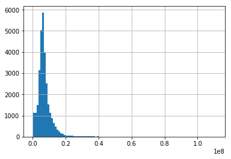
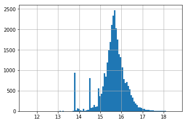

# Mini project 1 - Basic Data Analytics with Pandas

In the first week, we’ll practice data exploration and data analysis in Python with a real-world dataset – Sberbank data, which is available in the [Sberbank Russian Housing Market Kaggle competition](https://www.kaggle.com/c/sberbank-russian-housing-market). Sberbank dataset contains rich and messy data about Russian's housing market. This real-world data will provide you concrete practices for getting started with python. 

This step-by-step mini project will cover the most essential and useful techniques for data analysis in solving a real-world problem with key Python data analysis libraries: pandas and numpy. We’ll go through data loading and data frame creation, selection and query, grouping and function applying, plotting and writing data to file. 


```python
# Start with importing essentials
import pandas as pd
import numpy as np
import matplotlib.pyplot as plt
%matplotlib inline
```

**Question 1: Read the train set and test set of Sberbank dataset from the train.csv and test.csv, and call them train_data and test_data. **

Hint: You can read data from a CSV file using the read_csv function in pandas. By default, it assumes that the fields are comma-separated.


```python
train_data = pd.read_csv('train.csv')
test_data = pd.read_csv('test.csv')
```

** Question 2: Merge train and test to one dataframe and call it full_data. **

Hint: The new dataframe should have the rows from train_data followed by rows from test_data. Refer to [merge, join, and concatenate](https://pandas.pydata.org/pandas-docs/stable/merging.html). 


```python
full_data = pd.concat([test_data, train_data],keys=['test', 'train'])
full_data
```


<div>
<style>
    .dataframe thead tr:only-child th {
        text-align: right;
    }

    .dataframe thead th {
        text-align: left;
    }

    .dataframe tbody tr th {
        vertical-align: top;
    }
</style>
<table border="1" class="dataframe">
  <thead>
    <tr style="text-align: right;">
      <th></th>
      <th></th>
      <th>0_13_all</th>
      <th>0_13_female</th>
      <th>0_13_male</th>
      <th>0_17_all</th>
      <th>0_17_female</th>
      <th>0_17_male</th>
      <th>0_6_all</th>
      <th>0_6_female</th>
      <th>0_6_male</th>
      <th>16_29_all</th>
      <th>...</th>
      <th>water_km</th>
      <th>water_treatment_km</th>
      <th>work_all</th>
      <th>work_female</th>
      <th>work_male</th>
      <th>workplaces_km</th>
      <th>young_all</th>
      <th>young_female</th>
      <th>young_male</th>
      <th>zd_vokzaly_avto_km</th>
    </tr>
  </thead>
  <tbody>
    <tr>
      <th rowspan="30" valign="top">test</th>
      <th>0</th>
      <td>27123</td>
      <td>12783</td>
      <td>14340</td>
      <td>34341</td>
      <td>16247</td>
      <td>18094</td>
      <td>14080</td>
      <td>6623</td>
      <td>7457</td>
      <td>19906</td>
      <td>...</td>
      <td>0.248151</td>
      <td>0.967696</td>
      <td>121369</td>
      <td>62231</td>
      <td>59138</td>
      <td>7.922610</td>
      <td>30808</td>
      <td>14557</td>
      <td>16251</td>
      <td>27.553486</td>
    </tr>
    <tr>
      <th>1</th>
      <td>506</td>
      <td>245</td>
      <td>261</td>
      <td>646</td>
      <td>311</td>
      <td>336</td>
      <td>275</td>
      <td>133</td>
      <td>143</td>
      <td>3796</td>
      <td>...</td>
      <td>0.799853</td>
      <td>16.049420</td>
      <td>2566</td>
      <td>1211</td>
      <td>1356</td>
      <td>9.672779</td>
      <td>574</td>
      <td>277</td>
      <td>297</td>
      <td>27.421853</td>
    </tr>
    <tr>
      <th>2</th>
      <td>12162</td>
      <td>6045</td>
      <td>6117</td>
      <td>15514</td>
      <td>7701</td>
      <td>7813</td>
      <td>6400</td>
      <td>3191</td>
      <td>3209</td>
      <td>8137</td>
      <td>...</td>
      <td>1.384824</td>
      <td>11.749900</td>
      <td>91795</td>
      <td>47061</td>
      <td>44734</td>
      <td>3.506298</td>
      <td>13799</td>
      <td>6862</td>
      <td>6937</td>
      <td>10.093318</td>
    </tr>
    <tr>
      <th>3</th>
      <td>900</td>
      <td>435</td>
      <td>465</td>
      <td>1150</td>
      <td>553</td>
      <td>597</td>
      <td>489</td>
      <td>236</td>
      <td>254</td>
      <td>2155</td>
      <td>...</td>
      <td>0.233017</td>
      <td>5.061917</td>
      <td>4568</td>
      <td>2155</td>
      <td>2414</td>
      <td>11.306566</td>
      <td>1021</td>
      <td>493</td>
      <td>529</td>
      <td>37.436772</td>
    </tr>
    <tr>
      <th>4</th>
      <td>506</td>
      <td>245</td>
      <td>261</td>
      <td>646</td>
      <td>311</td>
      <td>336</td>
      <td>275</td>
      <td>133</td>
      <td>143</td>
      <td>3796</td>
      <td>...</td>
      <td>0.394422</td>
      <td>16.784630</td>
      <td>2566</td>
      <td>1211</td>
      <td>1356</td>
      <td>9.479093</td>
      <td>574</td>
      <td>277</td>
      <td>297</td>
      <td>25.699461</td>
    </tr>
    <tr>
      <th>5</th>
      <td>7332</td>
      <td>3617</td>
      <td>3715</td>
      <td>9249</td>
      <td>4558</td>
      <td>4691</td>
      <td>3903</td>
      <td>1914</td>
      <td>1989</td>
      <td>23768</td>
      <td>...</td>
      <td>0.420686</td>
      <td>14.695410</td>
      <td>65115</td>
      <td>26333</td>
      <td>38782</td>
      <td>2.271688</td>
      <td>8294</td>
      <td>4058</td>
      <td>4236</td>
      <td>7.586885</td>
    </tr>
    <tr>
      <th>6</th>
      <td>14555</td>
      <td>7398</td>
      <td>7157</td>
      <td>17908</td>
      <td>9050</td>
      <td>8858</td>
      <td>8340</td>
      <td>4292</td>
      <td>4048</td>
      <td>31549</td>
      <td>...</td>
      <td>0.589157</td>
      <td>16.103650</td>
      <td>75334</td>
      <td>37196</td>
      <td>38138</td>
      <td>6.167764</td>
      <td>16287</td>
      <td>8248</td>
      <td>8039</td>
      <td>20.071219</td>
    </tr>
    <tr>
      <th>7</th>
      <td>1207</td>
      <td>584</td>
      <td>623</td>
      <td>1542</td>
      <td>742</td>
      <td>801</td>
      <td>656</td>
      <td>316</td>
      <td>340</td>
      <td>3134</td>
      <td>...</td>
      <td>0.912455</td>
      <td>7.064776</td>
      <td>6127</td>
      <td>2890</td>
      <td>3237</td>
      <td>4.808383</td>
      <td>1370</td>
      <td>661</td>
      <td>709</td>
      <td>21.310806</td>
    </tr>
    <tr>
      <th>8</th>
      <td>2645</td>
      <td>1266</td>
      <td>1379</td>
      <td>3307</td>
      <td>1608</td>
      <td>1699</td>
      <td>1491</td>
      <td>713</td>
      <td>778</td>
      <td>281232</td>
      <td>...</td>
      <td>0.255966</td>
      <td>16.647890</td>
      <td>13457</td>
      <td>6524</td>
      <td>6933</td>
      <td>12.067427</td>
      <td>2981</td>
      <td>1432</td>
      <td>1549</td>
      <td>29.316910</td>
    </tr>
    <tr>
      <th>9</th>
      <td>506</td>
      <td>245</td>
      <td>261</td>
      <td>646</td>
      <td>311</td>
      <td>336</td>
      <td>275</td>
      <td>133</td>
      <td>143</td>
      <td>3796</td>
      <td>...</td>
      <td>1.094689</td>
      <td>18.946490</td>
      <td>2566</td>
      <td>1211</td>
      <td>1356</td>
      <td>10.721708</td>
      <td>574</td>
      <td>277</td>
      <td>297</td>
      <td>26.008518</td>
    </tr>
    <tr>
      <th>10</th>
      <td>13729</td>
      <td>6800</td>
      <td>6929</td>
      <td>17700</td>
      <td>8702</td>
      <td>8998</td>
      <td>6880</td>
      <td>3414</td>
      <td>3466</td>
      <td>15164</td>
      <td>...</td>
      <td>0.244431</td>
      <td>1.795546</td>
      <td>70194</td>
      <td>34572</td>
      <td>35622</td>
      <td>0.878220</td>
      <td>15727</td>
      <td>7802</td>
      <td>7925</td>
      <td>12.464723</td>
    </tr>
    <tr>
      <th>11</th>
      <td>506</td>
      <td>245</td>
      <td>261</td>
      <td>646</td>
      <td>311</td>
      <td>336</td>
      <td>275</td>
      <td>133</td>
      <td>143</td>
      <td>3796</td>
      <td>...</td>
      <td>0.394422</td>
      <td>16.784630</td>
      <td>2566</td>
      <td>1211</td>
      <td>1356</td>
      <td>9.479093</td>
      <td>574</td>
      <td>277</td>
      <td>297</td>
      <td>25.699461</td>
    </tr>
    <tr>
      <th>12</th>
      <td>506</td>
      <td>245</td>
      <td>261</td>
      <td>646</td>
      <td>311</td>
      <td>336</td>
      <td>275</td>
      <td>133</td>
      <td>143</td>
      <td>3796</td>
      <td>...</td>
      <td>0.173029</td>
      <td>18.857430</td>
      <td>2566</td>
      <td>1211</td>
      <td>1356</td>
      <td>12.462580</td>
      <td>574</td>
      <td>277</td>
      <td>297</td>
      <td>27.726514</td>
    </tr>
    <tr>
      <th>13</th>
      <td>3112</td>
      <td>1512</td>
      <td>1600</td>
      <td>3831</td>
      <td>1858</td>
      <td>1973</td>
      <td>1706</td>
      <td>844</td>
      <td>862</td>
      <td>55710</td>
      <td>...</td>
      <td>1.164959</td>
      <td>2.166674</td>
      <td>13331</td>
      <td>6661</td>
      <td>6670</td>
      <td>5.191946</td>
      <td>3459</td>
      <td>1677</td>
      <td>1782</td>
      <td>23.803464</td>
    </tr>
    <tr>
      <th>14</th>
      <td>322</td>
      <td>156</td>
      <td>166</td>
      <td>411</td>
      <td>198</td>
      <td>214</td>
      <td>175</td>
      <td>85</td>
      <td>91</td>
      <td>628</td>
      <td>...</td>
      <td>0.752827</td>
      <td>10.210550</td>
      <td>1633</td>
      <td>771</td>
      <td>863</td>
      <td>10.915502</td>
      <td>365</td>
      <td>177</td>
      <td>189</td>
      <td>37.934996</td>
    </tr>
    <tr>
      <th>15</th>
      <td>1207</td>
      <td>584</td>
      <td>623</td>
      <td>1542</td>
      <td>742</td>
      <td>801</td>
      <td>656</td>
      <td>316</td>
      <td>340</td>
      <td>3134</td>
      <td>...</td>
      <td>0.302692</td>
      <td>8.813134</td>
      <td>6127</td>
      <td>2890</td>
      <td>3237</td>
      <td>4.729796</td>
      <td>1370</td>
      <td>661</td>
      <td>709</td>
      <td>22.103983</td>
    </tr>
    <tr>
      <th>16</th>
      <td>9633</td>
      <td>4667</td>
      <td>4966</td>
      <td>13203</td>
      <td>6321</td>
      <td>6882</td>
      <td>4992</td>
      <td>2390</td>
      <td>2602</td>
      <td>24605</td>
      <td>...</td>
      <td>0.255791</td>
      <td>14.856050</td>
      <td>65499</td>
      <td>31332</td>
      <td>34167</td>
      <td>0.568046</td>
      <td>10988</td>
      <td>5333</td>
      <td>5655</td>
      <td>9.394126</td>
    </tr>
    <tr>
      <th>17</th>
      <td>10653</td>
      <td>5147</td>
      <td>5506</td>
      <td>14297</td>
      <td>7088</td>
      <td>7209</td>
      <td>5506</td>
      <td>2645</td>
      <td>2861</td>
      <td>291222</td>
      <td>...</td>
      <td>1.583581</td>
      <td>7.094807</td>
      <td>68518</td>
      <td>34386</td>
      <td>34132</td>
      <td>0.223616</td>
      <td>12074</td>
      <td>5876</td>
      <td>6198</td>
      <td>7.039798</td>
    </tr>
    <tr>
      <th>18</th>
      <td>3112</td>
      <td>1512</td>
      <td>1600</td>
      <td>3831</td>
      <td>1858</td>
      <td>1973</td>
      <td>1706</td>
      <td>844</td>
      <td>862</td>
      <td>55710</td>
      <td>...</td>
      <td>1.247852</td>
      <td>2.100849</td>
      <td>13331</td>
      <td>6661</td>
      <td>6670</td>
      <td>5.294133</td>
      <td>3459</td>
      <td>1677</td>
      <td>1782</td>
      <td>25.178735</td>
    </tr>
    <tr>
      <th>19</th>
      <td>10653</td>
      <td>5147</td>
      <td>5506</td>
      <td>14297</td>
      <td>7088</td>
      <td>7209</td>
      <td>5506</td>
      <td>2645</td>
      <td>2861</td>
      <td>291222</td>
      <td>...</td>
      <td>0.812136</td>
      <td>7.936607</td>
      <td>68518</td>
      <td>34386</td>
      <td>34132</td>
      <td>1.183532</td>
      <td>12074</td>
      <td>5876</td>
      <td>6198</td>
      <td>9.007753</td>
    </tr>
    <tr>
      <th>20</th>
      <td>506</td>
      <td>245</td>
      <td>261</td>
      <td>646</td>
      <td>311</td>
      <td>336</td>
      <td>275</td>
      <td>133</td>
      <td>143</td>
      <td>3796</td>
      <td>...</td>
      <td>0.394422</td>
      <td>16.784630</td>
      <td>2566</td>
      <td>1211</td>
      <td>1356</td>
      <td>9.479093</td>
      <td>574</td>
      <td>277</td>
      <td>297</td>
      <td>25.699461</td>
    </tr>
    <tr>
      <th>21</th>
      <td>12653</td>
      <td>6105</td>
      <td>6548</td>
      <td>15947</td>
      <td>7684</td>
      <td>8263</td>
      <td>6715</td>
      <td>3263</td>
      <td>3452</td>
      <td>16001</td>
      <td>...</td>
      <td>0.410296</td>
      <td>4.179881</td>
      <td>78835</td>
      <td>36506</td>
      <td>42329</td>
      <td>2.111245</td>
      <td>14317</td>
      <td>6905</td>
      <td>7412</td>
      <td>10.032059</td>
    </tr>
    <tr>
      <th>22</th>
      <td>10557</td>
      <td>5115</td>
      <td>5442</td>
      <td>13390</td>
      <td>6487</td>
      <td>6903</td>
      <td>5519</td>
      <td>2744</td>
      <td>2775</td>
      <td>17236</td>
      <td>...</td>
      <td>1.474372</td>
      <td>18.127570</td>
      <td>51138</td>
      <td>25603</td>
      <td>25535</td>
      <td>3.232352</td>
      <td>11996</td>
      <td>5811</td>
      <td>6185</td>
      <td>14.778442</td>
    </tr>
    <tr>
      <th>23</th>
      <td>11003</td>
      <td>5225</td>
      <td>5778</td>
      <td>13507</td>
      <td>6419</td>
      <td>7088</td>
      <td>6354</td>
      <td>2982</td>
      <td>3372</td>
      <td>27107</td>
      <td>...</td>
      <td>0.682454</td>
      <td>17.889290</td>
      <td>81271</td>
      <td>38523</td>
      <td>42748</td>
      <td>7.523798</td>
      <td>12244</td>
      <td>5826</td>
      <td>6418</td>
      <td>23.647287</td>
    </tr>
    <tr>
      <th>24</th>
      <td>10230</td>
      <td>4940</td>
      <td>5290</td>
      <td>13481</td>
      <td>6521</td>
      <td>6960</td>
      <td>5208</td>
      <td>2522</td>
      <td>2686</td>
      <td>21542</td>
      <td>...</td>
      <td>0.883414</td>
      <td>7.620876</td>
      <td>74032</td>
      <td>37346</td>
      <td>36686</td>
      <td>2.310634</td>
      <td>11729</td>
      <td>5670</td>
      <td>6059</td>
      <td>13.938686</td>
    </tr>
    <tr>
      <th>25</th>
      <td>7148</td>
      <td>3416</td>
      <td>3732</td>
      <td>9115</td>
      <td>4324</td>
      <td>4791</td>
      <td>3559</td>
      <td>1718</td>
      <td>1841</td>
      <td>20342</td>
      <td>...</td>
      <td>0.728382</td>
      <td>23.606450</td>
      <td>34611</td>
      <td>16976</td>
      <td>17635</td>
      <td>0.257841</td>
      <td>8140</td>
      <td>3899</td>
      <td>4241</td>
      <td>12.621859</td>
    </tr>
    <tr>
      <th>26</th>
      <td>5133</td>
      <td>2418</td>
      <td>2715</td>
      <td>6589</td>
      <td>3103</td>
      <td>3486</td>
      <td>2672</td>
      <td>1280</td>
      <td>1392</td>
      <td>19189</td>
      <td>...</td>
      <td>0.509525</td>
      <td>17.900570</td>
      <td>31832</td>
      <td>15122</td>
      <td>16710</td>
      <td>2.498736</td>
      <td>5836</td>
      <td>2752</td>
      <td>3084</td>
      <td>13.605319</td>
    </tr>
    <tr>
      <th>27</th>
      <td>10012</td>
      <td>4877</td>
      <td>5135</td>
      <td>12655</td>
      <td>6185</td>
      <td>6470</td>
      <td>5195</td>
      <td>2574</td>
      <td>2621</td>
      <td>21910</td>
      <td>...</td>
      <td>0.915929</td>
      <td>19.639800</td>
      <td>47628</td>
      <td>24101</td>
      <td>23527</td>
      <td>1.366228</td>
      <td>11356</td>
      <td>5537</td>
      <td>5819</td>
      <td>11.172078</td>
    </tr>
    <tr>
      <th>28</th>
      <td>3681</td>
      <td>1787</td>
      <td>1894</td>
      <td>4724</td>
      <td>2283</td>
      <td>2441</td>
      <td>2041</td>
      <td>976</td>
      <td>1065</td>
      <td>7467</td>
      <td>...</td>
      <td>0.198830</td>
      <td>2.721279</td>
      <td>20445</td>
      <td>9955</td>
      <td>10490</td>
      <td>10.473497</td>
      <td>4207</td>
      <td>2039</td>
      <td>2168</td>
      <td>29.502495</td>
    </tr>
    <tr>
      <th>29</th>
      <td>7332</td>
      <td>3617</td>
      <td>3715</td>
      <td>9249</td>
      <td>4558</td>
      <td>4691</td>
      <td>3903</td>
      <td>1914</td>
      <td>1989</td>
      <td>23768</td>
      <td>...</td>
      <td>0.098841</td>
      <td>16.860880</td>
      <td>65115</td>
      <td>26333</td>
      <td>38782</td>
      <td>1.466317</td>
      <td>8294</td>
      <td>4058</td>
      <td>4236</td>
      <td>10.069551</td>
    </tr>
    <tr>
      <th>...</th>
      <th>...</th>
      <td>...</td>
      <td>...</td>
      <td>...</td>
      <td>...</td>
      <td>...</td>
      <td>...</td>
      <td>...</td>
      <td>...</td>
      <td>...</td>
      <td>...</td>
      <td>...</td>
      <td>...</td>
      <td>...</td>
      <td>...</td>
      <td>...</td>
      <td>...</td>
      <td>...</td>
      <td>...</td>
      <td>...</td>
      <td>...</td>
      <td>...</td>
    </tr>
    <tr>
      <th rowspan="30" valign="top">train</th>
      <th>30441</th>
      <td>9955</td>
      <td>5120</td>
      <td>4835</td>
      <td>12508</td>
      <td>6443</td>
      <td>6065</td>
      <td>4237</td>
      <td>2158</td>
      <td>2079</td>
      <td>23480</td>
      <td>...</td>
      <td>0.524839</td>
      <td>10.378040</td>
      <td>43921</td>
      <td>22020</td>
      <td>21901</td>
      <td>1.091507</td>
      <td>11272</td>
      <td>5802</td>
      <td>5470</td>
      <td>4.060430</td>
    </tr>
    <tr>
      <th>30442</th>
      <td>900</td>
      <td>435</td>
      <td>465</td>
      <td>1150</td>
      <td>553</td>
      <td>597</td>
      <td>489</td>
      <td>236</td>
      <td>254</td>
      <td>2155</td>
      <td>...</td>
      <td>0.006707</td>
      <td>1.014447</td>
      <td>4568</td>
      <td>2155</td>
      <td>2414</td>
      <td>8.941513</td>
      <td>1021</td>
      <td>493</td>
      <td>529</td>
      <td>29.254460</td>
    </tr>
    <tr>
      <th>30443</th>
      <td>14555</td>
      <td>7398</td>
      <td>7157</td>
      <td>17908</td>
      <td>9050</td>
      <td>8858</td>
      <td>8340</td>
      <td>4292</td>
      <td>4048</td>
      <td>31549</td>
      <td>...</td>
      <td>0.589157</td>
      <td>16.103650</td>
      <td>75334</td>
      <td>37196</td>
      <td>38138</td>
      <td>6.167764</td>
      <td>16287</td>
      <td>8248</td>
      <td>8039</td>
      <td>20.071219</td>
    </tr>
    <tr>
      <th>30444</th>
      <td>24934</td>
      <td>12152</td>
      <td>12782</td>
      <td>32063</td>
      <td>15550</td>
      <td>16513</td>
      <td>13087</td>
      <td>6442</td>
      <td>6645</td>
      <td>3292</td>
      <td>...</td>
      <td>0.237405</td>
      <td>16.727180</td>
      <td>120381</td>
      <td>60341</td>
      <td>60040</td>
      <td>1.016728</td>
      <td>28563</td>
      <td>13883</td>
      <td>14680</td>
      <td>15.955488</td>
    </tr>
    <tr>
      <th>30445</th>
      <td>7332</td>
      <td>3617</td>
      <td>3715</td>
      <td>9249</td>
      <td>4558</td>
      <td>4691</td>
      <td>3903</td>
      <td>1914</td>
      <td>1989</td>
      <td>23768</td>
      <td>...</td>
      <td>0.420686</td>
      <td>14.695410</td>
      <td>65115</td>
      <td>26333</td>
      <td>38782</td>
      <td>2.271688</td>
      <td>8294</td>
      <td>4058</td>
      <td>4236</td>
      <td>7.586885</td>
    </tr>
    <tr>
      <th>30446</th>
      <td>1207</td>
      <td>584</td>
      <td>623</td>
      <td>1542</td>
      <td>742</td>
      <td>801</td>
      <td>656</td>
      <td>316</td>
      <td>340</td>
      <td>3134</td>
      <td>...</td>
      <td>0.302692</td>
      <td>8.813134</td>
      <td>6127</td>
      <td>2890</td>
      <td>3237</td>
      <td>4.729796</td>
      <td>1370</td>
      <td>661</td>
      <td>709</td>
      <td>22.103983</td>
    </tr>
    <tr>
      <th>30447</th>
      <td>14555</td>
      <td>7398</td>
      <td>7157</td>
      <td>17908</td>
      <td>9050</td>
      <td>8858</td>
      <td>8340</td>
      <td>4292</td>
      <td>4048</td>
      <td>31549</td>
      <td>...</td>
      <td>0.589157</td>
      <td>16.103650</td>
      <td>75334</td>
      <td>37196</td>
      <td>38138</td>
      <td>6.167764</td>
      <td>16287</td>
      <td>8248</td>
      <td>8039</td>
      <td>20.071219</td>
    </tr>
    <tr>
      <th>30448</th>
      <td>2756</td>
      <td>1333</td>
      <td>1423</td>
      <td>3523</td>
      <td>1694</td>
      <td>1830</td>
      <td>1497</td>
      <td>721</td>
      <td>777</td>
      <td>1566</td>
      <td>...</td>
      <td>1.263289</td>
      <td>13.997580</td>
      <td>13996</td>
      <td>6602</td>
      <td>7394</td>
      <td>9.907037</td>
      <td>3128</td>
      <td>1510</td>
      <td>1618</td>
      <td>30.927687</td>
    </tr>
    <tr>
      <th>30449</th>
      <td>7332</td>
      <td>3617</td>
      <td>3715</td>
      <td>9249</td>
      <td>4558</td>
      <td>4691</td>
      <td>3903</td>
      <td>1914</td>
      <td>1989</td>
      <td>23768</td>
      <td>...</td>
      <td>0.420686</td>
      <td>14.695410</td>
      <td>65115</td>
      <td>26333</td>
      <td>38782</td>
      <td>2.271688</td>
      <td>8294</td>
      <td>4058</td>
      <td>4236</td>
      <td>7.586885</td>
    </tr>
    <tr>
      <th>30450</th>
      <td>18732</td>
      <td>9069</td>
      <td>9663</td>
      <td>23849</td>
      <td>11437</td>
      <td>12412</td>
      <td>9753</td>
      <td>4709</td>
      <td>5044</td>
      <td>11588</td>
      <td>...</td>
      <td>0.536299</td>
      <td>22.081640</td>
      <td>112133</td>
      <td>53044</td>
      <td>59089</td>
      <td>2.164989</td>
      <td>21400</td>
      <td>10306</td>
      <td>11094</td>
      <td>9.121523</td>
    </tr>
    <tr>
      <th>30451</th>
      <td>730</td>
      <td>352</td>
      <td>379</td>
      <td>930</td>
      <td>450</td>
      <td>480</td>
      <td>390</td>
      <td>189</td>
      <td>201</td>
      <td>2092</td>
      <td>...</td>
      <td>0.136930</td>
      <td>37.667390</td>
      <td>3989</td>
      <td>1760</td>
      <td>2229</td>
      <td>37.681524</td>
      <td>830</td>
      <td>401</td>
      <td>430</td>
      <td>59.273863</td>
    </tr>
    <tr>
      <th>30452</th>
      <td>14168</td>
      <td>6842</td>
      <td>7326</td>
      <td>18269</td>
      <td>8762</td>
      <td>9507</td>
      <td>7454</td>
      <td>3609</td>
      <td>3845</td>
      <td>29595</td>
      <td>...</td>
      <td>0.571205</td>
      <td>14.420450</td>
      <td>78670</td>
      <td>34017</td>
      <td>44653</td>
      <td>3.278191</td>
      <td>16098</td>
      <td>7811</td>
      <td>8287</td>
      <td>10.596898</td>
    </tr>
    <tr>
      <th>30453</th>
      <td>27123</td>
      <td>12783</td>
      <td>14340</td>
      <td>34341</td>
      <td>16247</td>
      <td>18094</td>
      <td>14080</td>
      <td>6623</td>
      <td>7457</td>
      <td>19906</td>
      <td>...</td>
      <td>0.675396</td>
      <td>4.134976</td>
      <td>121369</td>
      <td>62231</td>
      <td>59138</td>
      <td>4.075042</td>
      <td>30808</td>
      <td>14557</td>
      <td>16251</td>
      <td>23.652443</td>
    </tr>
    <tr>
      <th>30454</th>
      <td>12479</td>
      <td>6296</td>
      <td>6183</td>
      <td>15630</td>
      <td>7847</td>
      <td>7783</td>
      <td>7103</td>
      <td>3505</td>
      <td>3598</td>
      <td>311210</td>
      <td>...</td>
      <td>1.245358</td>
      <td>16.663030</td>
      <td>59366</td>
      <td>28510</td>
      <td>30856</td>
      <td>0.961187</td>
      <td>13897</td>
      <td>6960</td>
      <td>6937</td>
      <td>6.951842</td>
    </tr>
    <tr>
      <th>30455</th>
      <td>506</td>
      <td>245</td>
      <td>261</td>
      <td>646</td>
      <td>311</td>
      <td>336</td>
      <td>275</td>
      <td>133</td>
      <td>143</td>
      <td>3796</td>
      <td>...</td>
      <td>0.718454</td>
      <td>17.049540</td>
      <td>2566</td>
      <td>1211</td>
      <td>1356</td>
      <td>9.660010</td>
      <td>574</td>
      <td>277</td>
      <td>297</td>
      <td>26.054343</td>
    </tr>
    <tr>
      <th>30456</th>
      <td>24934</td>
      <td>12152</td>
      <td>12782</td>
      <td>32063</td>
      <td>15550</td>
      <td>16513</td>
      <td>13087</td>
      <td>6442</td>
      <td>6645</td>
      <td>3292</td>
      <td>...</td>
      <td>0.327461</td>
      <td>16.791370</td>
      <td>120381</td>
      <td>60341</td>
      <td>60040</td>
      <td>1.132403</td>
      <td>28563</td>
      <td>13883</td>
      <td>14680</td>
      <td>15.601020</td>
    </tr>
    <tr>
      <th>30457</th>
      <td>12396</td>
      <td>6493</td>
      <td>5903</td>
      <td>16291</td>
      <td>8549</td>
      <td>7742</td>
      <td>5991</td>
      <td>3143</td>
      <td>2848</td>
      <td>18679</td>
      <td>...</td>
      <td>0.403743</td>
      <td>23.798810</td>
      <td>58882</td>
      <td>29502</td>
      <td>29380</td>
      <td>0.509614</td>
      <td>14309</td>
      <td>7498</td>
      <td>6811</td>
      <td>11.987559</td>
    </tr>
    <tr>
      <th>30458</th>
      <td>2756</td>
      <td>1333</td>
      <td>1423</td>
      <td>3523</td>
      <td>1694</td>
      <td>1830</td>
      <td>1497</td>
      <td>721</td>
      <td>777</td>
      <td>1566</td>
      <td>...</td>
      <td>0.191540</td>
      <td>15.164050</td>
      <td>13996</td>
      <td>6602</td>
      <td>7394</td>
      <td>5.247596</td>
      <td>3128</td>
      <td>1510</td>
      <td>1618</td>
      <td>21.641280</td>
    </tr>
    <tr>
      <th>30459</th>
      <td>14555</td>
      <td>7398</td>
      <td>7157</td>
      <td>17908</td>
      <td>9050</td>
      <td>8858</td>
      <td>8340</td>
      <td>4292</td>
      <td>4048</td>
      <td>31549</td>
      <td>...</td>
      <td>0.589157</td>
      <td>16.103650</td>
      <td>75334</td>
      <td>37196</td>
      <td>38138</td>
      <td>6.167764</td>
      <td>16287</td>
      <td>8248</td>
      <td>8039</td>
      <td>20.071219</td>
    </tr>
    <tr>
      <th>30460</th>
      <td>20530</td>
      <td>9999</td>
      <td>10531</td>
      <td>26209</td>
      <td>12754</td>
      <td>13455</td>
      <td>10712</td>
      <td>5210</td>
      <td>5502</td>
      <td>45669</td>
      <td>...</td>
      <td>0.517980</td>
      <td>9.477324</td>
      <td>105171</td>
      <td>52323</td>
      <td>52848</td>
      <td>0.703050</td>
      <td>23483</td>
      <td>11400</td>
      <td>12083</td>
      <td>17.876528</td>
    </tr>
    <tr>
      <th>30461</th>
      <td>8301</td>
      <td>4082</td>
      <td>4219</td>
      <td>10896</td>
      <td>5324</td>
      <td>5572</td>
      <td>4215</td>
      <td>2054</td>
      <td>2161</td>
      <td>15835</td>
      <td>...</td>
      <td>0.450691</td>
      <td>9.872418</td>
      <td>51445</td>
      <td>26442</td>
      <td>25003</td>
      <td>3.501005</td>
      <td>9414</td>
      <td>4599</td>
      <td>4815</td>
      <td>11.086655</td>
    </tr>
    <tr>
      <th>30462</th>
      <td>7332</td>
      <td>3617</td>
      <td>3715</td>
      <td>9249</td>
      <td>4558</td>
      <td>4691</td>
      <td>3903</td>
      <td>1914</td>
      <td>1989</td>
      <td>23768</td>
      <td>...</td>
      <td>0.420686</td>
      <td>14.695410</td>
      <td>65115</td>
      <td>26333</td>
      <td>38782</td>
      <td>2.271688</td>
      <td>8294</td>
      <td>4058</td>
      <td>4236</td>
      <td>7.586885</td>
    </tr>
    <tr>
      <th>30463</th>
      <td>20140</td>
      <td>9609</td>
      <td>10531</td>
      <td>26095</td>
      <td>12498</td>
      <td>13597</td>
      <td>10190</td>
      <td>4856</td>
      <td>5334</td>
      <td>11372</td>
      <td>...</td>
      <td>0.684074</td>
      <td>16.656070</td>
      <td>93843</td>
      <td>46574</td>
      <td>47269</td>
      <td>2.106114</td>
      <td>22961</td>
      <td>10922</td>
      <td>12039</td>
      <td>16.154691</td>
    </tr>
    <tr>
      <th>30464</th>
      <td>6859</td>
      <td>3564</td>
      <td>3295</td>
      <td>8741</td>
      <td>4430</td>
      <td>4311</td>
      <td>3694</td>
      <td>1873</td>
      <td>1821</td>
      <td>7290</td>
      <td>...</td>
      <td>0.241299</td>
      <td>20.271190</td>
      <td>40289</td>
      <td>20275</td>
      <td>20014</td>
      <td>1.766675</td>
      <td>7706</td>
      <td>3992</td>
      <td>3714</td>
      <td>7.185917</td>
    </tr>
    <tr>
      <th>30465</th>
      <td>9955</td>
      <td>5120</td>
      <td>4835</td>
      <td>12508</td>
      <td>6443</td>
      <td>6065</td>
      <td>4237</td>
      <td>2158</td>
      <td>2079</td>
      <td>23480</td>
      <td>...</td>
      <td>0.524839</td>
      <td>10.378040</td>
      <td>43921</td>
      <td>22020</td>
      <td>21901</td>
      <td>1.091507</td>
      <td>11272</td>
      <td>5802</td>
      <td>5470</td>
      <td>4.060430</td>
    </tr>
    <tr>
      <th>30466</th>
      <td>18732</td>
      <td>9069</td>
      <td>9663</td>
      <td>23849</td>
      <td>11437</td>
      <td>12412</td>
      <td>9753</td>
      <td>4709</td>
      <td>5044</td>
      <td>11588</td>
      <td>...</td>
      <td>0.979218</td>
      <td>22.746320</td>
      <td>112133</td>
      <td>53044</td>
      <td>59089</td>
      <td>1.442576</td>
      <td>21400</td>
      <td>10306</td>
      <td>11094</td>
      <td>11.396447</td>
    </tr>
    <tr>
      <th>30467</th>
      <td>9955</td>
      <td>5120</td>
      <td>4835</td>
      <td>12508</td>
      <td>6443</td>
      <td>6065</td>
      <td>4237</td>
      <td>2158</td>
      <td>2079</td>
      <td>23480</td>
      <td>...</td>
      <td>1.063533</td>
      <td>13.867820</td>
      <td>43921</td>
      <td>22020</td>
      <td>21901</td>
      <td>0.796851</td>
      <td>11272</td>
      <td>5802</td>
      <td>5470</td>
      <td>1.010437</td>
    </tr>
    <tr>
      <th>30468</th>
      <td>506</td>
      <td>245</td>
      <td>261</td>
      <td>646</td>
      <td>311</td>
      <td>336</td>
      <td>275</td>
      <td>133</td>
      <td>143</td>
      <td>3796</td>
      <td>...</td>
      <td>0.394422</td>
      <td>16.784630</td>
      <td>2566</td>
      <td>1211</td>
      <td>1356</td>
      <td>9.479093</td>
      <td>574</td>
      <td>277</td>
      <td>297</td>
      <td>25.699461</td>
    </tr>
    <tr>
      <th>30469</th>
      <td>8301</td>
      <td>4082</td>
      <td>4219</td>
      <td>10896</td>
      <td>5324</td>
      <td>5572</td>
      <td>4215</td>
      <td>2054</td>
      <td>2161</td>
      <td>15835</td>
      <td>...</td>
      <td>0.738539</td>
      <td>11.397520</td>
      <td>51445</td>
      <td>26442</td>
      <td>25003</td>
      <td>2.340429</td>
      <td>9414</td>
      <td>4599</td>
      <td>4815</td>
      <td>15.303338</td>
    </tr>
    <tr>
      <th>30470</th>
      <td>11903</td>
      <td>5975</td>
      <td>5928</td>
      <td>14994</td>
      <td>7572</td>
      <td>7422</td>
      <td>6120</td>
      <td>3024</td>
      <td>3096</td>
      <td>17070</td>
      <td>...</td>
      <td>0.518509</td>
      <td>10.451010</td>
      <td>56908</td>
      <td>29689</td>
      <td>27219</td>
      <td>3.065101</td>
      <td>13523</td>
      <td>6799</td>
      <td>6724</td>
      <td>12.243439</td>
    </tr>
  </tbody>
</table>
<p>38133 rows × 292 columns</p>
</div>


***For the rest questions, if not specified, we'll do practice on train_data. Let's create a dataframe called df from train_data.***


```python
df = pd.read_csv('train.csv')
```

** Question 3: Preview the first 10 columns with head().**

Hint: You can change the number of rows displayed by specifying a number. There is a similar function tail(), which will show you the last columns of a dataframe.


```python
df.head(10) 
df.tail(10)
```


<div>
<style>
    .dataframe thead tr:only-child th {
        text-align: right;
    }

    .dataframe thead th {
        text-align: left;
    }

    .dataframe tbody tr th {
        vertical-align: top;
    }
</style>
<table border="1" class="dataframe">
  <thead>
    <tr style="text-align: right;">
      <th></th>
      <th>id</th>
      <th>timestamp</th>
      <th>full_sq</th>
      <th>life_sq</th>
      <th>floor</th>
      <th>max_floor</th>
      <th>material</th>
      <th>build_year</th>
      <th>num_room</th>
      <th>kitch_sq</th>
      <th>...</th>
      <th>cafe_count_5000_price_2500</th>
      <th>cafe_count_5000_price_4000</th>
      <th>cafe_count_5000_price_high</th>
      <th>big_church_count_5000</th>
      <th>church_count_5000</th>
      <th>mosque_count_5000</th>
      <th>leisure_count_5000</th>
      <th>sport_count_5000</th>
      <th>market_count_5000</th>
      <th>price_doc</th>
    </tr>
  </thead>
  <tbody>
    <tr>
      <th>30461</th>
      <td>30464</td>
      <td>2015-06-30</td>
      <td>36</td>
      <td>19.0</td>
      <td>5.0</td>
      <td>16.0</td>
      <td>1.0</td>
      <td>1980.0</td>
      <td>1.0</td>
      <td>8.0</td>
      <td>...</td>
      <td>41</td>
      <td>4</td>
      <td>1</td>
      <td>4</td>
      <td>35</td>
      <td>1</td>
      <td>6</td>
      <td>80</td>
      <td>6</td>
      <td>5000000</td>
    </tr>
    <tr>
      <th>30462</th>
      <td>30465</td>
      <td>2015-06-30</td>
      <td>47</td>
      <td>30.0</td>
      <td>23.0</td>
      <td>25.0</td>
      <td>4.0</td>
      <td>2016.0</td>
      <td>1.0</td>
      <td>10.0</td>
      <td>...</td>
      <td>99</td>
      <td>57</td>
      <td>12</td>
      <td>23</td>
      <td>42</td>
      <td>1</td>
      <td>13</td>
      <td>123</td>
      <td>7</td>
      <td>10544070</td>
    </tr>
    <tr>
      <th>30463</th>
      <td>30466</td>
      <td>2015-06-30</td>
      <td>56</td>
      <td>29.0</td>
      <td>13.0</td>
      <td>14.0</td>
      <td>1.0</td>
      <td>2001.0</td>
      <td>2.0</td>
      <td>11.0</td>
      <td>...</td>
      <td>14</td>
      <td>2</td>
      <td>0</td>
      <td>13</td>
      <td>12</td>
      <td>0</td>
      <td>1</td>
      <td>53</td>
      <td>6</td>
      <td>12000000</td>
    </tr>
    <tr>
      <th>30464</th>
      <td>30467</td>
      <td>2015-06-30</td>
      <td>56</td>
      <td>51.0</td>
      <td>19.0</td>
      <td>19.0</td>
      <td>1.0</td>
      <td>2017.0</td>
      <td>2.0</td>
      <td>1.0</td>
      <td>...</td>
      <td>25</td>
      <td>3</td>
      <td>0</td>
      <td>14</td>
      <td>29</td>
      <td>1</td>
      <td>4</td>
      <td>90</td>
      <td>6</td>
      <td>10262010</td>
    </tr>
    <tr>
      <th>30465</th>
      <td>30468</td>
      <td>2015-06-30</td>
      <td>52</td>
      <td>NaN</td>
      <td>13.0</td>
      <td>17.0</td>
      <td>1.0</td>
      <td>NaN</td>
      <td>2.0</td>
      <td>1.0</td>
      <td>...</td>
      <td>371</td>
      <td>141</td>
      <td>26</td>
      <td>150</td>
      <td>249</td>
      <td>2</td>
      <td>105</td>
      <td>203</td>
      <td>13</td>
      <td>6750554</td>
    </tr>
    <tr>
      <th>30466</th>
      <td>30469</td>
      <td>2015-06-30</td>
      <td>44</td>
      <td>27.0</td>
      <td>7.0</td>
      <td>9.0</td>
      <td>1.0</td>
      <td>1975.0</td>
      <td>2.0</td>
      <td>6.0</td>
      <td>...</td>
      <td>15</td>
      <td>5</td>
      <td>0</td>
      <td>15</td>
      <td>26</td>
      <td>1</td>
      <td>2</td>
      <td>84</td>
      <td>6</td>
      <td>7400000</td>
    </tr>
    <tr>
      <th>30467</th>
      <td>30470</td>
      <td>2015-06-30</td>
      <td>86</td>
      <td>59.0</td>
      <td>3.0</td>
      <td>9.0</td>
      <td>2.0</td>
      <td>1935.0</td>
      <td>4.0</td>
      <td>10.0</td>
      <td>...</td>
      <td>313</td>
      <td>128</td>
      <td>24</td>
      <td>98</td>
      <td>182</td>
      <td>1</td>
      <td>82</td>
      <td>171</td>
      <td>15</td>
      <td>25000000</td>
    </tr>
    <tr>
      <th>30468</th>
      <td>30471</td>
      <td>2015-06-30</td>
      <td>45</td>
      <td>NaN</td>
      <td>10.0</td>
      <td>20.0</td>
      <td>1.0</td>
      <td>NaN</td>
      <td>1.0</td>
      <td>1.0</td>
      <td>...</td>
      <td>1</td>
      <td>1</td>
      <td>0</td>
      <td>2</td>
      <td>12</td>
      <td>0</td>
      <td>1</td>
      <td>11</td>
      <td>1</td>
      <td>6970959</td>
    </tr>
    <tr>
      <th>30469</th>
      <td>30472</td>
      <td>2015-06-30</td>
      <td>64</td>
      <td>32.0</td>
      <td>5.0</td>
      <td>15.0</td>
      <td>1.0</td>
      <td>2003.0</td>
      <td>2.0</td>
      <td>11.0</td>
      <td>...</td>
      <td>22</td>
      <td>1</td>
      <td>1</td>
      <td>6</td>
      <td>31</td>
      <td>1</td>
      <td>4</td>
      <td>65</td>
      <td>7</td>
      <td>13500000</td>
    </tr>
    <tr>
      <th>30470</th>
      <td>30473</td>
      <td>2015-06-30</td>
      <td>43</td>
      <td>28.0</td>
      <td>1.0</td>
      <td>9.0</td>
      <td>1.0</td>
      <td>1968.0</td>
      <td>2.0</td>
      <td>6.0</td>
      <td>...</td>
      <td>5</td>
      <td>2</td>
      <td>0</td>
      <td>7</td>
      <td>16</td>
      <td>0</td>
      <td>9</td>
      <td>54</td>
      <td>10</td>
      <td>5600000</td>
    </tr>
  </tbody>
</table>
<p>10 rows × 292 columns</p>
</div>


**Question 4: How many columns and rows are there in the data?**


```python
df.info()
```

    <class 'pandas.core.frame.DataFrame'>
    RangeIndex: 30471 entries, 0 to 30470
    Columns: 292 entries, id to price_doc
    dtypes: float64(119), int64(157), object(16)
    memory usage: 67.9+ MB


**Question 5: Which features are available in the data? Display the features.**

Hint: The features are the column names. You can print them out.


```python
df.describe()
df.columns.values
```


    array(['id', 'timestamp', 'full_sq', 'life_sq', 'floor', 'max_floor',
           'material', 'build_year', 'num_room', 'kitch_sq', 'state',
           'product_type', 'sub_area', 'area_m', 'raion_popul',
           'green_zone_part', 'indust_part', 'children_preschool',
           'preschool_quota', 'preschool_education_centers_raion',
           'children_school', 'school_quota', 'school_education_centers_raion',
           'school_education_centers_top_20_raion', 'hospital_beds_raion',
           'healthcare_centers_raion', 'university_top_20_raion',
           'sport_objects_raion', 'additional_education_raion',
           'culture_objects_top_25', 'culture_objects_top_25_raion',
           'shopping_centers_raion', 'office_raion',
           'thermal_power_plant_raion', 'incineration_raion',
           'oil_chemistry_raion', 'radiation_raion', 'railroad_terminal_raion',
           'big_market_raion', 'nuclear_reactor_raion',
           'detention_facility_raion', 'full_all', 'male_f', 'female_f',
           'young_all', 'young_male', 'young_female', 'work_all', 'work_male',
           'work_female', 'ekder_all', 'ekder_male', 'ekder_female', '0_6_all',
           '0_6_male', '0_6_female', '7_14_all', '7_14_male', '7_14_female',
           '0_17_all', '0_17_male', '0_17_female', '16_29_all', '16_29_male',
           '16_29_female', '0_13_all', '0_13_male', '0_13_female',
           'raion_build_count_with_material_info', 'build_count_block',
           'build_count_wood', 'build_count_frame', 'build_count_brick',
           'build_count_monolith', 'build_count_panel', 'build_count_foam',
           'build_count_slag', 'build_count_mix',
           'raion_build_count_with_builddate_info', 'build_count_before_1920',
           'build_count_1921-1945', 'build_count_1946-1970',
           'build_count_1971-1995', 'build_count_after_1995', 'ID_metro',
           'metro_min_avto', 'metro_km_avto', 'metro_min_walk',
           'metro_km_walk', 'kindergarten_km', 'school_km', 'park_km',
           'green_zone_km', 'industrial_km', 'water_treatment_km',
           'cemetery_km', 'incineration_km', 'railroad_station_walk_km',
           'railroad_station_walk_min', 'ID_railroad_station_walk',
           'railroad_station_avto_km', 'railroad_station_avto_min',
           'ID_railroad_station_avto', 'public_transport_station_km',
           'public_transport_station_min_walk', 'water_km', 'water_1line',
           'mkad_km', 'ttk_km', 'sadovoe_km', 'bulvar_ring_km', 'kremlin_km',
           'big_road1_km', 'ID_big_road1', 'big_road1_1line', 'big_road2_km',
           'ID_big_road2', 'railroad_km', 'railroad_1line',
           'zd_vokzaly_avto_km', 'ID_railroad_terminal',
           'bus_terminal_avto_km', 'ID_bus_terminal', 'oil_chemistry_km',
           'nuclear_reactor_km', 'radiation_km', 'power_transmission_line_km',
           'thermal_power_plant_km', 'ts_km', 'big_market_km',
           'market_shop_km', 'fitness_km', 'swim_pool_km', 'ice_rink_km',
           'stadium_km', 'basketball_km', 'hospice_morgue_km',
           'detention_facility_km', 'public_healthcare_km', 'university_km',
           'workplaces_km', 'shopping_centers_km', 'office_km',
           'additional_education_km', 'preschool_km', 'big_church_km',
           'church_synagogue_km', 'mosque_km', 'theater_km', 'museum_km',
           'exhibition_km', 'catering_km', 'ecology', 'green_part_500',
           'prom_part_500', 'office_count_500', 'office_sqm_500',
           'trc_count_500', 'trc_sqm_500', 'cafe_count_500',
           'cafe_sum_500_min_price_avg', 'cafe_sum_500_max_price_avg',
           'cafe_avg_price_500', 'cafe_count_500_na_price',
           'cafe_count_500_price_500', 'cafe_count_500_price_1000',
           'cafe_count_500_price_1500', 'cafe_count_500_price_2500',
           'cafe_count_500_price_4000', 'cafe_count_500_price_high',
           'big_church_count_500', 'church_count_500', 'mosque_count_500',
           'leisure_count_500', 'sport_count_500', 'market_count_500',
           'green_part_1000', 'prom_part_1000', 'office_count_1000',
           'office_sqm_1000', 'trc_count_1000', 'trc_sqm_1000',
           'cafe_count_1000', 'cafe_sum_1000_min_price_avg',
           'cafe_sum_1000_max_price_avg', 'cafe_avg_price_1000',
           'cafe_count_1000_na_price', 'cafe_count_1000_price_500',
           'cafe_count_1000_price_1000', 'cafe_count_1000_price_1500',
           'cafe_count_1000_price_2500', 'cafe_count_1000_price_4000',
           'cafe_count_1000_price_high', 'big_church_count_1000',
           'church_count_1000', 'mosque_count_1000', 'leisure_count_1000',
           'sport_count_1000', 'market_count_1000', 'green_part_1500',
           'prom_part_1500', 'office_count_1500', 'office_sqm_1500',
           'trc_count_1500', 'trc_sqm_1500', 'cafe_count_1500',
           'cafe_sum_1500_min_price_avg', 'cafe_sum_1500_max_price_avg',
           'cafe_avg_price_1500', 'cafe_count_1500_na_price',
           'cafe_count_1500_price_500', 'cafe_count_1500_price_1000',
           'cafe_count_1500_price_1500', 'cafe_count_1500_price_2500',
           'cafe_count_1500_price_4000', 'cafe_count_1500_price_high',
           'big_church_count_1500', 'church_count_1500', 'mosque_count_1500',
           'leisure_count_1500', 'sport_count_1500', 'market_count_1500',
           'green_part_2000', 'prom_part_2000', 'office_count_2000',
           'office_sqm_2000', 'trc_count_2000', 'trc_sqm_2000',
           'cafe_count_2000', 'cafe_sum_2000_min_price_avg',
           'cafe_sum_2000_max_price_avg', 'cafe_avg_price_2000',
           'cafe_count_2000_na_price', 'cafe_count_2000_price_500',
           'cafe_count_2000_price_1000', 'cafe_count_2000_price_1500',
           'cafe_count_2000_price_2500', 'cafe_count_2000_price_4000',
           'cafe_count_2000_price_high', 'big_church_count_2000',
           'church_count_2000', 'mosque_count_2000', 'leisure_count_2000',
           'sport_count_2000', 'market_count_2000', 'green_part_3000',
           'prom_part_3000', 'office_count_3000', 'office_sqm_3000',
           'trc_count_3000', 'trc_sqm_3000', 'cafe_count_3000',
           'cafe_sum_3000_min_price_avg', 'cafe_sum_3000_max_price_avg',
           'cafe_avg_price_3000', 'cafe_count_3000_na_price',
           'cafe_count_3000_price_500', 'cafe_count_3000_price_1000',
           'cafe_count_3000_price_1500', 'cafe_count_3000_price_2500',
           'cafe_count_3000_price_4000', 'cafe_count_3000_price_high',
           'big_church_count_3000', 'church_count_3000', 'mosque_count_3000',
           'leisure_count_3000', 'sport_count_3000', 'market_count_3000',
           'green_part_5000', 'prom_part_5000', 'office_count_5000',
           'office_sqm_5000', 'trc_count_5000', 'trc_sqm_5000',
           'cafe_count_5000', 'cafe_sum_5000_min_price_avg',
           'cafe_sum_5000_max_price_avg', 'cafe_avg_price_5000',
           'cafe_count_5000_na_price', 'cafe_count_5000_price_500',
           'cafe_count_5000_price_1000', 'cafe_count_5000_price_1500',
           'cafe_count_5000_price_2500', 'cafe_count_5000_price_4000',
           'cafe_count_5000_price_high', 'big_church_count_5000',
           'church_count_5000', 'mosque_count_5000', 'leisure_count_5000',
           'sport_count_5000', 'market_count_5000', 'price_doc'], dtype=object)


**Question 6: What's the data type of each column? Save the datatype as data_type.**


```python
data_type = df.dtypes
data_type
```


    id                                         int64
    timestamp                                 object
    full_sq                                    int64
    life_sq                                  float64
    floor                                    float64
    max_floor                                float64
    material                                 float64
    build_year                               float64
    num_room                                 float64
    kitch_sq                                 float64
    state                                    float64
    product_type                              object
    sub_area                                  object
    area_m                                   float64
    raion_popul                                int64
    green_zone_part                          float64
    indust_part                              float64
    children_preschool                         int64
    preschool_quota                          float64
    preschool_education_centers_raion          int64
    children_school                            int64
    school_quota                             float64
    school_education_centers_raion             int64
    school_education_centers_top_20_raion      int64
    hospital_beds_raion                      float64
    healthcare_centers_raion                   int64
    university_top_20_raion                    int64
    sport_objects_raion                        int64
    additional_education_raion                 int64
    culture_objects_top_25                    object
                                              ...   
    big_church_count_3000                      int64
    church_count_3000                          int64
    mosque_count_3000                          int64
    leisure_count_3000                         int64
    sport_count_3000                           int64
    market_count_3000                          int64
    green_part_5000                          float64
    prom_part_5000                           float64
    office_count_5000                          int64
    office_sqm_5000                            int64
    trc_count_5000                             int64
    trc_sqm_5000                               int64
    cafe_count_5000                            int64
    cafe_sum_5000_min_price_avg              float64
    cafe_sum_5000_max_price_avg              float64
    cafe_avg_price_5000                      float64
    cafe_count_5000_na_price                   int64
    cafe_count_5000_price_500                  int64
    cafe_count_5000_price_1000                 int64
    cafe_count_5000_price_1500                 int64
    cafe_count_5000_price_2500                 int64
    cafe_count_5000_price_4000                 int64
    cafe_count_5000_price_high                 int64
    big_church_count_5000                      int64
    church_count_5000                          int64
    mosque_count_5000                          int64
    leisure_count_5000                         int64
    sport_count_5000                           int64
    market_count_5000                          int64
    price_doc                                  int64
    Length: 292, dtype: object


```python
for i in range(len(df.dtypes)):
    print (df.dtypes.index[i], df.dtypes[i])
```

    id int64
    timestamp object
    full_sq int64
    life_sq float64
    floor float64
    max_floor float64
    material float64
    build_year float64
    num_room float64
    kitch_sq float64
    state float64
    product_type object
    sub_area object
    area_m float64
    raion_popul int64
    green_zone_part float64
    indust_part float64
    children_preschool int64
    preschool_quota float64
    preschool_education_centers_raion int64
    children_school int64
    school_quota float64
    school_education_centers_raion int64
    school_education_centers_top_20_raion int64
    hospital_beds_raion float64
    healthcare_centers_raion int64
    university_top_20_raion int64
    sport_objects_raion int64
    additional_education_raion int64
    culture_objects_top_25 object
    culture_objects_top_25_raion int64
    shopping_centers_raion int64
    office_raion int64
    thermal_power_plant_raion object
    incineration_raion object
    oil_chemistry_raion object
    radiation_raion object
    railroad_terminal_raion object
    big_market_raion object
    nuclear_reactor_raion object
    detention_facility_raion object
    full_all int64
    male_f int64
    female_f int64
    young_all int64
    young_male int64
    young_female int64
    work_all int64
    work_male int64
    work_female int64
    ekder_all int64
    ekder_male int64
    ekder_female int64
    0_6_all int64
    0_6_male int64
    0_6_female int64
    7_14_all int64
    7_14_male int64
    7_14_female int64
    0_17_all int64
    0_17_male int64
    0_17_female int64
    16_29_all int64
    16_29_male int64
    16_29_female int64
    0_13_all int64
    0_13_male int64
    0_13_female int64
    raion_build_count_with_material_info float64
    build_count_block float64
    build_count_wood float64
    build_count_frame float64
    build_count_brick float64
    build_count_monolith float64
    build_count_panel float64
    build_count_foam float64
    build_count_slag float64
    build_count_mix float64
    raion_build_count_with_builddate_info float64
    build_count_before_1920 float64
    build_count_1921-1945 float64
    build_count_1946-1970 float64
    build_count_1971-1995 float64
    build_count_after_1995 float64
    ID_metro int64
    metro_min_avto float64
    metro_km_avto float64
    metro_min_walk float64
    metro_km_walk float64
    kindergarten_km float64
    school_km float64
    park_km float64
    green_zone_km float64
    industrial_km float64
    water_treatment_km float64
    cemetery_km float64
    incineration_km float64
    railroad_station_walk_km float64
    railroad_station_walk_min float64
    ID_railroad_station_walk float64
    railroad_station_avto_km float64
    railroad_station_avto_min float64
    ID_railroad_station_avto int64
    public_transport_station_km float64
    public_transport_station_min_walk float64
    water_km float64
    water_1line object
    mkad_km float64
    ttk_km float64
    sadovoe_km float64
    bulvar_ring_km float64
    kremlin_km float64
    big_road1_km float64
    ID_big_road1 int64
    big_road1_1line object
    big_road2_km float64
    ID_big_road2 int64
    railroad_km float64
    railroad_1line object
    zd_vokzaly_avto_km float64
    ID_railroad_terminal int64
    bus_terminal_avto_km float64
    ID_bus_terminal int64
    oil_chemistry_km float64
    nuclear_reactor_km float64
    radiation_km float64
    power_transmission_line_km float64
    thermal_power_plant_km float64
    ts_km float64
    big_market_km float64
    market_shop_km float64
    fitness_km float64
    swim_pool_km float64
    ice_rink_km float64
    stadium_km float64
    basketball_km float64
    hospice_morgue_km float64
    detention_facility_km float64
    public_healthcare_km float64
    university_km float64
    workplaces_km float64
    shopping_centers_km float64
    office_km float64
    additional_education_km float64
    preschool_km float64
    big_church_km float64
    church_synagogue_km float64
    mosque_km float64
    theater_km float64
    museum_km float64
    exhibition_km float64
    catering_km float64
    ecology object
    green_part_500 float64
    prom_part_500 float64
    office_count_500 int64
    office_sqm_500 int64
    trc_count_500 int64
    trc_sqm_500 int64
    cafe_count_500 int64
    cafe_sum_500_min_price_avg float64
    cafe_sum_500_max_price_avg float64
    cafe_avg_price_500 float64
    cafe_count_500_na_price int64
    cafe_count_500_price_500 int64
    cafe_count_500_price_1000 int64
    cafe_count_500_price_1500 int64
    cafe_count_500_price_2500 int64
    cafe_count_500_price_4000 int64
    cafe_count_500_price_high int64
    big_church_count_500 int64
    church_count_500 int64
    mosque_count_500 int64
    leisure_count_500 int64
    sport_count_500 int64
    market_count_500 int64
    green_part_1000 float64
    prom_part_1000 float64
    office_count_1000 int64
    office_sqm_1000 int64
    trc_count_1000 int64
    trc_sqm_1000 int64
    cafe_count_1000 int64
    cafe_sum_1000_min_price_avg float64
    cafe_sum_1000_max_price_avg float64
    cafe_avg_price_1000 float64
    cafe_count_1000_na_price int64
    cafe_count_1000_price_500 int64
    cafe_count_1000_price_1000 int64
    cafe_count_1000_price_1500 int64
    cafe_count_1000_price_2500 int64
    cafe_count_1000_price_4000 int64
    cafe_count_1000_price_high int64
    big_church_count_1000 int64
    church_count_1000 int64
    mosque_count_1000 int64
    leisure_count_1000 int64
    sport_count_1000 int64
    market_count_1000 int64
    green_part_1500 float64
    prom_part_1500 float64
    office_count_1500 int64
    office_sqm_1500 int64
    trc_count_1500 int64
    trc_sqm_1500 int64
    cafe_count_1500 int64
    cafe_sum_1500_min_price_avg float64
    cafe_sum_1500_max_price_avg float64
    cafe_avg_price_1500 float64
    cafe_count_1500_na_price int64
    cafe_count_1500_price_500 int64
    cafe_count_1500_price_1000 int64
    cafe_count_1500_price_1500 int64
    cafe_count_1500_price_2500 int64
    cafe_count_1500_price_4000 int64
    cafe_count_1500_price_high int64
    big_church_count_1500 int64
    church_count_1500 int64
    mosque_count_1500 int64
    leisure_count_1500 int64
    sport_count_1500 int64
    market_count_1500 int64
    green_part_2000 float64
    prom_part_2000 float64
    office_count_2000 int64
    office_sqm_2000 int64
    trc_count_2000 int64
    trc_sqm_2000 int64
    cafe_count_2000 int64
    cafe_sum_2000_min_price_avg float64
    cafe_sum_2000_max_price_avg float64
    cafe_avg_price_2000 float64
    cafe_count_2000_na_price int64
    cafe_count_2000_price_500 int64
    cafe_count_2000_price_1000 int64
    cafe_count_2000_price_1500 int64
    cafe_count_2000_price_2500 int64
    cafe_count_2000_price_4000 int64
    cafe_count_2000_price_high int64
    big_church_count_2000 int64
    church_count_2000 int64
    mosque_count_2000 int64
    leisure_count_2000 int64
    sport_count_2000 int64
    market_count_2000 int64
    green_part_3000 float64
    prom_part_3000 float64
    office_count_3000 int64
    office_sqm_3000 int64
    trc_count_3000 int64
    trc_sqm_3000 int64
    cafe_count_3000 int64
    cafe_sum_3000_min_price_avg float64
    cafe_sum_3000_max_price_avg float64
    cafe_avg_price_3000 float64
    cafe_count_3000_na_price int64
    cafe_count_3000_price_500 int64
    cafe_count_3000_price_1000 int64
    cafe_count_3000_price_1500 int64
    cafe_count_3000_price_2500 int64
    cafe_count_3000_price_4000 int64
    cafe_count_3000_price_high int64
    big_church_count_3000 int64
    church_count_3000 int64
    mosque_count_3000 int64
    leisure_count_3000 int64
    sport_count_3000 int64
    market_count_3000 int64
    green_part_5000 float64
    prom_part_5000 float64
    office_count_5000 int64
    office_sqm_5000 int64
    trc_count_5000 int64
    trc_sqm_5000 int64
    cafe_count_5000 int64
    cafe_sum_5000_min_price_avg float64
    cafe_sum_5000_max_price_avg float64
    cafe_avg_price_5000 float64
    cafe_count_5000_na_price int64
    cafe_count_5000_price_500 int64
    cafe_count_5000_price_1000 int64
    cafe_count_5000_price_1500 int64
    cafe_count_5000_price_2500 int64
    cafe_count_5000_price_4000 int64
    cafe_count_5000_price_high int64
    big_church_count_5000 int64
    church_count_5000 int64
    mosque_count_5000 int64
    leisure_count_5000 int64
    sport_count_5000 int64
    market_count_5000 int64
    price_doc int64


**Question 7: Which variables are numerical variables (excluding 'id')? Put all the numerical variable in list.**

Hint: Use the index of the data_type we just created in Q5. The data type of numerical variables should be int or float. Remenber to remove the 'id'.


```python
numerical = data_type[(data_type == 'int64') | (data_type == 'float64')]
numerical[1: ]
```


    full_sq                                    int64
    life_sq                                  float64
    floor                                    float64
    max_floor                                float64
    material                                 float64
    build_year                               float64
    num_room                                 float64
    kitch_sq                                 float64
    state                                    float64
    area_m                                   float64
    raion_popul                                int64
    green_zone_part                          float64
    indust_part                              float64
    children_preschool                         int64
    preschool_quota                          float64
    preschool_education_centers_raion          int64
    children_school                            int64
    school_quota                             float64
    school_education_centers_raion             int64
    school_education_centers_top_20_raion      int64
    hospital_beds_raion                      float64
    healthcare_centers_raion                   int64
    university_top_20_raion                    int64
    sport_objects_raion                        int64
    additional_education_raion                 int64
    culture_objects_top_25_raion               int64
    shopping_centers_raion                     int64
    office_raion                               int64
    full_all                                   int64
    male_f                                     int64
                                              ...   
    big_church_count_3000                      int64
    church_count_3000                          int64
    mosque_count_3000                          int64
    leisure_count_3000                         int64
    sport_count_3000                           int64
    market_count_3000                          int64
    green_part_5000                          float64
    prom_part_5000                           float64
    office_count_5000                          int64
    office_sqm_5000                            int64
    trc_count_5000                             int64
    trc_sqm_5000                               int64
    cafe_count_5000                            int64
    cafe_sum_5000_min_price_avg              float64
    cafe_sum_5000_max_price_avg              float64
    cafe_avg_price_5000                      float64
    cafe_count_5000_na_price                   int64
    cafe_count_5000_price_500                  int64
    cafe_count_5000_price_1000                 int64
    cafe_count_5000_price_1500                 int64
    cafe_count_5000_price_2500                 int64
    cafe_count_5000_price_4000                 int64
    cafe_count_5000_price_high                 int64
    big_church_count_5000                      int64
    church_count_5000                          int64
    mosque_count_5000                          int64
    leisure_count_5000                         int64
    sport_count_5000                           int64
    market_count_5000                          int64
    price_doc                                  int64
    Length: 275, dtype: object


```python
num_vars = list(df.dtypes[df.dtypes=='int64'].index) + list(df.dtypes[df.dtypes=='float64'].index)
num_vars.remove('id')
```

**Question 8: Select the first 5 rows with 'id' (the 1st column) and 'price_doc' (the last column) columns from the data. **

Hint: You can find out several ways to solve this question. 


```python
df[:5][['id','price_doc']]
```


<div>
<style>
    .dataframe thead tr:only-child th {
        text-align: right;
    }

    .dataframe thead th {
        text-align: left;
    }

    .dataframe tbody tr th {
        vertical-align: top;
    }
</style>
<table border="1" class="dataframe">
  <thead>
    <tr style="text-align: right;">
      <th></th>
      <th>id</th>
      <th>price_doc</th>
    </tr>
  </thead>
  <tbody>
    <tr>
      <th>0</th>
      <td>1</td>
      <td>5850000</td>
    </tr>
    <tr>
      <th>1</th>
      <td>2</td>
      <td>6000000</td>
    </tr>
    <tr>
      <th>2</th>
      <td>3</td>
      <td>5700000</td>
    </tr>
    <tr>
      <th>3</th>
      <td>4</td>
      <td>13100000</td>
    </tr>
    <tr>
      <th>4</th>
      <td>5</td>
      <td>16331452</td>
    </tr>
  </tbody>
</table>
</div>


**Question 9: Select the rows with the full area larger than 10 and smaller than 1500. Full area is indicated by 'full_sq'.**

Hint: You can use boolean indexing or query. Try both methods.


```python
df.query('full_sq>10 and full_sq<1500')
df[(df['full_sq'] > 10) & (df['full_sq'] < 1500)]
```


<div>
<style>
    .dataframe thead tr:only-child th {
        text-align: right;
    }

    .dataframe thead th {
        text-align: left;
    }

    .dataframe tbody tr th {
        vertical-align: top;
    }
</style>
<table border="1" class="dataframe">
  <thead>
    <tr style="text-align: right;">
      <th></th>
      <th>id</th>
      <th>timestamp</th>
      <th>full_sq</th>
      <th>life_sq</th>
      <th>floor</th>
      <th>max_floor</th>
      <th>material</th>
      <th>build_year</th>
      <th>num_room</th>
      <th>kitch_sq</th>
      <th>...</th>
      <th>cafe_count_5000_price_2500</th>
      <th>cafe_count_5000_price_4000</th>
      <th>cafe_count_5000_price_high</th>
      <th>big_church_count_5000</th>
      <th>church_count_5000</th>
      <th>mosque_count_5000</th>
      <th>leisure_count_5000</th>
      <th>sport_count_5000</th>
      <th>market_count_5000</th>
      <th>price_doc</th>
    </tr>
  </thead>
  <tbody>
    <tr>
      <th>0</th>
      <td>1</td>
      <td>2011-08-20</td>
      <td>43</td>
      <td>27.0</td>
      <td>4.0</td>
      <td>NaN</td>
      <td>NaN</td>
      <td>NaN</td>
      <td>NaN</td>
      <td>NaN</td>
      <td>...</td>
      <td>9</td>
      <td>4</td>
      <td>0</td>
      <td>13</td>
      <td>22</td>
      <td>1</td>
      <td>0</td>
      <td>52</td>
      <td>4</td>
      <td>5850000</td>
    </tr>
    <tr>
      <th>1</th>
      <td>2</td>
      <td>2011-08-23</td>
      <td>34</td>
      <td>19.0</td>
      <td>3.0</td>
      <td>NaN</td>
      <td>NaN</td>
      <td>NaN</td>
      <td>NaN</td>
      <td>NaN</td>
      <td>...</td>
      <td>15</td>
      <td>3</td>
      <td>0</td>
      <td>15</td>
      <td>29</td>
      <td>1</td>
      <td>10</td>
      <td>66</td>
      <td>14</td>
      <td>6000000</td>
    </tr>
    <tr>
      <th>2</th>
      <td>3</td>
      <td>2011-08-27</td>
      <td>43</td>
      <td>29.0</td>
      <td>2.0</td>
      <td>NaN</td>
      <td>NaN</td>
      <td>NaN</td>
      <td>NaN</td>
      <td>NaN</td>
      <td>...</td>
      <td>10</td>
      <td>3</td>
      <td>0</td>
      <td>11</td>
      <td>27</td>
      <td>0</td>
      <td>4</td>
      <td>67</td>
      <td>10</td>
      <td>5700000</td>
    </tr>
    <tr>
      <th>3</th>
      <td>4</td>
      <td>2011-09-01</td>
      <td>89</td>
      <td>50.0</td>
      <td>9.0</td>
      <td>NaN</td>
      <td>NaN</td>
      <td>NaN</td>
      <td>NaN</td>
      <td>NaN</td>
      <td>...</td>
      <td>11</td>
      <td>2</td>
      <td>1</td>
      <td>4</td>
      <td>4</td>
      <td>0</td>
      <td>0</td>
      <td>26</td>
      <td>3</td>
      <td>13100000</td>
    </tr>
    <tr>
      <th>4</th>
      <td>5</td>
      <td>2011-09-05</td>
      <td>77</td>
      <td>77.0</td>
      <td>4.0</td>
      <td>NaN</td>
      <td>NaN</td>
      <td>NaN</td>
      <td>NaN</td>
      <td>NaN</td>
      <td>...</td>
      <td>319</td>
      <td>108</td>
      <td>17</td>
      <td>135</td>
      <td>236</td>
      <td>2</td>
      <td>91</td>
      <td>195</td>
      <td>14</td>
      <td>16331452</td>
    </tr>
    <tr>
      <th>5</th>
      <td>6</td>
      <td>2011-09-06</td>
      <td>67</td>
      <td>46.0</td>
      <td>14.0</td>
      <td>NaN</td>
      <td>NaN</td>
      <td>NaN</td>
      <td>NaN</td>
      <td>NaN</td>
      <td>...</td>
      <td>62</td>
      <td>14</td>
      <td>1</td>
      <td>53</td>
      <td>78</td>
      <td>1</td>
      <td>20</td>
      <td>113</td>
      <td>17</td>
      <td>9100000</td>
    </tr>
    <tr>
      <th>6</th>
      <td>7</td>
      <td>2011-09-08</td>
      <td>25</td>
      <td>14.0</td>
      <td>10.0</td>
      <td>NaN</td>
      <td>NaN</td>
      <td>NaN</td>
      <td>NaN</td>
      <td>NaN</td>
      <td>...</td>
      <td>81</td>
      <td>16</td>
      <td>3</td>
      <td>38</td>
      <td>80</td>
      <td>1</td>
      <td>27</td>
      <td>127</td>
      <td>8</td>
      <td>5500000</td>
    </tr>
    <tr>
      <th>7</th>
      <td>8</td>
      <td>2011-09-09</td>
      <td>44</td>
      <td>44.0</td>
      <td>5.0</td>
      <td>NaN</td>
      <td>NaN</td>
      <td>NaN</td>
      <td>NaN</td>
      <td>NaN</td>
      <td>...</td>
      <td>9</td>
      <td>4</td>
      <td>0</td>
      <td>11</td>
      <td>18</td>
      <td>1</td>
      <td>0</td>
      <td>47</td>
      <td>4</td>
      <td>2000000</td>
    </tr>
    <tr>
      <th>8</th>
      <td>9</td>
      <td>2011-09-10</td>
      <td>42</td>
      <td>27.0</td>
      <td>5.0</td>
      <td>NaN</td>
      <td>NaN</td>
      <td>NaN</td>
      <td>NaN</td>
      <td>NaN</td>
      <td>...</td>
      <td>19</td>
      <td>8</td>
      <td>1</td>
      <td>18</td>
      <td>34</td>
      <td>1</td>
      <td>3</td>
      <td>85</td>
      <td>11</td>
      <td>5300000</td>
    </tr>
    <tr>
      <th>9</th>
      <td>10</td>
      <td>2011-09-13</td>
      <td>36</td>
      <td>21.0</td>
      <td>9.0</td>
      <td>NaN</td>
      <td>NaN</td>
      <td>NaN</td>
      <td>NaN</td>
      <td>NaN</td>
      <td>...</td>
      <td>19</td>
      <td>13</td>
      <td>0</td>
      <td>10</td>
      <td>20</td>
      <td>1</td>
      <td>3</td>
      <td>67</td>
      <td>1</td>
      <td>2000000</td>
    </tr>
    <tr>
      <th>10</th>
      <td>11</td>
      <td>2011-09-16</td>
      <td>36</td>
      <td>19.0</td>
      <td>12.0</td>
      <td>NaN</td>
      <td>NaN</td>
      <td>NaN</td>
      <td>NaN</td>
      <td>NaN</td>
      <td>...</td>
      <td>1</td>
      <td>1</td>
      <td>0</td>
      <td>5</td>
      <td>9</td>
      <td>0</td>
      <td>2</td>
      <td>17</td>
      <td>6</td>
      <td>4650000</td>
    </tr>
    <tr>
      <th>11</th>
      <td>12</td>
      <td>2011-09-16</td>
      <td>38</td>
      <td>19.0</td>
      <td>11.0</td>
      <td>NaN</td>
      <td>NaN</td>
      <td>NaN</td>
      <td>NaN</td>
      <td>NaN</td>
      <td>...</td>
      <td>8</td>
      <td>3</td>
      <td>0</td>
      <td>10</td>
      <td>9</td>
      <td>0</td>
      <td>0</td>
      <td>35</td>
      <td>4</td>
      <td>4800000</td>
    </tr>
    <tr>
      <th>12</th>
      <td>13</td>
      <td>2011-09-17</td>
      <td>43</td>
      <td>28.0</td>
      <td>4.0</td>
      <td>NaN</td>
      <td>NaN</td>
      <td>NaN</td>
      <td>NaN</td>
      <td>NaN</td>
      <td>...</td>
      <td>13</td>
      <td>9</td>
      <td>1</td>
      <td>7</td>
      <td>15</td>
      <td>0</td>
      <td>2</td>
      <td>47</td>
      <td>0</td>
      <td>5100000</td>
    </tr>
    <tr>
      <th>13</th>
      <td>14</td>
      <td>2011-09-19</td>
      <td>31</td>
      <td>31.0</td>
      <td>4.0</td>
      <td>NaN</td>
      <td>NaN</td>
      <td>NaN</td>
      <td>NaN</td>
      <td>NaN</td>
      <td>...</td>
      <td>254</td>
      <td>108</td>
      <td>22</td>
      <td>57</td>
      <td>102</td>
      <td>1</td>
      <td>72</td>
      <td>166</td>
      <td>7</td>
      <td>5200000</td>
    </tr>
    <tr>
      <th>14</th>
      <td>15</td>
      <td>2011-09-19</td>
      <td>31</td>
      <td>21.0</td>
      <td>3.0</td>
      <td>NaN</td>
      <td>NaN</td>
      <td>NaN</td>
      <td>NaN</td>
      <td>NaN</td>
      <td>...</td>
      <td>88</td>
      <td>19</td>
      <td>2</td>
      <td>63</td>
      <td>100</td>
      <td>0</td>
      <td>28</td>
      <td>132</td>
      <td>14</td>
      <td>5000000</td>
    </tr>
    <tr>
      <th>15</th>
      <td>16</td>
      <td>2011-09-20</td>
      <td>51</td>
      <td>31.0</td>
      <td>15.0</td>
      <td>NaN</td>
      <td>NaN</td>
      <td>NaN</td>
      <td>NaN</td>
      <td>NaN</td>
      <td>...</td>
      <td>6</td>
      <td>1</td>
      <td>0</td>
      <td>9</td>
      <td>21</td>
      <td>0</td>
      <td>1</td>
      <td>53</td>
      <td>9</td>
      <td>1850000</td>
    </tr>
    <tr>
      <th>16</th>
      <td>17</td>
      <td>2011-09-20</td>
      <td>47</td>
      <td>31.0</td>
      <td>4.0</td>
      <td>NaN</td>
      <td>NaN</td>
      <td>NaN</td>
      <td>NaN</td>
      <td>NaN</td>
      <td>...</td>
      <td>10</td>
      <td>2</td>
      <td>0</td>
      <td>7</td>
      <td>23</td>
      <td>0</td>
      <td>4</td>
      <td>62</td>
      <td>13</td>
      <td>6300000</td>
    </tr>
    <tr>
      <th>17</th>
      <td>18</td>
      <td>2011-09-20</td>
      <td>42</td>
      <td>28.0</td>
      <td>2.0</td>
      <td>NaN</td>
      <td>NaN</td>
      <td>NaN</td>
      <td>NaN</td>
      <td>NaN</td>
      <td>...</td>
      <td>32</td>
      <td>6</td>
      <td>0</td>
      <td>13</td>
      <td>33</td>
      <td>1</td>
      <td>10</td>
      <td>72</td>
      <td>12</td>
      <td>5900000</td>
    </tr>
    <tr>
      <th>18</th>
      <td>19</td>
      <td>2011-09-22</td>
      <td>59</td>
      <td>33.0</td>
      <td>10.0</td>
      <td>NaN</td>
      <td>NaN</td>
      <td>NaN</td>
      <td>NaN</td>
      <td>NaN</td>
      <td>...</td>
      <td>1</td>
      <td>1</td>
      <td>0</td>
      <td>6</td>
      <td>9</td>
      <td>0</td>
      <td>2</td>
      <td>17</td>
      <td>6</td>
      <td>7900000</td>
    </tr>
    <tr>
      <th>19</th>
      <td>20</td>
      <td>2011-09-22</td>
      <td>44</td>
      <td>29.0</td>
      <td>4.0</td>
      <td>NaN</td>
      <td>NaN</td>
      <td>NaN</td>
      <td>NaN</td>
      <td>NaN</td>
      <td>...</td>
      <td>9</td>
      <td>2</td>
      <td>0</td>
      <td>10</td>
      <td>14</td>
      <td>0</td>
      <td>2</td>
      <td>51</td>
      <td>5</td>
      <td>5200000</td>
    </tr>
    <tr>
      <th>20</th>
      <td>21</td>
      <td>2011-09-22</td>
      <td>74</td>
      <td>44.0</td>
      <td>10.0</td>
      <td>NaN</td>
      <td>NaN</td>
      <td>NaN</td>
      <td>NaN</td>
      <td>NaN</td>
      <td>...</td>
      <td>0</td>
      <td>0</td>
      <td>0</td>
      <td>1</td>
      <td>5</td>
      <td>0</td>
      <td>0</td>
      <td>0</td>
      <td>0</td>
      <td>8200000</td>
    </tr>
    <tr>
      <th>21</th>
      <td>22</td>
      <td>2011-09-22</td>
      <td>39</td>
      <td>39.0</td>
      <td>7.0</td>
      <td>NaN</td>
      <td>NaN</td>
      <td>NaN</td>
      <td>NaN</td>
      <td>NaN</td>
      <td>...</td>
      <td>18</td>
      <td>3</td>
      <td>0</td>
      <td>12</td>
      <td>14</td>
      <td>0</td>
      <td>1</td>
      <td>64</td>
      <td>9</td>
      <td>5200000</td>
    </tr>
    <tr>
      <th>22</th>
      <td>23</td>
      <td>2011-09-23</td>
      <td>48</td>
      <td>34.0</td>
      <td>6.0</td>
      <td>NaN</td>
      <td>NaN</td>
      <td>NaN</td>
      <td>NaN</td>
      <td>NaN</td>
      <td>...</td>
      <td>16</td>
      <td>4</td>
      <td>1</td>
      <td>11</td>
      <td>10</td>
      <td>0</td>
      <td>1</td>
      <td>55</td>
      <td>8</td>
      <td>6250000</td>
    </tr>
    <tr>
      <th>23</th>
      <td>24</td>
      <td>2011-09-23</td>
      <td>32</td>
      <td>18.0</td>
      <td>3.0</td>
      <td>NaN</td>
      <td>NaN</td>
      <td>NaN</td>
      <td>NaN</td>
      <td>NaN</td>
      <td>...</td>
      <td>10</td>
      <td>1</td>
      <td>0</td>
      <td>7</td>
      <td>21</td>
      <td>1</td>
      <td>1</td>
      <td>42</td>
      <td>13</td>
      <td>5750000</td>
    </tr>
    <tr>
      <th>24</th>
      <td>25</td>
      <td>2011-09-23</td>
      <td>34</td>
      <td>19.0</td>
      <td>11.0</td>
      <td>NaN</td>
      <td>NaN</td>
      <td>NaN</td>
      <td>NaN</td>
      <td>NaN</td>
      <td>...</td>
      <td>20</td>
      <td>4</td>
      <td>1</td>
      <td>8</td>
      <td>9</td>
      <td>0</td>
      <td>1</td>
      <td>56</td>
      <td>8</td>
      <td>6000000</td>
    </tr>
    <tr>
      <th>25</th>
      <td>26</td>
      <td>2011-09-24</td>
      <td>45</td>
      <td>29.0</td>
      <td>9.0</td>
      <td>NaN</td>
      <td>NaN</td>
      <td>NaN</td>
      <td>NaN</td>
      <td>NaN</td>
      <td>...</td>
      <td>23</td>
      <td>15</td>
      <td>1</td>
      <td>11</td>
      <td>23</td>
      <td>1</td>
      <td>4</td>
      <td>70</td>
      <td>1</td>
      <td>1050000</td>
    </tr>
    <tr>
      <th>26</th>
      <td>27</td>
      <td>2011-09-26</td>
      <td>35</td>
      <td>20.0</td>
      <td>4.0</td>
      <td>NaN</td>
      <td>NaN</td>
      <td>NaN</td>
      <td>NaN</td>
      <td>NaN</td>
      <td>...</td>
      <td>16</td>
      <td>5</td>
      <td>0</td>
      <td>13</td>
      <td>25</td>
      <td>1</td>
      <td>3</td>
      <td>84</td>
      <td>4</td>
      <td>5000000</td>
    </tr>
    <tr>
      <th>27</th>
      <td>28</td>
      <td>2011-09-26</td>
      <td>38</td>
      <td>20.0</td>
      <td>6.0</td>
      <td>NaN</td>
      <td>NaN</td>
      <td>NaN</td>
      <td>NaN</td>
      <td>NaN</td>
      <td>...</td>
      <td>1</td>
      <td>1</td>
      <td>0</td>
      <td>2</td>
      <td>10</td>
      <td>0</td>
      <td>1</td>
      <td>11</td>
      <td>2</td>
      <td>4700000</td>
    </tr>
    <tr>
      <th>28</th>
      <td>29</td>
      <td>2011-09-26</td>
      <td>73</td>
      <td>38.0</td>
      <td>15.0</td>
      <td>NaN</td>
      <td>NaN</td>
      <td>NaN</td>
      <td>NaN</td>
      <td>NaN</td>
      <td>...</td>
      <td>20</td>
      <td>3</td>
      <td>0</td>
      <td>17</td>
      <td>35</td>
      <td>0</td>
      <td>9</td>
      <td>98</td>
      <td>7</td>
      <td>8254400</td>
    </tr>
    <tr>
      <th>29</th>
      <td>30</td>
      <td>2011-09-27</td>
      <td>42</td>
      <td>27.0</td>
      <td>3.0</td>
      <td>NaN</td>
      <td>NaN</td>
      <td>NaN</td>
      <td>NaN</td>
      <td>NaN</td>
      <td>...</td>
      <td>15</td>
      <td>2</td>
      <td>0</td>
      <td>12</td>
      <td>17</td>
      <td>0</td>
      <td>3</td>
      <td>73</td>
      <td>5</td>
      <td>5900000</td>
    </tr>
    <tr>
      <th>...</th>
      <td>...</td>
      <td>...</td>
      <td>...</td>
      <td>...</td>
      <td>...</td>
      <td>...</td>
      <td>...</td>
      <td>...</td>
      <td>...</td>
      <td>...</td>
      <td>...</td>
      <td>...</td>
      <td>...</td>
      <td>...</td>
      <td>...</td>
      <td>...</td>
      <td>...</td>
      <td>...</td>
      <td>...</td>
      <td>...</td>
      <td>...</td>
    </tr>
    <tr>
      <th>30441</th>
      <td>30444</td>
      <td>2015-06-27</td>
      <td>113</td>
      <td>1.0</td>
      <td>26.0</td>
      <td>26.0</td>
      <td>1.0</td>
      <td>2015.0</td>
      <td>4.0</td>
      <td>1.0</td>
      <td>...</td>
      <td>371</td>
      <td>141</td>
      <td>26</td>
      <td>150</td>
      <td>249</td>
      <td>2</td>
      <td>105</td>
      <td>203</td>
      <td>13</td>
      <td>25039300</td>
    </tr>
    <tr>
      <th>30442</th>
      <td>30445</td>
      <td>2015-06-27</td>
      <td>40</td>
      <td>40.0</td>
      <td>2.0</td>
      <td>12.0</td>
      <td>4.0</td>
      <td>2015.0</td>
      <td>1.0</td>
      <td>10.0</td>
      <td>...</td>
      <td>0</td>
      <td>0</td>
      <td>0</td>
      <td>1</td>
      <td>7</td>
      <td>1</td>
      <td>0</td>
      <td>12</td>
      <td>1</td>
      <td>4350000</td>
    </tr>
    <tr>
      <th>30443</th>
      <td>30446</td>
      <td>2015-06-27</td>
      <td>79</td>
      <td>NaN</td>
      <td>17.0</td>
      <td>17.0</td>
      <td>1.0</td>
      <td>NaN</td>
      <td>3.0</td>
      <td>79.0</td>
      <td>...</td>
      <td>7</td>
      <td>2</td>
      <td>0</td>
      <td>5</td>
      <td>14</td>
      <td>0</td>
      <td>3</td>
      <td>17</td>
      <td>2</td>
      <td>7567425</td>
    </tr>
    <tr>
      <th>30444</th>
      <td>30447</td>
      <td>2015-06-27</td>
      <td>85</td>
      <td>NaN</td>
      <td>20.0</td>
      <td>25.0</td>
      <td>4.0</td>
      <td>2016.0</td>
      <td>3.0</td>
      <td>1.0</td>
      <td>...</td>
      <td>13</td>
      <td>4</td>
      <td>1</td>
      <td>5</td>
      <td>7</td>
      <td>0</td>
      <td>1</td>
      <td>38</td>
      <td>5</td>
      <td>11438948</td>
    </tr>
    <tr>
      <th>30445</th>
      <td>30448</td>
      <td>2015-06-27</td>
      <td>47</td>
      <td>47.0</td>
      <td>19.0</td>
      <td>25.0</td>
      <td>1.0</td>
      <td>2016.0</td>
      <td>1.0</td>
      <td>1.0</td>
      <td>...</td>
      <td>99</td>
      <td>57</td>
      <td>12</td>
      <td>23</td>
      <td>42</td>
      <td>1</td>
      <td>13</td>
      <td>123</td>
      <td>7</td>
      <td>10139368</td>
    </tr>
    <tr>
      <th>30446</th>
      <td>30449</td>
      <td>2015-06-27</td>
      <td>82</td>
      <td>82.0</td>
      <td>8.0</td>
      <td>8.0</td>
      <td>6.0</td>
      <td>2017.0</td>
      <td>2.0</td>
      <td>1.0</td>
      <td>...</td>
      <td>2</td>
      <td>2</td>
      <td>0</td>
      <td>2</td>
      <td>9</td>
      <td>0</td>
      <td>0</td>
      <td>7</td>
      <td>2</td>
      <td>6125400</td>
    </tr>
    <tr>
      <th>30447</th>
      <td>30450</td>
      <td>2015-06-27</td>
      <td>64</td>
      <td>NaN</td>
      <td>15.0</td>
      <td>17.0</td>
      <td>1.0</td>
      <td>NaN</td>
      <td>2.0</td>
      <td>1.0</td>
      <td>...</td>
      <td>7</td>
      <td>2</td>
      <td>0</td>
      <td>5</td>
      <td>14</td>
      <td>0</td>
      <td>3</td>
      <td>17</td>
      <td>2</td>
      <td>6373324</td>
    </tr>
    <tr>
      <th>30448</th>
      <td>30451</td>
      <td>2015-06-27</td>
      <td>74</td>
      <td>NaN</td>
      <td>8.0</td>
      <td>17.0</td>
      <td>1.0</td>
      <td>NaN</td>
      <td>3.0</td>
      <td>1.0</td>
      <td>...</td>
      <td>1</td>
      <td>0</td>
      <td>0</td>
      <td>1</td>
      <td>7</td>
      <td>0</td>
      <td>0</td>
      <td>8</td>
      <td>0</td>
      <td>6888144</td>
    </tr>
    <tr>
      <th>30449</th>
      <td>30452</td>
      <td>2015-06-27</td>
      <td>47</td>
      <td>47.0</td>
      <td>7.0</td>
      <td>25.0</td>
      <td>1.0</td>
      <td>2015.0</td>
      <td>1.0</td>
      <td>1.0</td>
      <td>...</td>
      <td>99</td>
      <td>57</td>
      <td>12</td>
      <td>23</td>
      <td>42</td>
      <td>1</td>
      <td>13</td>
      <td>123</td>
      <td>7</td>
      <td>9227657</td>
    </tr>
    <tr>
      <th>30450</th>
      <td>30453</td>
      <td>2015-06-29</td>
      <td>65</td>
      <td>NaN</td>
      <td>5.0</td>
      <td>0.0</td>
      <td>1.0</td>
      <td>NaN</td>
      <td>2.0</td>
      <td>0.0</td>
      <td>...</td>
      <td>20</td>
      <td>4</td>
      <td>0</td>
      <td>13</td>
      <td>28</td>
      <td>1</td>
      <td>3</td>
      <td>84</td>
      <td>5</td>
      <td>12610000</td>
    </tr>
    <tr>
      <th>30451</th>
      <td>30454</td>
      <td>2015-06-29</td>
      <td>37</td>
      <td>NaN</td>
      <td>3.0</td>
      <td>3.0</td>
      <td>1.0</td>
      <td>0.0</td>
      <td>1.0</td>
      <td>1.0</td>
      <td>...</td>
      <td>0</td>
      <td>0</td>
      <td>0</td>
      <td>0</td>
      <td>0</td>
      <td>0</td>
      <td>0</td>
      <td>0</td>
      <td>0</td>
      <td>2394300</td>
    </tr>
    <tr>
      <th>30452</th>
      <td>30455</td>
      <td>2015-06-29</td>
      <td>38</td>
      <td>19.0</td>
      <td>7.0</td>
      <td>17.0</td>
      <td>1.0</td>
      <td>2006.0</td>
      <td>1.0</td>
      <td>7.0</td>
      <td>...</td>
      <td>26</td>
      <td>12</td>
      <td>0</td>
      <td>8</td>
      <td>23</td>
      <td>1</td>
      <td>4</td>
      <td>67</td>
      <td>2</td>
      <td>6800000</td>
    </tr>
    <tr>
      <th>30453</th>
      <td>30456</td>
      <td>2015-06-29</td>
      <td>45</td>
      <td>1.0</td>
      <td>6.0</td>
      <td>15.0</td>
      <td>6.0</td>
      <td>2015.0</td>
      <td>1.0</td>
      <td>1.0</td>
      <td>...</td>
      <td>2</td>
      <td>1</td>
      <td>0</td>
      <td>3</td>
      <td>8</td>
      <td>1</td>
      <td>0</td>
      <td>20</td>
      <td>3</td>
      <td>4066740</td>
    </tr>
    <tr>
      <th>30454</th>
      <td>30457</td>
      <td>2015-06-29</td>
      <td>40</td>
      <td>26.0</td>
      <td>3.0</td>
      <td>9.0</td>
      <td>2.0</td>
      <td>1972.0</td>
      <td>2.0</td>
      <td>5.0</td>
      <td>...</td>
      <td>25</td>
      <td>3</td>
      <td>0</td>
      <td>17</td>
      <td>29</td>
      <td>0</td>
      <td>8</td>
      <td>90</td>
      <td>4</td>
      <td>6300000</td>
    </tr>
    <tr>
      <th>30455</th>
      <td>30458</td>
      <td>2015-06-29</td>
      <td>79</td>
      <td>79.0</td>
      <td>3.0</td>
      <td>3.0</td>
      <td>1.0</td>
      <td>NaN</td>
      <td>3.0</td>
      <td>1.0</td>
      <td>...</td>
      <td>1</td>
      <td>1</td>
      <td>0</td>
      <td>2</td>
      <td>12</td>
      <td>0</td>
      <td>1</td>
      <td>10</td>
      <td>0</td>
      <td>9014972</td>
    </tr>
    <tr>
      <th>30456</th>
      <td>30459</td>
      <td>2015-06-29</td>
      <td>52</td>
      <td>30.0</td>
      <td>8.0</td>
      <td>14.0</td>
      <td>1.0</td>
      <td>1992.0</td>
      <td>2.0</td>
      <td>8.0</td>
      <td>...</td>
      <td>13</td>
      <td>4</td>
      <td>1</td>
      <td>5</td>
      <td>7</td>
      <td>0</td>
      <td>1</td>
      <td>42</td>
      <td>6</td>
      <td>1000000</td>
    </tr>
    <tr>
      <th>30457</th>
      <td>30460</td>
      <td>2015-06-29</td>
      <td>58</td>
      <td>43.0</td>
      <td>7.0</td>
      <td>9.0</td>
      <td>1.0</td>
      <td>1979.0</td>
      <td>3.0</td>
      <td>6.0</td>
      <td>...</td>
      <td>5</td>
      <td>0</td>
      <td>0</td>
      <td>8</td>
      <td>7</td>
      <td>1</td>
      <td>1</td>
      <td>36</td>
      <td>1</td>
      <td>7800000</td>
    </tr>
    <tr>
      <th>30458</th>
      <td>30461</td>
      <td>2015-06-29</td>
      <td>50</td>
      <td>1.0</td>
      <td>7.0</td>
      <td>7.0</td>
      <td>1.0</td>
      <td>2015.0</td>
      <td>1.0</td>
      <td>0.0</td>
      <td>...</td>
      <td>13</td>
      <td>1</td>
      <td>0</td>
      <td>5</td>
      <td>15</td>
      <td>0</td>
      <td>3</td>
      <td>35</td>
      <td>3</td>
      <td>6370777</td>
    </tr>
    <tr>
      <th>30459</th>
      <td>30462</td>
      <td>2015-06-29</td>
      <td>51</td>
      <td>NaN</td>
      <td>4.0</td>
      <td>17.0</td>
      <td>4.0</td>
      <td>NaN</td>
      <td>2.0</td>
      <td>1.0</td>
      <td>...</td>
      <td>7</td>
      <td>2</td>
      <td>0</td>
      <td>5</td>
      <td>14</td>
      <td>0</td>
      <td>3</td>
      <td>17</td>
      <td>2</td>
      <td>5778893</td>
    </tr>
    <tr>
      <th>30460</th>
      <td>30463</td>
      <td>2015-06-29</td>
      <td>54</td>
      <td>32.0</td>
      <td>8.0</td>
      <td>16.0</td>
      <td>1.0</td>
      <td>1979.0</td>
      <td>2.0</td>
      <td>9.0</td>
      <td>...</td>
      <td>8</td>
      <td>0</td>
      <td>0</td>
      <td>6</td>
      <td>25</td>
      <td>0</td>
      <td>1</td>
      <td>32</td>
      <td>8</td>
      <td>9500000</td>
    </tr>
    <tr>
      <th>30461</th>
      <td>30464</td>
      <td>2015-06-30</td>
      <td>36</td>
      <td>19.0</td>
      <td>5.0</td>
      <td>16.0</td>
      <td>1.0</td>
      <td>1980.0</td>
      <td>1.0</td>
      <td>8.0</td>
      <td>...</td>
      <td>41</td>
      <td>4</td>
      <td>1</td>
      <td>4</td>
      <td>35</td>
      <td>1</td>
      <td>6</td>
      <td>80</td>
      <td>6</td>
      <td>5000000</td>
    </tr>
    <tr>
      <th>30462</th>
      <td>30465</td>
      <td>2015-06-30</td>
      <td>47</td>
      <td>30.0</td>
      <td>23.0</td>
      <td>25.0</td>
      <td>4.0</td>
      <td>2016.0</td>
      <td>1.0</td>
      <td>10.0</td>
      <td>...</td>
      <td>99</td>
      <td>57</td>
      <td>12</td>
      <td>23</td>
      <td>42</td>
      <td>1</td>
      <td>13</td>
      <td>123</td>
      <td>7</td>
      <td>10544070</td>
    </tr>
    <tr>
      <th>30463</th>
      <td>30466</td>
      <td>2015-06-30</td>
      <td>56</td>
      <td>29.0</td>
      <td>13.0</td>
      <td>14.0</td>
      <td>1.0</td>
      <td>2001.0</td>
      <td>2.0</td>
      <td>11.0</td>
      <td>...</td>
      <td>14</td>
      <td>2</td>
      <td>0</td>
      <td>13</td>
      <td>12</td>
      <td>0</td>
      <td>1</td>
      <td>53</td>
      <td>6</td>
      <td>12000000</td>
    </tr>
    <tr>
      <th>30464</th>
      <td>30467</td>
      <td>2015-06-30</td>
      <td>56</td>
      <td>51.0</td>
      <td>19.0</td>
      <td>19.0</td>
      <td>1.0</td>
      <td>2017.0</td>
      <td>2.0</td>
      <td>1.0</td>
      <td>...</td>
      <td>25</td>
      <td>3</td>
      <td>0</td>
      <td>14</td>
      <td>29</td>
      <td>1</td>
      <td>4</td>
      <td>90</td>
      <td>6</td>
      <td>10262010</td>
    </tr>
    <tr>
      <th>30465</th>
      <td>30468</td>
      <td>2015-06-30</td>
      <td>52</td>
      <td>NaN</td>
      <td>13.0</td>
      <td>17.0</td>
      <td>1.0</td>
      <td>NaN</td>
      <td>2.0</td>
      <td>1.0</td>
      <td>...</td>
      <td>371</td>
      <td>141</td>
      <td>26</td>
      <td>150</td>
      <td>249</td>
      <td>2</td>
      <td>105</td>
      <td>203</td>
      <td>13</td>
      <td>6750554</td>
    </tr>
    <tr>
      <th>30466</th>
      <td>30469</td>
      <td>2015-06-30</td>
      <td>44</td>
      <td>27.0</td>
      <td>7.0</td>
      <td>9.0</td>
      <td>1.0</td>
      <td>1975.0</td>
      <td>2.0</td>
      <td>6.0</td>
      <td>...</td>
      <td>15</td>
      <td>5</td>
      <td>0</td>
      <td>15</td>
      <td>26</td>
      <td>1</td>
      <td>2</td>
      <td>84</td>
      <td>6</td>
      <td>7400000</td>
    </tr>
    <tr>
      <th>30467</th>
      <td>30470</td>
      <td>2015-06-30</td>
      <td>86</td>
      <td>59.0</td>
      <td>3.0</td>
      <td>9.0</td>
      <td>2.0</td>
      <td>1935.0</td>
      <td>4.0</td>
      <td>10.0</td>
      <td>...</td>
      <td>313</td>
      <td>128</td>
      <td>24</td>
      <td>98</td>
      <td>182</td>
      <td>1</td>
      <td>82</td>
      <td>171</td>
      <td>15</td>
      <td>25000000</td>
    </tr>
    <tr>
      <th>30468</th>
      <td>30471</td>
      <td>2015-06-30</td>
      <td>45</td>
      <td>NaN</td>
      <td>10.0</td>
      <td>20.0</td>
      <td>1.0</td>
      <td>NaN</td>
      <td>1.0</td>
      <td>1.0</td>
      <td>...</td>
      <td>1</td>
      <td>1</td>
      <td>0</td>
      <td>2</td>
      <td>12</td>
      <td>0</td>
      <td>1</td>
      <td>11</td>
      <td>1</td>
      <td>6970959</td>
    </tr>
    <tr>
      <th>30469</th>
      <td>30472</td>
      <td>2015-06-30</td>
      <td>64</td>
      <td>32.0</td>
      <td>5.0</td>
      <td>15.0</td>
      <td>1.0</td>
      <td>2003.0</td>
      <td>2.0</td>
      <td>11.0</td>
      <td>...</td>
      <td>22</td>
      <td>1</td>
      <td>1</td>
      <td>6</td>
      <td>31</td>
      <td>1</td>
      <td>4</td>
      <td>65</td>
      <td>7</td>
      <td>13500000</td>
    </tr>
    <tr>
      <th>30470</th>
      <td>30473</td>
      <td>2015-06-30</td>
      <td>43</td>
      <td>28.0</td>
      <td>1.0</td>
      <td>9.0</td>
      <td>1.0</td>
      <td>1968.0</td>
      <td>2.0</td>
      <td>6.0</td>
      <td>...</td>
      <td>5</td>
      <td>2</td>
      <td>0</td>
      <td>7</td>
      <td>16</td>
      <td>0</td>
      <td>9</td>
      <td>54</td>
      <td>10</td>
      <td>5600000</td>
    </tr>
  </tbody>
</table>
<p>30440 rows × 292 columns</p>
</div>


**Question 10: Find the index of the rows with full area ('full_sq') smaller than living area ('life_sq'). Change the 'life_sq' in these rows to NAN.**


```python
df.loc[df['full_sq'] < df['life_sq'], 'life_sq'] = np.NaN
df
```


<div>
<style>
    .dataframe thead tr:only-child th {
        text-align: right;
    }

    .dataframe thead th {
        text-align: left;
    }

    .dataframe tbody tr th {
        vertical-align: top;
    }
</style>
<table border="1" class="dataframe">
  <thead>
    <tr style="text-align: right;">
      <th></th>
      <th>id</th>
      <th>timestamp</th>
      <th>full_sq</th>
      <th>life_sq</th>
      <th>floor</th>
      <th>max_floor</th>
      <th>material</th>
      <th>build_year</th>
      <th>num_room</th>
      <th>kitch_sq</th>
      <th>...</th>
      <th>cafe_count_5000_price_2500</th>
      <th>cafe_count_5000_price_4000</th>
      <th>cafe_count_5000_price_high</th>
      <th>big_church_count_5000</th>
      <th>church_count_5000</th>
      <th>mosque_count_5000</th>
      <th>leisure_count_5000</th>
      <th>sport_count_5000</th>
      <th>market_count_5000</th>
      <th>price_doc</th>
    </tr>
  </thead>
  <tbody>
    <tr>
      <th>0</th>
      <td>1</td>
      <td>2011-08-20</td>
      <td>43</td>
      <td>27.0</td>
      <td>4.0</td>
      <td>NaN</td>
      <td>NaN</td>
      <td>NaN</td>
      <td>NaN</td>
      <td>NaN</td>
      <td>...</td>
      <td>9</td>
      <td>4</td>
      <td>0</td>
      <td>13</td>
      <td>22</td>
      <td>1</td>
      <td>0</td>
      <td>52</td>
      <td>4</td>
      <td>5850000</td>
    </tr>
    <tr>
      <th>1</th>
      <td>2</td>
      <td>2011-08-23</td>
      <td>34</td>
      <td>19.0</td>
      <td>3.0</td>
      <td>NaN</td>
      <td>NaN</td>
      <td>NaN</td>
      <td>NaN</td>
      <td>NaN</td>
      <td>...</td>
      <td>15</td>
      <td>3</td>
      <td>0</td>
      <td>15</td>
      <td>29</td>
      <td>1</td>
      <td>10</td>
      <td>66</td>
      <td>14</td>
      <td>6000000</td>
    </tr>
    <tr>
      <th>2</th>
      <td>3</td>
      <td>2011-08-27</td>
      <td>43</td>
      <td>29.0</td>
      <td>2.0</td>
      <td>NaN</td>
      <td>NaN</td>
      <td>NaN</td>
      <td>NaN</td>
      <td>NaN</td>
      <td>...</td>
      <td>10</td>
      <td>3</td>
      <td>0</td>
      <td>11</td>
      <td>27</td>
      <td>0</td>
      <td>4</td>
      <td>67</td>
      <td>10</td>
      <td>5700000</td>
    </tr>
    <tr>
      <th>3</th>
      <td>4</td>
      <td>2011-09-01</td>
      <td>89</td>
      <td>50.0</td>
      <td>9.0</td>
      <td>NaN</td>
      <td>NaN</td>
      <td>NaN</td>
      <td>NaN</td>
      <td>NaN</td>
      <td>...</td>
      <td>11</td>
      <td>2</td>
      <td>1</td>
      <td>4</td>
      <td>4</td>
      <td>0</td>
      <td>0</td>
      <td>26</td>
      <td>3</td>
      <td>13100000</td>
    </tr>
    <tr>
      <th>4</th>
      <td>5</td>
      <td>2011-09-05</td>
      <td>77</td>
      <td>77.0</td>
      <td>4.0</td>
      <td>NaN</td>
      <td>NaN</td>
      <td>NaN</td>
      <td>NaN</td>
      <td>NaN</td>
      <td>...</td>
      <td>319</td>
      <td>108</td>
      <td>17</td>
      <td>135</td>
      <td>236</td>
      <td>2</td>
      <td>91</td>
      <td>195</td>
      <td>14</td>
      <td>16331452</td>
    </tr>
    <tr>
      <th>5</th>
      <td>6</td>
      <td>2011-09-06</td>
      <td>67</td>
      <td>46.0</td>
      <td>14.0</td>
      <td>NaN</td>
      <td>NaN</td>
      <td>NaN</td>
      <td>NaN</td>
      <td>NaN</td>
      <td>...</td>
      <td>62</td>
      <td>14</td>
      <td>1</td>
      <td>53</td>
      <td>78</td>
      <td>1</td>
      <td>20</td>
      <td>113</td>
      <td>17</td>
      <td>9100000</td>
    </tr>
    <tr>
      <th>6</th>
      <td>7</td>
      <td>2011-09-08</td>
      <td>25</td>
      <td>14.0</td>
      <td>10.0</td>
      <td>NaN</td>
      <td>NaN</td>
      <td>NaN</td>
      <td>NaN</td>
      <td>NaN</td>
      <td>...</td>
      <td>81</td>
      <td>16</td>
      <td>3</td>
      <td>38</td>
      <td>80</td>
      <td>1</td>
      <td>27</td>
      <td>127</td>
      <td>8</td>
      <td>5500000</td>
    </tr>
    <tr>
      <th>7</th>
      <td>8</td>
      <td>2011-09-09</td>
      <td>44</td>
      <td>44.0</td>
      <td>5.0</td>
      <td>NaN</td>
      <td>NaN</td>
      <td>NaN</td>
      <td>NaN</td>
      <td>NaN</td>
      <td>...</td>
      <td>9</td>
      <td>4</td>
      <td>0</td>
      <td>11</td>
      <td>18</td>
      <td>1</td>
      <td>0</td>
      <td>47</td>
      <td>4</td>
      <td>2000000</td>
    </tr>
    <tr>
      <th>8</th>
      <td>9</td>
      <td>2011-09-10</td>
      <td>42</td>
      <td>27.0</td>
      <td>5.0</td>
      <td>NaN</td>
      <td>NaN</td>
      <td>NaN</td>
      <td>NaN</td>
      <td>NaN</td>
      <td>...</td>
      <td>19</td>
      <td>8</td>
      <td>1</td>
      <td>18</td>
      <td>34</td>
      <td>1</td>
      <td>3</td>
      <td>85</td>
      <td>11</td>
      <td>5300000</td>
    </tr>
    <tr>
      <th>9</th>
      <td>10</td>
      <td>2011-09-13</td>
      <td>36</td>
      <td>21.0</td>
      <td>9.0</td>
      <td>NaN</td>
      <td>NaN</td>
      <td>NaN</td>
      <td>NaN</td>
      <td>NaN</td>
      <td>...</td>
      <td>19</td>
      <td>13</td>
      <td>0</td>
      <td>10</td>
      <td>20</td>
      <td>1</td>
      <td>3</td>
      <td>67</td>
      <td>1</td>
      <td>2000000</td>
    </tr>
    <tr>
      <th>10</th>
      <td>11</td>
      <td>2011-09-16</td>
      <td>36</td>
      <td>19.0</td>
      <td>12.0</td>
      <td>NaN</td>
      <td>NaN</td>
      <td>NaN</td>
      <td>NaN</td>
      <td>NaN</td>
      <td>...</td>
      <td>1</td>
      <td>1</td>
      <td>0</td>
      <td>5</td>
      <td>9</td>
      <td>0</td>
      <td>2</td>
      <td>17</td>
      <td>6</td>
      <td>4650000</td>
    </tr>
    <tr>
      <th>11</th>
      <td>12</td>
      <td>2011-09-16</td>
      <td>38</td>
      <td>19.0</td>
      <td>11.0</td>
      <td>NaN</td>
      <td>NaN</td>
      <td>NaN</td>
      <td>NaN</td>
      <td>NaN</td>
      <td>...</td>
      <td>8</td>
      <td>3</td>
      <td>0</td>
      <td>10</td>
      <td>9</td>
      <td>0</td>
      <td>0</td>
      <td>35</td>
      <td>4</td>
      <td>4800000</td>
    </tr>
    <tr>
      <th>12</th>
      <td>13</td>
      <td>2011-09-17</td>
      <td>43</td>
      <td>28.0</td>
      <td>4.0</td>
      <td>NaN</td>
      <td>NaN</td>
      <td>NaN</td>
      <td>NaN</td>
      <td>NaN</td>
      <td>...</td>
      <td>13</td>
      <td>9</td>
      <td>1</td>
      <td>7</td>
      <td>15</td>
      <td>0</td>
      <td>2</td>
      <td>47</td>
      <td>0</td>
      <td>5100000</td>
    </tr>
    <tr>
      <th>13</th>
      <td>14</td>
      <td>2011-09-19</td>
      <td>31</td>
      <td>31.0</td>
      <td>4.0</td>
      <td>NaN</td>
      <td>NaN</td>
      <td>NaN</td>
      <td>NaN</td>
      <td>NaN</td>
      <td>...</td>
      <td>254</td>
      <td>108</td>
      <td>22</td>
      <td>57</td>
      <td>102</td>
      <td>1</td>
      <td>72</td>
      <td>166</td>
      <td>7</td>
      <td>5200000</td>
    </tr>
    <tr>
      <th>14</th>
      <td>15</td>
      <td>2011-09-19</td>
      <td>31</td>
      <td>21.0</td>
      <td>3.0</td>
      <td>NaN</td>
      <td>NaN</td>
      <td>NaN</td>
      <td>NaN</td>
      <td>NaN</td>
      <td>...</td>
      <td>88</td>
      <td>19</td>
      <td>2</td>
      <td>63</td>
      <td>100</td>
      <td>0</td>
      <td>28</td>
      <td>132</td>
      <td>14</td>
      <td>5000000</td>
    </tr>
    <tr>
      <th>15</th>
      <td>16</td>
      <td>2011-09-20</td>
      <td>51</td>
      <td>31.0</td>
      <td>15.0</td>
      <td>NaN</td>
      <td>NaN</td>
      <td>NaN</td>
      <td>NaN</td>
      <td>NaN</td>
      <td>...</td>
      <td>6</td>
      <td>1</td>
      <td>0</td>
      <td>9</td>
      <td>21</td>
      <td>0</td>
      <td>1</td>
      <td>53</td>
      <td>9</td>
      <td>1850000</td>
    </tr>
    <tr>
      <th>16</th>
      <td>17</td>
      <td>2011-09-20</td>
      <td>47</td>
      <td>31.0</td>
      <td>4.0</td>
      <td>NaN</td>
      <td>NaN</td>
      <td>NaN</td>
      <td>NaN</td>
      <td>NaN</td>
      <td>...</td>
      <td>10</td>
      <td>2</td>
      <td>0</td>
      <td>7</td>
      <td>23</td>
      <td>0</td>
      <td>4</td>
      <td>62</td>
      <td>13</td>
      <td>6300000</td>
    </tr>
    <tr>
      <th>17</th>
      <td>18</td>
      <td>2011-09-20</td>
      <td>42</td>
      <td>28.0</td>
      <td>2.0</td>
      <td>NaN</td>
      <td>NaN</td>
      <td>NaN</td>
      <td>NaN</td>
      <td>NaN</td>
      <td>...</td>
      <td>32</td>
      <td>6</td>
      <td>0</td>
      <td>13</td>
      <td>33</td>
      <td>1</td>
      <td>10</td>
      <td>72</td>
      <td>12</td>
      <td>5900000</td>
    </tr>
    <tr>
      <th>18</th>
      <td>19</td>
      <td>2011-09-22</td>
      <td>59</td>
      <td>33.0</td>
      <td>10.0</td>
      <td>NaN</td>
      <td>NaN</td>
      <td>NaN</td>
      <td>NaN</td>
      <td>NaN</td>
      <td>...</td>
      <td>1</td>
      <td>1</td>
      <td>0</td>
      <td>6</td>
      <td>9</td>
      <td>0</td>
      <td>2</td>
      <td>17</td>
      <td>6</td>
      <td>7900000</td>
    </tr>
    <tr>
      <th>19</th>
      <td>20</td>
      <td>2011-09-22</td>
      <td>44</td>
      <td>29.0</td>
      <td>4.0</td>
      <td>NaN</td>
      <td>NaN</td>
      <td>NaN</td>
      <td>NaN</td>
      <td>NaN</td>
      <td>...</td>
      <td>9</td>
      <td>2</td>
      <td>0</td>
      <td>10</td>
      <td>14</td>
      <td>0</td>
      <td>2</td>
      <td>51</td>
      <td>5</td>
      <td>5200000</td>
    </tr>
    <tr>
      <th>20</th>
      <td>21</td>
      <td>2011-09-22</td>
      <td>74</td>
      <td>44.0</td>
      <td>10.0</td>
      <td>NaN</td>
      <td>NaN</td>
      <td>NaN</td>
      <td>NaN</td>
      <td>NaN</td>
      <td>...</td>
      <td>0</td>
      <td>0</td>
      <td>0</td>
      <td>1</td>
      <td>5</td>
      <td>0</td>
      <td>0</td>
      <td>0</td>
      <td>0</td>
      <td>8200000</td>
    </tr>
    <tr>
      <th>21</th>
      <td>22</td>
      <td>2011-09-22</td>
      <td>39</td>
      <td>39.0</td>
      <td>7.0</td>
      <td>NaN</td>
      <td>NaN</td>
      <td>NaN</td>
      <td>NaN</td>
      <td>NaN</td>
      <td>...</td>
      <td>18</td>
      <td>3</td>
      <td>0</td>
      <td>12</td>
      <td>14</td>
      <td>0</td>
      <td>1</td>
      <td>64</td>
      <td>9</td>
      <td>5200000</td>
    </tr>
    <tr>
      <th>22</th>
      <td>23</td>
      <td>2011-09-23</td>
      <td>48</td>
      <td>34.0</td>
      <td>6.0</td>
      <td>NaN</td>
      <td>NaN</td>
      <td>NaN</td>
      <td>NaN</td>
      <td>NaN</td>
      <td>...</td>
      <td>16</td>
      <td>4</td>
      <td>1</td>
      <td>11</td>
      <td>10</td>
      <td>0</td>
      <td>1</td>
      <td>55</td>
      <td>8</td>
      <td>6250000</td>
    </tr>
    <tr>
      <th>23</th>
      <td>24</td>
      <td>2011-09-23</td>
      <td>32</td>
      <td>18.0</td>
      <td>3.0</td>
      <td>NaN</td>
      <td>NaN</td>
      <td>NaN</td>
      <td>NaN</td>
      <td>NaN</td>
      <td>...</td>
      <td>10</td>
      <td>1</td>
      <td>0</td>
      <td>7</td>
      <td>21</td>
      <td>1</td>
      <td>1</td>
      <td>42</td>
      <td>13</td>
      <td>5750000</td>
    </tr>
    <tr>
      <th>24</th>
      <td>25</td>
      <td>2011-09-23</td>
      <td>34</td>
      <td>19.0</td>
      <td>11.0</td>
      <td>NaN</td>
      <td>NaN</td>
      <td>NaN</td>
      <td>NaN</td>
      <td>NaN</td>
      <td>...</td>
      <td>20</td>
      <td>4</td>
      <td>1</td>
      <td>8</td>
      <td>9</td>
      <td>0</td>
      <td>1</td>
      <td>56</td>
      <td>8</td>
      <td>6000000</td>
    </tr>
    <tr>
      <th>25</th>
      <td>26</td>
      <td>2011-09-24</td>
      <td>45</td>
      <td>29.0</td>
      <td>9.0</td>
      <td>NaN</td>
      <td>NaN</td>
      <td>NaN</td>
      <td>NaN</td>
      <td>NaN</td>
      <td>...</td>
      <td>23</td>
      <td>15</td>
      <td>1</td>
      <td>11</td>
      <td>23</td>
      <td>1</td>
      <td>4</td>
      <td>70</td>
      <td>1</td>
      <td>1050000</td>
    </tr>
    <tr>
      <th>26</th>
      <td>27</td>
      <td>2011-09-26</td>
      <td>35</td>
      <td>20.0</td>
      <td>4.0</td>
      <td>NaN</td>
      <td>NaN</td>
      <td>NaN</td>
      <td>NaN</td>
      <td>NaN</td>
      <td>...</td>
      <td>16</td>
      <td>5</td>
      <td>0</td>
      <td>13</td>
      <td>25</td>
      <td>1</td>
      <td>3</td>
      <td>84</td>
      <td>4</td>
      <td>5000000</td>
    </tr>
    <tr>
      <th>27</th>
      <td>28</td>
      <td>2011-09-26</td>
      <td>38</td>
      <td>20.0</td>
      <td>6.0</td>
      <td>NaN</td>
      <td>NaN</td>
      <td>NaN</td>
      <td>NaN</td>
      <td>NaN</td>
      <td>...</td>
      <td>1</td>
      <td>1</td>
      <td>0</td>
      <td>2</td>
      <td>10</td>
      <td>0</td>
      <td>1</td>
      <td>11</td>
      <td>2</td>
      <td>4700000</td>
    </tr>
    <tr>
      <th>28</th>
      <td>29</td>
      <td>2011-09-26</td>
      <td>73</td>
      <td>38.0</td>
      <td>15.0</td>
      <td>NaN</td>
      <td>NaN</td>
      <td>NaN</td>
      <td>NaN</td>
      <td>NaN</td>
      <td>...</td>
      <td>20</td>
      <td>3</td>
      <td>0</td>
      <td>17</td>
      <td>35</td>
      <td>0</td>
      <td>9</td>
      <td>98</td>
      <td>7</td>
      <td>8254400</td>
    </tr>
    <tr>
      <th>29</th>
      <td>30</td>
      <td>2011-09-27</td>
      <td>42</td>
      <td>27.0</td>
      <td>3.0</td>
      <td>NaN</td>
      <td>NaN</td>
      <td>NaN</td>
      <td>NaN</td>
      <td>NaN</td>
      <td>...</td>
      <td>15</td>
      <td>2</td>
      <td>0</td>
      <td>12</td>
      <td>17</td>
      <td>0</td>
      <td>3</td>
      <td>73</td>
      <td>5</td>
      <td>5900000</td>
    </tr>
    <tr>
      <th>...</th>
      <td>...</td>
      <td>...</td>
      <td>...</td>
      <td>...</td>
      <td>...</td>
      <td>...</td>
      <td>...</td>
      <td>...</td>
      <td>...</td>
      <td>...</td>
      <td>...</td>
      <td>...</td>
      <td>...</td>
      <td>...</td>
      <td>...</td>
      <td>...</td>
      <td>...</td>
      <td>...</td>
      <td>...</td>
      <td>...</td>
      <td>...</td>
    </tr>
    <tr>
      <th>30441</th>
      <td>30444</td>
      <td>2015-06-27</td>
      <td>113</td>
      <td>1.0</td>
      <td>26.0</td>
      <td>26.0</td>
      <td>1.0</td>
      <td>2015.0</td>
      <td>4.0</td>
      <td>1.0</td>
      <td>...</td>
      <td>371</td>
      <td>141</td>
      <td>26</td>
      <td>150</td>
      <td>249</td>
      <td>2</td>
      <td>105</td>
      <td>203</td>
      <td>13</td>
      <td>25039300</td>
    </tr>
    <tr>
      <th>30442</th>
      <td>30445</td>
      <td>2015-06-27</td>
      <td>40</td>
      <td>40.0</td>
      <td>2.0</td>
      <td>12.0</td>
      <td>4.0</td>
      <td>2015.0</td>
      <td>1.0</td>
      <td>10.0</td>
      <td>...</td>
      <td>0</td>
      <td>0</td>
      <td>0</td>
      <td>1</td>
      <td>7</td>
      <td>1</td>
      <td>0</td>
      <td>12</td>
      <td>1</td>
      <td>4350000</td>
    </tr>
    <tr>
      <th>30443</th>
      <td>30446</td>
      <td>2015-06-27</td>
      <td>79</td>
      <td>NaN</td>
      <td>17.0</td>
      <td>17.0</td>
      <td>1.0</td>
      <td>NaN</td>
      <td>3.0</td>
      <td>79.0</td>
      <td>...</td>
      <td>7</td>
      <td>2</td>
      <td>0</td>
      <td>5</td>
      <td>14</td>
      <td>0</td>
      <td>3</td>
      <td>17</td>
      <td>2</td>
      <td>7567425</td>
    </tr>
    <tr>
      <th>30444</th>
      <td>30447</td>
      <td>2015-06-27</td>
      <td>85</td>
      <td>NaN</td>
      <td>20.0</td>
      <td>25.0</td>
      <td>4.0</td>
      <td>2016.0</td>
      <td>3.0</td>
      <td>1.0</td>
      <td>...</td>
      <td>13</td>
      <td>4</td>
      <td>1</td>
      <td>5</td>
      <td>7</td>
      <td>0</td>
      <td>1</td>
      <td>38</td>
      <td>5</td>
      <td>11438948</td>
    </tr>
    <tr>
      <th>30445</th>
      <td>30448</td>
      <td>2015-06-27</td>
      <td>47</td>
      <td>47.0</td>
      <td>19.0</td>
      <td>25.0</td>
      <td>1.0</td>
      <td>2016.0</td>
      <td>1.0</td>
      <td>1.0</td>
      <td>...</td>
      <td>99</td>
      <td>57</td>
      <td>12</td>
      <td>23</td>
      <td>42</td>
      <td>1</td>
      <td>13</td>
      <td>123</td>
      <td>7</td>
      <td>10139368</td>
    </tr>
    <tr>
      <th>30446</th>
      <td>30449</td>
      <td>2015-06-27</td>
      <td>82</td>
      <td>82.0</td>
      <td>8.0</td>
      <td>8.0</td>
      <td>6.0</td>
      <td>2017.0</td>
      <td>2.0</td>
      <td>1.0</td>
      <td>...</td>
      <td>2</td>
      <td>2</td>
      <td>0</td>
      <td>2</td>
      <td>9</td>
      <td>0</td>
      <td>0</td>
      <td>7</td>
      <td>2</td>
      <td>6125400</td>
    </tr>
    <tr>
      <th>30447</th>
      <td>30450</td>
      <td>2015-06-27</td>
      <td>64</td>
      <td>NaN</td>
      <td>15.0</td>
      <td>17.0</td>
      <td>1.0</td>
      <td>NaN</td>
      <td>2.0</td>
      <td>1.0</td>
      <td>...</td>
      <td>7</td>
      <td>2</td>
      <td>0</td>
      <td>5</td>
      <td>14</td>
      <td>0</td>
      <td>3</td>
      <td>17</td>
      <td>2</td>
      <td>6373324</td>
    </tr>
    <tr>
      <th>30448</th>
      <td>30451</td>
      <td>2015-06-27</td>
      <td>74</td>
      <td>NaN</td>
      <td>8.0</td>
      <td>17.0</td>
      <td>1.0</td>
      <td>NaN</td>
      <td>3.0</td>
      <td>1.0</td>
      <td>...</td>
      <td>1</td>
      <td>0</td>
      <td>0</td>
      <td>1</td>
      <td>7</td>
      <td>0</td>
      <td>0</td>
      <td>8</td>
      <td>0</td>
      <td>6888144</td>
    </tr>
    <tr>
      <th>30449</th>
      <td>30452</td>
      <td>2015-06-27</td>
      <td>47</td>
      <td>47.0</td>
      <td>7.0</td>
      <td>25.0</td>
      <td>1.0</td>
      <td>2015.0</td>
      <td>1.0</td>
      <td>1.0</td>
      <td>...</td>
      <td>99</td>
      <td>57</td>
      <td>12</td>
      <td>23</td>
      <td>42</td>
      <td>1</td>
      <td>13</td>
      <td>123</td>
      <td>7</td>
      <td>9227657</td>
    </tr>
    <tr>
      <th>30450</th>
      <td>30453</td>
      <td>2015-06-29</td>
      <td>65</td>
      <td>NaN</td>
      <td>5.0</td>
      <td>0.0</td>
      <td>1.0</td>
      <td>NaN</td>
      <td>2.0</td>
      <td>0.0</td>
      <td>...</td>
      <td>20</td>
      <td>4</td>
      <td>0</td>
      <td>13</td>
      <td>28</td>
      <td>1</td>
      <td>3</td>
      <td>84</td>
      <td>5</td>
      <td>12610000</td>
    </tr>
    <tr>
      <th>30451</th>
      <td>30454</td>
      <td>2015-06-29</td>
      <td>37</td>
      <td>NaN</td>
      <td>3.0</td>
      <td>3.0</td>
      <td>1.0</td>
      <td>0.0</td>
      <td>1.0</td>
      <td>1.0</td>
      <td>...</td>
      <td>0</td>
      <td>0</td>
      <td>0</td>
      <td>0</td>
      <td>0</td>
      <td>0</td>
      <td>0</td>
      <td>0</td>
      <td>0</td>
      <td>2394300</td>
    </tr>
    <tr>
      <th>30452</th>
      <td>30455</td>
      <td>2015-06-29</td>
      <td>38</td>
      <td>19.0</td>
      <td>7.0</td>
      <td>17.0</td>
      <td>1.0</td>
      <td>2006.0</td>
      <td>1.0</td>
      <td>7.0</td>
      <td>...</td>
      <td>26</td>
      <td>12</td>
      <td>0</td>
      <td>8</td>
      <td>23</td>
      <td>1</td>
      <td>4</td>
      <td>67</td>
      <td>2</td>
      <td>6800000</td>
    </tr>
    <tr>
      <th>30453</th>
      <td>30456</td>
      <td>2015-06-29</td>
      <td>45</td>
      <td>1.0</td>
      <td>6.0</td>
      <td>15.0</td>
      <td>6.0</td>
      <td>2015.0</td>
      <td>1.0</td>
      <td>1.0</td>
      <td>...</td>
      <td>2</td>
      <td>1</td>
      <td>0</td>
      <td>3</td>
      <td>8</td>
      <td>1</td>
      <td>0</td>
      <td>20</td>
      <td>3</td>
      <td>4066740</td>
    </tr>
    <tr>
      <th>30454</th>
      <td>30457</td>
      <td>2015-06-29</td>
      <td>40</td>
      <td>26.0</td>
      <td>3.0</td>
      <td>9.0</td>
      <td>2.0</td>
      <td>1972.0</td>
      <td>2.0</td>
      <td>5.0</td>
      <td>...</td>
      <td>25</td>
      <td>3</td>
      <td>0</td>
      <td>17</td>
      <td>29</td>
      <td>0</td>
      <td>8</td>
      <td>90</td>
      <td>4</td>
      <td>6300000</td>
    </tr>
    <tr>
      <th>30455</th>
      <td>30458</td>
      <td>2015-06-29</td>
      <td>79</td>
      <td>79.0</td>
      <td>3.0</td>
      <td>3.0</td>
      <td>1.0</td>
      <td>NaN</td>
      <td>3.0</td>
      <td>1.0</td>
      <td>...</td>
      <td>1</td>
      <td>1</td>
      <td>0</td>
      <td>2</td>
      <td>12</td>
      <td>0</td>
      <td>1</td>
      <td>10</td>
      <td>0</td>
      <td>9014972</td>
    </tr>
    <tr>
      <th>30456</th>
      <td>30459</td>
      <td>2015-06-29</td>
      <td>52</td>
      <td>30.0</td>
      <td>8.0</td>
      <td>14.0</td>
      <td>1.0</td>
      <td>1992.0</td>
      <td>2.0</td>
      <td>8.0</td>
      <td>...</td>
      <td>13</td>
      <td>4</td>
      <td>1</td>
      <td>5</td>
      <td>7</td>
      <td>0</td>
      <td>1</td>
      <td>42</td>
      <td>6</td>
      <td>1000000</td>
    </tr>
    <tr>
      <th>30457</th>
      <td>30460</td>
      <td>2015-06-29</td>
      <td>58</td>
      <td>43.0</td>
      <td>7.0</td>
      <td>9.0</td>
      <td>1.0</td>
      <td>1979.0</td>
      <td>3.0</td>
      <td>6.0</td>
      <td>...</td>
      <td>5</td>
      <td>0</td>
      <td>0</td>
      <td>8</td>
      <td>7</td>
      <td>1</td>
      <td>1</td>
      <td>36</td>
      <td>1</td>
      <td>7800000</td>
    </tr>
    <tr>
      <th>30458</th>
      <td>30461</td>
      <td>2015-06-29</td>
      <td>50</td>
      <td>1.0</td>
      <td>7.0</td>
      <td>7.0</td>
      <td>1.0</td>
      <td>2015.0</td>
      <td>1.0</td>
      <td>0.0</td>
      <td>...</td>
      <td>13</td>
      <td>1</td>
      <td>0</td>
      <td>5</td>
      <td>15</td>
      <td>0</td>
      <td>3</td>
      <td>35</td>
      <td>3</td>
      <td>6370777</td>
    </tr>
    <tr>
      <th>30459</th>
      <td>30462</td>
      <td>2015-06-29</td>
      <td>51</td>
      <td>NaN</td>
      <td>4.0</td>
      <td>17.0</td>
      <td>4.0</td>
      <td>NaN</td>
      <td>2.0</td>
      <td>1.0</td>
      <td>...</td>
      <td>7</td>
      <td>2</td>
      <td>0</td>
      <td>5</td>
      <td>14</td>
      <td>0</td>
      <td>3</td>
      <td>17</td>
      <td>2</td>
      <td>5778893</td>
    </tr>
    <tr>
      <th>30460</th>
      <td>30463</td>
      <td>2015-06-29</td>
      <td>54</td>
      <td>32.0</td>
      <td>8.0</td>
      <td>16.0</td>
      <td>1.0</td>
      <td>1979.0</td>
      <td>2.0</td>
      <td>9.0</td>
      <td>...</td>
      <td>8</td>
      <td>0</td>
      <td>0</td>
      <td>6</td>
      <td>25</td>
      <td>0</td>
      <td>1</td>
      <td>32</td>
      <td>8</td>
      <td>9500000</td>
    </tr>
    <tr>
      <th>30461</th>
      <td>30464</td>
      <td>2015-06-30</td>
      <td>36</td>
      <td>19.0</td>
      <td>5.0</td>
      <td>16.0</td>
      <td>1.0</td>
      <td>1980.0</td>
      <td>1.0</td>
      <td>8.0</td>
      <td>...</td>
      <td>41</td>
      <td>4</td>
      <td>1</td>
      <td>4</td>
      <td>35</td>
      <td>1</td>
      <td>6</td>
      <td>80</td>
      <td>6</td>
      <td>5000000</td>
    </tr>
    <tr>
      <th>30462</th>
      <td>30465</td>
      <td>2015-06-30</td>
      <td>47</td>
      <td>30.0</td>
      <td>23.0</td>
      <td>25.0</td>
      <td>4.0</td>
      <td>2016.0</td>
      <td>1.0</td>
      <td>10.0</td>
      <td>...</td>
      <td>99</td>
      <td>57</td>
      <td>12</td>
      <td>23</td>
      <td>42</td>
      <td>1</td>
      <td>13</td>
      <td>123</td>
      <td>7</td>
      <td>10544070</td>
    </tr>
    <tr>
      <th>30463</th>
      <td>30466</td>
      <td>2015-06-30</td>
      <td>56</td>
      <td>29.0</td>
      <td>13.0</td>
      <td>14.0</td>
      <td>1.0</td>
      <td>2001.0</td>
      <td>2.0</td>
      <td>11.0</td>
      <td>...</td>
      <td>14</td>
      <td>2</td>
      <td>0</td>
      <td>13</td>
      <td>12</td>
      <td>0</td>
      <td>1</td>
      <td>53</td>
      <td>6</td>
      <td>12000000</td>
    </tr>
    <tr>
      <th>30464</th>
      <td>30467</td>
      <td>2015-06-30</td>
      <td>56</td>
      <td>51.0</td>
      <td>19.0</td>
      <td>19.0</td>
      <td>1.0</td>
      <td>2017.0</td>
      <td>2.0</td>
      <td>1.0</td>
      <td>...</td>
      <td>25</td>
      <td>3</td>
      <td>0</td>
      <td>14</td>
      <td>29</td>
      <td>1</td>
      <td>4</td>
      <td>90</td>
      <td>6</td>
      <td>10262010</td>
    </tr>
    <tr>
      <th>30465</th>
      <td>30468</td>
      <td>2015-06-30</td>
      <td>52</td>
      <td>NaN</td>
      <td>13.0</td>
      <td>17.0</td>
      <td>1.0</td>
      <td>NaN</td>
      <td>2.0</td>
      <td>1.0</td>
      <td>...</td>
      <td>371</td>
      <td>141</td>
      <td>26</td>
      <td>150</td>
      <td>249</td>
      <td>2</td>
      <td>105</td>
      <td>203</td>
      <td>13</td>
      <td>6750554</td>
    </tr>
    <tr>
      <th>30466</th>
      <td>30469</td>
      <td>2015-06-30</td>
      <td>44</td>
      <td>27.0</td>
      <td>7.0</td>
      <td>9.0</td>
      <td>1.0</td>
      <td>1975.0</td>
      <td>2.0</td>
      <td>6.0</td>
      <td>...</td>
      <td>15</td>
      <td>5</td>
      <td>0</td>
      <td>15</td>
      <td>26</td>
      <td>1</td>
      <td>2</td>
      <td>84</td>
      <td>6</td>
      <td>7400000</td>
    </tr>
    <tr>
      <th>30467</th>
      <td>30470</td>
      <td>2015-06-30</td>
      <td>86</td>
      <td>59.0</td>
      <td>3.0</td>
      <td>9.0</td>
      <td>2.0</td>
      <td>1935.0</td>
      <td>4.0</td>
      <td>10.0</td>
      <td>...</td>
      <td>313</td>
      <td>128</td>
      <td>24</td>
      <td>98</td>
      <td>182</td>
      <td>1</td>
      <td>82</td>
      <td>171</td>
      <td>15</td>
      <td>25000000</td>
    </tr>
    <tr>
      <th>30468</th>
      <td>30471</td>
      <td>2015-06-30</td>
      <td>45</td>
      <td>NaN</td>
      <td>10.0</td>
      <td>20.0</td>
      <td>1.0</td>
      <td>NaN</td>
      <td>1.0</td>
      <td>1.0</td>
      <td>...</td>
      <td>1</td>
      <td>1</td>
      <td>0</td>
      <td>2</td>
      <td>12</td>
      <td>0</td>
      <td>1</td>
      <td>11</td>
      <td>1</td>
      <td>6970959</td>
    </tr>
    <tr>
      <th>30469</th>
      <td>30472</td>
      <td>2015-06-30</td>
      <td>64</td>
      <td>32.0</td>
      <td>5.0</td>
      <td>15.0</td>
      <td>1.0</td>
      <td>2003.0</td>
      <td>2.0</td>
      <td>11.0</td>
      <td>...</td>
      <td>22</td>
      <td>1</td>
      <td>1</td>
      <td>6</td>
      <td>31</td>
      <td>1</td>
      <td>4</td>
      <td>65</td>
      <td>7</td>
      <td>13500000</td>
    </tr>
    <tr>
      <th>30470</th>
      <td>30473</td>
      <td>2015-06-30</td>
      <td>43</td>
      <td>28.0</td>
      <td>1.0</td>
      <td>9.0</td>
      <td>1.0</td>
      <td>1968.0</td>
      <td>2.0</td>
      <td>6.0</td>
      <td>...</td>
      <td>5</td>
      <td>2</td>
      <td>0</td>
      <td>7</td>
      <td>16</td>
      <td>0</td>
      <td>9</td>
      <td>54</td>
      <td>10</td>
      <td>5600000</td>
    </tr>
  </tbody>
</table>
<p>30471 rows × 292 columns</p>
</div>


```python
sq_index = df.query('full_sq<life_sq').index
df.loc[sq_index,'life_sq'] = np.NaN
```

** Question 11: Check how many rows in life_sq are NAN? **


```python
df.life_sq.isnull().value_counts()
```


    False    24051
    True      6420
    Name: life_sq, dtype: int64


**Question 12: The 'product_type' column tells us whether this housing is a owner-occupier purchase or investment. Which type is more common? What's the percentage of each type?**


```python
df.groupby('product_type').count()
```


<div>
<style>
    .dataframe thead tr:only-child th {
        text-align: right;
    }

    .dataframe thead th {
        text-align: left;
    }

    .dataframe tbody tr th {
        vertical-align: top;
    }
</style>
<table border="1" class="dataframe">
  <thead>
    <tr style="text-align: right;">
      <th></th>
      <th>id</th>
      <th>timestamp</th>
      <th>full_sq</th>
      <th>life_sq</th>
      <th>floor</th>
      <th>max_floor</th>
      <th>material</th>
      <th>build_year</th>
      <th>num_room</th>
      <th>kitch_sq</th>
      <th>...</th>
      <th>cafe_count_5000_price_2500</th>
      <th>cafe_count_5000_price_4000</th>
      <th>cafe_count_5000_price_high</th>
      <th>big_church_count_5000</th>
      <th>church_count_5000</th>
      <th>mosque_count_5000</th>
      <th>leisure_count_5000</th>
      <th>sport_count_5000</th>
      <th>market_count_5000</th>
      <th>price_doc</th>
    </tr>
    <tr>
      <th>product_type</th>
      <th></th>
      <th></th>
      <th></th>
      <th></th>
      <th></th>
      <th></th>
      <th></th>
      <th></th>
      <th></th>
      <th></th>
      <th></th>
      <th></th>
      <th></th>
      <th></th>
      <th></th>
      <th></th>
      <th></th>
      <th></th>
      <th></th>
      <th></th>
      <th></th>
    </tr>
  </thead>
  <tbody>
    <tr>
      <th>Investment</th>
      <td>19448</td>
      <td>19448</td>
      <td>19448</td>
      <td>19429</td>
      <td>19371</td>
      <td>13602</td>
      <td>13602</td>
      <td>13518</td>
      <td>13602</td>
      <td>13602</td>
      <td>...</td>
      <td>19448</td>
      <td>19448</td>
      <td>19448</td>
      <td>19448</td>
      <td>19448</td>
      <td>19448</td>
      <td>19448</td>
      <td>19448</td>
      <td>19448</td>
      <td>19448</td>
    </tr>
    <tr>
      <th>OwnerOccupier</th>
      <td>11023</td>
      <td>11023</td>
      <td>11023</td>
      <td>4622</td>
      <td>10933</td>
      <td>7297</td>
      <td>7297</td>
      <td>3348</td>
      <td>7297</td>
      <td>7297</td>
      <td>...</td>
      <td>11023</td>
      <td>11023</td>
      <td>11023</td>
      <td>11023</td>
      <td>11023</td>
      <td>11023</td>
      <td>11023</td>
      <td>11023</td>
      <td>11023</td>
      <td>11023</td>
    </tr>
  </tbody>
</table>
<p>2 rows × 291 columns</p>
</div>


```python
df.product_type.value_counts(normalize=True)
```


    Investment       0.638246
    OwnerOccupier    0.361754
    Name: product_type, dtype: float64


**Question 13: Group the data by 'product_type' and calculate the median price for each type. The price is indicated by 'price_doc' column.**

Hint: First select the two columns, then group and aggregate. If you choose .aggragate() method, use np.median for the median calculation.


```python
df.groupby('product_type').median()
price_select = df[['product_type', 'price_doc']]
price_select.groupby('product_type').median()
```


<div>
<style>
    .dataframe thead tr:only-child th {
        text-align: right;
    }

    .dataframe thead th {
        text-align: left;
    }

    .dataframe tbody tr th {
        vertical-align: top;
    }
</style>
<table border="1" class="dataframe">
  <thead>
    <tr style="text-align: right;">
      <th></th>
      <th>price_doc</th>
    </tr>
    <tr>
      <th>product_type</th>
      <th></th>
    </tr>
  </thead>
  <tbody>
    <tr>
      <th>Investment</th>
      <td>6670000</td>
    </tr>
    <tr>
      <th>OwnerOccupier</th>
      <td>5564090</td>
    </tr>
  </tbody>
</table>
</div>


** Question 14: Check how many houses are there in each product type and each state. First group by product_type and then group by state. Name this as grouped**


```python
state_product = df[['state', 'product_type']]
state_product
grouped = state_product.groupby(['state','product_type']).size()
grouped
```


    state  product_type 
    1.0    Investment        520
           OwnerOccupier    4335
    2.0    Investment       5802
           OwnerOccupier      42
    3.0    Investment       5653
           OwnerOccupier     137
    4.0    Investment        413
           OwnerOccupier       9
    33.0   Investment          1
    dtype: int64


**Question 15: Unstack the state index in grouped.**

Hint: Use unstack() to turn the index values in state into column names.


```python
grouped.unstack('state')
```


<div>
<style>
    .dataframe thead tr:only-child th {
        text-align: right;
    }

    .dataframe thead th {
        text-align: left;
    }

    .dataframe tbody tr th {
        vertical-align: top;
    }
</style>
<table border="1" class="dataframe">
  <thead>
    <tr style="text-align: right;">
      <th>state</th>
      <th>1.0</th>
      <th>2.0</th>
      <th>3.0</th>
      <th>4.0</th>
      <th>33.0</th>
    </tr>
    <tr>
      <th>product_type</th>
      <th></th>
      <th></th>
      <th></th>
      <th></th>
      <th></th>
    </tr>
  </thead>
  <tbody>
    <tr>
      <th>Investment</th>
      <td>520.0</td>
      <td>5802.0</td>
      <td>5653.0</td>
      <td>413.0</td>
      <td>1.0</td>
    </tr>
    <tr>
      <th>OwnerOccupier</th>
      <td>4335.0</td>
      <td>42.0</td>
      <td>137.0</td>
      <td>9.0</td>
      <td>NaN</td>
    </tr>
  </tbody>
</table>
</div>


**Question 16: Add a new feature called 'room_size', which indicated the average living area in each room of a housing. 'num_room' is the column that shows the number of rooms.**


```python
df['room_size'] = df['life_sq'].astype("float64") / df['num_room'].astype("float64")
df
```


<div>
<style>
    .dataframe thead tr:only-child th {
        text-align: right;
    }

    .dataframe thead th {
        text-align: left;
    }

    .dataframe tbody tr th {
        vertical-align: top;
    }
</style>
<table border="1" class="dataframe">
  <thead>
    <tr style="text-align: right;">
      <th></th>
      <th>id</th>
      <th>timestamp</th>
      <th>full_sq</th>
      <th>life_sq</th>
      <th>floor</th>
      <th>max_floor</th>
      <th>material</th>
      <th>build_year</th>
      <th>num_room</th>
      <th>kitch_sq</th>
      <th>...</th>
      <th>cafe_count_5000_price_4000</th>
      <th>cafe_count_5000_price_high</th>
      <th>big_church_count_5000</th>
      <th>church_count_5000</th>
      <th>mosque_count_5000</th>
      <th>leisure_count_5000</th>
      <th>sport_count_5000</th>
      <th>market_count_5000</th>
      <th>price_doc</th>
      <th>room_size</th>
    </tr>
  </thead>
  <tbody>
    <tr>
      <th>0</th>
      <td>1</td>
      <td>2011-08-20</td>
      <td>43</td>
      <td>27.0</td>
      <td>4.0</td>
      <td>NaN</td>
      <td>NaN</td>
      <td>NaN</td>
      <td>NaN</td>
      <td>NaN</td>
      <td>...</td>
      <td>4</td>
      <td>0</td>
      <td>13</td>
      <td>22</td>
      <td>1</td>
      <td>0</td>
      <td>52</td>
      <td>4</td>
      <td>5850000</td>
      <td>NaN</td>
    </tr>
    <tr>
      <th>1</th>
      <td>2</td>
      <td>2011-08-23</td>
      <td>34</td>
      <td>19.0</td>
      <td>3.0</td>
      <td>NaN</td>
      <td>NaN</td>
      <td>NaN</td>
      <td>NaN</td>
      <td>NaN</td>
      <td>...</td>
      <td>3</td>
      <td>0</td>
      <td>15</td>
      <td>29</td>
      <td>1</td>
      <td>10</td>
      <td>66</td>
      <td>14</td>
      <td>6000000</td>
      <td>NaN</td>
    </tr>
    <tr>
      <th>2</th>
      <td>3</td>
      <td>2011-08-27</td>
      <td>43</td>
      <td>29.0</td>
      <td>2.0</td>
      <td>NaN</td>
      <td>NaN</td>
      <td>NaN</td>
      <td>NaN</td>
      <td>NaN</td>
      <td>...</td>
      <td>3</td>
      <td>0</td>
      <td>11</td>
      <td>27</td>
      <td>0</td>
      <td>4</td>
      <td>67</td>
      <td>10</td>
      <td>5700000</td>
      <td>NaN</td>
    </tr>
    <tr>
      <th>3</th>
      <td>4</td>
      <td>2011-09-01</td>
      <td>89</td>
      <td>50.0</td>
      <td>9.0</td>
      <td>NaN</td>
      <td>NaN</td>
      <td>NaN</td>
      <td>NaN</td>
      <td>NaN</td>
      <td>...</td>
      <td>2</td>
      <td>1</td>
      <td>4</td>
      <td>4</td>
      <td>0</td>
      <td>0</td>
      <td>26</td>
      <td>3</td>
      <td>13100000</td>
      <td>NaN</td>
    </tr>
    <tr>
      <th>4</th>
      <td>5</td>
      <td>2011-09-05</td>
      <td>77</td>
      <td>77.0</td>
      <td>4.0</td>
      <td>NaN</td>
      <td>NaN</td>
      <td>NaN</td>
      <td>NaN</td>
      <td>NaN</td>
      <td>...</td>
      <td>108</td>
      <td>17</td>
      <td>135</td>
      <td>236</td>
      <td>2</td>
      <td>91</td>
      <td>195</td>
      <td>14</td>
      <td>16331452</td>
      <td>NaN</td>
    </tr>
    <tr>
      <th>5</th>
      <td>6</td>
      <td>2011-09-06</td>
      <td>67</td>
      <td>46.0</td>
      <td>14.0</td>
      <td>NaN</td>
      <td>NaN</td>
      <td>NaN</td>
      <td>NaN</td>
      <td>NaN</td>
      <td>...</td>
      <td>14</td>
      <td>1</td>
      <td>53</td>
      <td>78</td>
      <td>1</td>
      <td>20</td>
      <td>113</td>
      <td>17</td>
      <td>9100000</td>
      <td>NaN</td>
    </tr>
    <tr>
      <th>6</th>
      <td>7</td>
      <td>2011-09-08</td>
      <td>25</td>
      <td>14.0</td>
      <td>10.0</td>
      <td>NaN</td>
      <td>NaN</td>
      <td>NaN</td>
      <td>NaN</td>
      <td>NaN</td>
      <td>...</td>
      <td>16</td>
      <td>3</td>
      <td>38</td>
      <td>80</td>
      <td>1</td>
      <td>27</td>
      <td>127</td>
      <td>8</td>
      <td>5500000</td>
      <td>NaN</td>
    </tr>
    <tr>
      <th>7</th>
      <td>8</td>
      <td>2011-09-09</td>
      <td>44</td>
      <td>44.0</td>
      <td>5.0</td>
      <td>NaN</td>
      <td>NaN</td>
      <td>NaN</td>
      <td>NaN</td>
      <td>NaN</td>
      <td>...</td>
      <td>4</td>
      <td>0</td>
      <td>11</td>
      <td>18</td>
      <td>1</td>
      <td>0</td>
      <td>47</td>
      <td>4</td>
      <td>2000000</td>
      <td>NaN</td>
    </tr>
    <tr>
      <th>8</th>
      <td>9</td>
      <td>2011-09-10</td>
      <td>42</td>
      <td>27.0</td>
      <td>5.0</td>
      <td>NaN</td>
      <td>NaN</td>
      <td>NaN</td>
      <td>NaN</td>
      <td>NaN</td>
      <td>...</td>
      <td>8</td>
      <td>1</td>
      <td>18</td>
      <td>34</td>
      <td>1</td>
      <td>3</td>
      <td>85</td>
      <td>11</td>
      <td>5300000</td>
      <td>NaN</td>
    </tr>
    <tr>
      <th>9</th>
      <td>10</td>
      <td>2011-09-13</td>
      <td>36</td>
      <td>21.0</td>
      <td>9.0</td>
      <td>NaN</td>
      <td>NaN</td>
      <td>NaN</td>
      <td>NaN</td>
      <td>NaN</td>
      <td>...</td>
      <td>13</td>
      <td>0</td>
      <td>10</td>
      <td>20</td>
      <td>1</td>
      <td>3</td>
      <td>67</td>
      <td>1</td>
      <td>2000000</td>
      <td>NaN</td>
    </tr>
    <tr>
      <th>10</th>
      <td>11</td>
      <td>2011-09-16</td>
      <td>36</td>
      <td>19.0</td>
      <td>12.0</td>
      <td>NaN</td>
      <td>NaN</td>
      <td>NaN</td>
      <td>NaN</td>
      <td>NaN</td>
      <td>...</td>
      <td>1</td>
      <td>0</td>
      <td>5</td>
      <td>9</td>
      <td>0</td>
      <td>2</td>
      <td>17</td>
      <td>6</td>
      <td>4650000</td>
      <td>NaN</td>
    </tr>
    <tr>
      <th>11</th>
      <td>12</td>
      <td>2011-09-16</td>
      <td>38</td>
      <td>19.0</td>
      <td>11.0</td>
      <td>NaN</td>
      <td>NaN</td>
      <td>NaN</td>
      <td>NaN</td>
      <td>NaN</td>
      <td>...</td>
      <td>3</td>
      <td>0</td>
      <td>10</td>
      <td>9</td>
      <td>0</td>
      <td>0</td>
      <td>35</td>
      <td>4</td>
      <td>4800000</td>
      <td>NaN</td>
    </tr>
    <tr>
      <th>12</th>
      <td>13</td>
      <td>2011-09-17</td>
      <td>43</td>
      <td>28.0</td>
      <td>4.0</td>
      <td>NaN</td>
      <td>NaN</td>
      <td>NaN</td>
      <td>NaN</td>
      <td>NaN</td>
      <td>...</td>
      <td>9</td>
      <td>1</td>
      <td>7</td>
      <td>15</td>
      <td>0</td>
      <td>2</td>
      <td>47</td>
      <td>0</td>
      <td>5100000</td>
      <td>NaN</td>
    </tr>
    <tr>
      <th>13</th>
      <td>14</td>
      <td>2011-09-19</td>
      <td>31</td>
      <td>31.0</td>
      <td>4.0</td>
      <td>NaN</td>
      <td>NaN</td>
      <td>NaN</td>
      <td>NaN</td>
      <td>NaN</td>
      <td>...</td>
      <td>108</td>
      <td>22</td>
      <td>57</td>
      <td>102</td>
      <td>1</td>
      <td>72</td>
      <td>166</td>
      <td>7</td>
      <td>5200000</td>
      <td>NaN</td>
    </tr>
    <tr>
      <th>14</th>
      <td>15</td>
      <td>2011-09-19</td>
      <td>31</td>
      <td>21.0</td>
      <td>3.0</td>
      <td>NaN</td>
      <td>NaN</td>
      <td>NaN</td>
      <td>NaN</td>
      <td>NaN</td>
      <td>...</td>
      <td>19</td>
      <td>2</td>
      <td>63</td>
      <td>100</td>
      <td>0</td>
      <td>28</td>
      <td>132</td>
      <td>14</td>
      <td>5000000</td>
      <td>NaN</td>
    </tr>
    <tr>
      <th>15</th>
      <td>16</td>
      <td>2011-09-20</td>
      <td>51</td>
      <td>31.0</td>
      <td>15.0</td>
      <td>NaN</td>
      <td>NaN</td>
      <td>NaN</td>
      <td>NaN</td>
      <td>NaN</td>
      <td>...</td>
      <td>1</td>
      <td>0</td>
      <td>9</td>
      <td>21</td>
      <td>0</td>
      <td>1</td>
      <td>53</td>
      <td>9</td>
      <td>1850000</td>
      <td>NaN</td>
    </tr>
    <tr>
      <th>16</th>
      <td>17</td>
      <td>2011-09-20</td>
      <td>47</td>
      <td>31.0</td>
      <td>4.0</td>
      <td>NaN</td>
      <td>NaN</td>
      <td>NaN</td>
      <td>NaN</td>
      <td>NaN</td>
      <td>...</td>
      <td>2</td>
      <td>0</td>
      <td>7</td>
      <td>23</td>
      <td>0</td>
      <td>4</td>
      <td>62</td>
      <td>13</td>
      <td>6300000</td>
      <td>NaN</td>
    </tr>
    <tr>
      <th>17</th>
      <td>18</td>
      <td>2011-09-20</td>
      <td>42</td>
      <td>28.0</td>
      <td>2.0</td>
      <td>NaN</td>
      <td>NaN</td>
      <td>NaN</td>
      <td>NaN</td>
      <td>NaN</td>
      <td>...</td>
      <td>6</td>
      <td>0</td>
      <td>13</td>
      <td>33</td>
      <td>1</td>
      <td>10</td>
      <td>72</td>
      <td>12</td>
      <td>5900000</td>
      <td>NaN</td>
    </tr>
    <tr>
      <th>18</th>
      <td>19</td>
      <td>2011-09-22</td>
      <td>59</td>
      <td>33.0</td>
      <td>10.0</td>
      <td>NaN</td>
      <td>NaN</td>
      <td>NaN</td>
      <td>NaN</td>
      <td>NaN</td>
      <td>...</td>
      <td>1</td>
      <td>0</td>
      <td>6</td>
      <td>9</td>
      <td>0</td>
      <td>2</td>
      <td>17</td>
      <td>6</td>
      <td>7900000</td>
      <td>NaN</td>
    </tr>
    <tr>
      <th>19</th>
      <td>20</td>
      <td>2011-09-22</td>
      <td>44</td>
      <td>29.0</td>
      <td>4.0</td>
      <td>NaN</td>
      <td>NaN</td>
      <td>NaN</td>
      <td>NaN</td>
      <td>NaN</td>
      <td>...</td>
      <td>2</td>
      <td>0</td>
      <td>10</td>
      <td>14</td>
      <td>0</td>
      <td>2</td>
      <td>51</td>
      <td>5</td>
      <td>5200000</td>
      <td>NaN</td>
    </tr>
    <tr>
      <th>20</th>
      <td>21</td>
      <td>2011-09-22</td>
      <td>74</td>
      <td>44.0</td>
      <td>10.0</td>
      <td>NaN</td>
      <td>NaN</td>
      <td>NaN</td>
      <td>NaN</td>
      <td>NaN</td>
      <td>...</td>
      <td>0</td>
      <td>0</td>
      <td>1</td>
      <td>5</td>
      <td>0</td>
      <td>0</td>
      <td>0</td>
      <td>0</td>
      <td>8200000</td>
      <td>NaN</td>
    </tr>
    <tr>
      <th>21</th>
      <td>22</td>
      <td>2011-09-22</td>
      <td>39</td>
      <td>39.0</td>
      <td>7.0</td>
      <td>NaN</td>
      <td>NaN</td>
      <td>NaN</td>
      <td>NaN</td>
      <td>NaN</td>
      <td>...</td>
      <td>3</td>
      <td>0</td>
      <td>12</td>
      <td>14</td>
      <td>0</td>
      <td>1</td>
      <td>64</td>
      <td>9</td>
      <td>5200000</td>
      <td>NaN</td>
    </tr>
    <tr>
      <th>22</th>
      <td>23</td>
      <td>2011-09-23</td>
      <td>48</td>
      <td>34.0</td>
      <td>6.0</td>
      <td>NaN</td>
      <td>NaN</td>
      <td>NaN</td>
      <td>NaN</td>
      <td>NaN</td>
      <td>...</td>
      <td>4</td>
      <td>1</td>
      <td>11</td>
      <td>10</td>
      <td>0</td>
      <td>1</td>
      <td>55</td>
      <td>8</td>
      <td>6250000</td>
      <td>NaN</td>
    </tr>
    <tr>
      <th>23</th>
      <td>24</td>
      <td>2011-09-23</td>
      <td>32</td>
      <td>18.0</td>
      <td>3.0</td>
      <td>NaN</td>
      <td>NaN</td>
      <td>NaN</td>
      <td>NaN</td>
      <td>NaN</td>
      <td>...</td>
      <td>1</td>
      <td>0</td>
      <td>7</td>
      <td>21</td>
      <td>1</td>
      <td>1</td>
      <td>42</td>
      <td>13</td>
      <td>5750000</td>
      <td>NaN</td>
    </tr>
    <tr>
      <th>24</th>
      <td>25</td>
      <td>2011-09-23</td>
      <td>34</td>
      <td>19.0</td>
      <td>11.0</td>
      <td>NaN</td>
      <td>NaN</td>
      <td>NaN</td>
      <td>NaN</td>
      <td>NaN</td>
      <td>...</td>
      <td>4</td>
      <td>1</td>
      <td>8</td>
      <td>9</td>
      <td>0</td>
      <td>1</td>
      <td>56</td>
      <td>8</td>
      <td>6000000</td>
      <td>NaN</td>
    </tr>
    <tr>
      <th>25</th>
      <td>26</td>
      <td>2011-09-24</td>
      <td>45</td>
      <td>29.0</td>
      <td>9.0</td>
      <td>NaN</td>
      <td>NaN</td>
      <td>NaN</td>
      <td>NaN</td>
      <td>NaN</td>
      <td>...</td>
      <td>15</td>
      <td>1</td>
      <td>11</td>
      <td>23</td>
      <td>1</td>
      <td>4</td>
      <td>70</td>
      <td>1</td>
      <td>1050000</td>
      <td>NaN</td>
    </tr>
    <tr>
      <th>26</th>
      <td>27</td>
      <td>2011-09-26</td>
      <td>35</td>
      <td>20.0</td>
      <td>4.0</td>
      <td>NaN</td>
      <td>NaN</td>
      <td>NaN</td>
      <td>NaN</td>
      <td>NaN</td>
      <td>...</td>
      <td>5</td>
      <td>0</td>
      <td>13</td>
      <td>25</td>
      <td>1</td>
      <td>3</td>
      <td>84</td>
      <td>4</td>
      <td>5000000</td>
      <td>NaN</td>
    </tr>
    <tr>
      <th>27</th>
      <td>28</td>
      <td>2011-09-26</td>
      <td>38</td>
      <td>20.0</td>
      <td>6.0</td>
      <td>NaN</td>
      <td>NaN</td>
      <td>NaN</td>
      <td>NaN</td>
      <td>NaN</td>
      <td>...</td>
      <td>1</td>
      <td>0</td>
      <td>2</td>
      <td>10</td>
      <td>0</td>
      <td>1</td>
      <td>11</td>
      <td>2</td>
      <td>4700000</td>
      <td>NaN</td>
    </tr>
    <tr>
      <th>28</th>
      <td>29</td>
      <td>2011-09-26</td>
      <td>73</td>
      <td>38.0</td>
      <td>15.0</td>
      <td>NaN</td>
      <td>NaN</td>
      <td>NaN</td>
      <td>NaN</td>
      <td>NaN</td>
      <td>...</td>
      <td>3</td>
      <td>0</td>
      <td>17</td>
      <td>35</td>
      <td>0</td>
      <td>9</td>
      <td>98</td>
      <td>7</td>
      <td>8254400</td>
      <td>NaN</td>
    </tr>
    <tr>
      <th>29</th>
      <td>30</td>
      <td>2011-09-27</td>
      <td>42</td>
      <td>27.0</td>
      <td>3.0</td>
      <td>NaN</td>
      <td>NaN</td>
      <td>NaN</td>
      <td>NaN</td>
      <td>NaN</td>
      <td>...</td>
      <td>2</td>
      <td>0</td>
      <td>12</td>
      <td>17</td>
      <td>0</td>
      <td>3</td>
      <td>73</td>
      <td>5</td>
      <td>5900000</td>
      <td>NaN</td>
    </tr>
    <tr>
      <th>...</th>
      <td>...</td>
      <td>...</td>
      <td>...</td>
      <td>...</td>
      <td>...</td>
      <td>...</td>
      <td>...</td>
      <td>...</td>
      <td>...</td>
      <td>...</td>
      <td>...</td>
      <td>...</td>
      <td>...</td>
      <td>...</td>
      <td>...</td>
      <td>...</td>
      <td>...</td>
      <td>...</td>
      <td>...</td>
      <td>...</td>
      <td>...</td>
    </tr>
    <tr>
      <th>30441</th>
      <td>30444</td>
      <td>2015-06-27</td>
      <td>113</td>
      <td>1.0</td>
      <td>26.0</td>
      <td>26.0</td>
      <td>1.0</td>
      <td>2015.0</td>
      <td>4.0</td>
      <td>1.0</td>
      <td>...</td>
      <td>141</td>
      <td>26</td>
      <td>150</td>
      <td>249</td>
      <td>2</td>
      <td>105</td>
      <td>203</td>
      <td>13</td>
      <td>25039300</td>
      <td>0.250000</td>
    </tr>
    <tr>
      <th>30442</th>
      <td>30445</td>
      <td>2015-06-27</td>
      <td>40</td>
      <td>40.0</td>
      <td>2.0</td>
      <td>12.0</td>
      <td>4.0</td>
      <td>2015.0</td>
      <td>1.0</td>
      <td>10.0</td>
      <td>...</td>
      <td>0</td>
      <td>0</td>
      <td>1</td>
      <td>7</td>
      <td>1</td>
      <td>0</td>
      <td>12</td>
      <td>1</td>
      <td>4350000</td>
      <td>40.000000</td>
    </tr>
    <tr>
      <th>30443</th>
      <td>30446</td>
      <td>2015-06-27</td>
      <td>79</td>
      <td>NaN</td>
      <td>17.0</td>
      <td>17.0</td>
      <td>1.0</td>
      <td>NaN</td>
      <td>3.0</td>
      <td>79.0</td>
      <td>...</td>
      <td>2</td>
      <td>0</td>
      <td>5</td>
      <td>14</td>
      <td>0</td>
      <td>3</td>
      <td>17</td>
      <td>2</td>
      <td>7567425</td>
      <td>NaN</td>
    </tr>
    <tr>
      <th>30444</th>
      <td>30447</td>
      <td>2015-06-27</td>
      <td>85</td>
      <td>NaN</td>
      <td>20.0</td>
      <td>25.0</td>
      <td>4.0</td>
      <td>2016.0</td>
      <td>3.0</td>
      <td>1.0</td>
      <td>...</td>
      <td>4</td>
      <td>1</td>
      <td>5</td>
      <td>7</td>
      <td>0</td>
      <td>1</td>
      <td>38</td>
      <td>5</td>
      <td>11438948</td>
      <td>NaN</td>
    </tr>
    <tr>
      <th>30445</th>
      <td>30448</td>
      <td>2015-06-27</td>
      <td>47</td>
      <td>47.0</td>
      <td>19.0</td>
      <td>25.0</td>
      <td>1.0</td>
      <td>2016.0</td>
      <td>1.0</td>
      <td>1.0</td>
      <td>...</td>
      <td>57</td>
      <td>12</td>
      <td>23</td>
      <td>42</td>
      <td>1</td>
      <td>13</td>
      <td>123</td>
      <td>7</td>
      <td>10139368</td>
      <td>47.000000</td>
    </tr>
    <tr>
      <th>30446</th>
      <td>30449</td>
      <td>2015-06-27</td>
      <td>82</td>
      <td>82.0</td>
      <td>8.0</td>
      <td>8.0</td>
      <td>6.0</td>
      <td>2017.0</td>
      <td>2.0</td>
      <td>1.0</td>
      <td>...</td>
      <td>2</td>
      <td>0</td>
      <td>2</td>
      <td>9</td>
      <td>0</td>
      <td>0</td>
      <td>7</td>
      <td>2</td>
      <td>6125400</td>
      <td>41.000000</td>
    </tr>
    <tr>
      <th>30447</th>
      <td>30450</td>
      <td>2015-06-27</td>
      <td>64</td>
      <td>NaN</td>
      <td>15.0</td>
      <td>17.0</td>
      <td>1.0</td>
      <td>NaN</td>
      <td>2.0</td>
      <td>1.0</td>
      <td>...</td>
      <td>2</td>
      <td>0</td>
      <td>5</td>
      <td>14</td>
      <td>0</td>
      <td>3</td>
      <td>17</td>
      <td>2</td>
      <td>6373324</td>
      <td>NaN</td>
    </tr>
    <tr>
      <th>30448</th>
      <td>30451</td>
      <td>2015-06-27</td>
      <td>74</td>
      <td>NaN</td>
      <td>8.0</td>
      <td>17.0</td>
      <td>1.0</td>
      <td>NaN</td>
      <td>3.0</td>
      <td>1.0</td>
      <td>...</td>
      <td>0</td>
      <td>0</td>
      <td>1</td>
      <td>7</td>
      <td>0</td>
      <td>0</td>
      <td>8</td>
      <td>0</td>
      <td>6888144</td>
      <td>NaN</td>
    </tr>
    <tr>
      <th>30449</th>
      <td>30452</td>
      <td>2015-06-27</td>
      <td>47</td>
      <td>47.0</td>
      <td>7.0</td>
      <td>25.0</td>
      <td>1.0</td>
      <td>2015.0</td>
      <td>1.0</td>
      <td>1.0</td>
      <td>...</td>
      <td>57</td>
      <td>12</td>
      <td>23</td>
      <td>42</td>
      <td>1</td>
      <td>13</td>
      <td>123</td>
      <td>7</td>
      <td>9227657</td>
      <td>47.000000</td>
    </tr>
    <tr>
      <th>30450</th>
      <td>30453</td>
      <td>2015-06-29</td>
      <td>65</td>
      <td>NaN</td>
      <td>5.0</td>
      <td>0.0</td>
      <td>1.0</td>
      <td>NaN</td>
      <td>2.0</td>
      <td>0.0</td>
      <td>...</td>
      <td>4</td>
      <td>0</td>
      <td>13</td>
      <td>28</td>
      <td>1</td>
      <td>3</td>
      <td>84</td>
      <td>5</td>
      <td>12610000</td>
      <td>NaN</td>
    </tr>
    <tr>
      <th>30451</th>
      <td>30454</td>
      <td>2015-06-29</td>
      <td>37</td>
      <td>NaN</td>
      <td>3.0</td>
      <td>3.0</td>
      <td>1.0</td>
      <td>0.0</td>
      <td>1.0</td>
      <td>1.0</td>
      <td>...</td>
      <td>0</td>
      <td>0</td>
      <td>0</td>
      <td>0</td>
      <td>0</td>
      <td>0</td>
      <td>0</td>
      <td>0</td>
      <td>2394300</td>
      <td>NaN</td>
    </tr>
    <tr>
      <th>30452</th>
      <td>30455</td>
      <td>2015-06-29</td>
      <td>38</td>
      <td>19.0</td>
      <td>7.0</td>
      <td>17.0</td>
      <td>1.0</td>
      <td>2006.0</td>
      <td>1.0</td>
      <td>7.0</td>
      <td>...</td>
      <td>12</td>
      <td>0</td>
      <td>8</td>
      <td>23</td>
      <td>1</td>
      <td>4</td>
      <td>67</td>
      <td>2</td>
      <td>6800000</td>
      <td>19.000000</td>
    </tr>
    <tr>
      <th>30453</th>
      <td>30456</td>
      <td>2015-06-29</td>
      <td>45</td>
      <td>1.0</td>
      <td>6.0</td>
      <td>15.0</td>
      <td>6.0</td>
      <td>2015.0</td>
      <td>1.0</td>
      <td>1.0</td>
      <td>...</td>
      <td>1</td>
      <td>0</td>
      <td>3</td>
      <td>8</td>
      <td>1</td>
      <td>0</td>
      <td>20</td>
      <td>3</td>
      <td>4066740</td>
      <td>1.000000</td>
    </tr>
    <tr>
      <th>30454</th>
      <td>30457</td>
      <td>2015-06-29</td>
      <td>40</td>
      <td>26.0</td>
      <td>3.0</td>
      <td>9.0</td>
      <td>2.0</td>
      <td>1972.0</td>
      <td>2.0</td>
      <td>5.0</td>
      <td>...</td>
      <td>3</td>
      <td>0</td>
      <td>17</td>
      <td>29</td>
      <td>0</td>
      <td>8</td>
      <td>90</td>
      <td>4</td>
      <td>6300000</td>
      <td>13.000000</td>
    </tr>
    <tr>
      <th>30455</th>
      <td>30458</td>
      <td>2015-06-29</td>
      <td>79</td>
      <td>79.0</td>
      <td>3.0</td>
      <td>3.0</td>
      <td>1.0</td>
      <td>NaN</td>
      <td>3.0</td>
      <td>1.0</td>
      <td>...</td>
      <td>1</td>
      <td>0</td>
      <td>2</td>
      <td>12</td>
      <td>0</td>
      <td>1</td>
      <td>10</td>
      <td>0</td>
      <td>9014972</td>
      <td>26.333333</td>
    </tr>
    <tr>
      <th>30456</th>
      <td>30459</td>
      <td>2015-06-29</td>
      <td>52</td>
      <td>30.0</td>
      <td>8.0</td>
      <td>14.0</td>
      <td>1.0</td>
      <td>1992.0</td>
      <td>2.0</td>
      <td>8.0</td>
      <td>...</td>
      <td>4</td>
      <td>1</td>
      <td>5</td>
      <td>7</td>
      <td>0</td>
      <td>1</td>
      <td>42</td>
      <td>6</td>
      <td>1000000</td>
      <td>15.000000</td>
    </tr>
    <tr>
      <th>30457</th>
      <td>30460</td>
      <td>2015-06-29</td>
      <td>58</td>
      <td>43.0</td>
      <td>7.0</td>
      <td>9.0</td>
      <td>1.0</td>
      <td>1979.0</td>
      <td>3.0</td>
      <td>6.0</td>
      <td>...</td>
      <td>0</td>
      <td>0</td>
      <td>8</td>
      <td>7</td>
      <td>1</td>
      <td>1</td>
      <td>36</td>
      <td>1</td>
      <td>7800000</td>
      <td>14.333333</td>
    </tr>
    <tr>
      <th>30458</th>
      <td>30461</td>
      <td>2015-06-29</td>
      <td>50</td>
      <td>1.0</td>
      <td>7.0</td>
      <td>7.0</td>
      <td>1.0</td>
      <td>2015.0</td>
      <td>1.0</td>
      <td>0.0</td>
      <td>...</td>
      <td>1</td>
      <td>0</td>
      <td>5</td>
      <td>15</td>
      <td>0</td>
      <td>3</td>
      <td>35</td>
      <td>3</td>
      <td>6370777</td>
      <td>1.000000</td>
    </tr>
    <tr>
      <th>30459</th>
      <td>30462</td>
      <td>2015-06-29</td>
      <td>51</td>
      <td>NaN</td>
      <td>4.0</td>
      <td>17.0</td>
      <td>4.0</td>
      <td>NaN</td>
      <td>2.0</td>
      <td>1.0</td>
      <td>...</td>
      <td>2</td>
      <td>0</td>
      <td>5</td>
      <td>14</td>
      <td>0</td>
      <td>3</td>
      <td>17</td>
      <td>2</td>
      <td>5778893</td>
      <td>NaN</td>
    </tr>
    <tr>
      <th>30460</th>
      <td>30463</td>
      <td>2015-06-29</td>
      <td>54</td>
      <td>32.0</td>
      <td>8.0</td>
      <td>16.0</td>
      <td>1.0</td>
      <td>1979.0</td>
      <td>2.0</td>
      <td>9.0</td>
      <td>...</td>
      <td>0</td>
      <td>0</td>
      <td>6</td>
      <td>25</td>
      <td>0</td>
      <td>1</td>
      <td>32</td>
      <td>8</td>
      <td>9500000</td>
      <td>16.000000</td>
    </tr>
    <tr>
      <th>30461</th>
      <td>30464</td>
      <td>2015-06-30</td>
      <td>36</td>
      <td>19.0</td>
      <td>5.0</td>
      <td>16.0</td>
      <td>1.0</td>
      <td>1980.0</td>
      <td>1.0</td>
      <td>8.0</td>
      <td>...</td>
      <td>4</td>
      <td>1</td>
      <td>4</td>
      <td>35</td>
      <td>1</td>
      <td>6</td>
      <td>80</td>
      <td>6</td>
      <td>5000000</td>
      <td>19.000000</td>
    </tr>
    <tr>
      <th>30462</th>
      <td>30465</td>
      <td>2015-06-30</td>
      <td>47</td>
      <td>30.0</td>
      <td>23.0</td>
      <td>25.0</td>
      <td>4.0</td>
      <td>2016.0</td>
      <td>1.0</td>
      <td>10.0</td>
      <td>...</td>
      <td>57</td>
      <td>12</td>
      <td>23</td>
      <td>42</td>
      <td>1</td>
      <td>13</td>
      <td>123</td>
      <td>7</td>
      <td>10544070</td>
      <td>30.000000</td>
    </tr>
    <tr>
      <th>30463</th>
      <td>30466</td>
      <td>2015-06-30</td>
      <td>56</td>
      <td>29.0</td>
      <td>13.0</td>
      <td>14.0</td>
      <td>1.0</td>
      <td>2001.0</td>
      <td>2.0</td>
      <td>11.0</td>
      <td>...</td>
      <td>2</td>
      <td>0</td>
      <td>13</td>
      <td>12</td>
      <td>0</td>
      <td>1</td>
      <td>53</td>
      <td>6</td>
      <td>12000000</td>
      <td>14.500000</td>
    </tr>
    <tr>
      <th>30464</th>
      <td>30467</td>
      <td>2015-06-30</td>
      <td>56</td>
      <td>51.0</td>
      <td>19.0</td>
      <td>19.0</td>
      <td>1.0</td>
      <td>2017.0</td>
      <td>2.0</td>
      <td>1.0</td>
      <td>...</td>
      <td>3</td>
      <td>0</td>
      <td>14</td>
      <td>29</td>
      <td>1</td>
      <td>4</td>
      <td>90</td>
      <td>6</td>
      <td>10262010</td>
      <td>25.500000</td>
    </tr>
    <tr>
      <th>30465</th>
      <td>30468</td>
      <td>2015-06-30</td>
      <td>52</td>
      <td>NaN</td>
      <td>13.0</td>
      <td>17.0</td>
      <td>1.0</td>
      <td>NaN</td>
      <td>2.0</td>
      <td>1.0</td>
      <td>...</td>
      <td>141</td>
      <td>26</td>
      <td>150</td>
      <td>249</td>
      <td>2</td>
      <td>105</td>
      <td>203</td>
      <td>13</td>
      <td>6750554</td>
      <td>NaN</td>
    </tr>
    <tr>
      <th>30466</th>
      <td>30469</td>
      <td>2015-06-30</td>
      <td>44</td>
      <td>27.0</td>
      <td>7.0</td>
      <td>9.0</td>
      <td>1.0</td>
      <td>1975.0</td>
      <td>2.0</td>
      <td>6.0</td>
      <td>...</td>
      <td>5</td>
      <td>0</td>
      <td>15</td>
      <td>26</td>
      <td>1</td>
      <td>2</td>
      <td>84</td>
      <td>6</td>
      <td>7400000</td>
      <td>13.500000</td>
    </tr>
    <tr>
      <th>30467</th>
      <td>30470</td>
      <td>2015-06-30</td>
      <td>86</td>
      <td>59.0</td>
      <td>3.0</td>
      <td>9.0</td>
      <td>2.0</td>
      <td>1935.0</td>
      <td>4.0</td>
      <td>10.0</td>
      <td>...</td>
      <td>128</td>
      <td>24</td>
      <td>98</td>
      <td>182</td>
      <td>1</td>
      <td>82</td>
      <td>171</td>
      <td>15</td>
      <td>25000000</td>
      <td>14.750000</td>
    </tr>
    <tr>
      <th>30468</th>
      <td>30471</td>
      <td>2015-06-30</td>
      <td>45</td>
      <td>NaN</td>
      <td>10.0</td>
      <td>20.0</td>
      <td>1.0</td>
      <td>NaN</td>
      <td>1.0</td>
      <td>1.0</td>
      <td>...</td>
      <td>1</td>
      <td>0</td>
      <td>2</td>
      <td>12</td>
      <td>0</td>
      <td>1</td>
      <td>11</td>
      <td>1</td>
      <td>6970959</td>
      <td>NaN</td>
    </tr>
    <tr>
      <th>30469</th>
      <td>30472</td>
      <td>2015-06-30</td>
      <td>64</td>
      <td>32.0</td>
      <td>5.0</td>
      <td>15.0</td>
      <td>1.0</td>
      <td>2003.0</td>
      <td>2.0</td>
      <td>11.0</td>
      <td>...</td>
      <td>1</td>
      <td>1</td>
      <td>6</td>
      <td>31</td>
      <td>1</td>
      <td>4</td>
      <td>65</td>
      <td>7</td>
      <td>13500000</td>
      <td>16.000000</td>
    </tr>
    <tr>
      <th>30470</th>
      <td>30473</td>
      <td>2015-06-30</td>
      <td>43</td>
      <td>28.0</td>
      <td>1.0</td>
      <td>9.0</td>
      <td>1.0</td>
      <td>1968.0</td>
      <td>2.0</td>
      <td>6.0</td>
      <td>...</td>
      <td>2</td>
      <td>0</td>
      <td>7</td>
      <td>16</td>
      <td>0</td>
      <td>9</td>
      <td>54</td>
      <td>10</td>
      <td>5600000</td>
      <td>14.000000</td>
    </tr>
  </tbody>
</table>
<p>30471 rows × 293 columns</p>
</div>


```python
df[['life_sq','num_room']].apply(lambda x:x[0]/x[1],axis=1)
```

    /Users/lucydiamondsky/anaconda3/lib/python3.6/site-packages/ipykernel_launcher.py:1: RuntimeWarning: invalid value encountered in double_scalars
      """Entry point for launching an IPython kernel.
    /Users/lucydiamondsky/anaconda3/lib/python3.6/site-packages/ipykernel_launcher.py:1: RuntimeWarning: divide by zero encountered in double_scalars
      """Entry point for launching an IPython kernel.


    0              NaN
    1              NaN
    2              NaN
    3              NaN
    4              NaN
    5              NaN
    6              NaN
    7              NaN
    8              NaN
    9              NaN
    10             NaN
    11             NaN
    12             NaN
    13             NaN
    14             NaN
    15             NaN
    16             NaN
    17             NaN
    18             NaN
    19             NaN
    20             NaN
    21             NaN
    22             NaN
    23             NaN
    24             NaN
    25             NaN
    26             NaN
    27             NaN
    28             NaN
    29             NaN
               ...    
    30441     0.250000
    30442    40.000000
    30443          NaN
    30444          NaN
    30445    47.000000
    30446    41.000000
    30447          NaN
    30448          NaN
    30449    47.000000
    30450          NaN
    30451          NaN
    30452    19.000000
    30453     1.000000
    30454    13.000000
    30455    26.333333
    30456    15.000000
    30457    14.333333
    30458     1.000000
    30459          NaN
    30460    16.000000
    30461    19.000000
    30462    30.000000
    30463    14.500000
    30464    25.500000
    30465          NaN
    30466    13.500000
    30467    14.750000
    30468          NaN
    30469    16.000000
    30470    14.000000
    Length: 30471, dtype: float64


**Quesion 17: Change the format of timestamp to '%Y-%m-%d'. **

Hint: For more info about timestamp in pandas, read [this document](https://pandas.pydata.org/pandas-docs/stable/timeseries.html). 


```python
df['timestamp'] = pd.to_datetime(df.timestamp)
df['ts_year'] = df['timestamp'].dt.year 
df['ts_dayofweek'] = df['timestamp'].dt.weekday_name

df18 = df.loc[0:5,['timestamp','ts_year','ts_dayofweek']]
df18
```


<div>
<style>
    .dataframe thead tr:only-child th {
        text-align: right;
    }

    .dataframe thead th {
        text-align: left;
    }

    .dataframe tbody tr th {
        vertical-align: top;
    }
</style>
<table border="1" class="dataframe">
  <thead>
    <tr style="text-align: right;">
      <th></th>
      <th>timestamp</th>
      <th>ts_year</th>
      <th>ts_dayofweek</th>
    </tr>
  </thead>
  <tbody>
    <tr>
      <th>0</th>
      <td>2011-08-20</td>
      <td>2011</td>
      <td>Saturday</td>
    </tr>
    <tr>
      <th>1</th>
      <td>2011-08-23</td>
      <td>2011</td>
      <td>Tuesday</td>
    </tr>
    <tr>
      <th>2</th>
      <td>2011-08-27</td>
      <td>2011</td>
      <td>Saturday</td>
    </tr>
    <tr>
      <th>3</th>
      <td>2011-09-01</td>
      <td>2011</td>
      <td>Thursday</td>
    </tr>
    <tr>
      <th>4</th>
      <td>2011-09-05</td>
      <td>2011</td>
      <td>Monday</td>
    </tr>
    <tr>
      <th>5</th>
      <td>2011-09-06</td>
      <td>2011</td>
      <td>Tuesday</td>
    </tr>
  </tbody>
</table>
</div>


```python
df['timestamp'] = pd.to_datetime(df['timestamp'], format='%Y-%m-%d')
df
```


<div>
<style>
    .dataframe thead tr:only-child th {
        text-align: right;
    }

    .dataframe thead th {
        text-align: left;
    }

    .dataframe tbody tr th {
        vertical-align: top;
    }
</style>
<table border="1" class="dataframe">
  <thead>
    <tr style="text-align: right;">
      <th></th>
      <th>id</th>
      <th>timestamp</th>
      <th>full_sq</th>
      <th>life_sq</th>
      <th>floor</th>
      <th>max_floor</th>
      <th>material</th>
      <th>build_year</th>
      <th>num_room</th>
      <th>kitch_sq</th>
      <th>...</th>
      <th>big_church_count_5000</th>
      <th>church_count_5000</th>
      <th>mosque_count_5000</th>
      <th>leisure_count_5000</th>
      <th>sport_count_5000</th>
      <th>market_count_5000</th>
      <th>price_doc</th>
      <th>room_size</th>
      <th>ts_year</th>
      <th>ts_dayofweek</th>
    </tr>
  </thead>
  <tbody>
    <tr>
      <th>0</th>
      <td>1</td>
      <td>2011-08-20</td>
      <td>43</td>
      <td>27.0</td>
      <td>4.0</td>
      <td>NaN</td>
      <td>NaN</td>
      <td>NaN</td>
      <td>NaN</td>
      <td>NaN</td>
      <td>...</td>
      <td>13</td>
      <td>22</td>
      <td>1</td>
      <td>0</td>
      <td>52</td>
      <td>4</td>
      <td>5850000</td>
      <td>NaN</td>
      <td>2011</td>
      <td>Saturday</td>
    </tr>
    <tr>
      <th>1</th>
      <td>2</td>
      <td>2011-08-23</td>
      <td>34</td>
      <td>19.0</td>
      <td>3.0</td>
      <td>NaN</td>
      <td>NaN</td>
      <td>NaN</td>
      <td>NaN</td>
      <td>NaN</td>
      <td>...</td>
      <td>15</td>
      <td>29</td>
      <td>1</td>
      <td>10</td>
      <td>66</td>
      <td>14</td>
      <td>6000000</td>
      <td>NaN</td>
      <td>2011</td>
      <td>Tuesday</td>
    </tr>
    <tr>
      <th>2</th>
      <td>3</td>
      <td>2011-08-27</td>
      <td>43</td>
      <td>29.0</td>
      <td>2.0</td>
      <td>NaN</td>
      <td>NaN</td>
      <td>NaN</td>
      <td>NaN</td>
      <td>NaN</td>
      <td>...</td>
      <td>11</td>
      <td>27</td>
      <td>0</td>
      <td>4</td>
      <td>67</td>
      <td>10</td>
      <td>5700000</td>
      <td>NaN</td>
      <td>2011</td>
      <td>Saturday</td>
    </tr>
    <tr>
      <th>3</th>
      <td>4</td>
      <td>2011-09-01</td>
      <td>89</td>
      <td>50.0</td>
      <td>9.0</td>
      <td>NaN</td>
      <td>NaN</td>
      <td>NaN</td>
      <td>NaN</td>
      <td>NaN</td>
      <td>...</td>
      <td>4</td>
      <td>4</td>
      <td>0</td>
      <td>0</td>
      <td>26</td>
      <td>3</td>
      <td>13100000</td>
      <td>NaN</td>
      <td>2011</td>
      <td>Thursday</td>
    </tr>
    <tr>
      <th>4</th>
      <td>5</td>
      <td>2011-09-05</td>
      <td>77</td>
      <td>77.0</td>
      <td>4.0</td>
      <td>NaN</td>
      <td>NaN</td>
      <td>NaN</td>
      <td>NaN</td>
      <td>NaN</td>
      <td>...</td>
      <td>135</td>
      <td>236</td>
      <td>2</td>
      <td>91</td>
      <td>195</td>
      <td>14</td>
      <td>16331452</td>
      <td>NaN</td>
      <td>2011</td>
      <td>Monday</td>
    </tr>
    <tr>
      <th>5</th>
      <td>6</td>
      <td>2011-09-06</td>
      <td>67</td>
      <td>46.0</td>
      <td>14.0</td>
      <td>NaN</td>
      <td>NaN</td>
      <td>NaN</td>
      <td>NaN</td>
      <td>NaN</td>
      <td>...</td>
      <td>53</td>
      <td>78</td>
      <td>1</td>
      <td>20</td>
      <td>113</td>
      <td>17</td>
      <td>9100000</td>
      <td>NaN</td>
      <td>2011</td>
      <td>Tuesday</td>
    </tr>
    <tr>
      <th>6</th>
      <td>7</td>
      <td>2011-09-08</td>
      <td>25</td>
      <td>14.0</td>
      <td>10.0</td>
      <td>NaN</td>
      <td>NaN</td>
      <td>NaN</td>
      <td>NaN</td>
      <td>NaN</td>
      <td>...</td>
      <td>38</td>
      <td>80</td>
      <td>1</td>
      <td>27</td>
      <td>127</td>
      <td>8</td>
      <td>5500000</td>
      <td>NaN</td>
      <td>2011</td>
      <td>Thursday</td>
    </tr>
    <tr>
      <th>7</th>
      <td>8</td>
      <td>2011-09-09</td>
      <td>44</td>
      <td>44.0</td>
      <td>5.0</td>
      <td>NaN</td>
      <td>NaN</td>
      <td>NaN</td>
      <td>NaN</td>
      <td>NaN</td>
      <td>...</td>
      <td>11</td>
      <td>18</td>
      <td>1</td>
      <td>0</td>
      <td>47</td>
      <td>4</td>
      <td>2000000</td>
      <td>NaN</td>
      <td>2011</td>
      <td>Friday</td>
    </tr>
    <tr>
      <th>8</th>
      <td>9</td>
      <td>2011-09-10</td>
      <td>42</td>
      <td>27.0</td>
      <td>5.0</td>
      <td>NaN</td>
      <td>NaN</td>
      <td>NaN</td>
      <td>NaN</td>
      <td>NaN</td>
      <td>...</td>
      <td>18</td>
      <td>34</td>
      <td>1</td>
      <td>3</td>
      <td>85</td>
      <td>11</td>
      <td>5300000</td>
      <td>NaN</td>
      <td>2011</td>
      <td>Saturday</td>
    </tr>
    <tr>
      <th>9</th>
      <td>10</td>
      <td>2011-09-13</td>
      <td>36</td>
      <td>21.0</td>
      <td>9.0</td>
      <td>NaN</td>
      <td>NaN</td>
      <td>NaN</td>
      <td>NaN</td>
      <td>NaN</td>
      <td>...</td>
      <td>10</td>
      <td>20</td>
      <td>1</td>
      <td>3</td>
      <td>67</td>
      <td>1</td>
      <td>2000000</td>
      <td>NaN</td>
      <td>2011</td>
      <td>Tuesday</td>
    </tr>
    <tr>
      <th>10</th>
      <td>11</td>
      <td>2011-09-16</td>
      <td>36</td>
      <td>19.0</td>
      <td>12.0</td>
      <td>NaN</td>
      <td>NaN</td>
      <td>NaN</td>
      <td>NaN</td>
      <td>NaN</td>
      <td>...</td>
      <td>5</td>
      <td>9</td>
      <td>0</td>
      <td>2</td>
      <td>17</td>
      <td>6</td>
      <td>4650000</td>
      <td>NaN</td>
      <td>2011</td>
      <td>Friday</td>
    </tr>
    <tr>
      <th>11</th>
      <td>12</td>
      <td>2011-09-16</td>
      <td>38</td>
      <td>19.0</td>
      <td>11.0</td>
      <td>NaN</td>
      <td>NaN</td>
      <td>NaN</td>
      <td>NaN</td>
      <td>NaN</td>
      <td>...</td>
      <td>10</td>
      <td>9</td>
      <td>0</td>
      <td>0</td>
      <td>35</td>
      <td>4</td>
      <td>4800000</td>
      <td>NaN</td>
      <td>2011</td>
      <td>Friday</td>
    </tr>
    <tr>
      <th>12</th>
      <td>13</td>
      <td>2011-09-17</td>
      <td>43</td>
      <td>28.0</td>
      <td>4.0</td>
      <td>NaN</td>
      <td>NaN</td>
      <td>NaN</td>
      <td>NaN</td>
      <td>NaN</td>
      <td>...</td>
      <td>7</td>
      <td>15</td>
      <td>0</td>
      <td>2</td>
      <td>47</td>
      <td>0</td>
      <td>5100000</td>
      <td>NaN</td>
      <td>2011</td>
      <td>Saturday</td>
    </tr>
    <tr>
      <th>13</th>
      <td>14</td>
      <td>2011-09-19</td>
      <td>31</td>
      <td>31.0</td>
      <td>4.0</td>
      <td>NaN</td>
      <td>NaN</td>
      <td>NaN</td>
      <td>NaN</td>
      <td>NaN</td>
      <td>...</td>
      <td>57</td>
      <td>102</td>
      <td>1</td>
      <td>72</td>
      <td>166</td>
      <td>7</td>
      <td>5200000</td>
      <td>NaN</td>
      <td>2011</td>
      <td>Monday</td>
    </tr>
    <tr>
      <th>14</th>
      <td>15</td>
      <td>2011-09-19</td>
      <td>31</td>
      <td>21.0</td>
      <td>3.0</td>
      <td>NaN</td>
      <td>NaN</td>
      <td>NaN</td>
      <td>NaN</td>
      <td>NaN</td>
      <td>...</td>
      <td>63</td>
      <td>100</td>
      <td>0</td>
      <td>28</td>
      <td>132</td>
      <td>14</td>
      <td>5000000</td>
      <td>NaN</td>
      <td>2011</td>
      <td>Monday</td>
    </tr>
    <tr>
      <th>15</th>
      <td>16</td>
      <td>2011-09-20</td>
      <td>51</td>
      <td>31.0</td>
      <td>15.0</td>
      <td>NaN</td>
      <td>NaN</td>
      <td>NaN</td>
      <td>NaN</td>
      <td>NaN</td>
      <td>...</td>
      <td>9</td>
      <td>21</td>
      <td>0</td>
      <td>1</td>
      <td>53</td>
      <td>9</td>
      <td>1850000</td>
      <td>NaN</td>
      <td>2011</td>
      <td>Tuesday</td>
    </tr>
    <tr>
      <th>16</th>
      <td>17</td>
      <td>2011-09-20</td>
      <td>47</td>
      <td>31.0</td>
      <td>4.0</td>
      <td>NaN</td>
      <td>NaN</td>
      <td>NaN</td>
      <td>NaN</td>
      <td>NaN</td>
      <td>...</td>
      <td>7</td>
      <td>23</td>
      <td>0</td>
      <td>4</td>
      <td>62</td>
      <td>13</td>
      <td>6300000</td>
      <td>NaN</td>
      <td>2011</td>
      <td>Tuesday</td>
    </tr>
    <tr>
      <th>17</th>
      <td>18</td>
      <td>2011-09-20</td>
      <td>42</td>
      <td>28.0</td>
      <td>2.0</td>
      <td>NaN</td>
      <td>NaN</td>
      <td>NaN</td>
      <td>NaN</td>
      <td>NaN</td>
      <td>...</td>
      <td>13</td>
      <td>33</td>
      <td>1</td>
      <td>10</td>
      <td>72</td>
      <td>12</td>
      <td>5900000</td>
      <td>NaN</td>
      <td>2011</td>
      <td>Tuesday</td>
    </tr>
    <tr>
      <th>18</th>
      <td>19</td>
      <td>2011-09-22</td>
      <td>59</td>
      <td>33.0</td>
      <td>10.0</td>
      <td>NaN</td>
      <td>NaN</td>
      <td>NaN</td>
      <td>NaN</td>
      <td>NaN</td>
      <td>...</td>
      <td>6</td>
      <td>9</td>
      <td>0</td>
      <td>2</td>
      <td>17</td>
      <td>6</td>
      <td>7900000</td>
      <td>NaN</td>
      <td>2011</td>
      <td>Thursday</td>
    </tr>
    <tr>
      <th>19</th>
      <td>20</td>
      <td>2011-09-22</td>
      <td>44</td>
      <td>29.0</td>
      <td>4.0</td>
      <td>NaN</td>
      <td>NaN</td>
      <td>NaN</td>
      <td>NaN</td>
      <td>NaN</td>
      <td>...</td>
      <td>10</td>
      <td>14</td>
      <td>0</td>
      <td>2</td>
      <td>51</td>
      <td>5</td>
      <td>5200000</td>
      <td>NaN</td>
      <td>2011</td>
      <td>Thursday</td>
    </tr>
    <tr>
      <th>20</th>
      <td>21</td>
      <td>2011-09-22</td>
      <td>74</td>
      <td>44.0</td>
      <td>10.0</td>
      <td>NaN</td>
      <td>NaN</td>
      <td>NaN</td>
      <td>NaN</td>
      <td>NaN</td>
      <td>...</td>
      <td>1</td>
      <td>5</td>
      <td>0</td>
      <td>0</td>
      <td>0</td>
      <td>0</td>
      <td>8200000</td>
      <td>NaN</td>
      <td>2011</td>
      <td>Thursday</td>
    </tr>
    <tr>
      <th>21</th>
      <td>22</td>
      <td>2011-09-22</td>
      <td>39</td>
      <td>39.0</td>
      <td>7.0</td>
      <td>NaN</td>
      <td>NaN</td>
      <td>NaN</td>
      <td>NaN</td>
      <td>NaN</td>
      <td>...</td>
      <td>12</td>
      <td>14</td>
      <td>0</td>
      <td>1</td>
      <td>64</td>
      <td>9</td>
      <td>5200000</td>
      <td>NaN</td>
      <td>2011</td>
      <td>Thursday</td>
    </tr>
    <tr>
      <th>22</th>
      <td>23</td>
      <td>2011-09-23</td>
      <td>48</td>
      <td>34.0</td>
      <td>6.0</td>
      <td>NaN</td>
      <td>NaN</td>
      <td>NaN</td>
      <td>NaN</td>
      <td>NaN</td>
      <td>...</td>
      <td>11</td>
      <td>10</td>
      <td>0</td>
      <td>1</td>
      <td>55</td>
      <td>8</td>
      <td>6250000</td>
      <td>NaN</td>
      <td>2011</td>
      <td>Friday</td>
    </tr>
    <tr>
      <th>23</th>
      <td>24</td>
      <td>2011-09-23</td>
      <td>32</td>
      <td>18.0</td>
      <td>3.0</td>
      <td>NaN</td>
      <td>NaN</td>
      <td>NaN</td>
      <td>NaN</td>
      <td>NaN</td>
      <td>...</td>
      <td>7</td>
      <td>21</td>
      <td>1</td>
      <td>1</td>
      <td>42</td>
      <td>13</td>
      <td>5750000</td>
      <td>NaN</td>
      <td>2011</td>
      <td>Friday</td>
    </tr>
    <tr>
      <th>24</th>
      <td>25</td>
      <td>2011-09-23</td>
      <td>34</td>
      <td>19.0</td>
      <td>11.0</td>
      <td>NaN</td>
      <td>NaN</td>
      <td>NaN</td>
      <td>NaN</td>
      <td>NaN</td>
      <td>...</td>
      <td>8</td>
      <td>9</td>
      <td>0</td>
      <td>1</td>
      <td>56</td>
      <td>8</td>
      <td>6000000</td>
      <td>NaN</td>
      <td>2011</td>
      <td>Friday</td>
    </tr>
    <tr>
      <th>25</th>
      <td>26</td>
      <td>2011-09-24</td>
      <td>45</td>
      <td>29.0</td>
      <td>9.0</td>
      <td>NaN</td>
      <td>NaN</td>
      <td>NaN</td>
      <td>NaN</td>
      <td>NaN</td>
      <td>...</td>
      <td>11</td>
      <td>23</td>
      <td>1</td>
      <td>4</td>
      <td>70</td>
      <td>1</td>
      <td>1050000</td>
      <td>NaN</td>
      <td>2011</td>
      <td>Saturday</td>
    </tr>
    <tr>
      <th>26</th>
      <td>27</td>
      <td>2011-09-26</td>
      <td>35</td>
      <td>20.0</td>
      <td>4.0</td>
      <td>NaN</td>
      <td>NaN</td>
      <td>NaN</td>
      <td>NaN</td>
      <td>NaN</td>
      <td>...</td>
      <td>13</td>
      <td>25</td>
      <td>1</td>
      <td>3</td>
      <td>84</td>
      <td>4</td>
      <td>5000000</td>
      <td>NaN</td>
      <td>2011</td>
      <td>Monday</td>
    </tr>
    <tr>
      <th>27</th>
      <td>28</td>
      <td>2011-09-26</td>
      <td>38</td>
      <td>20.0</td>
      <td>6.0</td>
      <td>NaN</td>
      <td>NaN</td>
      <td>NaN</td>
      <td>NaN</td>
      <td>NaN</td>
      <td>...</td>
      <td>2</td>
      <td>10</td>
      <td>0</td>
      <td>1</td>
      <td>11</td>
      <td>2</td>
      <td>4700000</td>
      <td>NaN</td>
      <td>2011</td>
      <td>Monday</td>
    </tr>
    <tr>
      <th>28</th>
      <td>29</td>
      <td>2011-09-26</td>
      <td>73</td>
      <td>38.0</td>
      <td>15.0</td>
      <td>NaN</td>
      <td>NaN</td>
      <td>NaN</td>
      <td>NaN</td>
      <td>NaN</td>
      <td>...</td>
      <td>17</td>
      <td>35</td>
      <td>0</td>
      <td>9</td>
      <td>98</td>
      <td>7</td>
      <td>8254400</td>
      <td>NaN</td>
      <td>2011</td>
      <td>Monday</td>
    </tr>
    <tr>
      <th>29</th>
      <td>30</td>
      <td>2011-09-27</td>
      <td>42</td>
      <td>27.0</td>
      <td>3.0</td>
      <td>NaN</td>
      <td>NaN</td>
      <td>NaN</td>
      <td>NaN</td>
      <td>NaN</td>
      <td>...</td>
      <td>12</td>
      <td>17</td>
      <td>0</td>
      <td>3</td>
      <td>73</td>
      <td>5</td>
      <td>5900000</td>
      <td>NaN</td>
      <td>2011</td>
      <td>Tuesday</td>
    </tr>
    <tr>
      <th>...</th>
      <td>...</td>
      <td>...</td>
      <td>...</td>
      <td>...</td>
      <td>...</td>
      <td>...</td>
      <td>...</td>
      <td>...</td>
      <td>...</td>
      <td>...</td>
      <td>...</td>
      <td>...</td>
      <td>...</td>
      <td>...</td>
      <td>...</td>
      <td>...</td>
      <td>...</td>
      <td>...</td>
      <td>...</td>
      <td>...</td>
      <td>...</td>
    </tr>
    <tr>
      <th>30441</th>
      <td>30444</td>
      <td>2015-06-27</td>
      <td>113</td>
      <td>1.0</td>
      <td>26.0</td>
      <td>26.0</td>
      <td>1.0</td>
      <td>2015.0</td>
      <td>4.0</td>
      <td>1.0</td>
      <td>...</td>
      <td>150</td>
      <td>249</td>
      <td>2</td>
      <td>105</td>
      <td>203</td>
      <td>13</td>
      <td>25039300</td>
      <td>0.250000</td>
      <td>2015</td>
      <td>Saturday</td>
    </tr>
    <tr>
      <th>30442</th>
      <td>30445</td>
      <td>2015-06-27</td>
      <td>40</td>
      <td>40.0</td>
      <td>2.0</td>
      <td>12.0</td>
      <td>4.0</td>
      <td>2015.0</td>
      <td>1.0</td>
      <td>10.0</td>
      <td>...</td>
      <td>1</td>
      <td>7</td>
      <td>1</td>
      <td>0</td>
      <td>12</td>
      <td>1</td>
      <td>4350000</td>
      <td>40.000000</td>
      <td>2015</td>
      <td>Saturday</td>
    </tr>
    <tr>
      <th>30443</th>
      <td>30446</td>
      <td>2015-06-27</td>
      <td>79</td>
      <td>NaN</td>
      <td>17.0</td>
      <td>17.0</td>
      <td>1.0</td>
      <td>NaN</td>
      <td>3.0</td>
      <td>79.0</td>
      <td>...</td>
      <td>5</td>
      <td>14</td>
      <td>0</td>
      <td>3</td>
      <td>17</td>
      <td>2</td>
      <td>7567425</td>
      <td>NaN</td>
      <td>2015</td>
      <td>Saturday</td>
    </tr>
    <tr>
      <th>30444</th>
      <td>30447</td>
      <td>2015-06-27</td>
      <td>85</td>
      <td>NaN</td>
      <td>20.0</td>
      <td>25.0</td>
      <td>4.0</td>
      <td>2016.0</td>
      <td>3.0</td>
      <td>1.0</td>
      <td>...</td>
      <td>5</td>
      <td>7</td>
      <td>0</td>
      <td>1</td>
      <td>38</td>
      <td>5</td>
      <td>11438948</td>
      <td>NaN</td>
      <td>2015</td>
      <td>Saturday</td>
    </tr>
    <tr>
      <th>30445</th>
      <td>30448</td>
      <td>2015-06-27</td>
      <td>47</td>
      <td>47.0</td>
      <td>19.0</td>
      <td>25.0</td>
      <td>1.0</td>
      <td>2016.0</td>
      <td>1.0</td>
      <td>1.0</td>
      <td>...</td>
      <td>23</td>
      <td>42</td>
      <td>1</td>
      <td>13</td>
      <td>123</td>
      <td>7</td>
      <td>10139368</td>
      <td>47.000000</td>
      <td>2015</td>
      <td>Saturday</td>
    </tr>
    <tr>
      <th>30446</th>
      <td>30449</td>
      <td>2015-06-27</td>
      <td>82</td>
      <td>82.0</td>
      <td>8.0</td>
      <td>8.0</td>
      <td>6.0</td>
      <td>2017.0</td>
      <td>2.0</td>
      <td>1.0</td>
      <td>...</td>
      <td>2</td>
      <td>9</td>
      <td>0</td>
      <td>0</td>
      <td>7</td>
      <td>2</td>
      <td>6125400</td>
      <td>41.000000</td>
      <td>2015</td>
      <td>Saturday</td>
    </tr>
    <tr>
      <th>30447</th>
      <td>30450</td>
      <td>2015-06-27</td>
      <td>64</td>
      <td>NaN</td>
      <td>15.0</td>
      <td>17.0</td>
      <td>1.0</td>
      <td>NaN</td>
      <td>2.0</td>
      <td>1.0</td>
      <td>...</td>
      <td>5</td>
      <td>14</td>
      <td>0</td>
      <td>3</td>
      <td>17</td>
      <td>2</td>
      <td>6373324</td>
      <td>NaN</td>
      <td>2015</td>
      <td>Saturday</td>
    </tr>
    <tr>
      <th>30448</th>
      <td>30451</td>
      <td>2015-06-27</td>
      <td>74</td>
      <td>NaN</td>
      <td>8.0</td>
      <td>17.0</td>
      <td>1.0</td>
      <td>NaN</td>
      <td>3.0</td>
      <td>1.0</td>
      <td>...</td>
      <td>1</td>
      <td>7</td>
      <td>0</td>
      <td>0</td>
      <td>8</td>
      <td>0</td>
      <td>6888144</td>
      <td>NaN</td>
      <td>2015</td>
      <td>Saturday</td>
    </tr>
    <tr>
      <th>30449</th>
      <td>30452</td>
      <td>2015-06-27</td>
      <td>47</td>
      <td>47.0</td>
      <td>7.0</td>
      <td>25.0</td>
      <td>1.0</td>
      <td>2015.0</td>
      <td>1.0</td>
      <td>1.0</td>
      <td>...</td>
      <td>23</td>
      <td>42</td>
      <td>1</td>
      <td>13</td>
      <td>123</td>
      <td>7</td>
      <td>9227657</td>
      <td>47.000000</td>
      <td>2015</td>
      <td>Saturday</td>
    </tr>
    <tr>
      <th>30450</th>
      <td>30453</td>
      <td>2015-06-29</td>
      <td>65</td>
      <td>NaN</td>
      <td>5.0</td>
      <td>0.0</td>
      <td>1.0</td>
      <td>NaN</td>
      <td>2.0</td>
      <td>0.0</td>
      <td>...</td>
      <td>13</td>
      <td>28</td>
      <td>1</td>
      <td>3</td>
      <td>84</td>
      <td>5</td>
      <td>12610000</td>
      <td>NaN</td>
      <td>2015</td>
      <td>Monday</td>
    </tr>
    <tr>
      <th>30451</th>
      <td>30454</td>
      <td>2015-06-29</td>
      <td>37</td>
      <td>NaN</td>
      <td>3.0</td>
      <td>3.0</td>
      <td>1.0</td>
      <td>0.0</td>
      <td>1.0</td>
      <td>1.0</td>
      <td>...</td>
      <td>0</td>
      <td>0</td>
      <td>0</td>
      <td>0</td>
      <td>0</td>
      <td>0</td>
      <td>2394300</td>
      <td>NaN</td>
      <td>2015</td>
      <td>Monday</td>
    </tr>
    <tr>
      <th>30452</th>
      <td>30455</td>
      <td>2015-06-29</td>
      <td>38</td>
      <td>19.0</td>
      <td>7.0</td>
      <td>17.0</td>
      <td>1.0</td>
      <td>2006.0</td>
      <td>1.0</td>
      <td>7.0</td>
      <td>...</td>
      <td>8</td>
      <td>23</td>
      <td>1</td>
      <td>4</td>
      <td>67</td>
      <td>2</td>
      <td>6800000</td>
      <td>19.000000</td>
      <td>2015</td>
      <td>Monday</td>
    </tr>
    <tr>
      <th>30453</th>
      <td>30456</td>
      <td>2015-06-29</td>
      <td>45</td>
      <td>1.0</td>
      <td>6.0</td>
      <td>15.0</td>
      <td>6.0</td>
      <td>2015.0</td>
      <td>1.0</td>
      <td>1.0</td>
      <td>...</td>
      <td>3</td>
      <td>8</td>
      <td>1</td>
      <td>0</td>
      <td>20</td>
      <td>3</td>
      <td>4066740</td>
      <td>1.000000</td>
      <td>2015</td>
      <td>Monday</td>
    </tr>
    <tr>
      <th>30454</th>
      <td>30457</td>
      <td>2015-06-29</td>
      <td>40</td>
      <td>26.0</td>
      <td>3.0</td>
      <td>9.0</td>
      <td>2.0</td>
      <td>1972.0</td>
      <td>2.0</td>
      <td>5.0</td>
      <td>...</td>
      <td>17</td>
      <td>29</td>
      <td>0</td>
      <td>8</td>
      <td>90</td>
      <td>4</td>
      <td>6300000</td>
      <td>13.000000</td>
      <td>2015</td>
      <td>Monday</td>
    </tr>
    <tr>
      <th>30455</th>
      <td>30458</td>
      <td>2015-06-29</td>
      <td>79</td>
      <td>79.0</td>
      <td>3.0</td>
      <td>3.0</td>
      <td>1.0</td>
      <td>NaN</td>
      <td>3.0</td>
      <td>1.0</td>
      <td>...</td>
      <td>2</td>
      <td>12</td>
      <td>0</td>
      <td>1</td>
      <td>10</td>
      <td>0</td>
      <td>9014972</td>
      <td>26.333333</td>
      <td>2015</td>
      <td>Monday</td>
    </tr>
    <tr>
      <th>30456</th>
      <td>30459</td>
      <td>2015-06-29</td>
      <td>52</td>
      <td>30.0</td>
      <td>8.0</td>
      <td>14.0</td>
      <td>1.0</td>
      <td>1992.0</td>
      <td>2.0</td>
      <td>8.0</td>
      <td>...</td>
      <td>5</td>
      <td>7</td>
      <td>0</td>
      <td>1</td>
      <td>42</td>
      <td>6</td>
      <td>1000000</td>
      <td>15.000000</td>
      <td>2015</td>
      <td>Monday</td>
    </tr>
    <tr>
      <th>30457</th>
      <td>30460</td>
      <td>2015-06-29</td>
      <td>58</td>
      <td>43.0</td>
      <td>7.0</td>
      <td>9.0</td>
      <td>1.0</td>
      <td>1979.0</td>
      <td>3.0</td>
      <td>6.0</td>
      <td>...</td>
      <td>8</td>
      <td>7</td>
      <td>1</td>
      <td>1</td>
      <td>36</td>
      <td>1</td>
      <td>7800000</td>
      <td>14.333333</td>
      <td>2015</td>
      <td>Monday</td>
    </tr>
    <tr>
      <th>30458</th>
      <td>30461</td>
      <td>2015-06-29</td>
      <td>50</td>
      <td>1.0</td>
      <td>7.0</td>
      <td>7.0</td>
      <td>1.0</td>
      <td>2015.0</td>
      <td>1.0</td>
      <td>0.0</td>
      <td>...</td>
      <td>5</td>
      <td>15</td>
      <td>0</td>
      <td>3</td>
      <td>35</td>
      <td>3</td>
      <td>6370777</td>
      <td>1.000000</td>
      <td>2015</td>
      <td>Monday</td>
    </tr>
    <tr>
      <th>30459</th>
      <td>30462</td>
      <td>2015-06-29</td>
      <td>51</td>
      <td>NaN</td>
      <td>4.0</td>
      <td>17.0</td>
      <td>4.0</td>
      <td>NaN</td>
      <td>2.0</td>
      <td>1.0</td>
      <td>...</td>
      <td>5</td>
      <td>14</td>
      <td>0</td>
      <td>3</td>
      <td>17</td>
      <td>2</td>
      <td>5778893</td>
      <td>NaN</td>
      <td>2015</td>
      <td>Monday</td>
    </tr>
    <tr>
      <th>30460</th>
      <td>30463</td>
      <td>2015-06-29</td>
      <td>54</td>
      <td>32.0</td>
      <td>8.0</td>
      <td>16.0</td>
      <td>1.0</td>
      <td>1979.0</td>
      <td>2.0</td>
      <td>9.0</td>
      <td>...</td>
      <td>6</td>
      <td>25</td>
      <td>0</td>
      <td>1</td>
      <td>32</td>
      <td>8</td>
      <td>9500000</td>
      <td>16.000000</td>
      <td>2015</td>
      <td>Monday</td>
    </tr>
    <tr>
      <th>30461</th>
      <td>30464</td>
      <td>2015-06-30</td>
      <td>36</td>
      <td>19.0</td>
      <td>5.0</td>
      <td>16.0</td>
      <td>1.0</td>
      <td>1980.0</td>
      <td>1.0</td>
      <td>8.0</td>
      <td>...</td>
      <td>4</td>
      <td>35</td>
      <td>1</td>
      <td>6</td>
      <td>80</td>
      <td>6</td>
      <td>5000000</td>
      <td>19.000000</td>
      <td>2015</td>
      <td>Tuesday</td>
    </tr>
    <tr>
      <th>30462</th>
      <td>30465</td>
      <td>2015-06-30</td>
      <td>47</td>
      <td>30.0</td>
      <td>23.0</td>
      <td>25.0</td>
      <td>4.0</td>
      <td>2016.0</td>
      <td>1.0</td>
      <td>10.0</td>
      <td>...</td>
      <td>23</td>
      <td>42</td>
      <td>1</td>
      <td>13</td>
      <td>123</td>
      <td>7</td>
      <td>10544070</td>
      <td>30.000000</td>
      <td>2015</td>
      <td>Tuesday</td>
    </tr>
    <tr>
      <th>30463</th>
      <td>30466</td>
      <td>2015-06-30</td>
      <td>56</td>
      <td>29.0</td>
      <td>13.0</td>
      <td>14.0</td>
      <td>1.0</td>
      <td>2001.0</td>
      <td>2.0</td>
      <td>11.0</td>
      <td>...</td>
      <td>13</td>
      <td>12</td>
      <td>0</td>
      <td>1</td>
      <td>53</td>
      <td>6</td>
      <td>12000000</td>
      <td>14.500000</td>
      <td>2015</td>
      <td>Tuesday</td>
    </tr>
    <tr>
      <th>30464</th>
      <td>30467</td>
      <td>2015-06-30</td>
      <td>56</td>
      <td>51.0</td>
      <td>19.0</td>
      <td>19.0</td>
      <td>1.0</td>
      <td>2017.0</td>
      <td>2.0</td>
      <td>1.0</td>
      <td>...</td>
      <td>14</td>
      <td>29</td>
      <td>1</td>
      <td>4</td>
      <td>90</td>
      <td>6</td>
      <td>10262010</td>
      <td>25.500000</td>
      <td>2015</td>
      <td>Tuesday</td>
    </tr>
    <tr>
      <th>30465</th>
      <td>30468</td>
      <td>2015-06-30</td>
      <td>52</td>
      <td>NaN</td>
      <td>13.0</td>
      <td>17.0</td>
      <td>1.0</td>
      <td>NaN</td>
      <td>2.0</td>
      <td>1.0</td>
      <td>...</td>
      <td>150</td>
      <td>249</td>
      <td>2</td>
      <td>105</td>
      <td>203</td>
      <td>13</td>
      <td>6750554</td>
      <td>NaN</td>
      <td>2015</td>
      <td>Tuesday</td>
    </tr>
    <tr>
      <th>30466</th>
      <td>30469</td>
      <td>2015-06-30</td>
      <td>44</td>
      <td>27.0</td>
      <td>7.0</td>
      <td>9.0</td>
      <td>1.0</td>
      <td>1975.0</td>
      <td>2.0</td>
      <td>6.0</td>
      <td>...</td>
      <td>15</td>
      <td>26</td>
      <td>1</td>
      <td>2</td>
      <td>84</td>
      <td>6</td>
      <td>7400000</td>
      <td>13.500000</td>
      <td>2015</td>
      <td>Tuesday</td>
    </tr>
    <tr>
      <th>30467</th>
      <td>30470</td>
      <td>2015-06-30</td>
      <td>86</td>
      <td>59.0</td>
      <td>3.0</td>
      <td>9.0</td>
      <td>2.0</td>
      <td>1935.0</td>
      <td>4.0</td>
      <td>10.0</td>
      <td>...</td>
      <td>98</td>
      <td>182</td>
      <td>1</td>
      <td>82</td>
      <td>171</td>
      <td>15</td>
      <td>25000000</td>
      <td>14.750000</td>
      <td>2015</td>
      <td>Tuesday</td>
    </tr>
    <tr>
      <th>30468</th>
      <td>30471</td>
      <td>2015-06-30</td>
      <td>45</td>
      <td>NaN</td>
      <td>10.0</td>
      <td>20.0</td>
      <td>1.0</td>
      <td>NaN</td>
      <td>1.0</td>
      <td>1.0</td>
      <td>...</td>
      <td>2</td>
      <td>12</td>
      <td>0</td>
      <td>1</td>
      <td>11</td>
      <td>1</td>
      <td>6970959</td>
      <td>NaN</td>
      <td>2015</td>
      <td>Tuesday</td>
    </tr>
    <tr>
      <th>30469</th>
      <td>30472</td>
      <td>2015-06-30</td>
      <td>64</td>
      <td>32.0</td>
      <td>5.0</td>
      <td>15.0</td>
      <td>1.0</td>
      <td>2003.0</td>
      <td>2.0</td>
      <td>11.0</td>
      <td>...</td>
      <td>6</td>
      <td>31</td>
      <td>1</td>
      <td>4</td>
      <td>65</td>
      <td>7</td>
      <td>13500000</td>
      <td>16.000000</td>
      <td>2015</td>
      <td>Tuesday</td>
    </tr>
    <tr>
      <th>30470</th>
      <td>30473</td>
      <td>2015-06-30</td>
      <td>43</td>
      <td>28.0</td>
      <td>1.0</td>
      <td>9.0</td>
      <td>1.0</td>
      <td>1968.0</td>
      <td>2.0</td>
      <td>6.0</td>
      <td>...</td>
      <td>7</td>
      <td>16</td>
      <td>0</td>
      <td>9</td>
      <td>54</td>
      <td>10</td>
      <td>5600000</td>
      <td>14.000000</td>
      <td>2015</td>
      <td>Tuesday</td>
    </tr>
  </tbody>
</table>
<p>30471 rows × 295 columns</p>
</div>


```python
df['ts_year']=df['timestamp'].apply(lambda x:x.year)
```


```python
df['ts_dayofweek']=df['timestamp'].apply(lambda x:x.dayofweek)
```

**Question 18: Add new features called 'ts_year' and 'ts_dayofweek', which indicate the year and the number of the day of the week.**

Hint: you can use apply() to apply functions to the data.


```python
df['ts_dayofweek']
```


    0        5
    1        1
    2        5
    3        3
    4        0
    5        1
    6        3
    7        4
    8        5
    9        1
    10       4
    11       4
    12       5
    13       0
    14       0
    15       1
    16       1
    17       1
    18       3
    19       3
    20       3
    21       3
    22       4
    23       4
    24       4
    25       5
    26       0
    27       0
    28       0
    29       1
            ..
    30441    5
    30442    5
    30443    5
    30444    5
    30445    5
    30446    5
    30447    5
    30448    5
    30449    5
    30450    0
    30451    0
    30452    0
    30453    0
    30454    0
    30455    0
    30456    0
    30457    0
    30458    0
    30459    0
    30460    0
    30461    1
    30462    1
    30463    1
    30464    1
    30465    1
    30466    1
    30467    1
    30468    1
    30469    1
    30470    1
    Name: ts_dayofweek, Length: 30471, dtype: int64


**Question 19: Draw histogram of price to see the distribution.**

Hint: You can use matplotlib or pandas for this histogram. 


```python
df.price_doc.hist(bins=100)
```


    <matplotlib.axes._subplots.AxesSubplot at 0x1142ea908>





**Question 20: From the plot in Q15, most of the data have smaller values and the right tail of the distribution is very long. Apply a logorithm transformation to price and add this as a new feature called 'log_price'.**


```python
df['log_price'] = np.log(df['price_doc'])
df
plt.figure()
plt.hist(df['log_price'],bins=100)
plt.grid()
plt.show()
```





** Question 21: Drop the log_price column.**


```python
df= df.drop('log_price', 1)
df
```


<div>
<style>
    .dataframe thead tr:only-child th {
        text-align: right;
    }

    .dataframe thead th {
        text-align: left;
    }

    .dataframe tbody tr th {
        vertical-align: top;
    }
</style>
<table border="1" class="dataframe">
  <thead>
    <tr style="text-align: right;">
      <th></th>
      <th>id</th>
      <th>timestamp</th>
      <th>full_sq</th>
      <th>life_sq</th>
      <th>floor</th>
      <th>max_floor</th>
      <th>material</th>
      <th>build_year</th>
      <th>num_room</th>
      <th>kitch_sq</th>
      <th>...</th>
      <th>big_church_count_5000</th>
      <th>church_count_5000</th>
      <th>mosque_count_5000</th>
      <th>leisure_count_5000</th>
      <th>sport_count_5000</th>
      <th>market_count_5000</th>
      <th>price_doc</th>
      <th>room_size</th>
      <th>ts_year</th>
      <th>ts_dayofweek</th>
    </tr>
  </thead>
  <tbody>
    <tr>
      <th>0</th>
      <td>1</td>
      <td>2011-08-20</td>
      <td>43</td>
      <td>27.0</td>
      <td>4.0</td>
      <td>NaN</td>
      <td>NaN</td>
      <td>NaN</td>
      <td>NaN</td>
      <td>NaN</td>
      <td>...</td>
      <td>13</td>
      <td>22</td>
      <td>1</td>
      <td>0</td>
      <td>52</td>
      <td>4</td>
      <td>5850000</td>
      <td>NaN</td>
      <td>2011</td>
      <td>5</td>
    </tr>
    <tr>
      <th>1</th>
      <td>2</td>
      <td>2011-08-23</td>
      <td>34</td>
      <td>19.0</td>
      <td>3.0</td>
      <td>NaN</td>
      <td>NaN</td>
      <td>NaN</td>
      <td>NaN</td>
      <td>NaN</td>
      <td>...</td>
      <td>15</td>
      <td>29</td>
      <td>1</td>
      <td>10</td>
      <td>66</td>
      <td>14</td>
      <td>6000000</td>
      <td>NaN</td>
      <td>2011</td>
      <td>1</td>
    </tr>
    <tr>
      <th>2</th>
      <td>3</td>
      <td>2011-08-27</td>
      <td>43</td>
      <td>29.0</td>
      <td>2.0</td>
      <td>NaN</td>
      <td>NaN</td>
      <td>NaN</td>
      <td>NaN</td>
      <td>NaN</td>
      <td>...</td>
      <td>11</td>
      <td>27</td>
      <td>0</td>
      <td>4</td>
      <td>67</td>
      <td>10</td>
      <td>5700000</td>
      <td>NaN</td>
      <td>2011</td>
      <td>5</td>
    </tr>
    <tr>
      <th>3</th>
      <td>4</td>
      <td>2011-09-01</td>
      <td>89</td>
      <td>50.0</td>
      <td>9.0</td>
      <td>NaN</td>
      <td>NaN</td>
      <td>NaN</td>
      <td>NaN</td>
      <td>NaN</td>
      <td>...</td>
      <td>4</td>
      <td>4</td>
      <td>0</td>
      <td>0</td>
      <td>26</td>
      <td>3</td>
      <td>13100000</td>
      <td>NaN</td>
      <td>2011</td>
      <td>3</td>
    </tr>
    <tr>
      <th>4</th>
      <td>5</td>
      <td>2011-09-05</td>
      <td>77</td>
      <td>77.0</td>
      <td>4.0</td>
      <td>NaN</td>
      <td>NaN</td>
      <td>NaN</td>
      <td>NaN</td>
      <td>NaN</td>
      <td>...</td>
      <td>135</td>
      <td>236</td>
      <td>2</td>
      <td>91</td>
      <td>195</td>
      <td>14</td>
      <td>16331452</td>
      <td>NaN</td>
      <td>2011</td>
      <td>0</td>
    </tr>
    <tr>
      <th>5</th>
      <td>6</td>
      <td>2011-09-06</td>
      <td>67</td>
      <td>46.0</td>
      <td>14.0</td>
      <td>NaN</td>
      <td>NaN</td>
      <td>NaN</td>
      <td>NaN</td>
      <td>NaN</td>
      <td>...</td>
      <td>53</td>
      <td>78</td>
      <td>1</td>
      <td>20</td>
      <td>113</td>
      <td>17</td>
      <td>9100000</td>
      <td>NaN</td>
      <td>2011</td>
      <td>1</td>
    </tr>
    <tr>
      <th>6</th>
      <td>7</td>
      <td>2011-09-08</td>
      <td>25</td>
      <td>14.0</td>
      <td>10.0</td>
      <td>NaN</td>
      <td>NaN</td>
      <td>NaN</td>
      <td>NaN</td>
      <td>NaN</td>
      <td>...</td>
      <td>38</td>
      <td>80</td>
      <td>1</td>
      <td>27</td>
      <td>127</td>
      <td>8</td>
      <td>5500000</td>
      <td>NaN</td>
      <td>2011</td>
      <td>3</td>
    </tr>
    <tr>
      <th>7</th>
      <td>8</td>
      <td>2011-09-09</td>
      <td>44</td>
      <td>44.0</td>
      <td>5.0</td>
      <td>NaN</td>
      <td>NaN</td>
      <td>NaN</td>
      <td>NaN</td>
      <td>NaN</td>
      <td>...</td>
      <td>11</td>
      <td>18</td>
      <td>1</td>
      <td>0</td>
      <td>47</td>
      <td>4</td>
      <td>2000000</td>
      <td>NaN</td>
      <td>2011</td>
      <td>4</td>
    </tr>
    <tr>
      <th>8</th>
      <td>9</td>
      <td>2011-09-10</td>
      <td>42</td>
      <td>27.0</td>
      <td>5.0</td>
      <td>NaN</td>
      <td>NaN</td>
      <td>NaN</td>
      <td>NaN</td>
      <td>NaN</td>
      <td>...</td>
      <td>18</td>
      <td>34</td>
      <td>1</td>
      <td>3</td>
      <td>85</td>
      <td>11</td>
      <td>5300000</td>
      <td>NaN</td>
      <td>2011</td>
      <td>5</td>
    </tr>
    <tr>
      <th>9</th>
      <td>10</td>
      <td>2011-09-13</td>
      <td>36</td>
      <td>21.0</td>
      <td>9.0</td>
      <td>NaN</td>
      <td>NaN</td>
      <td>NaN</td>
      <td>NaN</td>
      <td>NaN</td>
      <td>...</td>
      <td>10</td>
      <td>20</td>
      <td>1</td>
      <td>3</td>
      <td>67</td>
      <td>1</td>
      <td>2000000</td>
      <td>NaN</td>
      <td>2011</td>
      <td>1</td>
    </tr>
    <tr>
      <th>10</th>
      <td>11</td>
      <td>2011-09-16</td>
      <td>36</td>
      <td>19.0</td>
      <td>12.0</td>
      <td>NaN</td>
      <td>NaN</td>
      <td>NaN</td>
      <td>NaN</td>
      <td>NaN</td>
      <td>...</td>
      <td>5</td>
      <td>9</td>
      <td>0</td>
      <td>2</td>
      <td>17</td>
      <td>6</td>
      <td>4650000</td>
      <td>NaN</td>
      <td>2011</td>
      <td>4</td>
    </tr>
    <tr>
      <th>11</th>
      <td>12</td>
      <td>2011-09-16</td>
      <td>38</td>
      <td>19.0</td>
      <td>11.0</td>
      <td>NaN</td>
      <td>NaN</td>
      <td>NaN</td>
      <td>NaN</td>
      <td>NaN</td>
      <td>...</td>
      <td>10</td>
      <td>9</td>
      <td>0</td>
      <td>0</td>
      <td>35</td>
      <td>4</td>
      <td>4800000</td>
      <td>NaN</td>
      <td>2011</td>
      <td>4</td>
    </tr>
    <tr>
      <th>12</th>
      <td>13</td>
      <td>2011-09-17</td>
      <td>43</td>
      <td>28.0</td>
      <td>4.0</td>
      <td>NaN</td>
      <td>NaN</td>
      <td>NaN</td>
      <td>NaN</td>
      <td>NaN</td>
      <td>...</td>
      <td>7</td>
      <td>15</td>
      <td>0</td>
      <td>2</td>
      <td>47</td>
      <td>0</td>
      <td>5100000</td>
      <td>NaN</td>
      <td>2011</td>
      <td>5</td>
    </tr>
    <tr>
      <th>13</th>
      <td>14</td>
      <td>2011-09-19</td>
      <td>31</td>
      <td>31.0</td>
      <td>4.0</td>
      <td>NaN</td>
      <td>NaN</td>
      <td>NaN</td>
      <td>NaN</td>
      <td>NaN</td>
      <td>...</td>
      <td>57</td>
      <td>102</td>
      <td>1</td>
      <td>72</td>
      <td>166</td>
      <td>7</td>
      <td>5200000</td>
      <td>NaN</td>
      <td>2011</td>
      <td>0</td>
    </tr>
    <tr>
      <th>14</th>
      <td>15</td>
      <td>2011-09-19</td>
      <td>31</td>
      <td>21.0</td>
      <td>3.0</td>
      <td>NaN</td>
      <td>NaN</td>
      <td>NaN</td>
      <td>NaN</td>
      <td>NaN</td>
      <td>...</td>
      <td>63</td>
      <td>100</td>
      <td>0</td>
      <td>28</td>
      <td>132</td>
      <td>14</td>
      <td>5000000</td>
      <td>NaN</td>
      <td>2011</td>
      <td>0</td>
    </tr>
    <tr>
      <th>15</th>
      <td>16</td>
      <td>2011-09-20</td>
      <td>51</td>
      <td>31.0</td>
      <td>15.0</td>
      <td>NaN</td>
      <td>NaN</td>
      <td>NaN</td>
      <td>NaN</td>
      <td>NaN</td>
      <td>...</td>
      <td>9</td>
      <td>21</td>
      <td>0</td>
      <td>1</td>
      <td>53</td>
      <td>9</td>
      <td>1850000</td>
      <td>NaN</td>
      <td>2011</td>
      <td>1</td>
    </tr>
    <tr>
      <th>16</th>
      <td>17</td>
      <td>2011-09-20</td>
      <td>47</td>
      <td>31.0</td>
      <td>4.0</td>
      <td>NaN</td>
      <td>NaN</td>
      <td>NaN</td>
      <td>NaN</td>
      <td>NaN</td>
      <td>...</td>
      <td>7</td>
      <td>23</td>
      <td>0</td>
      <td>4</td>
      <td>62</td>
      <td>13</td>
      <td>6300000</td>
      <td>NaN</td>
      <td>2011</td>
      <td>1</td>
    </tr>
    <tr>
      <th>17</th>
      <td>18</td>
      <td>2011-09-20</td>
      <td>42</td>
      <td>28.0</td>
      <td>2.0</td>
      <td>NaN</td>
      <td>NaN</td>
      <td>NaN</td>
      <td>NaN</td>
      <td>NaN</td>
      <td>...</td>
      <td>13</td>
      <td>33</td>
      <td>1</td>
      <td>10</td>
      <td>72</td>
      <td>12</td>
      <td>5900000</td>
      <td>NaN</td>
      <td>2011</td>
      <td>1</td>
    </tr>
    <tr>
      <th>18</th>
      <td>19</td>
      <td>2011-09-22</td>
      <td>59</td>
      <td>33.0</td>
      <td>10.0</td>
      <td>NaN</td>
      <td>NaN</td>
      <td>NaN</td>
      <td>NaN</td>
      <td>NaN</td>
      <td>...</td>
      <td>6</td>
      <td>9</td>
      <td>0</td>
      <td>2</td>
      <td>17</td>
      <td>6</td>
      <td>7900000</td>
      <td>NaN</td>
      <td>2011</td>
      <td>3</td>
    </tr>
    <tr>
      <th>19</th>
      <td>20</td>
      <td>2011-09-22</td>
      <td>44</td>
      <td>29.0</td>
      <td>4.0</td>
      <td>NaN</td>
      <td>NaN</td>
      <td>NaN</td>
      <td>NaN</td>
      <td>NaN</td>
      <td>...</td>
      <td>10</td>
      <td>14</td>
      <td>0</td>
      <td>2</td>
      <td>51</td>
      <td>5</td>
      <td>5200000</td>
      <td>NaN</td>
      <td>2011</td>
      <td>3</td>
    </tr>
    <tr>
      <th>20</th>
      <td>21</td>
      <td>2011-09-22</td>
      <td>74</td>
      <td>44.0</td>
      <td>10.0</td>
      <td>NaN</td>
      <td>NaN</td>
      <td>NaN</td>
      <td>NaN</td>
      <td>NaN</td>
      <td>...</td>
      <td>1</td>
      <td>5</td>
      <td>0</td>
      <td>0</td>
      <td>0</td>
      <td>0</td>
      <td>8200000</td>
      <td>NaN</td>
      <td>2011</td>
      <td>3</td>
    </tr>
    <tr>
      <th>21</th>
      <td>22</td>
      <td>2011-09-22</td>
      <td>39</td>
      <td>39.0</td>
      <td>7.0</td>
      <td>NaN</td>
      <td>NaN</td>
      <td>NaN</td>
      <td>NaN</td>
      <td>NaN</td>
      <td>...</td>
      <td>12</td>
      <td>14</td>
      <td>0</td>
      <td>1</td>
      <td>64</td>
      <td>9</td>
      <td>5200000</td>
      <td>NaN</td>
      <td>2011</td>
      <td>3</td>
    </tr>
    <tr>
      <th>22</th>
      <td>23</td>
      <td>2011-09-23</td>
      <td>48</td>
      <td>34.0</td>
      <td>6.0</td>
      <td>NaN</td>
      <td>NaN</td>
      <td>NaN</td>
      <td>NaN</td>
      <td>NaN</td>
      <td>...</td>
      <td>11</td>
      <td>10</td>
      <td>0</td>
      <td>1</td>
      <td>55</td>
      <td>8</td>
      <td>6250000</td>
      <td>NaN</td>
      <td>2011</td>
      <td>4</td>
    </tr>
    <tr>
      <th>23</th>
      <td>24</td>
      <td>2011-09-23</td>
      <td>32</td>
      <td>18.0</td>
      <td>3.0</td>
      <td>NaN</td>
      <td>NaN</td>
      <td>NaN</td>
      <td>NaN</td>
      <td>NaN</td>
      <td>...</td>
      <td>7</td>
      <td>21</td>
      <td>1</td>
      <td>1</td>
      <td>42</td>
      <td>13</td>
      <td>5750000</td>
      <td>NaN</td>
      <td>2011</td>
      <td>4</td>
    </tr>
    <tr>
      <th>24</th>
      <td>25</td>
      <td>2011-09-23</td>
      <td>34</td>
      <td>19.0</td>
      <td>11.0</td>
      <td>NaN</td>
      <td>NaN</td>
      <td>NaN</td>
      <td>NaN</td>
      <td>NaN</td>
      <td>...</td>
      <td>8</td>
      <td>9</td>
      <td>0</td>
      <td>1</td>
      <td>56</td>
      <td>8</td>
      <td>6000000</td>
      <td>NaN</td>
      <td>2011</td>
      <td>4</td>
    </tr>
    <tr>
      <th>25</th>
      <td>26</td>
      <td>2011-09-24</td>
      <td>45</td>
      <td>29.0</td>
      <td>9.0</td>
      <td>NaN</td>
      <td>NaN</td>
      <td>NaN</td>
      <td>NaN</td>
      <td>NaN</td>
      <td>...</td>
      <td>11</td>
      <td>23</td>
      <td>1</td>
      <td>4</td>
      <td>70</td>
      <td>1</td>
      <td>1050000</td>
      <td>NaN</td>
      <td>2011</td>
      <td>5</td>
    </tr>
    <tr>
      <th>26</th>
      <td>27</td>
      <td>2011-09-26</td>
      <td>35</td>
      <td>20.0</td>
      <td>4.0</td>
      <td>NaN</td>
      <td>NaN</td>
      <td>NaN</td>
      <td>NaN</td>
      <td>NaN</td>
      <td>...</td>
      <td>13</td>
      <td>25</td>
      <td>1</td>
      <td>3</td>
      <td>84</td>
      <td>4</td>
      <td>5000000</td>
      <td>NaN</td>
      <td>2011</td>
      <td>0</td>
    </tr>
    <tr>
      <th>27</th>
      <td>28</td>
      <td>2011-09-26</td>
      <td>38</td>
      <td>20.0</td>
      <td>6.0</td>
      <td>NaN</td>
      <td>NaN</td>
      <td>NaN</td>
      <td>NaN</td>
      <td>NaN</td>
      <td>...</td>
      <td>2</td>
      <td>10</td>
      <td>0</td>
      <td>1</td>
      <td>11</td>
      <td>2</td>
      <td>4700000</td>
      <td>NaN</td>
      <td>2011</td>
      <td>0</td>
    </tr>
    <tr>
      <th>28</th>
      <td>29</td>
      <td>2011-09-26</td>
      <td>73</td>
      <td>38.0</td>
      <td>15.0</td>
      <td>NaN</td>
      <td>NaN</td>
      <td>NaN</td>
      <td>NaN</td>
      <td>NaN</td>
      <td>...</td>
      <td>17</td>
      <td>35</td>
      <td>0</td>
      <td>9</td>
      <td>98</td>
      <td>7</td>
      <td>8254400</td>
      <td>NaN</td>
      <td>2011</td>
      <td>0</td>
    </tr>
    <tr>
      <th>29</th>
      <td>30</td>
      <td>2011-09-27</td>
      <td>42</td>
      <td>27.0</td>
      <td>3.0</td>
      <td>NaN</td>
      <td>NaN</td>
      <td>NaN</td>
      <td>NaN</td>
      <td>NaN</td>
      <td>...</td>
      <td>12</td>
      <td>17</td>
      <td>0</td>
      <td>3</td>
      <td>73</td>
      <td>5</td>
      <td>5900000</td>
      <td>NaN</td>
      <td>2011</td>
      <td>1</td>
    </tr>
    <tr>
      <th>...</th>
      <td>...</td>
      <td>...</td>
      <td>...</td>
      <td>...</td>
      <td>...</td>
      <td>...</td>
      <td>...</td>
      <td>...</td>
      <td>...</td>
      <td>...</td>
      <td>...</td>
      <td>...</td>
      <td>...</td>
      <td>...</td>
      <td>...</td>
      <td>...</td>
      <td>...</td>
      <td>...</td>
      <td>...</td>
      <td>...</td>
      <td>...</td>
    </tr>
    <tr>
      <th>30441</th>
      <td>30444</td>
      <td>2015-06-27</td>
      <td>113</td>
      <td>1.0</td>
      <td>26.0</td>
      <td>26.0</td>
      <td>1.0</td>
      <td>2015.0</td>
      <td>4.0</td>
      <td>1.0</td>
      <td>...</td>
      <td>150</td>
      <td>249</td>
      <td>2</td>
      <td>105</td>
      <td>203</td>
      <td>13</td>
      <td>25039300</td>
      <td>0.250000</td>
      <td>2015</td>
      <td>5</td>
    </tr>
    <tr>
      <th>30442</th>
      <td>30445</td>
      <td>2015-06-27</td>
      <td>40</td>
      <td>40.0</td>
      <td>2.0</td>
      <td>12.0</td>
      <td>4.0</td>
      <td>2015.0</td>
      <td>1.0</td>
      <td>10.0</td>
      <td>...</td>
      <td>1</td>
      <td>7</td>
      <td>1</td>
      <td>0</td>
      <td>12</td>
      <td>1</td>
      <td>4350000</td>
      <td>40.000000</td>
      <td>2015</td>
      <td>5</td>
    </tr>
    <tr>
      <th>30443</th>
      <td>30446</td>
      <td>2015-06-27</td>
      <td>79</td>
      <td>NaN</td>
      <td>17.0</td>
      <td>17.0</td>
      <td>1.0</td>
      <td>NaN</td>
      <td>3.0</td>
      <td>79.0</td>
      <td>...</td>
      <td>5</td>
      <td>14</td>
      <td>0</td>
      <td>3</td>
      <td>17</td>
      <td>2</td>
      <td>7567425</td>
      <td>NaN</td>
      <td>2015</td>
      <td>5</td>
    </tr>
    <tr>
      <th>30444</th>
      <td>30447</td>
      <td>2015-06-27</td>
      <td>85</td>
      <td>NaN</td>
      <td>20.0</td>
      <td>25.0</td>
      <td>4.0</td>
      <td>2016.0</td>
      <td>3.0</td>
      <td>1.0</td>
      <td>...</td>
      <td>5</td>
      <td>7</td>
      <td>0</td>
      <td>1</td>
      <td>38</td>
      <td>5</td>
      <td>11438948</td>
      <td>NaN</td>
      <td>2015</td>
      <td>5</td>
    </tr>
    <tr>
      <th>30445</th>
      <td>30448</td>
      <td>2015-06-27</td>
      <td>47</td>
      <td>47.0</td>
      <td>19.0</td>
      <td>25.0</td>
      <td>1.0</td>
      <td>2016.0</td>
      <td>1.0</td>
      <td>1.0</td>
      <td>...</td>
      <td>23</td>
      <td>42</td>
      <td>1</td>
      <td>13</td>
      <td>123</td>
      <td>7</td>
      <td>10139368</td>
      <td>47.000000</td>
      <td>2015</td>
      <td>5</td>
    </tr>
    <tr>
      <th>30446</th>
      <td>30449</td>
      <td>2015-06-27</td>
      <td>82</td>
      <td>82.0</td>
      <td>8.0</td>
      <td>8.0</td>
      <td>6.0</td>
      <td>2017.0</td>
      <td>2.0</td>
      <td>1.0</td>
      <td>...</td>
      <td>2</td>
      <td>9</td>
      <td>0</td>
      <td>0</td>
      <td>7</td>
      <td>2</td>
      <td>6125400</td>
      <td>41.000000</td>
      <td>2015</td>
      <td>5</td>
    </tr>
    <tr>
      <th>30447</th>
      <td>30450</td>
      <td>2015-06-27</td>
      <td>64</td>
      <td>NaN</td>
      <td>15.0</td>
      <td>17.0</td>
      <td>1.0</td>
      <td>NaN</td>
      <td>2.0</td>
      <td>1.0</td>
      <td>...</td>
      <td>5</td>
      <td>14</td>
      <td>0</td>
      <td>3</td>
      <td>17</td>
      <td>2</td>
      <td>6373324</td>
      <td>NaN</td>
      <td>2015</td>
      <td>5</td>
    </tr>
    <tr>
      <th>30448</th>
      <td>30451</td>
      <td>2015-06-27</td>
      <td>74</td>
      <td>NaN</td>
      <td>8.0</td>
      <td>17.0</td>
      <td>1.0</td>
      <td>NaN</td>
      <td>3.0</td>
      <td>1.0</td>
      <td>...</td>
      <td>1</td>
      <td>7</td>
      <td>0</td>
      <td>0</td>
      <td>8</td>
      <td>0</td>
      <td>6888144</td>
      <td>NaN</td>
      <td>2015</td>
      <td>5</td>
    </tr>
    <tr>
      <th>30449</th>
      <td>30452</td>
      <td>2015-06-27</td>
      <td>47</td>
      <td>47.0</td>
      <td>7.0</td>
      <td>25.0</td>
      <td>1.0</td>
      <td>2015.0</td>
      <td>1.0</td>
      <td>1.0</td>
      <td>...</td>
      <td>23</td>
      <td>42</td>
      <td>1</td>
      <td>13</td>
      <td>123</td>
      <td>7</td>
      <td>9227657</td>
      <td>47.000000</td>
      <td>2015</td>
      <td>5</td>
    </tr>
    <tr>
      <th>30450</th>
      <td>30453</td>
      <td>2015-06-29</td>
      <td>65</td>
      <td>NaN</td>
      <td>5.0</td>
      <td>0.0</td>
      <td>1.0</td>
      <td>NaN</td>
      <td>2.0</td>
      <td>0.0</td>
      <td>...</td>
      <td>13</td>
      <td>28</td>
      <td>1</td>
      <td>3</td>
      <td>84</td>
      <td>5</td>
      <td>12610000</td>
      <td>NaN</td>
      <td>2015</td>
      <td>0</td>
    </tr>
    <tr>
      <th>30451</th>
      <td>30454</td>
      <td>2015-06-29</td>
      <td>37</td>
      <td>NaN</td>
      <td>3.0</td>
      <td>3.0</td>
      <td>1.0</td>
      <td>0.0</td>
      <td>1.0</td>
      <td>1.0</td>
      <td>...</td>
      <td>0</td>
      <td>0</td>
      <td>0</td>
      <td>0</td>
      <td>0</td>
      <td>0</td>
      <td>2394300</td>
      <td>NaN</td>
      <td>2015</td>
      <td>0</td>
    </tr>
    <tr>
      <th>30452</th>
      <td>30455</td>
      <td>2015-06-29</td>
      <td>38</td>
      <td>19.0</td>
      <td>7.0</td>
      <td>17.0</td>
      <td>1.0</td>
      <td>2006.0</td>
      <td>1.0</td>
      <td>7.0</td>
      <td>...</td>
      <td>8</td>
      <td>23</td>
      <td>1</td>
      <td>4</td>
      <td>67</td>
      <td>2</td>
      <td>6800000</td>
      <td>19.000000</td>
      <td>2015</td>
      <td>0</td>
    </tr>
    <tr>
      <th>30453</th>
      <td>30456</td>
      <td>2015-06-29</td>
      <td>45</td>
      <td>1.0</td>
      <td>6.0</td>
      <td>15.0</td>
      <td>6.0</td>
      <td>2015.0</td>
      <td>1.0</td>
      <td>1.0</td>
      <td>...</td>
      <td>3</td>
      <td>8</td>
      <td>1</td>
      <td>0</td>
      <td>20</td>
      <td>3</td>
      <td>4066740</td>
      <td>1.000000</td>
      <td>2015</td>
      <td>0</td>
    </tr>
    <tr>
      <th>30454</th>
      <td>30457</td>
      <td>2015-06-29</td>
      <td>40</td>
      <td>26.0</td>
      <td>3.0</td>
      <td>9.0</td>
      <td>2.0</td>
      <td>1972.0</td>
      <td>2.0</td>
      <td>5.0</td>
      <td>...</td>
      <td>17</td>
      <td>29</td>
      <td>0</td>
      <td>8</td>
      <td>90</td>
      <td>4</td>
      <td>6300000</td>
      <td>13.000000</td>
      <td>2015</td>
      <td>0</td>
    </tr>
    <tr>
      <th>30455</th>
      <td>30458</td>
      <td>2015-06-29</td>
      <td>79</td>
      <td>79.0</td>
      <td>3.0</td>
      <td>3.0</td>
      <td>1.0</td>
      <td>NaN</td>
      <td>3.0</td>
      <td>1.0</td>
      <td>...</td>
      <td>2</td>
      <td>12</td>
      <td>0</td>
      <td>1</td>
      <td>10</td>
      <td>0</td>
      <td>9014972</td>
      <td>26.333333</td>
      <td>2015</td>
      <td>0</td>
    </tr>
    <tr>
      <th>30456</th>
      <td>30459</td>
      <td>2015-06-29</td>
      <td>52</td>
      <td>30.0</td>
      <td>8.0</td>
      <td>14.0</td>
      <td>1.0</td>
      <td>1992.0</td>
      <td>2.0</td>
      <td>8.0</td>
      <td>...</td>
      <td>5</td>
      <td>7</td>
      <td>0</td>
      <td>1</td>
      <td>42</td>
      <td>6</td>
      <td>1000000</td>
      <td>15.000000</td>
      <td>2015</td>
      <td>0</td>
    </tr>
    <tr>
      <th>30457</th>
      <td>30460</td>
      <td>2015-06-29</td>
      <td>58</td>
      <td>43.0</td>
      <td>7.0</td>
      <td>9.0</td>
      <td>1.0</td>
      <td>1979.0</td>
      <td>3.0</td>
      <td>6.0</td>
      <td>...</td>
      <td>8</td>
      <td>7</td>
      <td>1</td>
      <td>1</td>
      <td>36</td>
      <td>1</td>
      <td>7800000</td>
      <td>14.333333</td>
      <td>2015</td>
      <td>0</td>
    </tr>
    <tr>
      <th>30458</th>
      <td>30461</td>
      <td>2015-06-29</td>
      <td>50</td>
      <td>1.0</td>
      <td>7.0</td>
      <td>7.0</td>
      <td>1.0</td>
      <td>2015.0</td>
      <td>1.0</td>
      <td>0.0</td>
      <td>...</td>
      <td>5</td>
      <td>15</td>
      <td>0</td>
      <td>3</td>
      <td>35</td>
      <td>3</td>
      <td>6370777</td>
      <td>1.000000</td>
      <td>2015</td>
      <td>0</td>
    </tr>
    <tr>
      <th>30459</th>
      <td>30462</td>
      <td>2015-06-29</td>
      <td>51</td>
      <td>NaN</td>
      <td>4.0</td>
      <td>17.0</td>
      <td>4.0</td>
      <td>NaN</td>
      <td>2.0</td>
      <td>1.0</td>
      <td>...</td>
      <td>5</td>
      <td>14</td>
      <td>0</td>
      <td>3</td>
      <td>17</td>
      <td>2</td>
      <td>5778893</td>
      <td>NaN</td>
      <td>2015</td>
      <td>0</td>
    </tr>
    <tr>
      <th>30460</th>
      <td>30463</td>
      <td>2015-06-29</td>
      <td>54</td>
      <td>32.0</td>
      <td>8.0</td>
      <td>16.0</td>
      <td>1.0</td>
      <td>1979.0</td>
      <td>2.0</td>
      <td>9.0</td>
      <td>...</td>
      <td>6</td>
      <td>25</td>
      <td>0</td>
      <td>1</td>
      <td>32</td>
      <td>8</td>
      <td>9500000</td>
      <td>16.000000</td>
      <td>2015</td>
      <td>0</td>
    </tr>
    <tr>
      <th>30461</th>
      <td>30464</td>
      <td>2015-06-30</td>
      <td>36</td>
      <td>19.0</td>
      <td>5.0</td>
      <td>16.0</td>
      <td>1.0</td>
      <td>1980.0</td>
      <td>1.0</td>
      <td>8.0</td>
      <td>...</td>
      <td>4</td>
      <td>35</td>
      <td>1</td>
      <td>6</td>
      <td>80</td>
      <td>6</td>
      <td>5000000</td>
      <td>19.000000</td>
      <td>2015</td>
      <td>1</td>
    </tr>
    <tr>
      <th>30462</th>
      <td>30465</td>
      <td>2015-06-30</td>
      <td>47</td>
      <td>30.0</td>
      <td>23.0</td>
      <td>25.0</td>
      <td>4.0</td>
      <td>2016.0</td>
      <td>1.0</td>
      <td>10.0</td>
      <td>...</td>
      <td>23</td>
      <td>42</td>
      <td>1</td>
      <td>13</td>
      <td>123</td>
      <td>7</td>
      <td>10544070</td>
      <td>30.000000</td>
      <td>2015</td>
      <td>1</td>
    </tr>
    <tr>
      <th>30463</th>
      <td>30466</td>
      <td>2015-06-30</td>
      <td>56</td>
      <td>29.0</td>
      <td>13.0</td>
      <td>14.0</td>
      <td>1.0</td>
      <td>2001.0</td>
      <td>2.0</td>
      <td>11.0</td>
      <td>...</td>
      <td>13</td>
      <td>12</td>
      <td>0</td>
      <td>1</td>
      <td>53</td>
      <td>6</td>
      <td>12000000</td>
      <td>14.500000</td>
      <td>2015</td>
      <td>1</td>
    </tr>
    <tr>
      <th>30464</th>
      <td>30467</td>
      <td>2015-06-30</td>
      <td>56</td>
      <td>51.0</td>
      <td>19.0</td>
      <td>19.0</td>
      <td>1.0</td>
      <td>2017.0</td>
      <td>2.0</td>
      <td>1.0</td>
      <td>...</td>
      <td>14</td>
      <td>29</td>
      <td>1</td>
      <td>4</td>
      <td>90</td>
      <td>6</td>
      <td>10262010</td>
      <td>25.500000</td>
      <td>2015</td>
      <td>1</td>
    </tr>
    <tr>
      <th>30465</th>
      <td>30468</td>
      <td>2015-06-30</td>
      <td>52</td>
      <td>NaN</td>
      <td>13.0</td>
      <td>17.0</td>
      <td>1.0</td>
      <td>NaN</td>
      <td>2.0</td>
      <td>1.0</td>
      <td>...</td>
      <td>150</td>
      <td>249</td>
      <td>2</td>
      <td>105</td>
      <td>203</td>
      <td>13</td>
      <td>6750554</td>
      <td>NaN</td>
      <td>2015</td>
      <td>1</td>
    </tr>
    <tr>
      <th>30466</th>
      <td>30469</td>
      <td>2015-06-30</td>
      <td>44</td>
      <td>27.0</td>
      <td>7.0</td>
      <td>9.0</td>
      <td>1.0</td>
      <td>1975.0</td>
      <td>2.0</td>
      <td>6.0</td>
      <td>...</td>
      <td>15</td>
      <td>26</td>
      <td>1</td>
      <td>2</td>
      <td>84</td>
      <td>6</td>
      <td>7400000</td>
      <td>13.500000</td>
      <td>2015</td>
      <td>1</td>
    </tr>
    <tr>
      <th>30467</th>
      <td>30470</td>
      <td>2015-06-30</td>
      <td>86</td>
      <td>59.0</td>
      <td>3.0</td>
      <td>9.0</td>
      <td>2.0</td>
      <td>1935.0</td>
      <td>4.0</td>
      <td>10.0</td>
      <td>...</td>
      <td>98</td>
      <td>182</td>
      <td>1</td>
      <td>82</td>
      <td>171</td>
      <td>15</td>
      <td>25000000</td>
      <td>14.750000</td>
      <td>2015</td>
      <td>1</td>
    </tr>
    <tr>
      <th>30468</th>
      <td>30471</td>
      <td>2015-06-30</td>
      <td>45</td>
      <td>NaN</td>
      <td>10.0</td>
      <td>20.0</td>
      <td>1.0</td>
      <td>NaN</td>
      <td>1.0</td>
      <td>1.0</td>
      <td>...</td>
      <td>2</td>
      <td>12</td>
      <td>0</td>
      <td>1</td>
      <td>11</td>
      <td>1</td>
      <td>6970959</td>
      <td>NaN</td>
      <td>2015</td>
      <td>1</td>
    </tr>
    <tr>
      <th>30469</th>
      <td>30472</td>
      <td>2015-06-30</td>
      <td>64</td>
      <td>32.0</td>
      <td>5.0</td>
      <td>15.0</td>
      <td>1.0</td>
      <td>2003.0</td>
      <td>2.0</td>
      <td>11.0</td>
      <td>...</td>
      <td>6</td>
      <td>31</td>
      <td>1</td>
      <td>4</td>
      <td>65</td>
      <td>7</td>
      <td>13500000</td>
      <td>16.000000</td>
      <td>2015</td>
      <td>1</td>
    </tr>
    <tr>
      <th>30470</th>
      <td>30473</td>
      <td>2015-06-30</td>
      <td>43</td>
      <td>28.0</td>
      <td>1.0</td>
      <td>9.0</td>
      <td>1.0</td>
      <td>1968.0</td>
      <td>2.0</td>
      <td>6.0</td>
      <td>...</td>
      <td>7</td>
      <td>16</td>
      <td>0</td>
      <td>9</td>
      <td>54</td>
      <td>10</td>
      <td>5600000</td>
      <td>14.000000</td>
      <td>2015</td>
      <td>1</td>
    </tr>
  </tbody>
</table>
<p>30471 rows × 295 columns</p>
</div>


**Question 22: Save the dataframe we have now to train_new.csv file**


```python
df.to_csv('train_new.csv')
```

**Now you've finished basic data processing for Sberbank dataset.**
